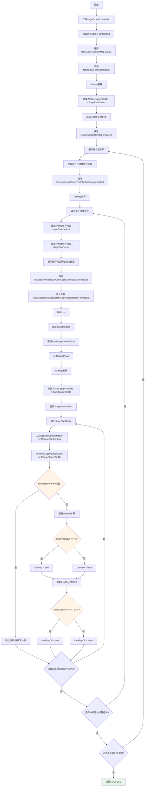
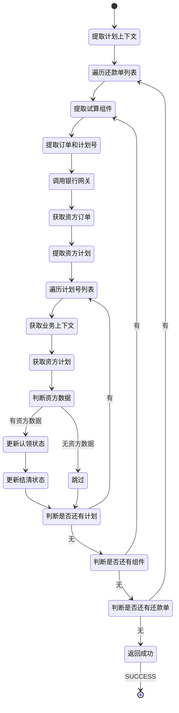

# PE120020 - 获取资方数据

## 节点信息

| 属性 | 值 |
|------|-----|
| **处理器代码** | PE120020 |
| **节点名称** | 获取资方数据 |
| **节点类型** | PROCESS |
| **所属流程** | [[账期制V400还款同步流程]] |
| **执行阶段** | 同步受理阶段 |
| **实现类** | RepayApplyBizFlowPE120020ServiceImpl |
| **优先级** | P0(核心节点) |

## 功能说明

获取资方数据节点负责从银行网关获取资方(资金方)的分期订单和分期计划数据,并将资方状态(认领状态/结清状态)集成到业务上下文中,为后续还款决策提供资方视角的数据支持。

### 核心职责
1. **提取分期计划上下文**: 从StageOrderContext中提取所有分期计划
2. **遍历还款试算组件**: 遍历还款试算计划组件列表
3. **提取订单和计划号**: 提取分期订单号和分期计划号
4. **调用银行网关**: 批量获取资方分期订单数据
5. **提取资方计划数据**: 从资方订单中提取分期计划数据
6. **更新上下文**: 更新StagePlanContext中的资方状态字段

### 适用场景

- **联合贷业务**: 资方参与放款,需要同步资方状态
- **资金方对账**: 核对资方状态与本地状态
- **还款决策**: 根据资方状态决定还款策略

## 输入参数

| 参数名 | 参数代码 | 类型 | 来源 | 说明 |
|--------|----------|------|------|------|
| 订单上下文映射 | stageOrderContextMap | Map<String,StageOrderContext> | RepayApplyContext | 订单号→订单上下文映射 |
| 还款单处理列表 | repaymentBillHandleForDcpList | List | RepayApplyBo | 还款单处理对象列表 |
| 用户ID | uid | String | RepayApplyBo | 用户唯一标识 |

### StageOrderContext 结构

| 字段名 | 字段代码 | 类型 | 说明 |
|--------|----------|------|------|
| 分期订单号 | stageOrderNo | String | 分期订单唯一标识 |
| 分期计划上下文列表 | stagePlanContextList | List<StagePlanContext> | 分期计划上下文列表 |

### StagePlanContext 结构

| 字段名 | 字段代码 | 类型 | 说明 |
|--------|----------|------|------|
| 分期计划号 | stagePlanNo | String | 分期计划唯一标识 |
| 资方是否已认领 | claimed | Boolean | 资方是否已认领该期 |
| 资方是否已结清 | fundPayOff | Boolean | 资方是否已结清该期 |

### RepaymentBillHandleForDcp 结构

| 字段名 | 字段代码 | 类型 | 说明 |
|--------|----------|------|------|
| 未合并还款试算列表 | unmergeRepayTrialPlanListComponentList | List | 未合并的还款试算组件列表 |

### RepayTrialPlanComponent 结构

| 字段名 | 字段代码 | 类型 | 说明 |
|--------|----------|------|------|
| 资产银行 | assetBank | String | 资方银行编码 |
| 资产ID | assetId | String | 资产ID |
| 分期计划还款组件列表 | stagePlanRepayComponentList | List | 分期计划还款组件列表 |

### StagePlanRepayComponent 结构

| 字段名 | 字段代码 | 类型 | 说明 |
|--------|----------|------|------|
| 分期订单号 | stageOrderNo | String | 分期订单唯一标识 |
| 分期计划号 | stagePlanNo | String | 分期计划唯一标识 |

## 输出参数

| 参数名 | 参数代码 | 类型 | 说明 |
|--------|----------|------|------|
| 无 | - | - | 更新StagePlanContext中的资方状态字段 |

## 处理流程



## 核心业务逻辑

### 1. 提取分期计划上下文

**业务逻辑**:
```
stagePlanContextMap = stageOrderContextMap.values().stream()
    .map(StageOrderContext::fetchStagePlanContextList)
    .flatMap(Collection::stream)
    .collect(Collectors.toMap(
        StagePlanContext::getStagePlanNo,
        Function.identity()
    ))
```

**Map结构**:
```
stagePlanContextMap = {
    "PLAN_001": StagePlanContext(stagePlanNo="PLAN_001", claimed=null, fundPayOff=null),
    "PLAN_002": StagePlanContext(stagePlanNo="PLAN_002", claimed=null, fundPayOff=null),
    "PLAN_003": StagePlanContext(stagePlanNo="PLAN_003", claimed=null, fundPayOff=null)
}
```

**业务含义**:
- Key: 分期计划号
- Value: 分期计划上下文对象(包含资方状态字段)

### 2. 遍历还款单处理列表

**业务逻辑**:
```
repaymentBillHandleForDcpList.stream()
    .map(RepaymentBillHandleForDcp::fetchUnmergeRepayTrialPlanListComponentList)
    .flatMap(Collection::stream)
    .forEach(repayTrialPlanListComponent -> {
        // 处理每个试算组件
    })
```

**为什么要遍历还款单列表**:
- 一笔还款可能包含多个还款单(如提前结清多期)
- 每个还款单可能包含多个试算组件(不同还款模式)
- 需要处理所有试算组件,获取完整的资方数据

### 3. 提取订单和计划号

**业务逻辑**:
```
// 提取分期订单号列表
List<String> stageOrderNoList = repayTrialPlanListComponent
    .getStagePlanRepayComponentList().stream()
    .map(StagePlanRepayComponent::getStageOrderNo)
    .distinct()
    .collect(Collectors.toList());

// 提取分期计划号列表
List<String> stagePlanNoList = repayTrialPlanListComponent
    .getStagePlanRepayComponentList().stream()
    .map(StagePlanRepayComponent::getStagePlanNo)
    .distinct()
    .collect(Collectors.toList());
```

**为什么要去重**:
- 同一个订单的多个期数可能在同一个还款单中
- 去重后减少银行网关查询次数

### 4. 调用银行网关

**服务**: `FacadeBankGateWayClient.getBankStageOrderBoList()`

**入参**:
- **uid**: 用户ID
- **assetBank**: 资方银行编码
- **assetId**: 资产ID
- **stageOrderNoList**: 分期订单号列表
- **stagePlanNoList**: 分期计划号列表

**出参**: `List<BankStageOrderBo>`

**BankStageOrderBo 结构**:

| 字段名 | 字段代码 | 类型 | 说明 |
|--------|----------|------|------|
| 分期订单号 | stageOrderNo | String | 分期订单唯一标识 |
| 分期计划列表 | stagePlans | List<BankStagePlanBo> | 资方分期计划列表 |

**BankStagePlanBo 结构**:

| 字段名 | 字段代码 | 类型 | 说明 |
|--------|----------|------|------|
| 分期计划号 | stagePlanNo | String | 分期计划唯一标识 |
| 资方预认领状态 | fundPreStatus | String | 资方预认领状态("1":已认领) |
| 资方状态 | fundStatus | String | 资方状态(PAY_OFF:已结清) |

### 5. 提取资方计划数据

**业务逻辑**:
```
Map<String, BankStagePlanBo> bankStagePlanBoMap = bankStageOrderBoList.stream()
    .map(BankStageOrderBo::getStagePlans)
    .flatMap(Collection::stream)
    .collect(Collectors.toMap(
        BankStagePlanBo::getStagePlanNo,
        Function.identity()
    ))
```

**Map结构**:
```
bankStagePlanBoMap = {
    "PLAN_001": BankStagePlanBo(stagePlanNo="PLAN_001", fundPreStatus="1", fundStatus="NORMAL"),
    "PLAN_002": BankStagePlanBo(stagePlanNo="PLAN_002", fundPreStatus="0", fundStatus="PAY_OFF"),
    "PLAN_003": BankStagePlanBo(stagePlanNo="PLAN_003", fundPreStatus="1", fundStatus="NORMAL")
}
```

**业务含义**:
- Key: 分期计划号
- Value: 资方分期计划对象(包含资方状态)

### 6. 更新StagePlanContext

**业务逻辑**:
```
stagePlanNoList.forEach(stagePlanNo -> {
    // 从业务上下文中获取分期计划上下文
    StagePlanContext stagePlanContext = stagePlanContextMap.get(stagePlanNo);

    // 从资方数据中获取分期计划
    BankStagePlanBo bankStagePlanBo = bankStagePlanBoMap.get(stagePlanNo);

    // 如果资方数据为空,跳过
    if (bankStagePlanBo == null) {
        return;
    }

    // 更新资方认领状态
    stagePlanContext.setClaimed(StringUtils.equals("1", bankStagePlanBo.getFundPreStatus()));

    // 更新资方结清状态
    stagePlanContext.setFundPayOff(StagePlanStatusEnum.PAY_OFF.name().equals(bankStagePlanBo.getFundStatus()));
});
```

**字段更新规则**:

#### 6.1 claimed 字段

**判断逻辑**: `fundPreStatus == "1"`

**取值**:
- `true`: 资方已预认领该期
- `false`: 资方未预认领该期

**业务含义**:
- 资方预认领表示资方已确认该期还款金额
- 已预认领的期数不能随意修改
- 未预认领的期数可以调整

#### 6.2 fundPayOff 字段

**判断逻辑**: `fundStatus == PAY_OFF`

**取值**:
- `true`: 资方已结清该期
- `false`: 资方未结清该期

**业务含义**:
- 资方已结清表示资方已收到该期还款
- 已结清的期数不能再次还款
- 未结清的期数可以继续还款

## 状态流转



## 上游节点

- **PE120001** - 还款试算

## 下游节点

- **PE120006** - 整合试算结果,初始化还款单元数据

## 异常处理

| 异常场景 | 错误类型 | 处理方式 | 影响 |
|----------|----------|----------|------|
| 银行网关调用失败 | Exception | 记录日志,返回ERROR | 流程终止 |
| 资方数据为空 | - | 跳过该期,继续处理下一期 | 不影响流程 |
| StagePlanContext为空 | NullPointerException | 记录日志,返回ERROR | 流程终止 |
| 其他异常 | Exception | 记录日志,返回ERROR | 流程终止 |

### 错误日志

**日志级别**: WARN
**日志内容**: "集成资金账到业务上下文「PE120020」异常"
**日志上下文**:
- 异常堆栈
- 用户ID
- 分期订单号列表
- 分期计划号列表

### 日志示例

```
WARN [PE120020] 集成资金账到业务上下文「PE120020」异常
  - uid: 100123456789
  - stageOrderNoList: ["ORDER_001","ORDER_002"]
  - stagePlanNoList: ["PLAN_001","PLAN_002","PLAN_003"]
  - error: 银行网关调用超时
```

## 监控指标

### 业务指标
- **资方数据获取成功率**: 成功数 / 总请求数
- **资方认领率**: 已认领数 / 总期数
- **资方结清率**: 已结清数 / 总期数
- **平均获取耗时**: P50/P95/P99

### 技术指标
- **银行网关调用成功率**: 成功数 / 总调用数
- **银行网关平均耗时**: P50/P95/P99
- **资方数据为空率**: 为空数 / 总请求数

## 性能优化

### 1. 批量查询
- **策略**: 批量调用银行网关,一次性获取多个订单的资方数据
- **效果**: 减少银行网关调用次数

### 2. 去重优化
- **策略**: 对订单号和计划号去重后再查询
- **效果**: 减少查询数据量

### 3. 异步调用
- **策略**: 异步调用银行网关,不阻塞主流程
- **效果**: 提高流程响应速度

### 4. 缓存优化
- **策略**: 缓存资方数据,减少银行网关调用
- **效果**: 减少外部依赖,提高响应速度

## 实现位置

```bash
repayengine-service/src/main/java/cn/caijiajia/repayengine/service/
├── repay/process/dcp/
│   └── RepayApplyBizFlowPE120020ServiceImpl.java  # 节点处理器 (102行)
└── client/
    └── FacadeBankGateWayClient.java                # 银行网关客户端
```

## 代码示例

### 核心代码片段

```java
@Override
public ProcessResult process(RepayApplyContext repayContext) {
    Map<String, StageOrderContext> stageOrderContextMap = repayContext.getStageOrderContextMap();
    try {
        refreshStageOrderContextFromBg(repayContext.getBo(), stageOrderContextMap);
    } catch (Exception e) {
        repayContext.setMessage(e.getMessage());
        RE_LOG.warn(e, "集成资金账到业务上下文「PE120020」异常");
        return createErrorProcessResult(repayContext.getMessage());
    }
    return createSuccessProcessResult();
}

/**
 * StageOrderContext 中集成资金账相关数据
 */
private void refreshStageOrderContextFromBg(RepayApplyBo repayApplyBo, Map<String, StageOrderContext> stageOrderContextMap) {
    // 1. 提取所有分期计划上下文
    Map<String, StageOrderContext.StagePlanContext> stagePlanContextMap = stageOrderContextMap.values().stream()
        .map(StageOrderContext::fetchStagePlanContextList)
        .flatMap(Collection::stream)
        .collect(Collectors.toMap(StageOrderContext.StagePlanContext::getStagePlanNo, Function.identity()));

    // 2. 遍历还款单处理列表
    repayApplyBo.getRepaymentBillHandleForDcpList().stream()
        .map(RepaymentBillHandleForDcp::fetchUnmergeRepayTrialPlanListComponentList)
        .flatMap(Collection::stream)
        .forEach(repayTrialPlanListComponent -> {
            // 3. 提取订单和计划号
            List<String> stageOrderNoList = repayTrialPlanListComponent.getStagePlanRepayComponentList().stream()
                .map(StagePlanRepayComponent::getStageOrderNo)
                .distinct()
                .collect(Collectors.toList());
            List<String> stagePlanNoList = repayTrialPlanListComponent.getStagePlanRepayComponentList().stream()
                .map(StagePlanRepayComponent::getStagePlanNo)
                .distinct()
                .collect(Collectors.toList());

            // 4. 调用银行网关获取资方数据
            List<BankStageOrderBo> bankStageOrderBoList = facadeBankGateWayClient.getBankStageOrderBoList(
                repayApplyBo.getUid(),
                repayTrialPlanListComponent.getAssetBank(),
                repayTrialPlanListComponent.getAssetId(),
                stageOrderNoList,
                stagePlanNoList
            );

            // 5. 提取资方计划数据
            Map<String, BankStagePlanBo> bankStagePlanBoMap = bankStageOrderBoList.stream()
                .map(BankStageOrderBo::getStagePlans)
                .flatMap(Collection::stream)
                .collect(Collectors.toMap(BankStagePlanBo::getStagePlanNo, Function.identity()));

            // 6. 更新StagePlanContext
            stagePlanNoList.forEach(stagePlanNo -> {
                StageOrderContext.StagePlanContext stagePlanContext = stagePlanContextMap.get(stagePlanNo);
                BankStagePlanBo bankStagePlanBo = bankStagePlanBoMap.get(stagePlanNo);

                if (bankStagePlanBo == null) {
                    return;
                }

                // 更新资方认领状态
                stagePlanContext.setClaimed(StringUtils.equals("1", bankStagePlanBo.getFundPreStatus()));

                // 更新资方结清状态
                stagePlanContext.setFundPayOff(StagePlanStatusEnum.PAY_OFF.name().equals(bankStagePlanBo.getFundStatus()));
            });
        });
}
```

## 设计考虑

### 1. 为什么要获取资方数据?

**原因**:
- 联合贷业务中,资方参与放款,需要同步资方状态
- 资方认领状态影响还款金额是否可调整
- 资方结清状态影响是否可以继续还款

### 2. 为什么要批量查询?

**原因**:
- 一笔还款可能涉及多期,每期都需要资方数据
- 批量查询减少银行网关调用次数
- 提高流程执行效率

### 3. 为什么资方数据为空时跳过而不是报错?

**原因**:
- 资方数据可能延迟同步
- 资方数据为空不影响本地业务逻辑
- 跳过可以保证流程继续执行

### 4. 为什么要更新StagePlanContext?

**原因**:
- StagePlanContext是业务上下文的一部分
- 后续决策节点需要使用资方状态
- 统一上下文便于业务逻辑处理

## 相关文档

- [[账期制V400还款同步流程]] - 主流程设计
- [[PE120006]] - 整合试算结果
- [[银行网关接口文档]] - 银行网关接口说明
- [[资方数据同步机制]] - 资方数据同步机制

## 标签

#节点 #资方数据 #银行网关 #联合贷 #PE120020