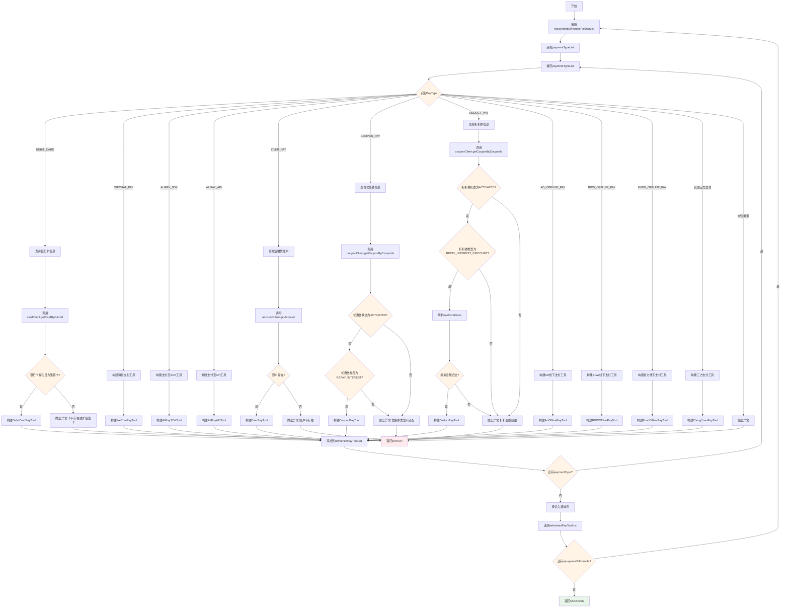
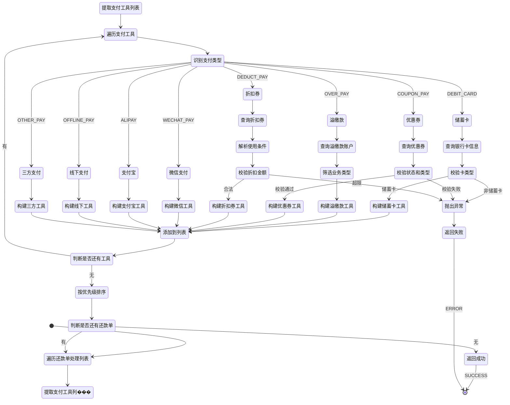

# PE130080 - 支付工具初始化

## 节点信息

| 属性 | 值 |
|------|-----|
| **处理器代码** | PE130080 |
| **节点名称** | 支付工具初始化 |
| **节点类型** | PROCESS |
| **所属流程** | [[账期制V400还款同步流程]] |
| **执行阶段** | 同步受理阶段 |
| **实现类** | RepayApplyBizFlowPE130080ServiceImpl |
| **优先级** | P0(核心节点) |

## 功能说明

支付工具初始化节点负责根据支付方式类型,补充和构建完整的支付工具对象,包括查询银行卡信息、优惠券信息、溢缴款账户信息等,并设置支付工具的优先级顺序,为后续扣款流程提供准备好的支付工具列表。

### 核心职责
1. **遍历还款单元**: 遍历所有还款单处理对象
2. **识别支付方式类型**: 根据PayType识别具体支付方式
3. **补充支付工具属性**: 调用外部服务补充支付工具的详细信息
4. **构建专用支付工具对象**: 根据支付方式创建对应的PayTool子类对象
5. **设置支付优先级**: 按照预定义的优先级对支付工具排序
6. **校验支付工具合法性**: 校验银行卡类型、优惠券状态、账户状态等

### 适用场景

- **正常还款**: 初始化银行卡/微信/支付宝等支付工具
- **优惠券还款**: 初始化优惠券和折扣券支付工具
- **溢缴款还款**: 初始化溢缴款账户支付工具
- **线下还款**: 初始化线下支付工具

## 输入参数

| 参数名 | 参数代码 | 类型 | 来源 | 说明 |
|--------|----------|------|------|------|
| 还款单处理列表 | repaymentBillHandleForDcpList | List | RepayApplyBo | 还款单处理对象列表 |

### RepaymentBillHandleForDcp 结构

| 字段名 | 字段代码 | 类型 | 说明 |
|--------|----------|------|------|
| 还款试算组件 | repayTrialPlanListComponent | RepayTrialPlanListComponent | 还款试算组件 |

### RepayTrialPlanListComponent 结构

| 字段名 | 字段代码 | 类型 | 说明 |
|--------|----------|------|------|
| 支付方式列表 | paymentTypeList | List<PayToolItem> | 支付方式列表 |

### PayToolItem 结构(输入)

| 字段名 | 字段代码 | 类型 | 说明 |
|--------|----------|------|------|
| 用户ID | uid | String | 用户唯一标识 |
| 支付方式 | payType | PayType | 支付方式枚举 |
| 支付工具号 | payInstrumentNo | String | 支付工具编号 |
| 可支付金额 | payableAmount | Integer | 可支付金额(单位:分) |
| 限制支付金额 | limitedAmount | Integer | 限制支付金额(单位:分) |

## 输出参数

| 参数名 | 参数代码 | 类型 | 说明 |
|--------|----------|------|------|
| 支付方式列表 | paymentTypeList | List<PayToolItem> | 初始化后的支付工具列表 |

### PayToolItem 结构(输出)

| 字段名 | 字段代码 | 类型 | 说明 |
|--------|----------|------|------|
| 支付类型 | payType | PayType | 支付方式枚举 |
| 支付工具号 | payInstrumentNo | String | 支付工具编号 |
| 可支付金额 | payableAmount | Integer | 可支付金额(单位:分) |
| 已支付金额 | payedAmount | Integer | 已支付金额(初始为0) |
| 本次支付金额 | payAmount | Integer | 本次支付金额(初始为0) |
| 限制支付金额 | limitedAmount | Integer | 限制支付金额(单位:分) |
| 支付编号 | payNo | String | 支付编号(银行卡号/账户号等) |
| 业务流水号 | bizSerial | String | 业务流水号 |
| 扩展信息 | extInfoMap | Map | 扩展信息 |

## 处理流程



## 核心业务逻辑

### 1. 遍历还款单处理列表

**遍历逻辑**:
```
FOR EACH repaymentBillHandleForDcp IN repaymentBillHandleForDcpList:
    paymentTypeList = repaymentBillHandleForDcp.repayTrialPlanListComponent.paymentTypeList

    // 调用PayToolsHandler刷新支付工具
    refreshedPayToolList = payToolsHandler.refreshPayTools(paymentTypeList)

    // 更新到原对象
    repaymentBillHandleForDcp.repayTrialPlanListComponent.paymentTypeList = refreshedPayToolList
END FOR
```

### 2. 支付工具类型识别

**支付方式���举**: PayType

| 枚举值 | 说明 | 子类对象 |
|--------|------|---------|
| DEBIT_CARD | 储蓄卡代扣 | DebitCardPayTool |
| WECHAT_PAY | 微信支付 | WeChatPayTool |
| ALIPAY_SDK | 支付宝SDK支付 | AliPaySDKTool |
| ALIPAY_API | 支付宝API支付 | AliPayAPITool |
| OVER_PAY | 溢缴款支付 | OverPayTool |
| COUPON_PAY | 优惠券支付 | CouponPayTool |
| DEDUCT_PAY | 折扣券支付 | DeductPayTool |
| AO_OFFLINE_PAY | AO线下支付 | AoOfflinePayTool |
| BGW_OFFLINE_PAY | BGW线下支付 | BGWOfflinePayTool |
| FUND_OFFLINE_PAY | 资方线下支付 | FundOfflinePayTool |
| ZHONGYUAN_PAY等 | 三方支付 | ZhongYuanPayTool |

### 3. 储蓄卡支付工具初始��

**查询服务**: `CardClient.getCardByCardId(uid, payInstrumentNo)`

**校验规则**:
- cardWrapper不为空
- cardWrapper.card不为空
- cardType == CardType.DEBIT(储蓄卡)

**构建逻辑**:
```
CardWrapper cardWrapper = cardClient.getCardByCardId(uid, payInstrumentNo)

IF cardWrapper为空 OR cardWrapper.card为空 THEN
    THROW ClientException(DEBIT_CARD_NOT_FOUND)
END IF

IF cardType != DEBIT THEN
    THROW ClientException(REPAY_PAY_TOOL_ERROR, "非储蓄卡")
END IF

DebitCardPayTool debitCardPayTool = DebitCardPayTool.builder()
    .cardNo(cardWrapper.card.cardNo)
    .payType(PayType.DEBIT_CARD)
    .payableAmount(payToolItem.payableAmount)
    .payedAmount(0)
    .payAmount(0)
    .limitedAmount(payToolItem.limitedAmount)
    .payInstrumentNo(payToolItem.payInstrumentNo)
    .payNo(cardNo)  // 使用银行卡号作为payNo
    .bankName(cardWrapper.card.bankName)
    .uid(uid)
    .extInfoMap(payToolItem.extInfoMap)
    .build()

RETURN debitCardPayTool
```

**业务含义**:
- 只支持储蓄卡代扣,不支持信用卡
- payNo设置为银行卡号,用于后续扣款
- bankName用于渠道路由决策

### 4. 优惠券支付工具初始化

**查询服务**: `CouponClient.getCouponByCouponId(payInstrumentNo)`

**校验规则**:
- couponWrapper不为空
- couponWrapper.value不为空
- status == CouponStatus.ACTIVATED(已激活)
- type == CouponTypeEnum.REPAY_INTEREST(还款优惠券)

**构建逻辑**:
```
CouponWrapper couponWrapper = couponClient.getCouponByCouponId(payInstrumentNo)

IF couponWrapper为空 OR couponWrapper.value为空 THEN
    THROW ClientException(COUPON_CAN_NOT_BE_USED, payInstrumentNo)
END IF

IF status != ACTIVATED THEN
    THROW ClientException(COUPON_CAN_NOT_BE_USED, payInstrumentNo)
END IF

IF type != REPAY_INTEREST THEN
    THROW ClientException(COUPON_CAN_NOT_BE_USED, payInstrumentNo)
END IF

// 计算限制金额: MIN(优惠券面额, 可支付金额)
limitedAmount = MIN(couponWrapper.value * 100, payToolItem.payableAmount)

CouponPayTool couponPayTool = CouponPayTool.builder()
    .couponId(couponWrapper.couponId)
    .payType(PayType.COUPON_PAY)
    .payableAmount(payToolItem.payableAmount)
    .payedAmount(0)
    .payAmount(0)
    .limitedAmount(limitedAmount)
    .payInstrumentNo(payInstrumentNo)
    .uid(uid)
    .extInfoMap(payToolItem.extInfoMap)
    .build()

RETURN couponPayTool
```

**业务含义**:
- 优惠券面额单位为元,需要乘以100转换为分
- 限制金额取优惠券面额和可支付金额的最小值
- 只有REPAY_INTEREST类型的优惠券可用于还款

### 5. 折扣券支付工具初始化

**查询服务**: `CouponClient.getCouponByCouponId(payInstrumentNo)`

**校验规则**:
- couponWrapper不为空
- couponWrapper.useConditions不为空
- status == CouponStatus.ACTIVATED(已激活)
- type == CouponTypeEnum.REPAY_INTEREST_DISCOUNT(还款折扣券)
- redeemAmtMaxLimit(最大抵扣金额) >= payableAmount

**构建逻辑**:
```
CouponWrapper couponWrapper = couponClient.getCouponByCouponId(payInstrumentNo)

IF couponWrapper为空 OR useConditions为空 THEN
    THROW ClientException(COUPON_CAN_NOT_BE_USED, payInstrumentNo)
END IF

IF status != ACTIVATED THEN
    THROW ClientException(COUPON_CAN_NOT_BE_USED, payInstrumentNo)
END IF

IF type != REPAY_INTEREST_DISCOUNT THEN
    THROW ClientException(COUPON_CAN_NOT_BE_USED, payInstrumentNo)
END IF

// 解析useConditions
jsonArray = JSON.parseArray(useConditions)
redeemAmtMaxLimit = jsonArray[0].redeemAmtMaxLimit * 100
discountRatioValue = jsonArray[0].discountRatioValue / 100

// 校验最大抵扣金额
IF redeemAmtMaxLimit < payableAmount THEN
    THROW ClientException(COUPON_CAN_NOT_BE_USED, payInstrumentNo)
END IF

// 计算限制金额: MIN(最大抵扣金额, 可支付金额)
limitedAmount = MIN(redeemAmtMaxLimit, payableAmount)

DeductPayTool deductPayTool = DeductPayTool.builder()
    .couponId(couponWrapper.couponId)
    .payType(PayType.DEDUCT_PAY)
    .payableAmount(payToolItem.payableAmount)
    .payedAmount(0)
    .payAmount(0)
    .limitedAmount(limitedAmount)
    .payInstrumentNo(payInstrumentNo)
    .redeemAmtMaxLimit(redeemAmtMaxLimit)
    .discountRatioValue(discountRatioValue)
    .uid(uid)
    .extInfoMap(payToolItem.extInfoMap)
    .build()

RETURN deductPayTool
```

**业务含义**:
- 折扣券有最大抵扣金额限制
- discountRatioValue是折扣比例(如0.8表示8折)
- 折扣金额 = 应付金额 * (1 - discountRatioValue)

### 6. 溢缴款支付工具初始化

**查询服务**: `AccountClient.getAccount(uid, AccountTypeEnum.DEBIT, null)`

**查询逻辑**:
```
accountWrapperList = accountClient.getAccount(uid, AccountTypeEnum.DEBIT, null)

IF accountWrapperList为空 THEN
    THROW ClientException(OVER_ACCOUNT_CAN_NOT_BE_USED)
END IF

// 筛选ENJOY_PAY或FUN_PAY业务类型的账户
accountWrapper = accountWrapperList.stream()
    .filter(account -> businessType == ENJOY_PAY OR businessType == FUN_PAY)
    .findFirst()

OverPayTool overPayTool = OverPayTool.builder()
    .overPayAccountNo(accountWrapper.accountNo)
    .payType(PayType.OVER_PAY)
    .payableAmount(payToolItem.payableAmount)
    .payedAmount(0)
    .payAmount(0)
    .limitedAmount(payToolItem.limitedAmount)
    .payInstrumentNo(payInstrumentNo)
    .uid(uid)
    .extInfoMap(payToolItem.extInfoMap)
    .build()

RETURN overPayTool
```

**业务含义**:
- 溢缴款账户是DEBIT类型的账户
- 只支持ENJOY_PAY和FUN_PAY业务类型
- overPayAccountNo用于后续扣款

### 7. 三方支付工具初始化

**支持的三方支付**: 微信/支付宝/中原/美团/海尔等

**构建逻辑**(以微信为例):
```
WeChatPayTool weChatPayTool = WeChatPayTool.builder()
    .bizSerial(payInstrumentNo)
    .payType(PayType.WECHAT_PAY)
    .payableAmount(payToolItem.payableAmount)
    .payedAmount(0)
    .payAmount(0)
    .limitedAmount(payToolItem.limitedAmount)
    .payInstrumentNo(payInstrumentNo)
    .payNo(payInstrumentNo)  // 使用payInstrumentNo作为payNo
    .uid(uid)
    .extInfoMap(payToolItem.extInfoMap)
    .weChatParams(payToolItem.weChatParams)  // 微信支付参数
    .build()

RETURN weChatPayTool
```

**业务含义**:
- 三方支付不需要查询外部服务
- 直接使用payInstrumentNo作为payNo
- extInfoMap可能包含特定支付参数

### 8. 设置支付优先级

**优先级规则**:

| 支付方式 | 优先级值 | 说明 |
|---------|---------|------|
| OVER_PAY(溢缴款) | 10 | 最高优先级 |
| BALANCE_PAY(余额) | 10 | 最高优先级 |
| WECHAT_PAY(微信) | 20 | 次高优先级 |
| DEBIT_CARD(银行卡) | 30 | 中等优先级 |
| COUPON_PAY(优惠券) | 50 | 较低优先级 |
| 其他支付方式 | 100 | 最低优先级 |

**排序逻辑**:
```
refreshedPayToolList.sort(Comparator.comparingInt(a -> getPayToolPriority(a.payType)))
```

**业务含义**:
- 优先使用用户的溢缴款和余额
- 其次使用微信等三方支付
- 银行卡代扣优先级中等
- 优惠券放在最后,避免影响其他支付方式

## 状态流转



## 上游节点

- **PE120006** - 整合试算结果,初始化还款单元数据

## 下游节点

- **PE130090** - 优惠券锁定

## 异常处理

| 异常场景 | 错误类型 | 错误码 | 处理方式 | 影响 |
|----------|----------|--------|----------|------|
| 银行卡不存在 | ClientException | DEBIT_CARD_NOT_FOUND | 记录日志,返回ERROR | 流程终止 |
| 非储蓄卡 | ClientException | REPAY_PAY_TOOL_ERROR | 记录日志,返回ERROR | 流程终止 |
| 优惠券不可用 | ClientException | COUPON_CAN_NOT_BE_USED | 记录日志,返回ERROR | 流程终止 |
| 溢缴款账户不可用 | ClientException | OVER_ACCOUNT_CAN_NOT_BE_USED | 记录日志,返回ERROR | 流程终止 |
| 未知支付方式 | ServerException | REPAY_METHOD_NOT_FOUND | 记录日志,返回ERROR | 流程终止 |
| 其他异常 | Exception | - | 记录日志,返回ERROR | 流程终止 |

## 监控指标

### 业务指标
- **各支付方式使用率**: 各支付方式使用次数 / 总还款次数
- **银行卡查询失败率**: 查询失败数 / 总查询数
- **优惠券使用失败率**: 使用失败数 / 优惠券使用数
- **溢缴款使用比例**: 使用溢缴款次数 / 总还款次数

### 技术指标
- **平均处理耗时**: P50/P95/P99
- **外部服务调用成功率**: 成功数 / 总调用数
- **外部服务平均耗时**: P50/P95/P99

## 性能优化

### 1. 批量查询
- **策略**: 批量查询银行卡/优惠券/账户信息
- **效果**: 减少外部服务调用次数

### 2. 缓存优化
- **策略**: 缓存银行卡信息和账户信息
- **效果**: 减少外部服务调用,提高响应速度

### 3. 异步查询
- **策略**: 异步查询非关键信息
- **效果**: 减少主流程耗时

## 实现位置

```bash
repayengine-service/src/main/java/cn/caijiajia/repayengine/service/
├── repay/process/dcp/
│   └── RepayApplyBizFlowPE130080ServiceImpl.java  # 节点处理器 (57行)
└── handler/
    └── PayToolsHandler.java                        # 支付工具处理器 (362行)
```

## 设计考虑

### 1. 为什么要初始化支付工具?

**原因**:
- 补充支付工具的详细信息(银行卡号/账户号等)
- 校验支付工具的合法性(卡类型/优惠券状态等)
- 统一支付工具对象结构

### 2. 为什么要设置支付优先级?

**原因**:
- 优先使用用户的溢缴款和余额
- 优惠券放在最后,避免优先消耗
- 不同支付方式的费率和成本不同

### 3. 为什么优惠券要区分COUPON_PAY和DEDUCT_PAY?

**原因**:
- COUPON_PAY是固定面额优惠券(如10元券)
- DEDUCT_PAY是折扣券(如8折券)
- 两者的计算逻辑和限制条件不同

### 4. 为什么要查询银行卡信息?

**原因**:
- 校验银行卡是否存在
- 校验银行卡类型(只支持储蓄卡)
- 获取银行卡号用于扣款
- 获取银行名称用于渠道路由

## 相关文档

- [[账期制V400还款同步流程]] - 主流程设计
- [[PE120006]] - 整合试算结果
- [[PE130090]] - 优惠券锁定
- [[支付工具设计]] - 支付工具设计文档
- [[优惠券系统对接]] - 优惠券系统对接文档

## 标签

#节点 #支付工具 #初始化 #PE130080