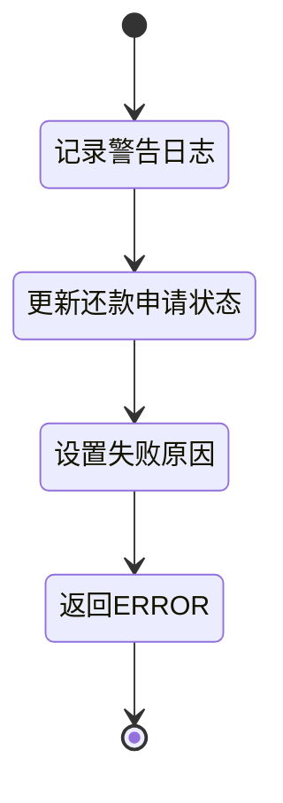
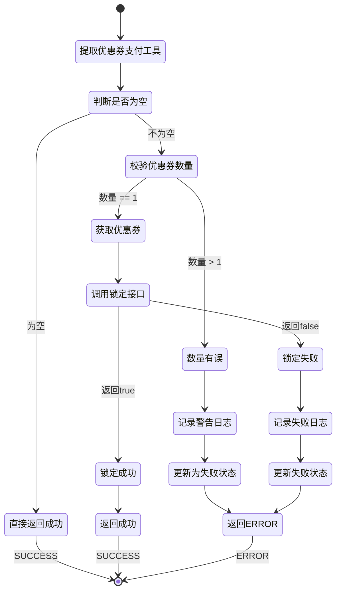

# PE130090 - 优惠券锁定

## 节点信息

| 属性 | 值 |
|------|-----|
| **处理器代码** | PE130090 |
| **节点名称** | 优惠券锁定 |
| **节点类型** | PROCESS |
| **所属流程** | [[账期制V400还款同步流程]] |
| **执行阶段** | 同步受理阶段 |
| **实现类** | RepayApplyBizFlowPE130090ServiceImpl |
| **优先级** | P0(核心节点) |

## 功能说明

优惠券锁定节点负责锁定用户在本次还款中使用的优惠券或折扣券,防止优惠券被重复使用或在还款过程中被其他流程消费,确保优惠券使用的原子性和一致性。

### 核心职责
1. **提取优惠券支付工具**: 从还款单处理列表中提取所有优惠券和折扣券支付工具
2. **校验优惠券数量**: 检查优惠券数量是否合法(最多1张)
3. **调用优惠券系统锁定**: 调用couponClient锁定优惠券
4. **处理锁定失败**: 锁定失败时更新还款申请状态并返回错误

### 适用场景

- **优惠券还款**: 使用优惠券(COUPON_PAY)进行还款
- **折扣券还款**: 使用折扣券(DEDUCT_PAY)进行还款
- **无优惠券还款**: 不使用优惠券,直接跳过

## 输入参数

| 参数名 | 参数代码 | 类型 | 来源 | 说明 |
|--------|----------|------|------|------|
| 还款单处理列表 | repaymentBillHandleForDcpList | List | RepayApplyBo | 还款单处理对象列表 |
| 还款申请号 | repayApplyNo | String | RepayApplyBo | 还款申请唯一标识 |

### RepaymentBillHandleForDcp 结构

| 字段名 | 字段代码 | 类型 | 说明 |
|--------|----------|------|------|
| 还款试算组件 | repayTrialPlanListComponent | RepayTrialPlanListComponent | 还款试算组件 |

### RepayTrialPlanListComponent 结构

| 字段名 | 字段代码 | 类型 | 说明 |
|--------|----------|------|------|
| 支付方式列表 | paymentTypeList | List<PayToolItem> | 支付方式列表 |

### PayToolItem 结构

| 字段名 | 字段代码 | 类型 | 说明 |
|--------|----------|------|------|
| 用户ID | uid | String | 用户唯一标识 |
| 支付方式 | payType | PayType | 支付方式枚举 |
| 支付工具号 | payInstrumentNo | String | 优惠券ID |

## 输出参数

| 参数名 | 参数代码 | 类型 | 说明 |
|--------|----------|------|---------|
| 无 | - | - | 锁定成功返回SUCCESS,锁定失败返回ERROR |

## 处理流程

```mermaid
flowchart TD
    A[开始] --> B[遍历repaymentBillHandleForDcpList]
    B --> C[提取paymentTypeList]
    C --> D[flatMap展开所有支付工具]

    D --> E[筛选优惠券和折扣券]
    E --> E1[filter: isCouponPay OR isDeductPay]
    E1 --> E2[收集为payToolItemList]

    E2 --> F{payToolItemList为空?}
    F -->|是| G[返回SUCCESS]

    F -->|否| H[校验优惠券数量]
    H --> H1[distinct计数payInstrumentNo]
    H1 --> H2{数量 > 1?}

    H2 -->|是| I1[记录警告日志]
    I1 --> I2[更新还款申请状态为失败]
    I2 --> I3[设置失败原因:优惠券数量有误]
    I3 --> J1[返回ERROR]

    H2 -->|否| K[获取第一个优惠券]
    K --> K1[payToolItem = payToolItemList.get(0)]

    K1 --> L[调用优惠券系统锁定]
    L --> L1[couponClient.lockedCouponByCouponIds]
    L1 --> L2[传入参数: uid, couponId, repayApplyNo]

    L2 --> M{锁定结果?}
    M -->|成功| N[返回SUCCESS]

    M -->|失败| O1[记录警告日志]
    O1 --> O2[更新还款申请状态为失败]
    O2 --> O3[设置失败原因:优惠券锁定失败]
    O3 --> J2[返回ERROR]

    style F fill:#fff4e6
    style H2 fill:#fff4e6
    style M fill:#fff4e6
    style G fill:#e8f5e9
    style N fill:#e8f5e9
    style J1 fill:#ffebee
    style J2 fill:#ffebee
```

## 核心业务逻辑

### 1. 提取优惠券支付工具

**提取逻辑**:
```
payToolItemList = repaymentBillHandleForDcpList.stream()
    .map(RepaymentBillHandleForDcp::getRepayTrialPlanListComponent)
    .map(RepayTrialPlanListComponent::getPaymentTypeList)
    .flatMap(Collection::stream)
    .filter(payToolItem -> isCouponPay(payType) OR isDeductPay(payType))
    .collect(Collectors.toList())
```

**筛选条件**:
- PayType.isCouponPay(payType): 优惠券支付(COUPON_PAY)
- PayType.isDeductPay(payType): 折扣券支付(DEDUCT_PAY)

**业务含义**:
- 遍历所有还款单处理对象
- 提取所有支付方式列表
- flatMap展开为支付工具流
- 筛选出优惠券和折扣券

### 2. 校验优惠券数量

**校验规则**: 一次还款最多使用1张优惠券

**校验逻辑**:
```
distinctCount = payToolItemList.stream()
    .map(PayToolItem::getPayInstrumentNo)
    .distinct()
    .count()

IF distinctCount > 1 THEN
    LOG.warn("优惠券数量有误,请排查", payToolItemList)
    repayDataService.updateForFailed(repayApplyNo, "优惠券数量有误")
    RETURN ERROR("优惠券数量有误")
END IF
```

**业务含义**:
- 通过payInstrumentNo(优惠券ID)去重后计数
- 如果数量大于1,说明使用了多张优惠券
- 更新还款申请状态为失败
- 返回ERROR终止流程

**异常场景**:
- 前端传入多张优惠券
- 数据异常导致优惠券重复

### 3. 调用优惠券系统锁定

**锁定服务**: `CouponClient.lockedCouponByCouponIds(uid, couponId, repayApplyNo)`

**锁定参数**:
- **uid**: 用户ID
- **couponId**: 优惠券ID(payInstrumentNo)
- **repayApplyNo**: 还款申请号(用于关联锁定记录)

**锁定逻辑**:
```
payToolItem = payToolItemList.get(0)

couponLockedResult = couponClient.lockedCouponByCouponIds(
    payToolItem.uid,
    payToolItem.payInstrumentNo,
    repayApplyNo
)

IF !couponLockedResult THEN
    LOG.warn(FAIL_MSG, payToolItem)
    repayDataService.updateForFailed(repayApplyNo, FAIL_MSG)
    RETURN ERROR(FAIL_MSG)
END IF

RETURN SUCCESS
```

**锁定结果**:
- **true**: 锁定成功,可以继续后续流程
- **false**: 锁定失败,流程终止

### 4. 处理锁定失败

**失败处理流程**:



**更新还款申请**:
```
repayDataService.updateForFailed(repayApplyNo, failMessage)
```

**更新内容**:
- 还款状态: 更新为失败状态
- 失败原因: 记录具体失败原因

**业务含义**:
- 记录失败信息便于排查
- 防止后续流程继续执行
- 用户可以查看失败原因

## 优惠券锁定机制

### 1. 锁定状态

**状态流转**:
```
ACTIVATED(已激活) --> LOCKED(已锁定) --> USED(已使用)
                   \-> ACTIVATED(释放锁定)
```

**状态说明**:

| 状态 | 说明 | 可否使用 |
|------|------|---------|
| ACTIVATED | 已激活,未使用 | 可以 |
| LOCKED | 已锁定,还款中 | 不可以 |
| USED | 已使用,已消费 | 不可以 |
| EXPIRED | 已过期 | 不可以 |
| CANCELLED | 已取消 | 不可以 |

### 2. 锁定时机

**锁定时机**: 在还款受理阶段(同步流程),扣款前锁定

**为什么在这个时机锁定**:
- 还��申请已创建,不会重复提交
- 还款试算已完成,金额已确定
- 支付工具已初始化,优惠券已校验
- 扣款尚未开始,可以安全锁定

### 3. 锁定释放

**释放场景**:

| 场景 | 释放时机 | 处理方式 |
|------|---------|---------|
| 还款成功 | 扣款成功后 | 标记优惠券为USED |
| 还款失败 | 异步流程失败后 | 释放锁定,恢复为ACTIVATED |
| 还款超时 | 定时任务扫描 | 释放锁定,恢复为ACTIVATED |

**释放逻辑**:
```
IF 还款状态 == SUCCESS THEN
    优惠券状态 = USED
ELSE IF 还款状态 == FAILED OR 还款状态 == TIMEOUT THEN
    优惠券状态 = ACTIVATED
END IF
```

### 4. 并发控制

**并发场景**: 用户同时发起多笔还款,使用同一张优惠券

**控制机制**:
- **乐观锁**: 优惠券表增加version字段
- **数据库锁**: UPDATE语句带WHERE条件(status=ACTIVATED)
- **分布式锁**: Redis分布式锁(锁Key: coupon:lock:uid:{uid}:couponId:{couponId})

**锁定SQL示例**:
```sql
UPDATE coupon
SET status = 'LOCKED',
    version = version + 1,
    locked_repay_apply_no = #{repayApplyNo}
WHERE coupon_id = #{couponId}
  AND uid = #{uid}
  AND status = 'ACTIVATED'
  AND version = #{version}
```

## 状态流转



## 上游节点

- **PE130080** - 支付工具初始化

## 下游节点

- **PE130100** - 筛选还款单元数据

## 异常处理

| 异常场景 | 错误类型 | 处理方式 | 影响 |
|----------|----------|----------|------|
| 优惠券数量有误 | ClientException | 记录日志,更新失败状态,返回ERROR | 流程终止 |
| 优惠券锁定失败 | ClientException | 记录日志,更新失败状态,返回ERROR | 流程终止 |
| 优惠券系统异常 | Exception | 记录日志,返回ERROR | 流程终止 |

### 错误日志

**日志级别**: WARN

**日志场景1**: 优惠券数量有误
- **日志内容**: "优惠券数量有误,请排查"
- **日志上下文**: payToolItemList

**日志场景2**: 优惠券锁定失败
- **日志内容**: "优惠券锁定失败"
- **日志上下文**: payToolItem

## 监控指标

### 业务指标
- **优惠券锁定成功率**: 锁定成功数 / 总锁定请求数
- **优惠券使用比例**: 使用优惠券还款数 / 总还款数
- **优惠券数量异常率**: 数量异常数 / 使用优惠券还款数
- **平均锁定耗时**: P50/P95/P99

### 技术指标
- **优惠券系统调用成功率**: 成功数 / 总调用数
- **优惠券系统平均耗时**: P50/P95/P99
- **锁定并发冲突率**: 冲突数 / 总锁定数

## 性能优化

### 1. 异步锁定
- **策略**: 异步调用优惠券系统锁定接口
- **效果**: 减少主流程阻塞时间

### 2. 批量锁定
- **策略**: 批量锁定多张优惠券(如果业务支持)
- **效果**: 减少接口调用次数

### 3. 缓存优化
- **策略**: 缓存优惠券状态信息
- **效果**: 减少优惠券系统查询次数

## 实现位置

```bash
repayengine-service/src/main/java/cn/caijiajia/repayengine/service/
├── repay/process/dcp/
│   └── RepayApplyBizFlowPE130090ServiceImpl.java  # 节点处理器 (83行)
├── repay/persistence/
│   └── IRepayDataService.java                      # 还款数据服务
└── client/feign/
    └── CouponClient.java                            # 优惠券客户端
```

## 设计考虑

### 1. 为什么要锁定优惠券?

**原因**:
- 防止优惠券被重复使用
- 防止并发还款使用同一张优惠券
- 确保优惠券使用的原子性

### 2. 为什么锁定失败要更新还款申请状态?

**原因**:
- 记录失败原因便于排查
- 防止后续流程继续执行
- 用户可以查看失败原因

### 3. 为什么一次还款只能使用1张优惠券?

**原因**:
- 业务规则限制
- 简化优惠券叠加逻辑
- 防止优惠券滥用

### 4. 为什么不在PE130080节点就锁定?

**原因**:
- PE130080只是初始化,还未确定最终使用
- 锁定太早可能影响其他还款
- 当前时机(PE130090)更合适,前面节点已完成校验

## 相关文档

- [[账期制V400还款同步流程]] - 主流程设计
- [[PE130080]] - 支付工具初始化
- [[PE130100]] - 筛选还款单元数据
- [[优惠券系统对接]] - 优惠券系统对接文档
- [[优惠券状态流转]] - 优惠券状态流转图

## 标签

#节点 #优惠券锁定 #并发控制 #PE130090