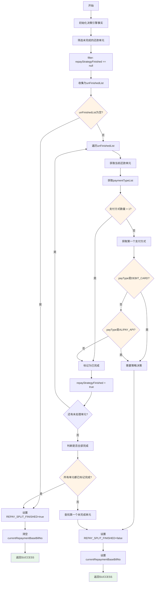
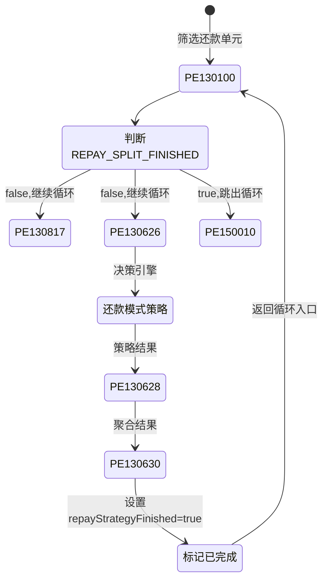
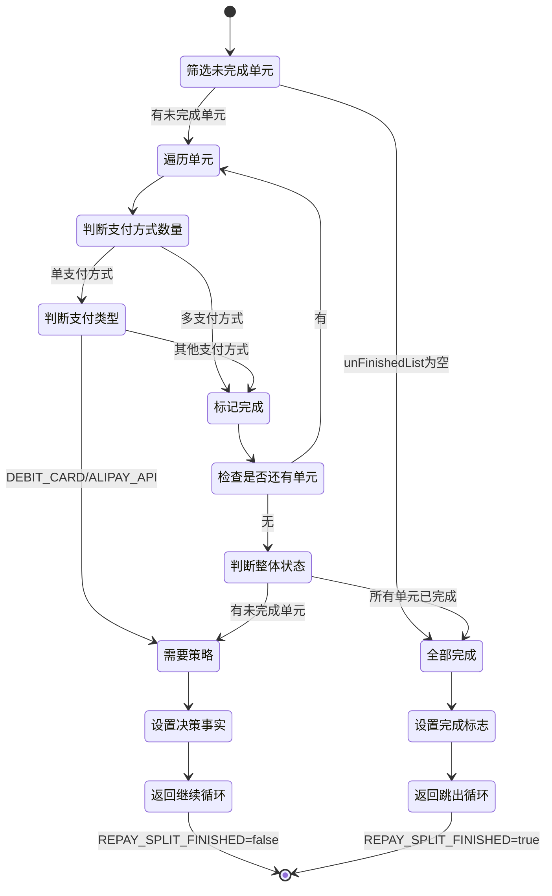

# PE130100 - 筛选还款单元数据

## 节点信息

| 属性 | 值 |
|------|-----|
| **处理器代码** | PE130100 |
| **节点名称** | 筛选还款单元数据 |
| **节点类型** | PROCESS |
| **所属流程** | [[账期制V400还款同步流程]] |
| **执行阶段** | 同步受理阶段 |
| **实现类** | RepayApplyBizFlowPE130100ServiceImpl |
| **优先级** | P0(核心节点) |

## 功能说明

筛选还款单元数据节点负责从还款单处理列表中筛选出需要进行还款模式策略决策的还款单元,并设置决策引擎所需的事实数据,控制是否需要执行还款模式策略决策循环。

### 核心职责
1. **筛选未完成的还款单元**: 过滤出repayStrategyFinished为null的还款单元
2. **判断是否需要策略决策**: 根据支付方式类型和数量判断
3. **设置决策引擎事实**: 设置REPAY_SPLIT_FINISHED和currentRepaymentBaseBillNo
4. **标记完成状态**: 对不需要策略的还款单元标记为已完成
5. **控制决策循环**: 通过REPAY_SPLIT_FINISHED控制是否继续循环

### 适用场景

- **多支付方式**: 不需要策略,直接标记完成
- **单支付方式(储蓄卡)**: 需要策略决策
- **单支付方式(支付宝API)**: 需要策略决策
- **单支付方式(其他)**: 不需要策略,直接标记完成

## 输入参数

| 参数名 | 参数代码 | 类型 | 来源 | 说明 |
|--------|----------|------|------|------|
| 还款单处理列表 | repaymentBillHandleForDcpList | List | RepayApplyBo | 还款单处理对象列表 |

### RepaymentBillHandleForDcp 结构

| 字段名 | 字段代码 | 类型 | 说明 |
|--------|----------|------|------|
| 还款单基础号 | repaymentBillBaseNo | String | 还款单基础号 |
| 还款单序号 | repaymentBillSeqNo | Integer | 还款单序号 |
| 策略完成标志 | repayStrategyFinished | Boolean | 是否已完成策略决策 |
| 还款试算组件 | repayTrialPlanListComponent | RepayTrialPlanListComponent | 还款试算结果 |

### RepayTrialPlanListComponent 结构

| 字段名 | 字段代码 | 类型 | 说明 |
|--------|----------|------|------|
| 支付方式列表 | paymentTypeList | List<PayToolItem> | 支付方式列表 |

## 输出参数

| 参数名 | 参数代码 | 类型 | 说明 |
|--------|----------|------|---------|
| 还款拆分完成标志 | REPAY_SPLIT_FINISHED | Boolean | 决策引擎事实,true表示全部完成 |
| 当前还款单基础号 | currentRepaymentBaseBillNo | String | 决策引擎事实,当前处理的还款单基础号 |

## 处理流程



## 核心业务逻辑

### 1. 筛选未完成的还款单元

**筛选逻辑**:
```
unFinishedList = repaymentBillHandleForDcpList.stream()
    .filter(item -> item.repayStrategyFinished == null)
    .collect(Collectors.toList())
```

**业务含义**:
- repayStrategyFinished为null表示还未经过策略决策处理
- 已标记为true的说明已完成,不再处理
- 筛选出未完成的单元进行后续判断

### 2. 判断是否需要策略决策

**判断规则**:

| 条件 | 需要策略 | 原因 |
|------|---------|------|
| paymentTypeList.size() > 1 | 否 | 多支付方式不需要策略 |
| 单支付方式 && payType == DEBIT_CARD | 是 | 银行卡代扣需要选择渠道 |
| 单支付方式 && payType == ALIPAY_API | 是 | 支付宝API需要选择渠道 |
| 单支付方式 && payType == 其他 | 否 | 其他支付方式不需要策略 |

**判断逻辑**:
```
FOR EACH repaymentBillHandleForDcp IN unFinishedList:
    paymentTypeList = repaymentBillHandleForDcp.repayTrialPlanListComponent.paymentTypeList

    IF paymentTypeList.size() > 1 THEN
        // 多支付方式,不需要策略
        repaymentBillHandleForDcp.repayStrategyFinished = true
        CONTINUE
    END IF

    payType = paymentTypeList.get(0).payType

    IF payType == DEBIT_CARD OR payType == ALIPAY_API THEN
        // 需要策略决策
        RETURN 当前单元
    ELSE
        // 其他支付方式,不需要策略
        repaymentBillHandleForDcp.repayStrategyFinished = true
    END IF
END FOR
```

**业务含义**:
- 多支付方式场景:用户已经选择了多种支付方式,不需要系统再做渠道决策
- 单一银行卡/支付宝:需要系统决策选择最优扣款渠道(银联/网联等)
- 单一其他支付方式:如微信、优惠券、溢缴款等,渠道已确定,不需要策略

### 3. 设置决策引擎事实

**事实数据说明**:

| 事实名称 | 类型 | 说明 |
|---------|------|------|
| REPAY_SPLIT_FINISHED | Boolean | 还款拆分是否全部完成 |
| currentRepaymentBaseBillNo | String | 当前处理的还款单基础号 |

**设置逻辑**:
```
IF 所有单元都已完成(repayStrategyFinished == true) THEN
    facts.put("REPAY_SPLIT_FINISHED", true)
    facts.remove("currentRepaymentBaseBillNo")
ELSE
    // 找到第一个未完成的单元
    currentUnit = 查找repayStrategyFinished == null的第一个单元

    facts.put("REPAY_SPLIT_FINISHED", false)
    facts.put("currentRepaymentBaseBillNo", currentUnit.repaymentBillBaseNo)
END IF
```

**业务含义**:
- REPAY_SPLIT_FINISHED = true:全部还款单元已处理完毕,跳出决策循环
- REPAY_SPLIT_FINISHED = false:还有未完成单元,继续执行决策循环
- currentRepaymentBaseBillNo:告诉决策引擎当前需要处理哪个还款单元

### 4. 决策循环控制

**循环逻辑**:


**业务含义**:
- 每次循环处理一个还款单元
- 处理完成后标记repayStrategyFinished=true
- 返回循环入口重新筛选
- 直到所有单元处理完毕,跳出循环

## 为什么需要这个节点?

### 1. 性能优化

**原因**:
- 不是所有还款单元都需要策略决策
- 多支付方式、非银行卡/支付宝支付可以直接跳过
- 减少不必要的决策引擎调用

**效果**:
```
假设有10个还款单元:
- 3个多支付方式 -> 直接跳过
- 2个微信支付 -> 直接跳过
- 2个优惠券支付 -> 直接跳过
- 3个银行卡支付 -> 需要策略决策

只有3个单元需要调用决策引擎,减少70%的决策调用
```

### 2. 循环控制

**原因**:
- 决策引擎每次只能处理一个还款单元
- 需要循环机制逐个处理
- 通过REPAY_SPLIT_FINISHED控制循环终止

**循环示例**:
```
第1次循环:
  PE130100 -> 筛选出第1个需要策略的单元 -> 设置REPAY_SPLIT_FINISHED=false
  -> 策略决策 -> 标记第1个单元完成 -> 返回循环入口

第2次循环:
  PE130100 -> 筛选出第2个需要策略的单元 -> 设置REPAY_SPLIT_FINISHED=false
  -> 策略决策 -> 标记第2个单元完成 -> 返回循环入口

第3次循环:
  PE130100 -> 筛选出第3个需要策略的单元 -> 设置REPAY_SPLIT_FINISHED=false
  -> 策略决策 -> 标记第3个单元完成 -> 返回循环入口

第4次循环:
  PE130100 -> 所有单元都已完成 -> 设置REPAY_SPLIT_FINISHED=true -> 跳出循环
```

### 3. 状态管理

**原因**:
- 通过repayStrategyFinished字段记录处理状态
- 避免重复处理同一个还款单元
- 支持断点续处理(如果流程异常中断)

## 状态流转



## 上游节点

- **PE130090** - 优惠券锁定

## 下游节点

- **LOGIC_JUDGE** - 是否完成还款模式策略(判断REPAY_SPLIT_FINISHED)
  - false分支 -> **PE130817** - 拆还款单(继续循环)
  - true分支 -> **PE150010** - 保存还款单(跳出循环)

## 异常处理

本节点属于数据筛选和状态设置节点,不涉及外部服务调用,一般不会出现异常。

## 监控指标

### 业务指标
- **需要策略比例**: 需要策略的还款单元数 / 总还款单元数
- **平均循环次数**: 总循环次数 / 总还款次数
- **多支付方式比例**: 多支付方式单元数 / 总单元数
- **银行卡支付比例**: 银行卡单元数 / 总单元数

### 技术指标
- **平均筛选耗时**: P50/P95/P99
- **平均循环耗时**: P50/P95/P99

## 性能优化

### 1. 提前筛选
- **策略**: 在遍历前先筛选出未完成单元
- **效果**: 减少遍历次数,提高处理速度

### 2. 批量标记
- **策略**: 批量标记不需要策略的单元为完成
- **效果**: 减少后续循环次数

## 实现位置

```bash
repayengine-service/src/main/java/cn/caijiajia/repayengine/service/
└── repay/process/dcp/
    └── RepayApplyBizFlowPE130100ServiceImpl.java  # 节点处理器 (96行)
```

## 设计考虑

### 1. 为什么使用initFacts()而不是process()?

**原因**:
- 本节点主要作用是设置决策引擎事实
- initFacts()专门用于初始化决策引擎所需的事实数据
- process()用于业务逻辑处理,不适合设置决策事实

### 2. 为什么多支付方式不需要策略?

**原因**:
- 用户已经选择了多种支付方式(如银行卡+微信+优惠券)
- 说明用户对支付方式已有明确意图
- 系统不需要再做渠道选择决策

### 3. 为什么只有银行卡和支付宝API需要策略?

**原因**:
- 银行卡代扣有多个渠道可选(银联、网联、银行直连等)
- 支付宝API也有多个接入方式可选
- 其他支付方式(微信、优惠券、溢缴款)渠道已确定

### 4. 为什么使用循环而不是批量处理?

**原因**:
- 决策引擎(HENGINE)每次只能处理一个还款单元
- 不同还款单元的决策规则可能不同
- 循环处理可以确保每个单元都得到正确的策略结果

## 相关文档

- [[账期制V400还款同步流程]] - 主流程设计
- [[PE130090]] - 优惠券锁定
- [[PE130817]] - 拆还款单
- [[PE130626]] - 还款模式策略入参
- [[还款模式策略决策]] - 还款模式策略规则说明

## 标签

#节点 #筛选还款单元 #决策循环控制 #PE130100