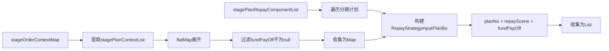
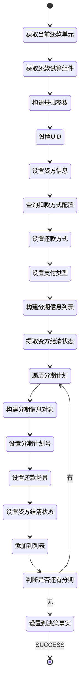

# PE130626 - 还款模式策略入参

## 节点信息

| 属性 | 值 |
|------|-----|
| **处理器代码** | PE130626 |
| **节点名称** | 还款模式策略入参 |
| **节点类型** | PROCESS |
| **所属流程** | [[账期制V400还款同步流程]] |
| **执行阶段** | 同步受理阶段 |
| **实现类** | RepayApplyBizFlowPE130626ServiceImpl |
| **优先级** | P0(核心节点) |

## 功能说明

还款模式策略入参节点负责为还款模式策略决策引擎准备输入参数,将当前还款单元的业务信息转换为决策引擎所需的事实数据格式,用于后续的还款模式策略决策。

### 核心职责
1. **获取当前还款单元**: 根据currentRepaymentBaseBillNo获取当前处理的还款单元
2. **构建策略入参**: 准备uid、资方、资产、扣款方式等决策参数
3. **构建分期信息列表**: 组装分期计划信息,包括还款场景和资方结清状态
4. **设置决策引擎事实**: 将入参设置为决策引擎的Facts

### 适用场景

- **银行卡代扣**: 需要决策选择最优扣款渠道
- **支付宝API支付**: 需要决策选择最优支付接口
- **按序还款**: 需要决策还款顺序

## 输入参数

| 参数名 | 参数代码 | 类型 | 来源 | 说明 |
|--------|----------|------|------|------|
| 当前还款单基础号 | currentRepaymentBaseBillNo | String | RepayApplyBo | PE130100设置的当前处理单元 |
| 还款单处理列表 | repaymentBillHandleForDcpList | List | RepayApplyBo | 还款单处理对象列表 |
| 订单上下文映射 | stageOrderContextMap | Map | RepayApplyContext | 订单上下文信息 |
| 还款方式 | repayWay | RepayWay | RepayApplyBo | 还款方式枚举 |
| 支付工具列表 | payToolList | List | RepayApplyReq | 支付工具列表 |

### RepaymentBillHandleForDcp 结构

| 字段名 | 字段代码 | 类型 | 说明 |
|--------|----------|------|------|
| 还款单基础号 | repaymentBillBaseNo | String | 还款单基础号 |
| 还款试算组件 | repayTrialPlanListComponent | RepayTrialPlanListComponent | 还款试算结果 |

### RepayTrialPlanListComponent 结构

| 字段名 | 字段代码 | 类型 | 说明 |
|--------|----------|------|------|
| 资方银行 | assetBank | BankEnum | 资方银行枚举 |
| 资产ID | assetId | String | 资产ID |
| 分期计划还款组件列表 | stagePlanRepayComponentList | List | 分期计划信息 |

### StageOrderContext 结构

| 字段名 | 字段代码 | 类型 | 说明 |
|--------|----------|------|------|
| 分期计划上下文列��� | stagePlanContextList | List<StagePlanContext> | 分期计划上下文 |

### StagePlanContext 结构

| 字段名 | 字段代码 | 类型 | 说明 |
|--------|----------|------|------|
| 分期计划号 | stagePlanNo | String | 分期计划唯一标识 |
| 资方是否已结清 | fundPayOff | Boolean | 资方是否已结清该期 |

## 输出参数

| 参数名 | 参数代码 | 类型 | 说明 |
|--------|----------|------|---------|
| 用户ID | UID | String | 决策引擎事实 |
| 资方银行 | ASSET_BANK | String | 决策引擎事实 |
| 资产ID | ASSET_ID | String | 决策引擎事实 |
| 扣款方式 | DEDUCT_CHANNEL_DEDUCT_WAY | String | 决策引擎事实 |
| 还款方式 | STRATEGY_PARAM_REPAY_WAY | String | 决策引擎事实 |
| 支付类型 | STRATEGY_PARAM_PAY_TYPE | String | 决策引擎事实 |
| 分期信息列表 | STRATEGY_PARAM_PLAN_LIST | List<RepayStrategyInputPlanBo> | 决策引擎事实 |

### RepayStrategyInputPlanBo 结构

| 字段名 | 字段代码 | 类型 | 说明 |
|--------|----------|------|------|
| 分期计划号 | planNo | String | 分期计划唯一标识 |
| 还款场景 | repayScene | RepayScene | 还款场景枚举 |
| 资方是否已结清 | fundPayOff | Boolean | 资方是否已结清 |

## 处理流程

```mermaid
flowchart TD
    A[开始] --> B[获取当前还款单元]
    B --> B1[根据currentRepaymentBaseBillNo]
    B1 --> B2[从repaymentBillHandleForDcpList获取]

    B2 --> C[获取还款试算组件]
    C --> C1[repayTrialPlanListComponent]

    C1 --> D[构建策略入参Map]
    D --> D1[设置UID]
    D1 --> D2[设置ASSET_BANK]
    D2 --> D3[设置ASSET_ID]

    D3 --> E[查询扣款方式配置]
    E --> E1[fundConfig.getDeductWay]
    E1 --> E2[参数: assetBank-assetId]
    E2 --> E3[设置DEDUCT_CHANNEL_DEDUCT_WAY]

    E3 --> F[设置还款方式]
    F --> F1[repayApplyBo.repayWay]
    F1 --> F2[设置STRATEGY_PARAM_REPAY_WAY]

    F2 --> G[设置支付类型]
    G --> G1[payToolList.get(0).payType]
    G1 --> G2[设置STRATEGY_PARAM_PAY_TYPE]

    G2 --> H[构建分期信息列表]
    H --> H1[调用buildPlanInfoList]

    H1 --> I[提取资方结清状态]
    I --> I1[遍历stageOrderContextMap]
    I1 --> I2[提取stagePlanContextList]
    I2 --> I3[flatMap展开]
    I3 --> I4[过滤fundPayOff不为null]
    I4 --> I5[收集为stagePlanFundPayOffMap]

    I5 --> J[遍历分期计划列表]
    J --> J1[stagePlanRepayComponentList]
    J1 --> K[构建RepayStrategyInputPlanBo]
    K --> K1[设置planNo]
    K1 --> K2[设置repayScene]
    K2 --> K3[设置fundPayOff]
    K3 --> K4[从stagePlanFundPayOffMap获取]

    K4 --> L{还有分期计划?}
    L -->|是| J
    L -->|否| M[收集为planInfoList]

    M --> N[设置STRATEGY_PARAM_PLAN_LIST]
    N --> O[添加到决策引擎Facts]
    O --> P[返回SUCCESS]

    style L fill:#fff4e6
    style P fill:#e8f5e9
```

## 核心业务逻辑

### 1. 获取当前还款单元

**获取逻辑**:
```
currentRepaymentBaseBillNo = repayApplyBo.getCurrentRepaymentBaseBillNo()

repaymentBillHandleForDcp = repaymentBillHandleForDcpList.stream()
    .filter(item -> item.repaymentBillBaseNo == currentRepaymentBaseBillNo)
    .findFirst()
    .orElseThrow()
```

**业务含义**:
- currentRepaymentBaseBillNo由PE130100设置
- 标识当前需要决策的还款单元
- 从还款单处理列表中定位具体单元

### 2. 构建基础决策参数

**参数说明**:

| 参数名 | 来源 | 用途 |
|--------|------|------|
| UID | repayApplyContext.uid | 用户标识,用于查询用户属性 |
| ASSET_BANK | repayTrialPlanListComponent.assetBank | 资方银行,用于渠道路由 |
| ASSET_ID | repayTrialPlanListComponent.assetId | 资产ID,用于费率计算 |
| DEDUCT_CHANNEL_DEDUCT_WAY | fundConfig配置 | 扣款方式配置 |
| STRATEGY_PARAM_REPAY_WAY | repayApplyBo.repayWay | 还款方式(自动/手动) |
| STRATEGY_PARAM_PAY_TYPE | payToolList[0].payType | 支付类型 |

**扣款方式查询**:
```
key = assetBank + "-" + assetId
deductWay = fundConfig.getDeductWay(key)
```

**业务含义**:
- 扣款方式由资方和资产ID共同决定
- 不同资方/资产包可能有不同的扣款方式配置
- 配置来源:confplus配置中心

### 3. 构建分期信息列表

**构建步骤**:



**提取资方结清状态**:
```
stagePlanFundPayOffMap = stageOrderContextMap.values().stream()
    .map(StageOrderContext::fetchStagePlanContextList)
    .flatMap(Collection::stream)
    .filter(item -> item.fundPayOff != null)
    .collect(Collectors.toMap(
        StagePlanContext::getStagePlanNo,
        StagePlanContext::getFundPayOff
    ))
```

**构建分期信息**:
```
FOR EACH stagePlanRepayComponent IN stagePlanRepayComponentList:
    planNo = stagePlanRepayComponent.stagePlanNo
    repayScene = stagePlanRepayComponent.repayScene
    fundPayOff = stagePlanFundPayOffMap.get(planNo) ?: false

    repayStrategyInputPlanBo = RepayStrategyInputPlanBo.builder()
        .planNo(planNo)
        .repayScene(repayScene)
        .fundPayOff(fundPayOff)
        .build()

    repayStrategyInputPlanBoList.add(repayStrategyInputPlanBo)
END FOR
```

**业务含义**:
- 每个分期计划都需要传入决策引擎
- repayScene标识还款场景(正常还款/提前结清/逾期还款等)
- fundPayOff标识资方是否已结清该期(影响是否需要推送资方)

### 4. 还款场景枚举

**RepayScene 枚举值**:

| 枚举值 | 说明 | 决策影响 |
|--------|------|----------|
| NORMAL | 正常还款 | 按正常规则处理 |
| ADVANCE_SETTLE | 提前结清 | 可能有提前结清费用 |
| OVERDUE | 逾期还款 | 需要计算逾期费用 |
| PARTIAL | 部分还款 | 需要拆分金额 |

### 5. 资方结清状态的作用

**fundPayOff 的含义**:
- `true`: 资方已认领该期,后续入账不需要再推送资方
- `false`: 资方未认领该期,后续入账需要推送资方
- `null`: 未查询到资方状态,按false处理

**业务影响**:
```
IF fundPayOff == true THEN
    // 资方已结清
    // 入账时只更新本地数据
    // 不推送资方系统
ELSE
    // 资方未结清
    // 入账时需要推送资方
    // 更新资方系统的结清状态
END IF
```

## 状态流转



## 上游节点

- **PE130100** - 筛选还款单元数据

## 下游节点

- **还款模式策略** - 决策引擎(HENGINE决策)

## 异常处理

| 异常场景 | 错误类型 | 处理方式 | 影响 |
|----------|----------|----------|------|
| 还款单元未找到 | NoSuchElementException | 抛出异常 | 流程终止 |
| 扣款方式配置缺失 | ConfigException | 使用默认值或抛出异常 | 流程终止 |
| 其他异常 | Exception | 记录日志,返回ERROR | 流程终止 |

## 监控指标

### 业务指标
- **平均分期计划数**: 总分期计划数 / 总决策次数
- **资方已结清比例**: fundPayOff=true的分期数 / 总分期数
- **还款场景分布**: 各还款场景的占比

### 技术指标
- **平均构建耗时**: P50/P95/P99
- **配置查询成功率**: 成功数 / 总查询数

## 性能优化

### 1. Map缓存
- **策略**: 使用Map缓存资方结清状态
- **效果**: 避免重复遍历stageOrderContextMap

### 2. Stream优化
- **策略**: 使用Stream API简化集合操作
- **效果**: 代码简洁,性能提升

## 实现位置

```bash
repayengine-service/src/main/java/cn/caijiajia/repayengine/service/
├── repay/process/dcp/
│   └── RepayApplyBizFlowPE130626ServiceImpl.java  # 节点处理器 (102行)
└── configuration/
    └── FundConfig.java                             # 资方配置
```

## 设计考虑

### 1. 为什么使用initFacts()而不是process()?

**原因**:
- 本节点主要作用是准备决策引擎输入参数
- initFacts()专门用于设置决策引擎事实数据
- process()用于业务逻辑处理,这里不需要

### 2. 为什么需要资方结清状态?

**原因**:
- 资方已结清的分期,后续入账不需要推送资方
- 减少与资方系统的交互,提高性能
- 避免资方系统重复处理

### 3. 为什么需要还款场景?

**原因**:
- 不同还款场景的处理规则不同
- 提前结清可能有提前结清费用
- 逾期还款需要计算逾期费用
- 决策引擎需要根据场景选择策略

### 4. 为什么只取第一个支付工具的payType?

**原因**:
- 本节点只处理单支付方式的还款单元
- PE130100已经过滤掉多支付方式的单元
- 单支付方式只有一个payType

## 相关文档

- [[账期制V400还款同步流程]] - 主流程设计
- [[PE130100]] - 筛选还款单元数据
- [[PE130628]] - 还款模式策略出参聚合
- [[还款模式策略决策]] - 还款模式策略规则
- [[决策引擎集成]] - HENGINE决策引擎使用

## 标签

#节点 #还款模式策略 #决策引擎入参 #PE130626