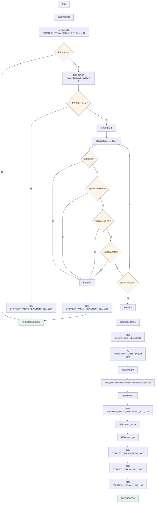
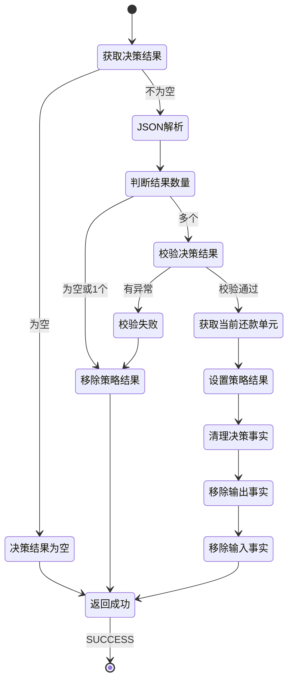

# PE130628 - 还款模式策略出参聚合

## 节点信息

| 属性 | 值 |
|------|-----|
| **处理器代码** | PE130628 |
| **节点名称** | 还款模式策略出参聚合 |
| **节点类型** | PROCESS |
| **所属流程** | [[账期制V400还款同步流程]] |
| **执行阶段** | 同步受理阶段 |
| **实现类** | RepayApplyBizFlowPE130628ServiceImpl |
| **优先级** | P0(核心节点) |

## 功能说明

还款模式策略出参聚合节点负责接收还款模式策略决策引擎返回的决策结果,进行校验和转换后设置到当前还款单元,并清理决策引擎事实数据,为下一次循环做准备。

### 核心职责
1. **获取决策引擎输出**: 从Facts中提取STRATEGY_PARAM_REPAYMENT_BILL_LIST
2. **校验决策结果**: 校验决策结果的合法性(repaySeqNo、planNoList等)
3. **设置到还款单元**: 将决策结果设置到repaymentBillHandleForDcp
4. **清理决策事实**: 清除决策引擎的输入输出事实数据
5. **异常处理**: 决策结果异常时移除策略结果,走默认流程

### 适用场景

- **按序还款**: 决策引擎返回多个还款单,需要按序号排序
- **单一还款**: 决策引擎返回单个还款单,直接处理
- **决策异常**: 决策结果异常,移除策略结果,走默认流程

## 输入参数

| 参数名 | 参数代码 | 类型 | 来源 | 说明 |
|--------|----------|------|------|------|
| 策略决策结果 | STRATEGY_PARAM_REPAYMENT_BILL_LIST | List | 决策引擎Facts | 还款模式策略决策结果 |
| 当前还款单基础号 | currentRepaymentBaseBillNo | String | RepayApplyBo | 当前处理的还款单基础号 |
| 还款单处理列表 | repaymentBillHandleForDcpList | List | RepayApplyBo | 还款单处理对象列表 |

### RepayStrategyOutputBo 结构(决策引擎输出)

| 字段名 | 字段代码 | 类型 | 说明 |
|--------|----------|------|------|
| 还款序号 | repaySeqNo | Integer | 还款顺序(0开始) |
| 分期计划号列表 | planNoList | List<String> | 该还款单包含的分期计划 |

## 输出参数

| 参数名 | 参数代码 | 类型 | 说明 |
|--------|----------|------|---------|
| 策略决策结果列表 | strategyRespBoList | List<RepayStrategyOutputBo> | 设置到repaymentBillHandleForDcp |

## 处理流程



## 核心业务逻辑

### 1. 获取决策引擎输出

**获取逻辑**:
```
facts = processContext.getFacts()

IF facts.get(STRATEGY_PARAM_REPAYMENT_BILL_LIST) == null THEN
    RETURN  // 直接返回
END IF

// JSON解析为对象列表
strategyRespBoList = JSON.parseArray(
    JSON.toJSONString(facts.get(STRATEGY_PARAM_REPAYMENT_BILL_LIST)),
    RepayStrategyOutputBo.class
)
```

**业务含义**:
- STRATEGY_PARAM_REPAYMENT_BILL_LIST是决策引擎的输出事实
- 决策引擎以JSON格式返回结果
- 需要反序列化为RepayStrategyOutputBo对象列表

### 2. 校验决策结果

**校验规则**:

| 校验项 | 规则 | 说明 |
|--------|------|------|
| 对象非空 | repayStrategyOutputBo != null | 决策结果对象不能为空 |
| 序号非空 | repaySeqNo != null | 还款序号必须有值 |
| 序号非负 | repaySeqNo >= 0 | 还款序号不能为负数 |
| 分期列表非空 | planNoList不为空 | 必须包含分期计划 |

**校验逻辑**:
```
FOR EACH repayStrategyOutputBo IN strategyRespBoList:
    IF repayStrategyOutputBo == null THEN
        校验失败 = true
        BREAK
    END IF

    IF repaySeqNo == null OR repaySeqNo < 0 THEN
        校验失败 = true
        BREAK
    END IF

    IF planNoList为空 THEN
        校验失败 = true
        BREAK
    END IF
END FOR

IF 校验失败 THEN
    // 移除策略结���
    facts.remove(STRATEGY_PARAM_REPAYMENT_BILL_LIST)
    RETURN
END IF
```

**业务含义**:
- 校验失败说明决策引擎返回异常数据
- 移除策略结果后,走默认流程(不拆分)
- 避免异常数据影响后续处理

### 3. 处理只有一个结果的情况

**处理逻辑**:
```
IF strategyRespBoList为空 OR strategyRespBoList.size() == 1 THEN
    // 移除策略结果
    facts.remove(STRATEGY_PARAM_REPAYMENT_BILL_LIST)
    RETURN
END IF
```

**业务含义**:
- 只有一个结果说明不需要拆分
- 移除策略结果,走默认流程
- 避免不必要的拆分逻辑

**为什么?**
- 决策引擎的作用是决策如何拆分还款单
- 如果返回1个结果,说明不需要拆分
- 不拆分的情况下,保持原有的还款单即可

### 4. 设置策略结果到还款单元

**设置逻辑**:
```
// 获取当前还款单元
repaymentBillHandleForDcp = repaymentBillHandleForDcpList.stream()
    .filter(item -> item.repaymentBillBaseNo == currentRepaymentBaseBillNo)
    .findFirst()
    .orElseThrow()

// 设置策略结果
repaymentBillHandleForDcp.setStrategyRespBoList(strategyRespBoList)
```

**业务含义**:
- 将决策结果关联到当前处理的还款单元
- 后续PE130630节点会根据策略结果拆分还款单

### 5. 清理决策事实

**清理逻辑**:
```
facts.remove(STRATEGY_PARAM_REPAYMENT_BILL_LIST)  // 策略输出
facts.remove(ASSET_BANK)                          // 策略输入
facts.remove(ASSET_ID)                            // 策略输入
facts.remove(STRATEGY_PARAM_REPAY_WAY)            // 策略输入
facts.remove(STRATEGY_PARAM_PAY_TYPE)             // 策略输入
facts.remove(STRATEGY_PARAM_PLAN_LIST)            // 策略输入
```

**业务含义**:
- 清理本次决策的输入输出事实
- 为下一次循环做准备(下一个还款单元)
- 避免事实数据污染

**为什么要清理?**
- 决策引擎是有状态的,需要清理旧数据
- 下一次循环会设置新的输入事实
- 避免上一次的事实影响下一次决策

## 决策结果示例

### 场景1: 按序还款(多个还款单)

**决策结果**:
```json
[
  {
    "repaySeqNo": 0,
    "planNoList": ["PLAN001", "PLAN002"]
  },
  {
    "repaySeqNo": 1,
    "planNoList": ["PLAN003"]
  }
]
```

**业务含义**:
- 拆分为2个还款单
- 第1个还款单包含PLAN001和PLAN002,序号0
- 第2个还款单包含PLAN003,序号1
- 按序号顺序执行还款

### 场景2: 不拆分(单个还款单)

**决策结果**:
```json
[
  {
    "repaySeqNo": 0,
    "planNoList": ["PLAN001", "PLAN002", "PLAN003"]
  }
]
```

**处理方式**:
- 移除策略结果
- 走默认流程,不拆分

### 场景3: 决策异常

**决策结果**:
```json
[
  {
    "repaySeqNo": null,
    "planNoList": ["PLAN001"]
  }
]
```

**处理方式**:
- 校验失败
- 移除策略结果
- 走默认流程

## 状态流转



## 上游节点

- **还款模式策略** - 决策引擎(HENGINE决策)

## 下游节点

- **PE130630** - 聚合还款单元数据

## 异常处理

| 异常场景 | 错误类型 | 处理方式 | 影响 |
|----------|----------|----------|------|
| 决策结果为空 | - | 直接返回,不处理 | 走默认流程 |
| 决策结果只有1个 | - | 移除策略结果 | 走默认流程 |
| repaySeqNo为空 | - | 移除策略结果 | 走默认流程 |
| repaySeqNo为负数 | - | 移除策略结果 | 走默认流程 |
| planNoList为空 | - | 移除策略结果 | 走默认流程 |
| JSON解析失败 | JSONException | 抛出异常 | 流程终止 |

## 监控指标

### 业务指标
- **决策拆分率**: 决策返回多个还款单的次数 / 总决策次数
- **决策异常率**: 决策结果异常的次数 / 总决策次数
- **平均拆分数**: 总还款单数 / 拆分的决策次数

### 技术指标
- **平均处理耗时**: P50/P95/P99
- **JSON解析成功率**: 成功数 / 总次数

## 性能优化

### 1. 提前返回
- **策略**: 决策结果异常时提前返回
- **效果**: 避免不必要的处理

### 2. 批量清理
- **策略**: 批量清理决策事实
- **效果**: 减少多次调用

## 实现位置

```bash
repayengine-service/src/main/java/cn/caijiajia/repayengine/service/
└── repay/process/dcp/
    └── RepayApplyBizFlowPE130628ServiceImpl.java  # 节点处理器 (92行)
```

## 设计考虑

### 1. 为什么只有1个结果也要移除策略结果?

**原因**:
- 决策引擎的目的是决策如何拆分
- 返回1个结果说明不需要拆分
- 不拆分的情况下保持原有还款单即可
- 移除策略结果后走默认流程更简单

### 2. 为什么决策异常不抛出异常?

**原因**:
- 决策引擎是辅助决策,不是必须的
- 决策失败可以降级走默认流程
- 保证还款流程的可用性
- 避免因决策引擎问题导致还款失败

### 3. 为什么要清理决策事实?

**原因**:
- 决策引擎是有状态的
- 下一次循环会设置新的输入事实
- 避免上一次的事实污染下一次决策
- 保证每次决策的独立性

### 4. 为什么使用initFacts()而不是process()?

**原因**:
- 本节点主要作用是处理决策引擎输出
- initFacts()可以修改决策引擎事实
- process()无法访问决策引擎事实

## 相关文档

- [[账期制V400还款同步流程]] - 主流程设计
- [[PE130626]] - 还款模式策略入参
- [[PE130630]] - 聚合还款单元数据
- [[还款模式策略决策]] - 还款模式策略规则
- [[决策引擎集成]] - HENGINE决策引擎使用

## 标签

#节点 #还款模式策略 #决策引擎出参 #PE130628