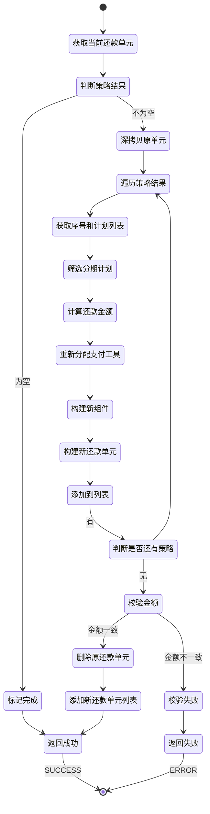

# PE130630 - 聚合还款单元数据

## 节点信息

| 属性 | 值 |
|------|-----|
| **处理器代码** | PE130630 |
| **节点名称** | 聚合还款单元数据 |
| **节点类型** | PROCESS |
| **所属流程** | [[账期制V400还款同步流程]] |
| **执行阶段** | 同步受理阶段 |
| **实现类** | RepayApplyBizFlowPE130630ServiceImpl |
| **优先级** | P0(核心节点) |

## 功能说明

聚合还款单元数据节点负责根据还款模式策略的决策结果,将当前还款单元拆分为多个子还款单元,每个子还款单元包含决策引擎指定的分期计划,并重新计算还款金额和支付工具金额。

### 核心职责
1. **判断是否需要拆分**: 检查strategyRespBoList是否为空
2. **深拷贝原始还款单元**: 避免修改原对象
3. **按策略拆分还款单元**: 根据planNoList拆分分期计划
4. **重新计算还款金额**: 根据分期计划计算新的还款金额
5. **重新分配支付工具**: 按比例分配支付金额
6. **校验金额一致性**: 确保拆分后总金额等于原金额
7. **替换还款单元列表**: 删除原单元,添加新单元

### 适用场景

- **按序还款**: 需要拆分为多个还款单,按序号顺序执行
- **不拆分**: 策略结果为空,标记为已完成

## 输入参数

| 参数名 | 参数代码 | 类型 | 来源 | 说明 |
|--------|----------|------|------|------|
| 当前还款单基础号 | currentRepaymentBaseBillNo | String | RepayApplyBo | 当前处理的还款单基础号 |
| 还款单处理列表 | repaymentBillHandleForDcpList | List | RepayApplyBo | 还款单处理对象列表 |
| 策略决策结果 | strategyRespBoList | List | RepaymentBillHandleForDcp | PE130628设置的决策结果 |

### RepaymentBillHandleForDcp 结构

| 字段名 | 字段代码 | 类型 | 说明 |
|--------|----------|------|------|
| 还款单基础号 | repaymentBillBaseNo | String | 还款单基础号 |
| 还款单序号 | repaymentBillSeqNo | Integer | 还款单序号 |
| 策略决策结果 | strategyRespBoList | List<RepayStrategyOutputBo> | 决策引擎返回的拆分策略 |
| 还款试算组件 | repayTrialPlanListComponent | RepayTrialPlanListComponent | 还款试算结果 |

### RepayStrategyOutputBo 结构

| 字段名 | 字段代码 | 类型 | 说明 |
|--------|----------|------|------|
| 还款序号 | repaySeqNo | Integer | 还款顺序(0开始) |
| 分期计划号列表 | planNoList | List<String> | 该还款单包含的分期计划 |

### RepayTrialPlanListComponent 结构

| 字段名 | 字段代码 | 类型 | 说明 |
|--------|----------|------|------|
| 还款金额 | repayAmount | Integer | 还款金额(单位:分) |
| 分期计划还款组件列表 | stagePlanRepayComponentList | List | 分期计划信息 |
| 支付方式列表 | paymentTypeList | List<PayToolItem> | 支付方式列表 |

## 输出参数

| 参数名 | 参数代码 | 类型 | 说明 |
|--------|----------|------|---------|
| 还款单处理列表 | repaymentBillHandleForDcpList | List | 更新后的还款单处理列表 |

## 处理流程

```mermaid
flowchart TD
    A[开始] --> B[获取当前还款单元]
    B --> B1[根据currentRepaymentBaseBillNo]
    B1 --> B2[从repaymentBillHandleForDcpList获取]

    B2 --> C{strategyRespBoList为空?}
    C -->|是| D1[标记repayStrategyFinished=true]
    D1 --> D2[返回SUCCESS]

    C -->|否| E[深拷贝原始还款单元]
    E --> E1[JSON序列化+反序列化]
    E1 --> E2[baseBillHandleForDcp]

    E2 --> F[初始化新还款单元列表]
    F --> G[遍历strategyRespBoList]

    G --> H[获取策略结果]
    H --> H1[repaySeqNo]
    H1 --> H2[planNoList]

    H2 --> I[构建新的还款单元]
    I --> I1[设置repaymentBillSeqNo=repaySeqNo]
    I1 --> I2[设置repaymentBillBaseNo=原baseNo]
    I2 --> I3[设置repayStrategyFinished=true]

    I3 --> J[构建RepayTrialPlanListComponent]
    J --> J1[调用buildRepayPlanList]
    J1 --> J2[传入: 原组件 + planNoList]

    J2 --> K[筛选分期计划]
    K --> K1[filter: planNoList.contains]
    K1 --> K2[收集为planRepayComponentList]

    K2 --> L[重新计算还款金额]
    L --> L1[flatMap展开RepayComponentInfo]
    L1 --> L2[mapToInt repayAmount]
    L2 --> L3[sum]

    L3 --> M[重新分配支付工具]
    M --> M1[调用refreshPayTypeList]
    M1 --> M2[深拷贝第一个PayToolItem]
    M2 --> M3[设置payableAmount=repayAmount]

    M3 --> N[构建新的RepayTrialPlanListComponent]
    N --> N1[设置assetBank/assetId/fundTag等]
    N1 --> N2[设置stagePlanRepayComponentList]
    N2 --> N3[设置repayAmount]
    N3 --> N4[设置paymentTypeList]

    N4 --> O[添加到新还款单元列表]
    O --> P{还有策略结果?}
    P -->|是| G
    P -->|否| Q[校验金额一致性]

    Q --> Q1[计算新还款单元总金额]
    Q1 --> Q2[计算原还款单元总金额]
    Q2 --> Q3{金额一致?}
    Q3 -->|否| R1[抛出异常REPAY_BILL_AMOUNT_ERROR]

    Q3 -->|是| S[删除原还款单元]
    S --> S1[removeIf: repaymentBillBaseNo相同]

    S1 --> T[添加新还款单元列表]
    T --> T1[addAll: repaymentBillHandleForDcpList]

    T1 --> U[返回SUCCESS]

    style C fill:#fff4e6
    style P fill:#fff4e6
    style Q3 fill:#fff4e6
    style D2 fill:#e8f5e9
    style U fill:#e8f5e9
    style R1 fill:#ffebee
```



## 核心业务逻辑

### 1. 判断是否需要拆分

**判断逻辑**:
```
IF strategyRespBoList为空 THEN
    // 不需要拆分
    repaymentBillHandleForDcp.setRepayStrategyFinished(true)
    RETURN SUCCESS
END IF
```

**业务含义**:
- strategyRespBoList为空说明不需要拆分
- 标记repayStrategyFinished=true
- 返回后PE130100会继续处理下一个还款单元

### 2. 深拷贝原始还款单元

**深拷贝逻辑**:
```
baseBillHandleForDcp = JSON.parseObject(
    JSON.toJSONString(repaymentBillHandleForDcp, DisableCircularReferenceDetect),
    RepaymentBillHandleForDcp.class
)
```

**业务含义**:
- 深拷贝避免修改原对象
- DisableCircularReferenceDetect避免循环引用问题
- 作为模板生成新的还款单元

**为什么需要深拷贝?**
- 原还款单元还在列表中
- 需要基于原数据生成新单元
- 避免引用同一个对象导致数据混乱

### 3. 按策略拆分还款单元

**拆分逻辑**:
```
newRepaymentBillHandleForDcpList = []

FOR EACH strategyRespBo IN strategyRespBoList:
    newRepaymentBillHandleForDcp = RepaymentBillHandleForDcp.builder()
        .repaymentBillSeqNo(strategyRespBo.repaySeqNo)
        .repaymentBillBaseNo(baseBillHandleForDcp.repaymentBillBaseNo)
        .repayStrategyFinished(true)
        .repayTrialPlanListComponent(
            buildRepayPlanList(
                baseBillHandleForDcp.repayTrialPlanListComponent,
                strategyRespBo.planNoList
            )
        )
        .build()

    newRepaymentBillHandleForDcpList.add(newRepaymentBillHandleForDcp)
END FOR
```

**业务含义**:
- 每个策略结果对应一个新的还款单元
- repaymentBillSeqNo设置为决策引擎返回的序号
- repaymentBillBaseNo保持不变(同一组还款单元)
- repayStrategyFinished=true标记为已完成

### 4. 构建新的还款试算组件

**构建逻辑**:
```
buildRepayPlanList(repayTrialPlanListComponent, planNoList):
    // 筛选分期计划
    planRepayComponentList = repayTrialPlanListComponent.stagePlanRepayComponentList.stream()
        .filter(item -> planNoList.contains(item.stagePlanNo))
        .collect(Collectors.toList())

    // 重新计算还款金额
    repayAmount = planRepayComponentList.stream()
        .map(StagePlanRepayComponent::getRepayComponentInfoList)
        .flatMap(Collection::stream)
        .mapToInt(RepayComponentInfo::getRepayAmount)
        .sum()

    // 重新分配支付工具
    paymentTypeList = refreshPayTypeList(
        repayTrialPlanListComponent.paymentTypeList,
        repayAmount
    )

    // 构建新的组件
    RETURN RepayTrialPlanListComponent.builder()
        .assetBank(repayTrialPlanListComponent.assetBank)
        .assetId(repayTrialPlanListComponent.assetId)
        .fundTag(repayTrialPlanListComponent.fundTag)
        .loanSubject(repayTrialPlanListComponent.loanSubject)
        .stagePlanRepayComponentList(planRepayComponentList)
        .repayAmount(repayAmount)
        .paymentTypeList(paymentTypeList)
        .build()
```

**业务含义**:
- 根据planNoList筛选分期计划
- 只包含决策引擎指定的分期计划
- 重新计算还款金额(筛选后的分期计划金额之和)
- 重新分配支付工具(按新金额分配)

### 5. 重新分配支付工具

**分配逻辑**:
```
refreshPayTypeList(payToolItemList, repayAmount):
    // 深拷贝第一个支付工具
    payToolItem = modelMapper.map(payToolItemList.get(0), PayToolItem.class)

    // 设置新的可支付金额
    payToolItem.setPayableAmount(repayAmount)

    // 返回单元素列表
    RETURN [payToolItem]
```

**业务含义**:
- 只取第一个支付工具(单支付方式场景)
- 深拷贝避免修改原对象
- 设置payableAmount为新的还款金额
- 返回单元素列表(只有一个支付方式)

**为什么只取第一个?**
- 本节点只处理单支付方式的还款单元
- PE130100已经过滤掉多支付方式的单元
- 单支付方式只有一个PayToolItem

### 6. 校验金额一致性

**校验逻辑**:
```
checkAmount(newRepaymentBillHandleForDcpList, baseBillHandleForDcp):
    // 计算新还款单元总金额
    newAllRepayAmount = newRepaymentBillHandleForDcpList.stream()
        .map(RepaymentBillHandleForDcp::getRepayTrialPlanListComponent)
        .mapToInt(RepayTrialPlanListComponent::getRepayAmount)
        .sum()

    // 获取原还款单元总金额
    oldAllRepayAmount = baseBillHandleForDcp.repayTrialPlanListComponent.repayAmount

    // 校验一致
    IF newAllRepayAmount != oldAllRepayAmount THEN
        THROW ClientException(REPAY_BILL_AMOUNT_ERROR)
    END IF
```

**业务含义**:
- 拆分后的总金额必须等于原金额
- 防止金额丢失或增加
- 确保数据一致性

**校验公式**:
```
SUM(新还款单元.repayAmount) == 原还款单元.repayAmount
```

### 7. 替换还款单元列表

**替换逻辑**:
```
// 删除原还款单元
repayApplyBo.repaymentBillHandleForDcpList.removeIf(
    item -> item.repaymentBillBaseNo.equals(currentRepaymentBaseBillNo)
)

// 添加新还款单元列表
repayApplyBo.repaymentBillHandleForDcpList.addAll(newRepaymentBillHandleForDcpList)
```

**业务含义**:
- 删除原还款单元(1个)
- 添加新还款单元列表(多个)
- 完成拆分操作

## 拆分示例

### 场景1: 拆分为2个还款单元

**原始还款单元**:
```
repaymentBillBaseNo: "BASE001"
repayAmount: 10000分 (100元)
stagePlanRepayComponentList: [PLAN001(50元), PLAN002(30元), PLAN003(20元)]
paymentTypeList: [DEBIT_CARD(100元)]
```

**决策引擎返回**:
```json
[
  {
    "repaySeqNo": 0,
    "planNoList": ["PLAN001", "PLAN002"]
  },
  {
    "repaySeqNo": 1,
    "planNoList": ["PLAN003"]
  }
]
```

**拆分后的新还款单元**:

**第1个还款单元**:
```
repaymentBillBaseNo: "BASE001"
repaymentBillSeqNo: 0
repayAmount: 8000分 (80元)
stagePlanRepayComponentList: [PLAN001(50元), PLAN002(30元)]
paymentTypeList: [DEBIT_CARD(80元)]
```

**第2个还款单元**:
```
repaymentBillBaseNo: "BASE001"
repaymentBillSeqNo: 1
repayAmount: 2000分 (20元)
stagePlanRepayComponentList: [PLAN003(20元)]
paymentTypeList: [DEBIT_CARD(20元)]
```

**校验**:
- 新总金额: 80 + 20 = 100元
- 原总金额: 100元
- 一致 ✓

## 状态流转



## 上游节点

- **PE130628** - 还款模式策略出参聚合

## 下游节点

- **PE130100** - 筛选还款单元数据(循环入口)

## 异常处理

| 异常场景 | 错误类型 | 错误码 | 处理方式 | 影响 |
|----------|----------|--------|----------|------|
| 金额不一致 | ClientException | REPAY_BILL_AMOUNT_ERROR | 抛出异常 | 流程终止 |
| JSON解析失败 | JSONException | - | 抛出异常 | 流程终止 |
| 其他异常 | Exception | - | 记录日志,返回ERROR | 流程终止 |

## 监控指标

### 业务指标
- **拆分比例**: 拆分的还款单元数 / 总还款单元数
- **平均拆分数**: 拆分后的还款单元数 / 拆分次数
- **金额校验失败率**: 失败次数 / 总拆分次数

### 技术指标
- **平均拆分耗时**: P50/P95/P99
- **深拷贝成功率**: 成功数 / 总次数

## 性能优化

### 1. Stream优化
- **策略**: 使用Stream API简化集合操作
- **效果**: 代码简洁,性能提升

### 2. 深拷贝优化
- **策略**: JSON序列化+反序列化
- **效果**: 简单可靠,避免复杂对象拷贝

### 3. 金额校验
- **策略**: 使用Stream的sum()方法
- **效果**: 代码简洁,性能好

## 实现位置

```bash
repayengine-service/src/main/java/cn/caijiajia/repayengine/service/
└── repay/process/dcp/
    └── RepayApplyBizFlowPE130630ServiceImpl.java  # 节点处理器 (117行)
```

## 设计考虑

### 1. 为什么需要深拷贝原始还款单元?

**原因**:
- 原还款单元还在列表中,不能直接修改
- 需要基于原数据生成新的还款单元
- 避免引用同一个对象导致数据混乱

### 2. 为什么要校验金额一致性?

**原因**:
- 确保拆分后总金额等于原金额
- 防止金额丢失或增加
- 保证数据一致性
- 避免资金问题

### 3. 为什么只取第一个支付工具?

**原因**:
- 本节点只处理单支付方式的还款单元
- PE130100已经过滤掉多支付方式的单元
- 单支付方式只有一个PayToolItem

### 4. 为什么需要标记repayStrategyFinished=true?

**原因**:
- 标记该还款单元已完成策略决策
- 避免PE130100再次选中该单元
- 支持循环处理多个还款单元

## 相关文档

- [[账期制V400还款同步流程]] - 主流程设计
- [[PE130628]] - 还款模式策略出参聚合
- [[PE130100]] - 筛选还款单元数据
- [[还款单元拆分规则]] - 还款单元拆分规则说明

## 标签

#节点 #还款单元拆分 #策略决策 #PE130630