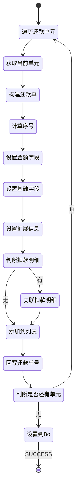

# PE130817 - 拆还款单

## 节点信息

| 属性 | 值 |
|------|-----|
| **处理器代码** | PE130817 |
| **节点名称** | 拆还款单 |
| **节点类型** | PROCESS |
| **所属流程** | [[账期制V400还款同步流程]] |
| **执行阶段** | 同步受理阶段 |
| **实现类** | RepayApplyBizFlowPE130817ServiceImpl |
| **优先级** | P0(核心节点) |

## 功能说明

拆还款单节点负责根据还款模式策略的决策结果,将还款单元拆分为具体的还款单,每个还款单对应一个还款单元,包含还款金额、资方信息、扣款明细等完整信息。

### 核心职责
1. **遍历还款单元**: 遍历所有待处理的还款单元
2. **构建还款单**: 为每个还款单元创建对应的还款单
3. **设置还款金额**: 设置还款单的总金额和未拆分金额
4. **设置资方信息**: 设置资方银行、资产ID等信息
5. **设置扩展信息**: 设置还款方式、申请日期、资金标签等
6. **关联扣款明细**: 关联线下扣款明细(如有)
7. **生成还款单号**: 为每个还款单生成唯一的还款单号

### 适用场景

- **正常还款**: 拆分为一个或多个还款单
- **提前结清**: 拆分为多个还款单(按资方/资产包)
- **部分还款**: 拆分为一个或多个还款单
- **线下还款**: 拆分为多个还款单(按扣款流水)

## 输入参数

| 参数名 | 参数代码 | 类型 | 来源 | 说明 |
|--------|----------|------|------|------|
| 还款单处理列表 | repaymentBillHandleForDcpList | List | RepayApplyBo | 还款单处理对象列表 |
| 还款申请号 | repayApplyNo | String | RepayApplyBo | 还款申请唯一标识 |
| 用户ID | uid | String | RepayApplyBo | 用户唯一标识 |

### RepaymentBillHandleForDcp 结构

| 字段名 | 字段代码 | 类型 | 说明 |
|--------|----------|------|------|
| 还款单基础号 | repaymentBillBaseNo | String | 还款单基础号(分组标识) |
| 还款单序号 | repaymentBillSeqNo | Integer | 还款单序号 |
| 还款试算组件 | repayTrialPlanListComponent | RepayTrialPlanListComponent | 还款试算结果 |
| 扣款明细列表 | deductDetailInfoList | List<DeductDetailInfo> | 线下扣款明细 |

### RepayTrialPlanListComponent 结构

| 字段名 | 字段代码 | 类型 | 说明 |
|--------|----------|------|------|
| 还款金额 | repayAmount | Integer | 还款金额(单位:分) |
| 资方银行 | assetBank | BankEnum | 资方银行枚举 |
| 资产ID | assetId | String | 资产ID |
| 资金标签 | fundTag | String | 资金标签 |
| 放款主体 | loanSubject | String | 放款主体 |

## 输出参数

| 参数名 | 参数代码 | 类型 | 说明 |
|--------|----------|------|------|
| 还款单列表 | repaymentBillList | List<BaseRepaymentBill> | 拆分后的还款单列表 |

### BaseRepaymentBill 结构

| 字段名 | 字段代码 | 类型 | 说明 |
|--------|----------|------|------|
| 还款单号 | repaymentBillNo | String | 还款单唯一标识(UUID) |
| 还款申请号 | repayApplyNo | String | 关联的还款申请号 |
| 用户ID | uid | String | 用户唯一标识 |
| 还款金额 | repayAmount | Integer | 还款金额(单位:分) |
| 未拆分金额 | unSplitAmount | Integer | 未拆分的金额 |
| 已拆分金额 | splitAmount | Integer | 已拆分的金额 |
| 未扣款金额 | unDeductAmount | Integer | 未扣款的金额 |
| 还款状态 | repayStatus | RepayStatus | 还款状态(INIT) |
| 还款类型 | repayType | RepayCategory | 还款类型(BILL) |
| 还款单类型 | repaymentBillType | RepaymentBillType | 还款单类型(NORMAL) |
| 资方银行 | assetBank | BankEnum | 资方银行 |
| 是否按序还款 | repayBySeq | Boolean | 是否按序还款 |

## 处理流程

```mermaid
flowchart TD
    A[开始] --> B[初始化还款单列表]
    B --> C[遍历repaymentBillHandleForDcpList]

    C --> D[获取当前还款单处理对象]
    D --> E[构建还款单]

    E --> E1[创建ByAmountRepaymentBill对象]
    E1 --> E2[计算baseRepaymentBillNum]
    E2 --> E3[获取repayTrialPlanListComponent]

    E3 --> F[设置金额字段]
    F --> F1[splitAmount = 0]
    F1 --> F2[unSplitAmount = repayAmount]
    F2 --> F3[repayAmount = 试算金额]
    F3 --> F4[unDeductAmount = repayAmount]

    F4 --> G[设置基础字段]
    G --> G1[repaymentBillNo = UUID]
    G1 --> G2[repayApplyNo = 申请号]
    G2 --> G3[uid = 用户ID]
    G3 --> G4[repayStatus = INIT]
    G4 --> G5[repayType = BILL]
    G5 --> G6[repaymentBillType = NORMAL]
    G6 --> G7[assetBank = 资方银行]
    G7 --> G8[repayBySeq = 是否按序]

    G8 --> H[设置扩展信息]
    H --> H1[dcpFlag = V2]
    H1 --> H2[repayApplyDate = 申请日期]
    H2 --> H3[repayWay = 还款方式]
    H3 --> H4[requestSource = 请求来源]
    H4 --> H5[fundTag = 资金标签]
    H5 --> H6[assetId = 资产ID]
    H6 --> H7[loanSubject = 放款主体]

    H7 --> I[关联扣款明细]
    I --> I1{有线下扣款明细?}
    I1 -->|是| I2[设置deductDetailInfos]
    I1 -->|否| I3[deductDetailInfos为空]

    I2 --> J[添加到还款单列表]
    I3 --> J

    J --> K[设置还款单号到处理对象]
    K --> L{还有未处理的还款单元?}

    L -->|是| C
    L -->|否| M[设置还款单列表到Bo]

    M --> N[返回SUCCESS]

    style I1 fill:#fff4e6
    style L fill:#fff4e6
    style N fill:#e8f5e9
```



## 核心业务逻辑

### 1. 遍历还款单元

**遍历逻辑**:
```
FOR EACH repaymentBillHandleForDcp IN repaymentBillHandleForDcpList:
    // 构建还款单
    byAmountRepaymentBill = buildRepaymentBill(repaymentBillHandleForDcp, repayApplyBo)

    // 添加到列表
    baseRepaymentBillList.add(byAmountRepaymentBill)

    // 设置还款单号到处理对象
    repaymentBillHandleForDcp.setRepaymentBillNo(byAmountRepaymentBill.repaymentBillNo)
END FOR
```

**业务含义**:
- 一个还款单元对应一个还款单
- 还款单号回写到处理对象,供后续流程使用

### 2. 计算baseRepaymentBillNum

**计算逻辑**:
```
baseRepaymentBillNum = repaymentBillHandleForDcpList.stream()
    .filter(item -> item.repaymentBillBaseNo == 当前repaymentBillBaseNo)
    .count()
```

**业务含义**:
- 统计相同repaymentBillBaseNo的还款单数量
- 如果数量 > 1,说明需要按序还款(repayBySeq = true)
- 按序还款表示多个还款单需要按顺序执行

### 3. 设置金额字段

**金额字段说明**:

| 字段名 | 初始值 | 说明 |
|--------|--------|------|
| repayAmount | 试算金额 | 还款单总金额 |
| unSplitAmount | 试算金额 | 未拆分金额(初始等于总金额) |
| splitAmount | 0 | 已拆分金额(初始为0) |
| unDeductAmount | 试算金额 | 未扣款金额(初始等于总金额) |

**金额流转**:
```
初始状态:
  repayAmount = 10000
  unSplitAmount = 10000 (待拆分)
  splitAmount = 0
  unDeductAmount = 10000 (待扣款)

拆分扣款单后:
  unSplitAmount = 7000 (剩余待拆分)
  splitAmount = 3000 (已拆分3000到扣款单)
  unDeductAmount = 10000 (还未实际扣款)

扣款成功后:
  unDeductAmount = 7000 (剩余待扣款)
```

### 4. 设置基础字段

**字段设置规则**:

| 字段名 | 设置规则 | 说明 |
|--------|----------|------|
| repaymentBillNo | UUID.randomUUID() | 还款单唯一标识 |
| repayApplyNo | repayApplyBo.repayApplyNo | 关联还款申请 |
| uid | repayApplyBo.uid | 用户ID |
| repayStatus | RepayStatus.INIT | 初始状态 |
| repayType | RepayCategory.BILL | 还款类型(账期制) |
| repaymentBillType | RepaymentBillType.NORMAL | 还款单类型(正常) |
| assetBank | repayTrialResult.assetBank | 资方银行 |
| repayBySeq | baseRepaymentBillNum > 1 | 是否按序还款 |

**repayBySeq 判断**:
- `true`: 同一个repaymentBillBaseNo有多个还款单,需要按序执行
- `false`: 只有一个还款单,可以直接执行

### 5. 设置扩展信息

**扩展字段说明**:

| 字段名 | 说明 | 用途 |
|--------|------|------|
| dcpFlag | 账期制标识(V2) | 标识账期制还款流程版本 |
| repayApplyDate | 还款申请日期 | 记录申请时间 |
| repayWay | 还款方式 | 自动扣款/手动扣款等 |
| requestSource | 请求来源 | APP/H5/小程序等 |
| fundTag | 资金标签 | 资金标签标识 |
| assetId | 资产ID | 资产包标识 |
| loanSubject | 放款主体 | 放款主体名称 |

**业务含义**:
- 扩展信息用于后续流程的决策和处理
- 资方信息用于扣款渠道选择
- 资金标签用于清分和入账

### 6. 关联扣款明细

**关联逻辑**:
```
IF repaymentBillHandleForDcp.deductDetailInfoList不为空 THEN
    repaymentBill.deductDetailInfos = deductDetailInfoList
END IF
```

**业务含义**:
- 线下还款场景需要关联扣款明细
- 扣款明细包含扣款流水号、扣款金额等信息
- 用于后续生成扣款单

### 7. 生成还款单号

**生成规则**:
```
repaymentBillNo = UUID.randomUUID().toString()
```

**UUID特点**:
- 全局唯一
- 无需中心化生成
- 性能好

## 还款单类型说明

### RepaymentBillType

| 枚举值 | 说明 | 使用场景 |
|--------|------|----------|
| NORMAL | 正常还款单 | 正常还款/提前结清/部分还款 |
| ADVANCE | 提前结清还款单 | 提前结清专用 |
| OVERDUE | 逾期还款单 | 逾期还款专用 |

**本节点使用**: NORMAL

### RepayCategory

| 枚举值 | 说明 | 使用场景 |
|--------|------|----------|
| BILL | 账期制还款 | 还享花/还享贷等账期制产品 |
| STAGE | 分期制还款 | 传统分期产品 |

**本节点使用**: BILL

### RepayStatus

| 枚举值 | 说明 | 流转说明 |
|--------|------|----------|
| INIT | 初始状态 | 还款单刚创建,未拆分扣款单 |
| SPLITTING | 拆分中 | 正在拆分扣款单 |
| DEDUCTING | 扣款中 | 正在执行扣款 |
| SUCCESS | 成功 | 还款成功 |
| FAILED | 失败 | 还款失败 |

**本节点使用**: INIT

## 状态流转



## 上游节点

- **LOGIC_JUDGE** - 是否完成还款模式策略(条件不满足分支)

## 下游节点

- **PE150010** - 保存还款单

## 异常处理

本节点不涉及复杂异常处理,所有异常都会向上抛出。

## 监控指标

### 业务指标
- **平均还款单数**: 总还款单数 / 总还款次数
- **按序还款比例**: 按序还款数 / 总还款数
- **线下还款比例**: 有扣款明细的还款单数 / 总还款单数

### 技术指标
- **平均拆分耗时**: P50/P95/P99
- **还款单生成成功率**: 成功数 / 总次数

## 性能优化

### 1. UUID生成优化
- **策略**: 使用UUID而不是数据库自增ID
- **效果**: 避免数据库生成ID的性能瓶颈

### 2. 批量设置
- **策略**: 批量设置还款单字段
- **效果**: 减少对象创建次数

## 实现位置

```bash
repayengine-service/src/main/java/cn/caijiajia/repayengine/service/
└── repay/process/dcp/
    └── RepayApplyBizFlowPE130817ServiceImpl.java  # 节点处理器 (89行)
```

## 设计考虑

### 1. 为什么要拆分还款单?

**原因**:
- 一笔还款可能涉及多个资方/资产包
- 不同资方/资产包需要独立的扣款和入账流程
- 拆分后便于并行处理,提高效率

### 2. 为什么还款单号使用UUID?

**原因**:
- UUID全局唯一,无需中心化生成
- 避免数据库自增ID的性能瓶颈
- 分布式环境下更友好

### 3. 为什么要设置repayBySeq字段?

**原因**:
- 同一个repaymentBillBaseNo的多个还款单需要按序执行
- 按序执行可以避免并发冲突
- 保证扣款顺序符合业务规则

### 4. 为什么初始状态是INIT?

**原因**:
- INIT表示还款单已创建,但未拆分扣款单
- 下一步是拆分扣款单
- 状态流转: INIT -> SPLITTING -> DEDUCTING -> SUCCESS/FAILED

## 相关文档

- [[账期制V400还款同步流程]] - 主流程设计
- [[PE150010]] - 保存还款单
- [[还款单拆分规则]] - 还款单拆分规则说明
- [[还款单状态流转]] - 还款单状态流转图

## 标签

#节点 #拆还款单 #还款单生成 #PE130817