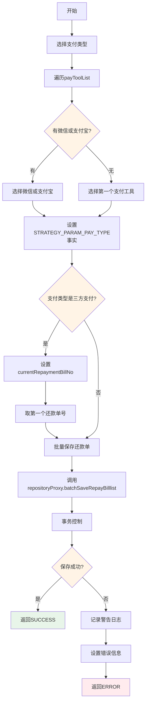
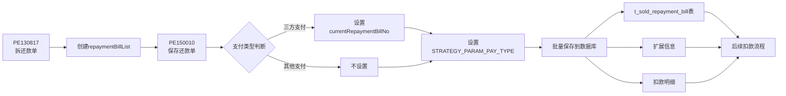
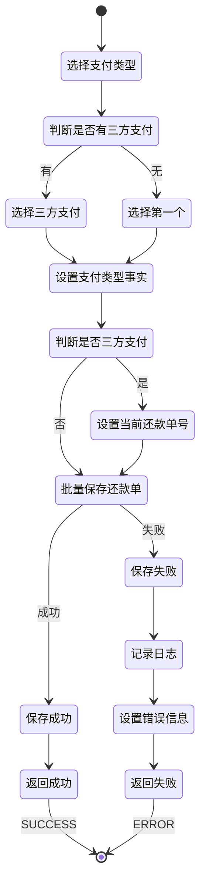

# PE150010 - 保存还款单

## 节点信息

| 属性 | 值 |
|------|-----|
| **处理器代码** | PE150010 |
| **节点名称** | 保存还款单 |
| **节点类型** | PROCESS |
| **所属流程** | [[账期制V400还款同步流程]] |
| **执行阶段** | 同步受理阶段 |
| **实现类** | RepayApplyBizFlowPE150010ServiceImpl |
| **优先级** | P0(核心节点) |

## 功能说明

保存还款单节点负责将还款单列表持久化到数据库,完成还款申请受理阶段的数据持久化,同时设置扣款渠道决策所需的支付类型事实数据。

### 核心职责
1. **设置支付类型事实**: 从支付工具列表中选择合适的支付类型
2. **设置当前还款单号**: 三方支付场景下设置第一个还款单号
3. **批量保存还款单**: 调用仓储层批量保存还款单列表
4. **异常处理**: 捕获异常并返回错误信息

### 适用场景

- **三方支付**: 微信/支付宝支付,需要设置currentRepaymentBillNo
- **银行卡代扣**: 不需要设置currentRepaymentBillNo
- **其他支付方式**: 优惠券/溢缴款等

## 输入参数

| 参数名 | 参数代码 | 类型 | 来源 | 说明 |
|--------|----------|------|------|------|
| 还款单列表 | repaymentBillList | List<BaseRepaymentBill> | RepayApplyBo | PE130817创建的还款单列表 |
| 支付工具列表 | payToolList | List<PayTool> | RepayApplyReq | 支付工具列表 |

### BaseRepaymentBill 结构

| 字段名 | 字段代码 | 类型 | 说明 |
|--------|----------|------|------|
| 还款单号 | repaymentBillNo | String | 还款单唯一标识(UUID) |
| 还款申请号 | repayApplyNo | String | 关联的还款申请号 |
| 还款金额 | repayAmount | Integer | 还款金额(单位:分) |
| 还款状态 | repayStatus | RepayStatus | 还款状态(INIT) |
| 资方银行 | assetBank | BankEnum | 资方银行 |

## 输出参数

| 参数名 | 参数代码 | 类型 | 说明 |
|--------|----------|------|---------|
| 支付类型 | STRATEGY_PARAM_PAY_TYPE | String | 决策引擎事实,用于扣款渠道决策 |
| 当前还款单号 | currentRepaymentBillNo | String | 三方支付场景下的当前还款单号 |

## 处理流程



## 核心业务逻辑

### 1. 选择支付类型

**选择策略**:

| 优先级 | 支付类型 | 说明 |
|--------|---------|------|
| 1 | ALIPAY_SDK | 支付宝SDK支付,优先选择 |
| 2 | WECHAT_PAY | 微信支付,优先选择 |
| 3 | 第一个支付工具 | 默认选择第一个 |

**选择逻辑**:
```
payToolItem = payToolList.stream()
    .filter(item -> payType == ALIPAY_SDK || payType == WECHAT_PAY)
    .findAny()
    .orElse(payToolList.get(0))

processContext.addFact(STRATEGY_PARAM_PAY_TYPE, payToolItem.payType.name())
```

**业务含义**:
- 优先选择三方支付(支付宝/微信)
- 三方支付需要特殊的渠道决策
- 如果没有三方支付,选择第一个支付工具
- 设置为决策引擎事实,用于后续扣款渠道决策

**为什么优先选择三方支付?**
- 三方支付需要选择支付渠道(微信/支付宝)
- 扣款渠道决策需要知道支付类型
- 三方支付的处理逻辑与其他支付方式不同

### 2. 设置当前还款单号

**设置条件**:
```
IF payType == WECHAT_PAY OR payType == ALIPAY_SDK THEN
    currentRepaymentBillNo = repaymentBillList.get(0).repaymentBillNo
END IF
```

**业务含义**:
- 只有三方支付需要设置currentRepaymentBillNo
- 三方支付场景下,用户只需要支付一次
- 后端需要将支付金额分配到各个还款单
- currentRepaymentBillNo标识当前需要处理的还款单

**为什么只取第一个?**
- 三方支付是统一支付入口
- 用户支付后,系统自动分配到各个还款单
- 第一个还款单作为主还款单
- 后续扣款渠道决策基于这个还款单

### 3. 批量保存还款单

**保存逻辑**:
```
repositoryProxy.batchSaveRepayBilllist(repaymentBillList)
```

**保存内容**:
- 还款单主表(t_sold_repayment_bill)
- 还款单扩展信息(extInfoMap)
- 扣款明细(线下还款场景)

**事务控制**:
- batchSaveRepayBilllist方法使用@Transactional注解
- 保证批量保存的原子性
- 全部成功或全部失败

**为什么需要事务控制?**
- 还款单是重要的业务数据
- 必须保证数据一致性
- 避免部分保存成功导致数据不完整

### 4. 异常处理

**异常捕获**:
```
TRY:
    repositoryProxy.batchSaveRepayBilllist(repaymentBillList)
CATCH Exception e:
    RE_LOG.warn(e, "还款各单据持久化「PE150010」异常")
    repayContext.setMessage(e.getMessage())
    RETURN createErrorProcessResult(e.getMessage())
END TRY
```

**异常场景**:

| 异常场景 | 错误类型 | 处理方式 | 影响 |
|----------|----------|----------|------|
| 数据库连接失败 | SQLException | 记录日志,返回ERROR | 流程终止 |
| 主键冲突 | DuplicateKeyException | 记录日志,返回ERROR | 流程终止 |
| 字段超长 | Data truncation | 记录日志,返回ERROR | 流程终止 |
| 其他异常 | Exception | 记录日志,返回ERROR | 流程终止 |

**业务含义**:
- 保存失败说明数据有问题或系统异常
- 返回ERROR终止流程
- 用户可以查看错误信息
- 避免后续流程处理异常数据

## 还款单数据流



## 状态流转



## 上游节点

- **PE130817** - 拆还款单(创建repaymentBillList)

## 下游节点

- **PE160026** - 扣款渠道决策入参(需要STRATEGY_PARAM_PAY_TYPE事实)

## 异常处理

| 异常场景 | 错误类型 | 处理方式 | 影响 |
|----------|----------|----------|------|
| 数据库连接失败 | SQLException | 记录日志,返回ERROR | 流程终止 |
| 主键冲突 | DuplicateKeyException | 记录日志,返回ERROR | 流程终止 |
| 事务回滚 | TransactionException | 记录日志,返回ERROR | 流程终止 |
| 其他异常 | Exception | 记录日志,返回ERROR | 流程终止 |

## 监控指标

### 业务指标
- **三方支付比例**: 三方支付次数 / 总还款次数
- **平均还款单数**: 总还款单数 / 总还款次数
- **保存成功率**: 成功数 / 总保存次数

### 技术指标
- **平均保存耗时**: P50/P95/P99
- **数据库连接成功率**: 成功数 / 总次数
- **事务成功率**: 成功数 / 总事务数

## 性能优化

### 1. 批量保存
- **策略**: 批量保存还款单列表
- **效果**: 减少数据库交互次数

### 2. 事务控制
- **策略**: 独立事务方法
- **效果**: 保证原子性,避免部分成功

### 3. 索引优化
- **策略**: 还款单号建立唯一索引
- **效果**: 加快查询速度,保证唯一性

## 实现位置

```bash
repayengine-service/src/main/java/cn/caijiajia/repayengine/service/
├── repay/process/dcp/
│   └── RepayApplyBizFlowPE150010ServiceImpl.java  # 节点处理器 (77行)
└── dcp/repository/
    └── DcpRepayRepositoryProxy.java                # 仓储代理
```

## 设计考虑

### 1. 为什么优先选择三方支付?

**原因**:
- 三方支付需要特殊的渠道决策
- 微信/支付宝的扣款流程与其他支付方式不同
- 扣款渠道决策需要知道支付类型
- 设置STRATEGY_PARAM_PAY_TYPE供后续决策使用

### 2. 为什么三方支付要设置currentRepaymentBillNo?

**原因**:
- 三方支付是统一支付入口
- 用户只需要支付一次
- 后端需要将支付金额分配到各个还款单
- currentRepaymentBillNo标识主还款单
- 后续扣款渠道决策基于这个还款单

### 3. 为什么使用独立事务方法?

**原因**:
- 保证批量保存的原子性
- 全部成功或全部失败
- 避免部分保存成功导致数据不完整
- 事务控制更清晰

### 4. 为什么异常不向上抛出?

**原因**:
- 捕获异常后记录日志
- 设置错误信息到上下文
- 返回ERROR终止流程
- 用户可以查看错误信息
- 避免异常向上传播

## 相关文档

- [[账期制V400还款同步流程]] - 主流程设计
- [[PE130817]] - 拆还款单
- [[PE160026]] - 扣款渠道决策入参
- [[还款单数据模型]] - 还款单表结构说明

## 标签

#节点 #保存还款单 #数据持久化 #PE150010