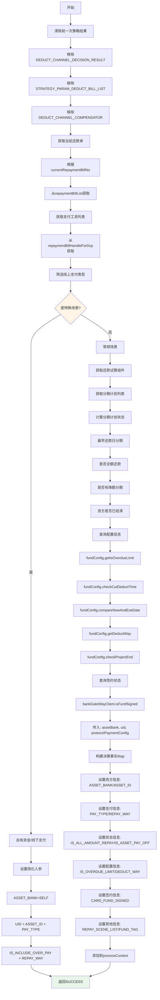
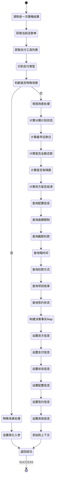

# PE160026 - 扣款渠道决策入参

## 节点信息

| 属性 | 值 |
|------|-----|
| **处理器代码** | PE160026 |
| **节点名称** | 扣款渠道决策入参 |
| **节点类型** | PROCESS |
| **所属流程** | [[账期制V400还款同步流程]] |
| **执行阶段** | 同步受理阶段 |
| **实现类** | RepayApplyBizFlowPE160026ServiceImpl |
| **优先级** | P0(核心节点) |

## 功能说明

扣款渠道决策入参节点负责为扣款渠道策略决策引擎准备输入参数,收集资方信息、还款计划状态、用户签约状态、逾期状态、配置信息等,用于后续选择最优的扣款渠道。

### 核心职责
1. **清除前一次策略结果**: 移除上一次决策的事实数据
2. **识别支付类型**: 获取线上支付类型或第一个支付工具
3. **特殊场景处理**: 自有资金、线下支付等特殊场景简化入参
4. **收集还款计划信息**: 分期计划状态、还款场景、是否全额还款等
5. **查询资方签约状态**: 银行卡是否签约资金方协议
6. **查询配置信息**: 逾期限制、截断扣款、项目结束等配置
7. **设置决策引擎事实**: 将所有参数设置为Facts

### 适用场景

- **银行卡代扣**: 需要选择最优扣款渠道(银联/网联/银行直连)
- **支付宝API支付**: 需要选择支付接口
- **自有资金**: 简化入参,直接返回
- **线下支付**: 简化入参,不需要渠道决策

## 输入参数

| 参数名 | 参数代码 | 类型 | 来源 | 说明 |
|--------|----------|------|------|------|
| 当前还款单号 | currentRepaymentBillNo | String | RepayApplyBo | PE150010设置的当前还款单号 |
| 还款单列表 | repaymentBillList | List | RepayApplyBo | 还款单列表 |
| 还款单处理列表 | repaymentBillHandleForDcpList | List | RepayApplyBo | 还款单处理对象列表 |
| 订单上下文映射 | stageOrderContextMap | Map | RepayApplyContext | 订单上下文信息 |
| 订单包装列表 | stageOrderWrapperList | List | RepayApplyContext | 订单信息列表 |

## 输出参数

| 参数名 | 参数代码 | 类型 | 说明 |
|--------|----------|------|---------|
| 资方银行 | ASSET_BANK | String | 决策引擎事实 |
| 资产ID | ASSET_ID | String | 决策引擎事实 |
| 支付类型 | DEDUCT_CHANNEL_PAY_TYPE | String | 决策引擎事实 |
| 是否全额还款 | DEDUCT_CHANNEL_IS_ALL_AMOUNT_REPAY | Boolean | 决策引擎事实 |
| 是否有降额分期 | DEDUCT_CHANNEL_IS_DOWN_BY_PLAN_COMPONENTS | Boolean | 决策引擎事实 |
| 资方是否已结清 | DEDUCT_CHANNEL_IS_ASSET_PAY_OFF | Boolean | 决策引擎事实 |
| 是否逾期超限 | DEDUCT_CHANNEL_IS_OVERDUE_LIMIT_DAYS | Boolean | 决策引擎事实 |
| 扣款方式 | DEDUCT_CHANNEL_DEDUCT_WAY | String | 决策引擎事实 |
| 银行卡是否签约 | DEDUCT_CHANNEL_CARD_FUND_SIGNED | Boolean | 决策引擎事实 |
| 等20+个决策参数 | - | - | 见详细说明 |

## 处理流程



## 核心业务逻辑

### 1. 清除前一次策略结果

**清除逻辑**:
```
processContext.facts.remove(DEDUCT_CHANNEL_DECISION_RESULT)
processContext.facts.remove(STRATEGY_PARAM_DEDUCT_BILL_LIST)
processContext.facts.remove(DEDUCT_CHANNEL_COMPENSATOR)
```

**业务含义**:
- 扣款渠道决策是循环处理(每次一个还款单)
- 清除上一次决策的结果,避免污染
- 保证每次决策的独立性

### 2. 识别支付类型

**识别逻辑**:
```
paymentTypeList = repaymentBillHandleForDcp.repayTrialPlanListComponent.paymentTypeList

// 筛选线上支付类型
payToolItem = paymentTypeList.stream()
    .filter(item -> PayType.isOnlinePay(item.payType))
    .findAny()
    .orElse(paymentTypeList.get(0))

// 判断是否包含溢缴款/优惠券
includeOverPay = paymentTypeList.stream().anyMatch(
    item -> payType == OVER_PAY || payType == COUPON_PAY || payType == DEDUCT_PAY
)
```

**业务含义**:
- 优先选择线上支付类型(银行卡/微信/支付宝)
- 如果没有线上支付,选择第一个支付工具
- includeOverPay标识是否包含特殊支付方式

### 3. 特殊场景处理

**特殊场景识别**:
```
IF assetBank == SELF
   OR assetId == SELF
   OR anyMatch(payType == AO_OFFLINE_PAY) THEN
    // 特殊场景: 自有资金或线下支付
    设置简化入参
    RETURN
END IF
```

**简化入参**:
```
routeFacts = {
    ASSET_BANK: SELF,
    UID: uid,
    ASSET_ID: SELF,
    DEDUCT_CHANNEL_PAY_TYPE: payType,
    DEDUCT_CHANNEL_IS_INCLUDE_OVER_PAY: includeOverPay,
    DEDUCT_CHANNEL_REPAY_WAY: repayWay
}
```

**业务含义**:
- 自有资金: 不需要复杂的渠道决策
- 线下支付: 已通过银行转账等方式扣款
- 简化入参,直接返回
- 后续决策引擎会直接返回默认渠道

### 4. 计算分期计划状态

#### 4.1 最早还款日分期

**计算逻辑**:
```
stagePlan = stagePlanRepayComponentList.stream()
    .map(item -> stagePlanMap.get(item.stagePlanNo))
    .min(Comparator.comparing(StagePlan::getRepaymentDate))
    .orElseThrow()
```

**业务含义**:
- 找出最早还款日的分期计划
- 用于判断逾期状态
- 逾期天数从最早还款日开始计算

#### 4.2 是否全额还款

**计算逻辑**:
```
planAllPayOff = stagePlanRepayComponentList.stream()
    .map(item -> stagePlanContextMap.get(item.stagePlanNo))
    .map(StagePlanContext::getPlanAllPayOff)
    .allMatch(BooleanUtils::isTrue)
```

**业务含义**:
- planAllPayOff=true: 该期全部结清(本金+利息+费用)
- 所有分期都planAllPayOff=true: 全额还款
- 全额还款可能有优惠

#### 4.3 是否有降额分期

**计算逻辑**:
```
isDownByPlanComponents = stagePlanRepayComponentList.stream()
    .map(item -> stagePlanMap.get(item.stagePlanNo))
    .anyMatch(DecisionRouteFactCreator::calcDownAmountForStagePlan)
```

**业务含义**:
- 降额分期: 分期金额减少(如减免部分本金)
- 有降额分期的还款可能需要特殊渠道
- 避免渠道不支持降额

#### 4.4 资方是否已结清

**计算逻辑**:
```
anyBgStagePlanListPayOff = stagePlanRepayComponentList.stream()
    .map(item -> stagePlanContextMap.get(item.stagePlanNo))
    .map(StagePlanContext::getFundPayOff)
    .anyMatch(BooleanUtils::isTrue)
```

**业务含义**:
- fundPayOff=true: 资方已认领该期,已结清
- 有任意一期已结清,可能不需要推送资方
- 影响扣款渠道选择

**特殊处理**:
```
IF configFunctions.checkBankAsset(assetBank, assetId) THEN
    // 已配置的资金包,按资方已结清处理
    RETURN true
END IF
```

**为什么?**
- 历史老资金包和FOCUS_LOAN包不需要查询资方状态
- 默认按资方已结清处理
- 减少资方系统交互

### 5. 查询配置信息

#### 5.1 逾期限制配置

**查询逻辑**:
```
isOverdueLimitDays = fundConfig.getIsOverdueLimit(repaymentDate, assetKey)
isOverdueLimitTime = fundConfig.getIsOverdueLimitTime(assetKey)
```

**业务含义**:
- isOverdueLimitDays: 逾期天数是否超限
- isOverdueLimitTime: 逾期时间是否超限
- 逾期超限可能限制某些扣款渠道

#### 5.2 截断扣款配置

**查询逻辑**:
```
cutDeduct = fundConfig.checkCutDeductTime(repaymentDate, assetBank, assetId)
```

**业务含义**:
- 截断扣款: 在特定时间后停止扣款
- 如: 逾期30天后截断扣款
- 截断扣款后走其他流程

#### 5.3 暗时间配置

**查询逻辑**:
```
isInDarkTime = fundConfig.compareNowAndExeDate(assetKey)
```

**业务含义**:
- 暗时间: 不执行扣款的时间段
- 如: 凌晨0-6点不扣款
- 暗时间内延迟扣款

#### 5.4 扣款方式配置

**查询逻辑**:
```
deductWay = fundConfig.getDeductWay(assetKey)
```

**业务含义**:
- deductWay: 扣款方式(代扣/主动支付等)
- 影响扣款渠道选择
- 不同的扣款方式对应不同的渠道

#### 5.5 项目结束配置

**查询逻辑**:
```
projectIsEnd = fundConfig.checkProjectEnd(assetKey)
```

**业务含义**:
- projectIsEnd: 项目是否已结束
- 项目结束后可能限制扣款
- 走清算流程

### 6. 查询签约状态

**查询逻辑**:
```
cardFundSigned = bankGateWayClient.isFundSigned(
    assetBank,
    uid,
    protocolPaymentConfig,
    paymentTypeList
)
```

**业务含义**:
- cardFundSigned: 银行卡是否签约资金方协议
- 签约后可以走协议扣款
- 未签约只能走普通扣款

**签约类型**:
- 协议扣款: 用户授权自动扣款
- 普通扣款: 用户主动支付

### 7. 构建决策事实Map

**事实参数说明**:

| 参数名 | 类型 | 说明 | 用途 |
|--------|------|------|------|
| ASSET_BANK | String | 资方银行 | 渠道路由 |
| ASSET_ID | String | 资产ID | 费率计算 |
| DEDUCT_CHANNEL_PAY_TYPE | String | 支付类型 | 渠道选择 |
| DEDUCT_CHANNEL_IS_ALL_AMOUNT_REPAY | Boolean | 是否全额还款 | 优惠判断 |
| DEDUCT_CHANNEL_IS_DOWN_BY_PLAN_COMPONENTS | Boolean | 是否有降额分期 | 渠道限制 |
| DEDUCT_CHANNEL_IS_DOWN_BY_PLAN_ALL_COMPONENTS | Boolean | 是否全部降额 | 渠道限制 |
| DEDUCT_CHANNEL_IS_ASSET_PAY_OFF | Boolean | 资方是否已结清 | 推送判断 |
| DEDUCT_CHANNEL_IS_OVERDUE_LIMIT_DAYS | Boolean | 逾期天数是否超限 | 渠道限制 |
| DEDUCT_CHANNEL_IS_OVERDUE_LIMIT_TIME | Boolean | 逾期时间是否超限 | 渠道限制 |
| DEDUCT_CHANNEL_CUT_DEDUCT | Boolean | 是否截断扣款 | 流程控制 |
| DEDUCT_CHANNEL_IS_IN_DARK_TIME | Boolean | 是否在暗时间 | 延迟扣款 |
| DEDUCT_CHANNEL_COMPENSATOR | String | 补偿器 | 异常处理 |
| DEDUCT_CHANNEL_DEDUCT_WAY | String | 扣款方式 | 渠道选择 |
| DEDUCT_CHANNEL_PROJECT_IS_END | Boolean | 项目是否结束 | 流程控制 |
| DEDUCT_CHANNEL_DEDUCT_COMPONENT | String | 扣款组件 | 渠道选择 |
| DEDUCT_CHANNEL_PROTOCOL_PAYMENT_CONFIG | Boolean | 协议扣款配置 | 签约判断 |
| DEDUCT_CHANNEL_CARD_FUND_SIGNED | Boolean | 银行卡是否签约 | 渠道选择 |
| DEDUCT_CHANNEL_INCLUDE_ORDER_NUM | Long | 包含订单数 | 批量处理 |
| DEDUCT_CHANNEL_REPAY_SCENE_LIST | List | 还款场景列表 | 场景判断 |
| DEDUCT_CHANNEL_IS_INCLUDE_OVER_PAY | Boolean | 是否包含溢缴款 | 支付方式 |
| UID | String | 用户ID | 用户标识 |
| DEDUCT_CHANNEL_REPAY_WAY | String | 还款方式 | 渠道选择 |
| DEDUCT_CHANNEL_FUND_TAG | String | 资金标签 | 清分入账 |

## 状态流转



## 上游节点

- **PE150010** - 保存还款单

## 下游节点

- **扣款渠道选择路由新策略** - 决策引擎(HENGINE决策)

## 异常处理

| 异常场景 | 错误类型 | 错误码 | 处理方式 | 影响 |
|----------|----------|--------|----------|------|
| 分期计划未找到 | ServerException | REPAY_STAGE_PLAN_NOT_FOUND | 抛出异常 | 流程终止 |
| 配置查询失败 | ConfigException | - | 使用默认值 | 降级处理 |
| 签约查询失败 | ClientException | - | 使用false | 走普通扣款 |
| 其他异常 | Exception | - | 记录日志 | 流程继续 |

## 监控指标

### 业务指标
- **特殊场景比例**: 特殊场景次数 / 总决策次数
- **全额还款比例**: 全额还款次数 / 总还款次数
- **签约率**: 已签约次数 / 总次数
- **逾期超限比例**: 逾期超限次数 / 总次数

### 技术指标
- **平均入参构建耗时**: P50/P95/P99
- **配置查询成功率**: 成功数 / 总查询数
- **签约查询成功率**: 成功数 / 总查询数

## 性能优化

### 1. 配置缓存
- **策略**: fundConfig使用缓存
- **效果**: 减少配置中心查询次数

### 2. 批量查询
- **策略**: 批量查询签约状态
- **效果**: 减少银行网关调用次数

### 3. 提前返回
- **策略**: 特殊场景提前返回
- **效果**: 减少不必要的计算

## 实现位置

```bash
repayengine-service/src/main/java/cn/caijiajia/repayengine/service/
├── repay/process/dcp/
│   └── RepayApplyBizFlowPE160026ServiceImpl.java  # 节点处理器 (187行)
├── configuration/
│   └── FundConfig.java                             # 资方配置
└── client/feign/
    └── BankGateWayClient.java                      # 银行网关客户端
```

## 设计考虑

### 1. 为什么需要清除前一次策略结果?

**原因**:
- 扣款渠道决策是循环处理(每次一个还款单)
- 避免上一次决策结果污染本次决策
- 保证每次决策的独立性

### 2. 为什么特殊场景要简化入参?

**原因**:
- 自有资金/线下支付不需要复杂的渠道决策
- 简化入参减少计算量
- 提高性能

### 3. 为什么需要查询签约状态?

**原因**:
- 签约用户可以走协议扣款(自动扣款)
- 未签约用户只能走普通扣款(主动支付)
- 影响扣款渠道选择

### 4. 为什么需要查询这么多配置?

**原因**:
- 不同资方有不同的扣款规则
- 逾期限制/截断扣款/暗时间等配置影响渠道选择
- 确保选择最优的扣款渠道

## 相关文档

- [[账期制V400还款同步流程]] - 主流程设计
- [[PE150010]] - 保存还款单
- [[扣款渠道选择路由策略]] - 扣款渠道决策规则
- [[决策引擎集成]] - HENGINE决策引擎使用
- [[资方配置说明]] - fundConfig配置说明

## 标签

#节点 #扣款渠道决策 #决策引擎入参 #PE160026