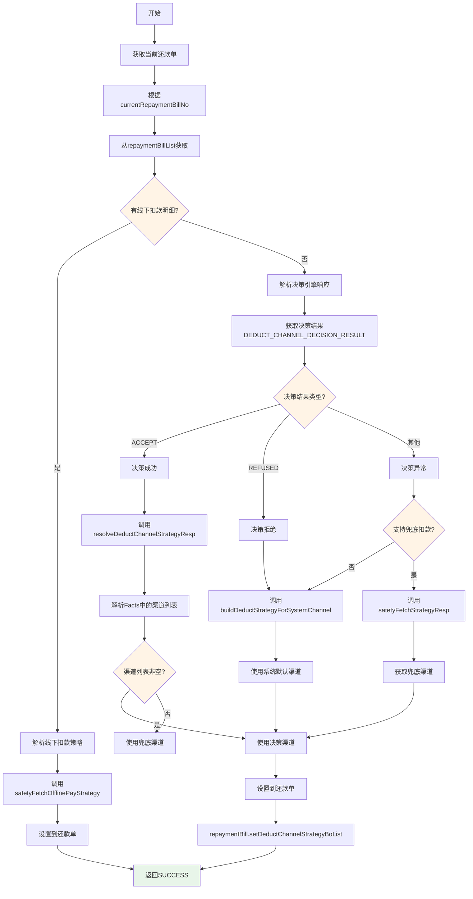
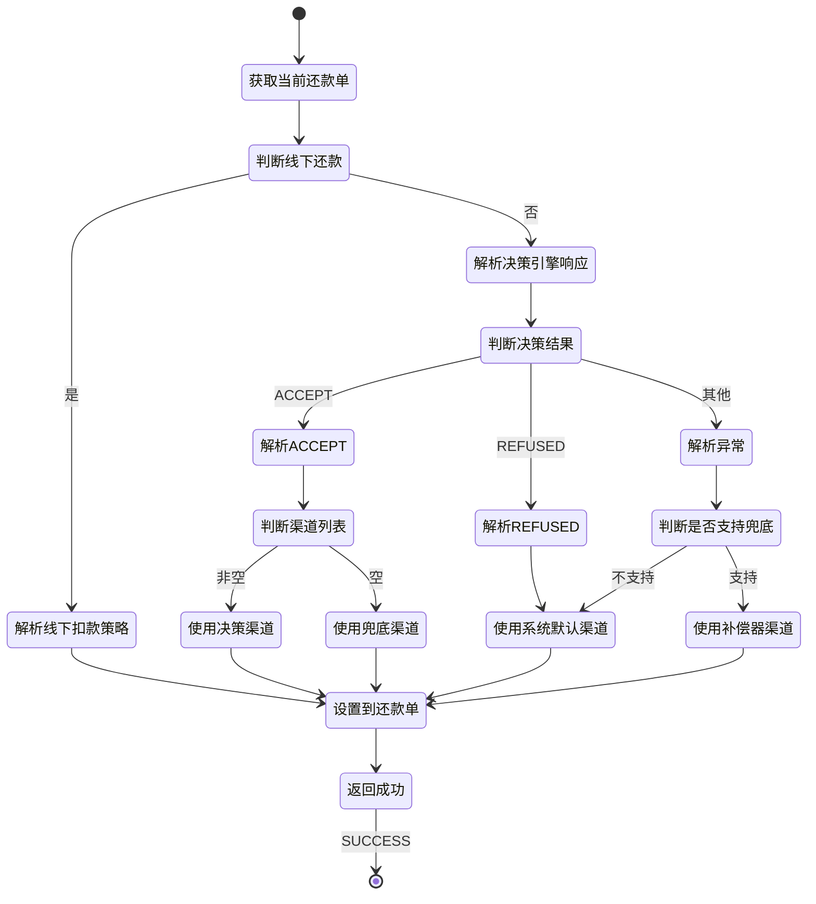

# PE160028 - 扣款渠道决策出参

## 节点信息

| 属性 | 值 |
|------|-----|
| **处理器代码** | PE160028 |
| **节点名称** | 扣款渠道决策出参 |
| **节点类型** | PROCESS |
| **所属流程** | [[账期制V400还款同步流程]] |
| **执行阶段** | 同步受理阶段 |
| **实现类** | RepayApplyBizFlowPE160028ServiceImpl |
| **优先级** | P0(核心节点) |

## 功能说明

扣款渠道决策出参节点负责接收扣款渠道策略决策引擎返回的决策结果,进行解析和转换后设置到还款单,并处理决策异常和降级逻辑,确保即使决策失败也能选择合适的扣款渠道。

### 核心职责
1. **获取当前还款单**: 根据currentRepaymentBillNo获取还款单
2. **处理线下还款**: 已有扣款明细的场景直接返回
3. **解析决策结果**: 从Facts中提取决策引擎输出
4. **处理决策成功**: ACCEPT场景,解析决策结果
5. **处理决策拒绝**: REFUSED场景,使用系统默认渠道
6. **处理决策异常**: 异常场景,使用兜底渠道
7. **设置扣款渠道策略**: 将结果设置到还款单

### 适用场景

- **决策成功**: 决策引擎返回ACCEPT,使用决策渠道
- **决策拒绝**: 决策引擎返回REFUSED,使用系统默认渠道
- **决策异常**: 决策引擎异常,使用兜底渠道
- **线下还款**: 已有扣款明细,直接返回

## 输入参数

| 参数名 | 参数代码 | 类型 | 来源 | 说明 |
|--------|----------|------|------|------|
| 当前还款单号 | currentRepaymentBillNo | String | RepayApplyBo | 当前处理的还款单号 |
| 还款单列表 | repaymentBillList | List | RepayApplyBo | 还款单列表 |
| 决策结果 | DEDUCT_CHANNEL_DECISION_RESULT | String | 决策引擎Facts | ACCEPT/REFUSED |
| 扣款渠道列表 | STRATEGY_PARAM_DEDUCT_BILL_LIST | List | 决策引擎Facts | 决策引擎返回的渠道列表 |

### DeductStrategyOutputBo 结构(决策引擎输出)

| 字段名 | 字段代码 | 类型 | 说明 |
|--------|----------|------|------|
| 扣款渠道 | deductChannel | String | 扣款渠道(UNIONPAY/NETSUN/等) |
| 扣款金额 | deductAmount | Integer | 该渠道扣款金额(单位:分) |
| 扣款优先级 | deductSeq | Integer | 扣款优先级(0开始) |
| 扣款类型 | deductType | String | 扣款类型(REAL/TRIAL) |
| 扩展信息 | extInfoMap | Map | 扩展信息 |

## 输出参数

| 参数名 | 参数代码 | 类型 | 说明 |
|--------|----------|------|---------|
| 扣款渠道策略列表 | deductChannelStrategyBoList | List<DeductStrategyOutputBo> | 设置到repaymentBill |

## 处理流程



## 核心业务逻辑

### 1. 处理线下还款

**识别逻辑**:
```
IF repaymentBill.deductDetailInfos不为空 THEN
    // 线下还款场景
    deductChannelStrategyBoList = satetyFetchOfflinePayStrategy(deductDetailInfos)
    repaymentBill.setDeductChannelStrategyBoList(deductChannelStrategyBoList)
    RETURN
END IF
```

**业务含义**:
- deductDetailInfos不为空说明是线下还款
- 线下还款已有扣款明细(银行流水)
- 不需要决策引擎决策
- 直接解析扣款明细生成策略

**线下扣款策略生成**:
```
FOR EACH deductDetailInfo IN deductDetailInfos:
    deductStrategy = DeductStrategyOutputBo.builder()
        .deductChannel(OFFLINE_PAY)  // 线下支付渠道
        .deductAmount(deductDetailInfo.deductAmount)
        .deductSeq(0)
        .deductType(REAL)
        .build()
    deductChannelStrategyBoList.add(deductStrategy)
END FOR
```

### 2. 解析决策成功(ACCEPT)

**解析逻辑**:
```
IF decisionResult == ACCEPT THEN
    strategyOutputBoList = DeductChannelStrategyRespParser.resolveDeductChannelStrategyResp(facts)

    IF strategyOutputBoList不为空 THEN
        RETURN strategyOutputBoList
    ELSE
        // 决策结果为空,使用兜底渠道
        RETURN 兜底渠道
    END IF
END IF
```

**resolveDeductChannelStrategyResp 逻辑**:
```
deductChannelStrategyBoList = []

// 从Facts中获取决策引擎输出的渠道列表
deductBillList = facts.get(STRATEGY_PARAM_DEDUCT_BILL_LIST)

FOR EACH deductBill IN deductBillList:
    deductStrategy = DeductStrategyOutputBo.builder()
        .deductChannel(deductBill.deductChannel)
        .deductAmount(deductBill.deductAmount)
        .deductSeq(deductBill.deductSeq)
        .deductType(deductBill.deductType)
        .extInfoMap(deductBill.extInfoMap)
        .build()
    deductChannelStrategyBoList.add(deductStrategy)
END FOR

RETURN deductChannelStrategyBoList
```

**业务含义**:
- ACCEPT表示决策成功
- 从Facts中提取决策引擎返回的渠道列表
- 每个渠道包含: 渠道名称、扣款金额、优先级等
- 如果决策结果为空,使用兜底渠道

### 3. 解析决策拒绝(REFUSED)

**解析逻辑**:
```
IF decisionResult == REFUSED THEN
    // 决策拒绝,使用系统默认渠道
    RETURN buildDeductStrategyForSystemChannel()
END IF
```

**buildDeductStrategyForSystemChannel 逻辑**:
```
// 系统默认渠道: UNIONPAY(银联代扣)
deductStrategy = DeductStrategyOutputBo.builder()
    .deductChannel(DeductChannelEnum.UNIONPAY)
    .deductAmount(repaymentBill.unDeductAmount)  // 剩余未扣款金额
    .deductSeq(0)
    .deductType(REAL)
    .build()

RETURN [deductStrategy]
```

**业务含义**:
- REFUSED表示决策引擎拒绝本次扣款
- 拒绝原因可能是: 风险控制、渠道不可用等
- 使用系统默认渠道(银联代扣)兜底
- 保证还款流程可以继续

**为什么决策拒绝还要扣款?**
- 决策引擎只是建议,不是最终决定
- 还款是用户的权利,不能因为决策拒绝就拒绝还款
- 使用默认渠道兜底,确保还款流程可用

### 4. 解析决策异常

**解析逻辑**:
```
// 决策异常(非ACCEPT非REFUSED)
IF !fundConfig.checkSupportPayment(assetBank, assetId) THEN
    // 不支持兜底扣款,使用系统默认渠道
    RETURN buildDeductStrategyForSystemChannel()
ELSE
    // 支持兜底扣款,获取兜底渠道
    RETURN satetyFetchStrategyResp(facts)
END IF
```

**satetyFetchStrategyResp 逻辑**:
```
// 尝试从Facts中获取兜底渠道
deductChannel = facts.get(DEDUCT_CHANNEL_COMPENSATOR)  // 补偿器渠道

IF deductChannel不为空 THEN
    deductStrategy = DeductStrategyOutputBo.builder()
        .deductChannel(deductChannel)
        .deductAmount(repaymentBill.unDeductAmount)
        .deductSeq(0)
        .deductType(REAL)
        .build()
    RETURN [deductStrategy]
ELSE
    // 兜底渠道也没有,使用系统默认渠道
    RETURN buildDeductStrategyForSystemChannel()
END IF
```

**业务含义**:
- 决策异常可能是: 决策引擎超时、规则执行异常等
- 检查是否支持兜底扣款(配置项)
- 支持兜底: 使用配置的补偿器渠道
- 不支持兜底: 使用系统默认渠道

**为什么需要兜底机制?**
- 决策引擎可能故障
- 保证还款流程的高可用
- 避免因决策引擎问题导致还款失败

### 5. 渠道优先级说明

**扣款优先级**:
```
deductSeq: 0, 1, 2, 3...
```

**业务含义**:
- deductSeq=0: 第一优先级,优先扣款
- deductSeq=1: 第二优先级,第一渠道失败后尝试
- deductSeq=2: 第三优先级,前两个渠道失败后尝试
- 以此类推

**扣款逻辑**:
```
FOR EACH deductStrategy IN deductChannelStrategyBoList ORDER BY deductSeq:
    result = deduct(deductStrategy)

    IF result == SUCCESS THEN
        BREAK  // 扣款成功,不再尝试其他渠道
    ELSE
        CONTINUE  // 扣款失败,尝试下一个渠道
    END IF
END FOR
```

## 决策结果处理策略

| 决策结果 | 场景 | 处理方式 | 渠道来源 |
|---------|------|----------|---------|
| ACCEPT | 决策成功 | 解析决策结果 | 决策引擎 |
| ACCEPT(空结果) | 决策成功但无渠道 | 使用兜底渠道 | 补偿器/系统默认 |
| REFUSED | 决策拒绝 | 使用系统默认渠道 | UNIONPAY |
| 异常 | 决策引擎故障 | 使用兜底渠道 | 补偿器/系统默认 |
| 异常(无兜底) | 不支持兜底 | 使用系统默认渠道 | UNIONPAY |

## 扣款渠道类型

| 渠道类型 | 说明 | 适用场景 |
|---------|------|---------|
| UNIONPAY | 银联代扣 | 系统默认渠道 |
| NETSUN | 网联代扣 | 部分银行支持 |
| BANK_DIRECT | 银行直连 | 特定银行 |
| WECHAT_PAY | 微信支付 | 三方支付 |
| ALIPAY_SDK | 支付宝SDK | 三方支付 |
| OFFLINE_PAY | 线下支付 | 线下还款 |

## 状态流转



## 上游节点

- **扣款渠道选择路由新策略** - 决策引擎(HENGINE决策)

## 下游节点

- **PE160030** - BY决策结果聚合拆扣款单

## 异常处理

| 异常场景 | 错误类型 | 处理方式 | 影响 |
|----------|----------|----------|------|
| 决策结果为空 | - | 使用兜底渠道 | 降级处理 |
| 决策引擎异常 | Exception | 使用兜底渠道 | 降级处理 |
| 兜底渠道不可用 | ConfigException | 使用系统默认渠道 | 降级处理 |
| 其他异常 | Exception | 使用系统默认渠道 | 降级处理 |

**降级策略**:
- 决策失败 → 兜底渠道 → 系统默认渠道
- 保证还款流程可用性
- 避免因决策引擎问题导致还款失败

## 监控指标

### 业务指标
- **决策成功率**: ACCEPT次数 / 总决策次数
- **决策拒绝率**: REFUSED次数 / 总决策次数
- **决策异常率**: 异常次数 / 总决策次数
- **兜底渠道使用率**: 兜底渠道次数 / 总次数

### 技术指标
- **平均解析耗时**: P50/P95/P99
- **渠道解析成功率**: 成功数 / 总次数

## 性能优化

### 1. 提前返回
- **策略**: 线下还款场景提前返回
- **效果**: 减少不必要的决策解析

### 2. 降级机制
- **策略**: 多级降级(决策→兜底→系统默认)
- **效果**: 保证高可用

### 3. 异常捕获
- **策略**: 捕获所有异常,使用默认渠道
- **效果**: 避免异常影响流程

## 实现位置

```bash
repayengine-service/src/main/java/cn/caijiajia/repayengine/service/
├── repay/process/dcp/
│   └── RepayApplyBizFlowPE160028ServiceImpl.java  # 节点处理器 (91行)
└── route/decisionroute/repaychannel/
    └── DeductChannelStrategyRespParser.java       # 决策结果解析器
```

## 设计考虑

### 1. 为什么决策拒绝还要继续扣款?

**原因**:
- 决策引擎只是建议,不是最终决定
- 还款是用户的权利,不能因为决策拒绝就拒绝还款
- 使用默认渠道兜底,确保还款流程可用
- 保证用户体验

### 2. 为什么需要多级降级?

**原因**:
- 决策引擎可能故障
- 兜底渠道可能不可用
- 系统默认渠道最可靠
- 保证高可用性

### 3. 为什么线下还款不需要决策?

**原因**:
- 线下还款已有扣款明细(银行流水)
- 扣款渠道已确定(银行转账)
- 不需要决策引擎决策
- 直接解析扣款明细即可

### 4. 为什么使用initFacts()而不是process()?

**原因**:
- 本节点主要作用是处理决策引擎输出
- initFacts()可以访问决策引擎Facts
- process()无法访问决策引擎Facts

## 相关文档

- [[账期制V400还款同步流程]] - 主流程设计
- [[PE160026]] - 扣款渠道决策入参
- [[PE160030]] - BY决策结果聚合拆扣款单
- [[扣款渠道选择路由策略]] - 扣款渠道决策规则
- [[决策引擎集成]] - HENGINE决策引擎使用

## 标签

#节点 #扣款渠道决策 #决策引擎出参 #PE160028