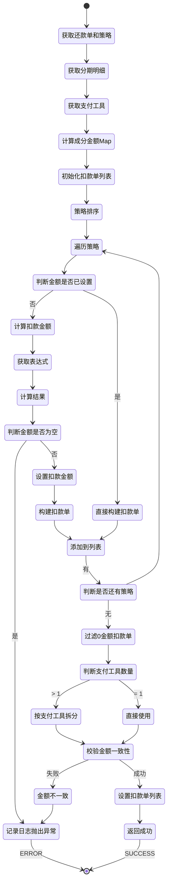

# PE160030 - BY决策结果聚合拆扣款单

## 节点信息

| 属性 | 值 |
|------|-----|
| **处理器代码** | PE160030 |
| **节点名称** | BY决策结果聚合拆扣款单 |
| **节点类型** | PROCESS |
| **所属流程** | [[账期制V400还款同步流程]] |
| **执行阶段** | 同步受理阶段 |
| **实现类** | RepayApplyBizFlowPE160030ServiceImpl |
| **优先级** | P0(核心节点) |

## 功能说明

BY决策结果聚合拆扣款单节点负责根据扣款渠道策略决策结果,将还款单拆分为具体的扣款单,每个扣款单对应一个扣款渠道,包含扣款金额、支付方式、分期明细等信息,并按支付工具进一步拆分扣款单。

### 核心职责
1. **获取还款单和策略**: 获取当前还款单和扣款渠道策略
2. **计算成分金额**: 计算本金、利息、费用等成分金额
3. **遍历策略拆分扣款单**: 根据决策策略逐个创建扣款单
4. **计算扣款金额**: 根据金额类型配置计算扣款金额
5. **按支付工具拆分**: 多支付工具场景进一步拆分扣款单
6. **校验金额一致性**: 确保扣款单总金额等于还款单金额
7. **过滤0金额扣款单**: 移除金额为0的扣款单

### 适用场景

- **单渠道单支付方式**: 1个扣款单
- **单渠道多支付方式**: 多个扣款单(按支付方式拆分)
- **多渠道单支付方式**: 多个扣款单(按渠道拆分)
- **多渠道多支付方式**: 多个扣款单(按渠道和支付方式拆分)

## 输入参数

| 参数名 | 参数代码 | 类型 | 来源 | 说明 |
|--------|----------|------|------|------|
| 当前还款单号 | currentRepaymentBillNo | String | RepayApplyBo | 当前处理的还款单号 |
| 还款单列表 | repaymentBillList | List | RepayApplyBo | 还款单列表 |
| 还款单处理列表 | repaymentBillHandleForDcpList | List | RepayApplyBo | 还款单处理对象列表 |

### BaseRepaymentBill 结构

| 字段名 | 字段代码 | 类型 | 说明 |
|--------|----------|------|------|
| 还款单号 | repaymentBillNo | String | 还款单唯一标识 |
| 还款金额 | repayAmount | Integer | 还款金额(单位:分) |
| 扣款渠道策略列表 | deductChannelStrategyBoList | List<DeductStrategyOutputBo> | PE160028设置的策略 |

### DeductStrategyOutputBo 结构

| 字段名 | 字段代码 | 类型 | 说明 |
|--------|----------|------|------|
| 扣款渠道 | deductChannel | String | 扣款渠道 |
| 扣款金额 | deductAmount | Integer | 扣款金额(可为null,需计算) |
| 扣款序号 | deductSeqNo | Integer | 扣款优先级 |
| 金额类型 | deductAmtType | String | 金额计算类型 |
| 扣款类型 | deductType | String | 扣款类型(REAL/TRIAL) |

## 输出参数

| 参数名 | 参数代码 | 类型 | 说明 |
|--------|----------|------|---------|
| 当前扣款单列表 | currentDeductBillList | List<DeductBill> | 设置到RepayApplyBo |

### DeductBill 结构

| 字段名 | 字段代码 | 类型 | 说明 |
|--------|----------|------|------|
| 扣款单号 | deductBillNo | String | 扣款单唯一标识(UUID) |
| 还款单号 | repaymentBillNo | String | 关联的还款单号 |
| 扣款金额 | deductAmount | Integer | 扣款金额(单位:分) |
| 扣款渠道 | payChannel | PayChannel | 支付渠道 |
| 支付类型 | payType | PayType | 支付类型 |
| 扣款序号 | deductSeqNo | Integer | 扣款优先级 |

## 处理流程

```mermaid
flowchart TD
    A[开始] --> B[获取还款单和策略]
    B --> B1[获取repaymentBill]
    B1 --> B2[获取repaymentBillHandleForDcp]
    B2 --> B3[获取deductChannelStrategyBoList]

    B3 --> C[获取分期明细]
    C --> C1[提取stagePlanRepayComponentList]
    C1 --> C2[flatMap展开]

    C2 --> D[获取支付工具]
    D --> D1[提取paymentTypeList]
    D1 --> D2[筛选线上支付或第一个]

    D2 --> E[计算成分金额Map]
    E --> E1[CUSTOMER_TOTAL=还款总金额]
    E1 --> E2[PRINCIPAL_TOTAL=本金总额]
    E2 --> E3[FEE_TOTAL=费用总额]
    E3 --> E4[EARLY_SETTLE_FEE=提前结清费]
    E4 --> E5[WARRANTY_FEE_IN=质保费]

    E5 --> F[初始化扣款单列表]
    F --> G[策略按deductSeqNo排序]

    G --> H[遍历策略列表]
    H --> I{扣款金额已设置?}

    I -->|是| J1[线下还款场景]
    J1 --> J2[直接构建扣款单]
    J2 --> K

    I -->|否| L1[计算扣款金额]
    L1 --> L2[获取金额类型配置]
    L2 --> L3[获取表达式expressionString]
    L3 --> L4[调用calDeductBillAmt]

    L4 --> L5{金额计算成功?}
    L5 -->|否| M1[记录警告日志]
    M1 --> M2[抛出异常]

    L5 -->|是| N[设置deductAmount]
    N --> O[构建扣款单]

    O --> K[添加到扣款单列表]
    K --> P{还有策略?}
    P -->|是| H
    P -->|否| Q[过滤0金额扣款单]

    Q --> R{支付工具数量 > 1?}
    R -->|是| S1[按支付工具拆分]
    R -->|否| S2[直接使用]

    S1 --> T1[克隆扣款单]
    T1 --> T2[设置扣款单号=UUID]
    T2 --> T3[设置扣款金额=payableAmount]
    T3 --> T4[设置扣款序号=支付工具优先级]
    T4 --> T5[设置payType和payChannel]

    T5 --> U[校验金额一致性]
    S2 --> U

    U --> U1[计算扣款单总金额]
    U1 --> U2{等于还款单金额?}
    U2 -->|否| V1[记录警告日志]
    V1 --> V2[抛出异常]

    U2 -->|是| W[设置currentDeductBillList]
    W --> X[返回SUCCESS]

    style I fill:#fff4e6
    style L5 fill:#fff4e6
    style P fill:#fff4e6
    style R fill:#fff4e6
    style U2 fill:#fff4e6
    style X fill:#e8f5e9
    style M2 fill:#ffebee
    style V2 fill:#ffebee
```



## 核心业务逻辑

### 1. 计算成分金额

**成分金额Map**:
```
deductAmtMapByType = {
    CUSTOMER_TOTAL: 还款总金额,
    PRINCIPAL_TOTAL: 本金总额,
    FEE_TOTAL: 费用总额,
    EARLY_SETTLE_FEE: 提前结清费,
    WARRANTY_FEE_IN: 质保费,
    PRE_DEDUCT_AMT: 已拆分金额(动态更新)
}
```

**计算逻辑**:
```
// 还款总金额
CUSTOMER_TOTAL = repaymentBill.repayAmount

// 本金总额
PRINCIPAL_TOTAL = SUM(stagePlanRepayComponentList
    .flatMap(RepayComponentInfoList)
    .filter(componentsEnum == PRINCIPAL)
    .map(RepayAmount))

// 费用总额
FEE_TOTAL = SUM(stagePlanRepayComponentList
    .flatMap(RepayComponentInfoList)
    .filter(componentsEnum == FEE)
    .map(RepayAmount))

// 提前结清费
EARLY_SETTLE_FEE = SUM(stagePlanRepayComponentList
    .flatMap(RepayComponentInfoList)
    .filter(componentsEnum == EARLY_SETTLE_FEE)
    .map(RepayAmount))

// 质保费
WARRANTY_FEE_IN = SUM(stagePlanRepayComponentList
    .flatMap(RepaySubComponentInfoList)
    .filter(componentsEnum == WARRANTY_FEE_IN)
    .map(RepayAmount))
```

**业务含义**:
- 成分金额用于计算扣款单金额
- 不同金额类型有不同的计算表达式
- PRE_DEDUCT_AMT在遍历策略时动态更新

### 2. 遍历策略拆分扣款单

**遍历逻辑**:
```
// 策略按优先级排序
deductChannelStrategyBoList.sort(Comparator.comparingInt(DeductStrategyOutputBo::getDeductSeqNo))

FOR EACH deductStrategyOutputBo IN deductChannelStrategyBoList:
    IF deductStrategyOutputBo.deductAmount != null AND deductAmount > 0 THEN
        // 线下还款场景,金额已设置
        deductBill = buildDeductBill(deductStrategyOutputBo, repaymentBill, payToolItem, stagePlanRepayComponentList)
        deductBillList.add(deductBill)
        CONTINUE
    END IF

    // 计算扣款金额
    deductAmtMapByType.put(PRE_DEDUCT_AMT, SUM(deductBillList.deductAmount))
    deductBillAmt = calDeductBillAmt(deductAmtMapByType, expressionString)

    IF deductBillAmt == null THEN
        LOG.warn("计算" + deductAmtType + "类型金额为空")
        THROW ServerException(REPAY_SPLIT_AMOUNT_NOT_EQUAL)
    END IF

    deductStrategyOutputBo.deductAmount = deductBillAmt
    deductBill = buildDeductBill(deductStrategyOutputBo, repaymentBill, payToolItem, stagePlanRepayComponentList)
    deductBillList.add(deductBill)
END FOR
```

**业务含义**:
- 按策略优先级逐个处理
- 线下还款场景金额已确定,直接使用
- 其他场景需要根据表达式计算金额
- PRE_DEDUCT_AMT记录已拆分的金额

### 3. 计算扣款金额

**计算逻辑**:
```
calDeductBillAmt(deductAmtMapByType, expressionString):
    // 表达式示例:
    // "CUSTOMER_TOTAL - PRE_DEDUCT_AMT"
    // "PRINCIPAL_TOTAL * 0.5"
    // "FEE_TOTAL"

    // 解析表达式
    expression = parseExpression(expressionString)

    // 替换变量
    FOR EACH (key, value) IN deductAmtMapByType:
        expression = expression.replace(key, value)
    END FOR

    // 计算结果
    result = evaluate(expression)

    RETURN result
```

**表达式示例**:

| 金额类型 | 表达式 | 说明 |
|---------|--------|------|
| CUSTOMER_ALL | CUSTOMER_TOTAL - PRE_DEDUCT_AMT | 剩余总金额 |
| PRINCIPAL_ALL | PRINCIPAL_TOTAL - PRE_DEDUCT_AMT | 剩余本金 |
| FEE_ALL | FEE_TOTAL - PRE_DEDUCT_AMT | 剩余费用 |
| PRINCIPAL_HALF | PRINCIPAL_TOTAL * 0.5 | 本金一半 |
| EARLY_SETTLE_FEE | EARLY_SETTLE_FEE | 提前结清费 |

**业务含义**:
- 表达式配置在deductAmtTypeConfig
- 通过表达式灵活计算扣款金额
- 支持加减乘除等运算
- 支持引用成分金额

### 4. 过滤0金额扣款单

**过滤逻辑**:
```
deductBillList = deductBillList.stream()
    .filter(deductBill -> deductBill.deductAmount > 0)
    .collect(Collectors.toList())
```

**业务含义**:
- 决策策略可能返回金额为0的渠道
- 如: 某成分金额为0,但策略配置了该成分渠道
- 过滤掉金额为0的扣款单,避免无效扣款

**为什么会有0金额?**
- 决策策略按成分配置渠道
- 如果该成分金额为0,渠道金额也为0
- 例如: 用户没有提前结清费,但策略配置了提前结清费渠道

### 5. 按支付工具拆分

**拆分条件**:
```
IF payToolItemList.size() > 1 THEN
    // 多支付工具,需要拆分
    deductBillRespList = splitByPayTool(deductBillList, payToolItemList)
ELSE
    // 单支付工具,不需要拆分
    deductBillRespList = deductBillList
END IF
```

**拆分逻辑**:
```
// 校验: 扣款单数量必须为1(多渠道场景不支持按支付工具拆分)
IF deductBillList.size() != 1 THEN
    LOG.warn("扣款单数量大于1,请排查")
    THROW ServerException(REPAY_DEDUCT_BILL_SPLIT_ERROR)
END IF

// 克隆扣款单
deductBillStr = JSON.toJSONString(deductBillList.get(0))
deductBillRespList = []

FOR EACH payToolItem IN payToolItemList:
    // 深拷贝
    deductBill = JSON.parseObject(deductBillStr, DeductBill.class)

    // 设置新的扣款单号
    deductBill.deductBillNo = genUUID()

    // 设置扣款金额(按支付工具金额)
    deductBill.deductAmount = payToolItem.payableAmount

    // 设置扣款序号(按支付工具优先级)
    deductBill.deductSeqNo = getPayToolPriority(payToolItem.payType)

    // 设置支付类型
    deductBill.payType = payToolItem.payType

    // 设置支付渠道
    deductBill.payChannel = getPayChannelByPayType(payToolItem.payType, deductBill.payChannel)

    // 设置支付工具号
    deductBill.payInstrumentNo = payToolItem.payNo ?: payToolItem.payInstrumentNo

    // 设置入账流水号
    deductBill.incomeSerialNo = deductBill.deductBillNo

    deductBillRespList.add(deductBill)
END FOR

RETURN deductBillRespList
```

**业务含义**:
- 多支付工具场景(如: 银行卡+优惠券)
- 每个支付工具对应一个扣款单
- 扣款金额按支付工具金额分配
- 扣款序号按支付工具优先级

**为什么不支持多渠道+多支付工具?**
- 复杂度太高
- 容易出错
- 业务场景少见

### 6. 支付渠道映射

**映射规则**:

| 支付类型 | 支付渠道 | 说明 |
|---------|---------|------|
| DEBIT_CARD | 保持原渠道 | 银行卡代扣,使用决策渠道 |
| ALIPAY_API | 保持原渠道 | 支付宝API,使用决策渠道 |
| WECHAT_PAY | PAYMENT | 微信支付,固定渠道 |
| ALIPAY_SDK | PAYMENT | 支付宝SDK,固定渠道 |
| AO_OFFLINE_PAY | PAYMENT | 线下支付,固定渠道 |
| OVER_PAY | ACCOUNT_BALANCE | 溢缴款,账户余额渠道 |
| BALANCE_PAY | ACCOUNT_BALANCE | 余额支付,账户余额渠道 |
| COUPON_PAY | COUPON | 优惠券,优惠券渠道 |
| DEDUCT_PAY | COUPON | 折扣券,优惠券渠道 |
| 其他 | SYSTEM | 系统渠道 |

**业务含义**:
- 银行卡/支付宝API需要决策渠道
- 三方支付(微信/支付宝SDK)固定PAYMENT渠道
- 优惠券/溢缴款有专用渠道

### 7. 校验金额一致性

**校验逻辑**:
```
// 计算扣款单总金额
deductBillAmountSum = SUM(deductBillList.deductAmount)

// 获取还款单金额
repaymentBillAmount = repaymentBill.repayAmount

// 校验一致
IF deductBillAmountSum != repaymentBillAmount THEN
    LOG.warn("扣款单总金额:" + deductBillAmountSum + ", 还款单金额:" + repaymentBillAmount)
    THROW ServerException(REPAY_BILL_AMOUNT_ERROR)
END IF
```

**业务含义**:
- 扣款单总金额必须等于还款单金额
- 防止金额丢失或增加
- 确保数据一致性

**校验公式**:
```
SUM(deductBill.deductAmount) == repaymentBill.repayAmount
```

## 扣款单拆分示例

### 场景1: 单渠道单支付方式

**还款单**: 100元(银行卡80元)

**决策策略**:
```json
[
  {
    "deductChannel": "UNIONPAY",
    "deductSeqNo": 0,
    "deductAmtType": "CUSTOMER_ALL"
  }
]
```

**扣款单列表**:
```
[
  {
    "deductBillNo": "UUID001",
    "deductChannel": "UNIONPAY",
    "payType": "DEBIT_CARD",
    "deductAmount": 100元,
    "deductSeqNo": 30
  }
]
```

### 场景2: 单渠道多支付方式

**还款单**: 100元(银行卡80元 + 优惠券20元)

**决策策略**:
```json
[
  {
    "deductChannel": "UNIONPAY",
    "deductSeqNo": 0,
    "deductAmtType": "CUSTOMER_ALL"
  }
]
```

**按支付工具拆分**:
```
[
  {
    "deductBillNo": "UUID001",
    "deductChannel": "UNIONPAY",
    "payType": "DEBIT_CARD",
    "deductAmount": 80元,
    "deductSeqNo": 30
  },
  {
    "deductBillNo": "UUID002",
    "deductChannel": "COUPON",
    "payType": "COUPON_PAY",
    "deductAmount": 20元,
    "deductSeqNo": 50
  }
]
```

### 场景3: 多渠道单支付方式

**还款单**: 100元(银行卡100元)

**决策策略**:
```json
[
  {
    "deductChannel": "UNIONPAY",
    "deductSeqNo": 0,
    "deductAmtType": "PRINCIPAL_ALL"
  },
  {
    "deductChannel": "NETSUN",
    "deductSeqNo": 1,
    "deductAmtType": "FEE_ALL"
  }
]
```

**扣款单列表**:
```
[
  {
    "deductBillNo": "UUID001",
    "deductChannel": "UNIONPAY",
    "payType": "DEBIT_CARD",
    "deductAmount": 80元(本金),
    "deductSeqNo": 0
  },
  {
    "deductBillNo": "UUID002",
    "deductChannel": "NETSUN",
    "payType": "DEBIT_CARD",
    "deductAmount": 20元(费用),
    "deductSeqNo": 1
  }
]
```

## 状态流转



## 上游节点

- **PE160028** - 扣款渠道决策出参

## 下游节点

- **PE160060** - 获取三方支付参数

## 异常处理

| 异常场景 | 错误类型 | 错误码 | 处理方式 | 影响 |
|----------|----------|--------|----------|------|
| 金额计算为空 | ServerException | REPAY_SPLIT_AMOUNT_NOT_EQUAL | 记录日志,抛出异常 | 流程终止 |
| 扣款单数量异常 | ServerException | REPAY_DEDUCT_BILL_SPLIT_ERROR | 记录日志,抛出异常 | 流程终止 |
| 金额不一致 | ServerException | REPAY_BILL_AMOUNT_ERROR | 记录日志,抛出异常 | 流程终止 |
| 其他异常 | Exception | - | 记录日志,抛出异常 | 流程终止 |

## 监控指标

### 业务指标
- **平均扣款单数**: 总扣款单数 / 总还款次数
- **多渠道拆分比例**: 多渠道拆分次数 / 总次数
- **多支付方式拆分比例**: 多支付方式拆分次数 / 总次数
- **0金额扣款单过滤率**: 过滤数 / 总扣款单数

### 技术指标
- **平均拆分耗时**: P50/P95/P99
- **金额计算成功率**: 成功数 / 总次数

## 性能优化

### 1. 提前过滤
- **策略**: 过滤0金额扣款单
- **效果**: 减少无效扣款单处理

### 2. 批量构建
- **策略**: 批量构建扣款单
- **效果**: 减少对象创建次数

### 3. Stream优化
- **策略**: 使用Stream API简化集合操作
- **效果**: 代码简洁,性能提升

## 实现位置

```bash
repayengine-service/src/main/java/cn/caijiajia/repayengine/service/
├── repay/process/dcp/
│   └── RepayApplyBizFlowPE160030ServiceImpl.java  # 节点处理器 (237行)
├── deduct/util/
│   └── DeductBillBuilder.java                     # 扣款单构建器
└── handler/
    └── PayToolsHandler.java                       # 支付工具处理器
```

## 设计考虑

### 1. 为什么需要按策略拆分扣款单?

**原因**:
- 不同成分可能需要不同的扣款渠道
- 如: 本金走银联,费用走网联
- 提高扣款成功率
- 降低渠道成本

### 2. 为什么需要按支付工具拆分?

**原因**:
- 用户可能使用多种支付方式
- 如: 银行卡+优惠券
- 每种支付方式对应一个扣款单
- 便于后续扣款和入账

### 3. 为什么需要过滤0金额扣款单?

**原因**:
- 决策策略可能返回金额为0的渠道
- 金额为0的扣款单无意义
- 减少无效扣款处理
- 提高性能

### 4. 为什么需要校验金额一致性?

**原因**:
- 确保扣款单总金额等于还款单金额
- 防止金额丢失或增加
- 保证数据一致性
- 避免资金问题

## 相关文档

- [[账期制V400还款同步流程]] - 主流程设计
- [[PE160028]] - 扣款渠道决策出参
- [[PE160060]] - 获取三方支付参数
- [[扣款单数据模型]] - 扣款单表结构说明
- [[扣款渠道策略]] - 扣款渠道决策规则

## 标签

#节点 #拆扣款单 #决策结果聚合 #PE160030