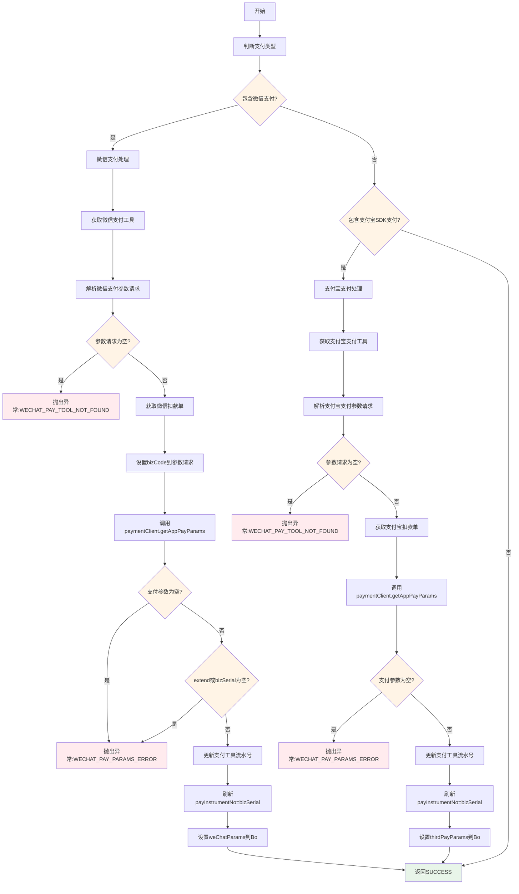
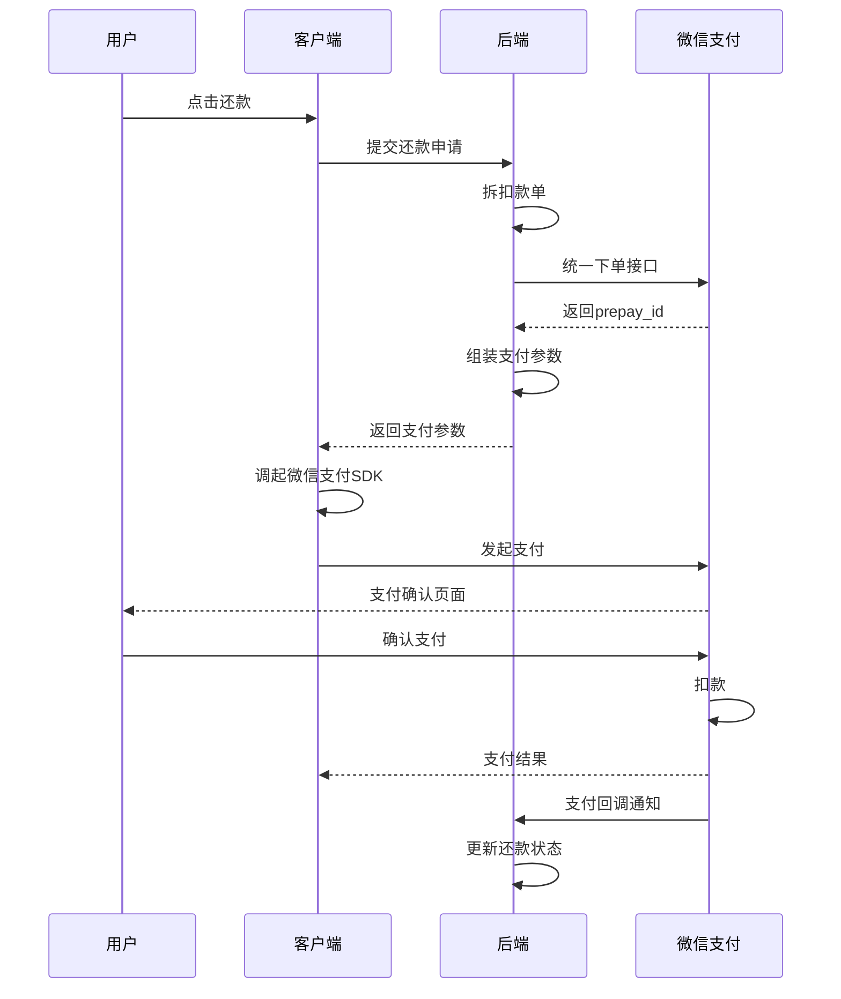
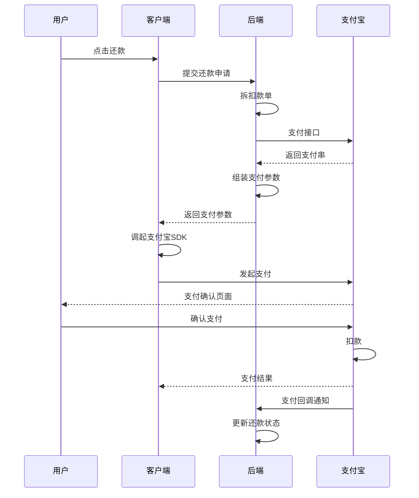
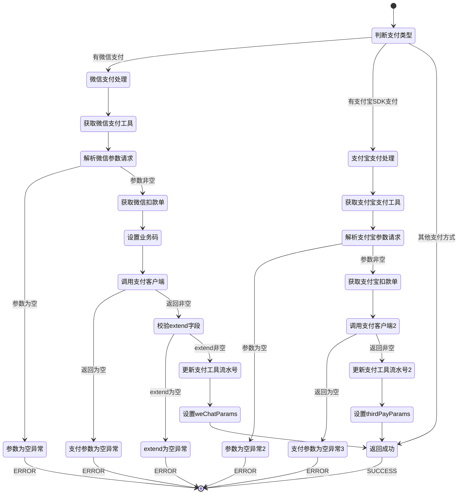

# PE160060 - 获取三方支付参数

## 节点信息

| 属性 | 值 |
|------|-----|
| **处理器代码** | PE160060 |
| **节点名称** | 获取三方支付参数 |
| **节点类型** | PROCESS |
| **所属流程** | [[账期制V400还款同步流程]] |
| **执行阶段** | 同步受理阶段 |
| **实现类** | RepayApplyBizFlowPE160060ServiceImpl |
| **优先级** | P0(核心节点) |

## 功能说明

获取三方支付参数节点负责为微信支付和支付宝SDK支付获取调用三方支付所需的参数,包括预支付ID(prepay_id)、支付流水号等,并更新扣款单号到支付工具,为后续客户端调起三方支付SDK做准备。

### 核心职责
1. **识别三方支付类型**: 判断是否包含微信或支付宝支付
2. **获取微信支付参数**: 调用paymentClient获取预支付参数
3. **获取支付宝支付参数**: 调用paymentClient获取支付参数
4. **更新支付工具流水号**: 将扣款单号更新到payInstrumentNo
5. **设置响应参数**: 将支付参数设置到Bo供后续返回

### 适用场景

- **微信支付**: WECHAT_PAY,需要获取prepay_id等参数
- **支付宝SDK支付**: ALIPAY_SDK,需要获取支付参数
- **其他支付方式**: 不需要获取三方参数,跳过

## 输入参数

| 参数名 | 参数代码 | 类型 | 来源 | 说明 |
|--------|----------|------|------|------|
| 支付工具列表 | payToolList | List<PayTool> | RepayApplyReq | 支付工具列表 |
| 当前扣款单列表 | currentDeductBillList | List<DeductBill> | RepayApplyBo | PE160030拆分的扣款单 |

### PayTool 结构

| 字段名 | 字段代码 | 类型 | 说明 |
|--------|----------|------|------|
| 支付类型 | payType | PayType | 支付类型枚举 |
| 扩展信息 | extInfoMap | Map | 扩展信息 |

### WeChatPayParamsReq 结构(微信支付参数请求)

| 字段名 | 字段代码 | 类型 | 说明 |
|--------|----------|------|------|
| 应用ID | appId | String | 微信应用ID |
| 商户号 | mchId | String | 微信商户号 |
| 用户OpenID | openId | String | 用户微信OpenID |
| 业务码 | bizCode | String | 业务码(从扣款单获取) |

### ThirdPayParamsReq 结构(支付宝参数请求)

| 字段名 | 字段代码 | 类型 | 说明 |
|--------|----------|------|------|
| 应用ID | appId | String | 支付宝应用ID |
| 用户ID | userId | String | 支付宝用户ID |

## 输出参数

| 参数名 | 参数代码 | 类型 | 说明 |
|--------|----------|------|---------|
| 微信支付参数 | weChatParams | Map<String,String> | 设置到RepayApplyBo |
| 支付宝支付参数 | thirdPayParams | Map<String,String> | 设置到RepayApplyBo |

### 微信支付参数Map

| 参数名 | 参数代码 | 类型 | 说明 |
|--------|----------|------|------|
| 应用ID | appId | String | 微信应用ID |
| 预支付ID | prepayId | String | 预支付交易会话标识 |
| 时间戳 | timeStamp | String | 时间戳 |
| 随机字符串 | nonceStr | String | 随机字符串 |
| 签名 | sign | String | 签名 |
| 扩展信息 | extend | String | 扩展信息(JSON格式,包含bizSerial) |

### 支付宝支付参数Map

| 参数名 | 参数代码 | 类型 | 说明 |
|--------|----------|------|------|
| 支付串 | payStr | String | 支付宝支付串 |
| 扩展信息 | extend | String | 扩展信息(JSON格式) |

## 处理流程



## 核心业务逻辑

### 1. 识别三方支付类型

**识别逻辑**:
```
// 判断是否包含微信支付
hasWeChatPay = payToolList.stream()
    .anyMatch(item -> item.payType == WECHAT_PAY)

// 判断是否包含支付宝SDK支付
hasAlipaySdk = payToolList.stream()
    .anyMatch(item -> item.payType == ALIPAY_SDK)
```

**业务含义**:
- 只有WECHAT_PAY和ALIPAY_SDK需要获取三方支付参数
- 其他支付方式(银行卡/溢缴款/优惠券)不需要
- 微信和支付宝支付参数获取逻辑不同

### 2. 微信支付参数获取

#### 2.1 解析微信支付参数请求

**解析逻辑**:
```
// 获取微信支付工具
weChatPayTool = payToolList.stream()
    .filter(item -> item.payType == WECHAT_PAY)
    .findAny()
    .get()

// 获取微信支付参数JSON字符串
wechatParamsStr = weChatPayTool.extInfoMap.get(WECHAT_PARAMS)

// 校验参数
IF wechatParamsStr为空 THEN
    THROW ClientException(WECHAT_PAY_TOOL_NOT_FOUND)
END IF

// 解析为对象
weChatPayParamsReq = JSON.parseObject(wechatParamsStr, WeChatPayParamsReq.class)

IF weChatPayParamsReq为空 THEN
    THROW ServerException(REPAY_DEDUCT_BILL_SPLIT_ERROR)
END IF
```

**WeChatPayParamsReq 包含**:
- appId: 微信应用ID
- mchId: 微信商户号
- openId: 用户微信OpenID

#### 2.2 获取微信扣款单

**获取逻辑**:
```
// 获取微信支付类型的扣款单
deductBill = currentDeductBillList.stream()
    .filter(item -> item.payType == WECHAT_PAY)
    .findAny()
    .get()
```

**业务含义**:
- 一个还款申请可能拆分为多个扣款单
- 只需要获取微信支付类型的扣款单
- 微信扣款单包含扣款金额、渠道等信息

#### 2.3 设置业务码并调用支付客户端

**调用逻辑**:
```
// 设置业务码(从扣款单扩展信息获取)
weChatPayParamsReq.bizCode = deductBill.extInfo.bizCode

// 调用支付客户端获取支付参数
payParams = paymentClient.getAppPayParams(
    weChatPayParamsReq,  // 微信支付参数请求
    deductBill,          // 扣款单
    null,                // 支付宝参数(微信场景为null)
    uid                  // 用户ID
)
```

**paymentClient.getAppPayParams 逻辑**:
- 调用微信支付统一下单接口
- 生成预支付交易会话标识(prepay_id)
- 组装客户端调起支付所需的参数
- 返回包含prepay_id的支付参数Map

**参数Map包含**:
```
{
    "appId": "wx1234567890",
    "prepayId": "wx2024...",
    "timeStamp": "1712345678",
    "nonceStr": "abc123",
    "sign": "ABC123...",
    "extend": "{\"bizSerial\":\"BIZ2024...\"}"
}
```

#### 2.4 校验支付参数

**校验逻辑**:
```
// 校验支付参数不为空
IF payParams为空 THEN
    THROW ClientException(WECHAT_PAY_PARAMS_ERROR)
END IF

// 校验extend字段
extendStr = payParams.get(EXTEND)
IF extendStr为空 THEN
    THROW ClientException(WECHAT_PAY_PARAMS_ERROR)
END IF

// 解析extend获取bizSerial
extendJson = JSON.parseObject(extendStr)
bizSerial = extendJson.getString(BIZ_SERIAL)
IF bizSerial为空 THEN
    THROW ClientException(WECHAT_PAY_PARAMS_ERROR)
END IF
```

**业务含义**:
- extend字段包含支付流水号(bizSerial)
- bizSerial用于后续扣款单和入账单关联
- 必须确保bizSerial存在

#### 2.5 更新支付工具流水号

**更新逻辑**:
```
refreshDeductBillNo(bo, bizSerial, WECHAT_PAY):
    // 遍历还款单处理列表
    FOR EACH repaymentBillHandleForDcp IN bo.repaymentBillHandleForDcpList:
        // 遍历支付工具列表
        FOR EACH payToolItem IN repaymentBillHandleForDcp.repayTrialPlanListComponent.paymentTypeList:
            // 找到微信支付工具
            IF payToolItem.payType == WECHAT_PAY THEN
                // 更新支付工具号为支付流水号
                payToolItem.payInstrumentNo = bizSerial
            END IF
        END FOR
    END FOR
```

**业务含义**:
- 将支付流水号更新到支付工具的payInstrumentNo
- 后续入账时可以通过payInstrumentNo关联支付流水
- 保证扣款单、入账单、支付流水的一致性

#### 2.6 设置响应参数

**设置逻辑**:
```
// 设置微信支付参数到Bo
bo.setWeChatParams(payParams)
```

**业务含义**:
- 支付参数会返回给客户端
- 客户端使用支付参数调起微信支付SDK
- 用户完成支付后,微信回调通知后端

### 3. 支付宝SDK支付参数获取

#### 3.1 解析支付宝支付参数请求

**解析逻辑**:
```
// 获取支付宝支付工具
aliPayTool = payToolList.stream()
    .filter(item -> item.payType == ALIPAY_SDK)
    .findAny()
    .get()

// 获取支付宝支付参数JSON字符串
thirdParamStr = aliPayTool.extInfoMap.get(THIRD_PAY_PARAMS)

// 校验参数
IF thirdParamStr为空 THEN
    THROW ClientException(WECHAT_PAY_TOOL_NOT_FOUND)
END IF

// 解析为对象
thirdPayParamsReq = JSON.parseObject(thirdParamStr, ThirdPayParamsReq.class)

IF thirdPayParamsReq为空 THEN
    THROW ServerException(REPAY_DEDUCT_BILL_SPLIT_ERROR)
END IF
```

**ThirdPayParamsReq 包含**:
- appId: 支付宝应用ID
- userId: 支付宝用户ID

#### 3.2 获取支付宝扣款单

**获取逻辑**:
```
// 获取支付宝支付类型的扣款单
deductBill = currentDeductBillList.stream()
    .filter(item -> item.payType == ALIPAY_SDK)
    .findAny()
    .get()
```

#### 3.3 调用支付客户端

**调用逻辑**:
```
// 调用支付客户端获取支付参数
payParams = paymentClient.getAppPayParams(
    deductBill,            // 扣款单
    thirdPayParamsReq,     // 支付宝参数请求
    null,                  // 微信参数(支付宝场景为null)
    null                   // uid(支付宝场景不需要)
)
```

**paymentClient.getAppPayParams 逻辑**:
- 调用支付宝支付接口
- 生成支付串(payStr)
- 组装客户端调起支付所需的参数
- 返回包含payStr的支付参数Map

**参数Map包含**:
```
{
    "payStr": "alipay_sdk=...",
    "extend": "{...}"
}
```

#### 3.4 校验支付参数

**校验逻辑**:
```
// 校验支付参数不为空
IF payParams为空 THEN
    THROW ClientException(WECHAT_PAY_PARAMS_ERROR)
END IF
```

#### 3.5 更新支付工具流水号

**更新逻辑**:
```
// 获取支付流水号
bizSerial = deductBill.deductBillNo

// 更新支付工具流水号
refreshDeductBillNo(bo, bizSerial, ALIPAY_SDK)
```

#### 3.6 设置响应参数

**设置逻辑**:
```
// 设置支付宝支付参数到Bo
bo.setThirdPayParams(payParams)
```

## 微信支付参数详解

### 预支付流程



### 支付参数说明

| 参数 | 说明 | 用途 |
|------|------|------|
| appId | 微信应用ID | 标识小程序/公众号 |
| prepayId | 预支付交易会话标识 | 调起支付必需 |
| timeStamp | 时间戳 | 签名参数 |
| nonceStr | 随机字符串 | 签名参数 |
| sign | 签名 | 安全校验 |
| extend | 扩展信息 | 包含bizSerial等 |

### 客户端调起支付

**客户端使用支付参数**:
```
// iOS示例
WXApi.sendReq({
    appId: weChatParams.appId,
    partnerId: mchId,
    prepayId: weChatParams.prepayId,
    package: "Sign=WXPay",
    nonceStr: weChatParams.nonceStr,
    timeStamp: weChatParams.timeStamp,
    sign: weChatParams.sign
})
```

## 支付宝支付参数详解

### 支付流程



### 支付参数说明

| 参数 | 说明 | 用途 |
|------|------|------|
| payStr | 支付串 | 调起支付宝SDK必需 |
| extend | 扩展信息 | 包含额外参数 |

### 客户端调起支付

**客户端使用支付参数**:
```
// iOS示例
AlipaySDK.defaultService().payOrder(
    payStr,
    fromScheme: appScheme,
    callback: { result in
        // 支付结果回调
    }
)
```

## 状态流转



## 上游节点

- **PE160030** - BY决策结果聚合拆扣款单

## 下游节点

- **PE160090** - 保存扣款单

## 异常处理

| 异常场景 | 错误类型 | 错误码 | 处理方式 | 影响 |
|----------|----------|--------|----------|------|
| 微信支付工具未找到 | ClientException | WECHAT_PAY_TOOL_NOT_FOUND | 抛出异常 | 流程终止 |
| 微信支付参数为空 | ClientException | WECHAT_PAY_PARAMS_ERROR | 抛出异常 | 流程终止 |
| 支付宝支付工具未找到 | ClientException | WECHAT_PAY_TOOL_NOT_FOUND | 抛出异常 | 流程终止 |
| 支付宝支付参数为空 | ClientException | WECHAT_PAY_PARAMS_ERROR | 抛出异常 | 流程终止 |
| 其他异常 | Exception | - | 记录日志,抛出异常 | 流程终止 |

## 监控指标

### 业务指标
- **微信支付比例**: 微信支付次数 / 总还款次数
- **支付宝支付比例**: 支付宝支付次数 / 总还款次数
- **支付参数获取成功率**: 成功数 / 总请求次数
- **微信预支付平均耗时**: P50/P95/P99
- **支付宝预支付平均耗时**: P50/P95/P99

### 技术指标
- **paymentClient调用成功率**: 成功数 / 总调用数
- **支付参数解析成功率**: 成功数 / 总次数

## 性能优化

### 1. 提前返回
- **策略**: 非三方支付提前返回
- **效果**: 减少不必要的处理

### 2. 并行处理
- **策略**: 微信和支付宝参数获取可以并行(当前是串行)
- **效果**: 提高响应速度(如果同时有两种支付方式)

### 3. 缓存优化
- **策略**: 缓存支付客户端配置
- **效果**: 减少配置查询时间

## 实现位置

```bash
repayengine-service/src/main/java/cn/caijiajia/repayengine/service/
├── repay/process/dcp/
│   └── RepayApplyBizFlowPE160060ServiceImpl.java  # 节点处理器 (131行)
└── client/feign/
    └── PaymentClient.java                          # 支付客户端
```

## 设计考虑

### 1. 为什么需要获取三方支付参数?

**原因**:
- 微信/支付宝支付需要预支付ID或支付串
- 客户端调起支付SDK需要这些参数
- 参数由支付系统生成
- 包含签名等安全信息

### 2. 为什么要更新支付工具流水号?

**原因**:
- 支付流水号(bizSerial)用于关联支付和还款
- 后续入账时需要通过流水号找到对应的扣款单
- 保证数据一致性
- 便于对账和问题排查

### 3. 为什么微信和支付宝参数获取逻辑不同?

**原因**:
- 微信和支付宝接口不同
- 微信需要openId,支付宝需要userId
- 返回参数格式不同
- 调起SDK的方式不同

### 4. 为什么只处理WECHAT_PAY和ALIPAY_SDK?

**原因**:
- 只有这两种支付方式需要预支付参数
- 银行卡代扣直接扣款,不需要预支付
- 优惠券/溢缴款是内部支付,不需要三方参数
- 其他支付方式由专门的流程处理

## 相关文档

- [[账期制V400还款同步流程]] - 主流程设计
- [[PE160030]] - BY决策结果聚合拆扣款单
- [[PE160090]] - 保存扣款单
- [[微信支付集成]] - 微信支付对接文档
- [[支付宝支付集成]] - 支付宝支付对接文档

## 标签

#节点 #三方支付 #支付参数 #PE160060