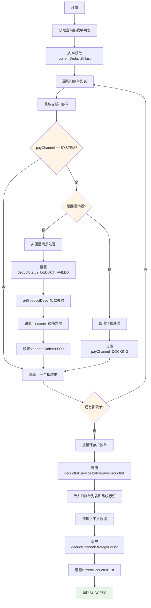
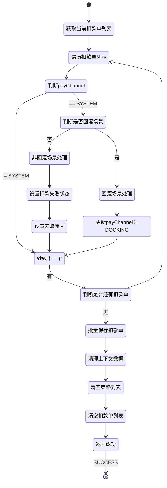

# PE160090 - 保存扣款单

## 节点信息

| 属性 | 值 |
|------|-----|
| **处理器代码** | PE160090 |
| **节点名称** | 保存扣款单 |
| **节点类型** | PROCESS |
| **所属流程** | [[账期制V400还款同步流程]] |
| **执行阶段** | 同步受理阶段 |
| **实现类** | RepayApplyBizFlowPE160090ServiceImpl |
| **优先级** | P0(核心节点) |

## 功能说明

保存扣款单节点负责将扣款单列表持久化到数据库,处理策略输出异常的扣款单状态,并清理上下文中的临时数据,完成还款申请受理阶段的数据持久化。

### 核心职责
1. **处理系统渠道扣款单**: 策略输出异常的扣款单设置状态
2. **区分回灌场景**: 回灌场景和非回灌场景处理逻辑不同
3. **批量保存扣款单**: 调用服务层批量保存扣款单列表
4. **清理上下文数据**: 清除临时数据避免内存泄漏

### 适用场景

- **正常扣款**: 扣款渠道策略正常,直接保存扣款单
- **策略异常**: 策略输出异常,payChannel=SYSTEM,需要特殊处理
- **回灌场景**: 线下还款/成功充值等已扣款场景
- **非回灌场景**: 需要后续异步扣款的场景

## 输入参数

| 参数名 | 参数代码 | 类型 | 来源 | 说明 |
|--------|----------|------|------|------|
| 当前扣款单列表 | currentDeductBillList | List<DeductBill> | RepayApplyBo | PE160030拆分的扣款单列表 |

### DeductBill 结构

| 字段名 | 字段代码 | 类型 | 说明 |
|--------|----------|------|------|
| 扣款单号 | deductBillNo | String | 扣款单唯一标识 |
| 还款单号 | repaymentBillNo | String | 关联的还款单号 |
| 扣款金额 | deductAmount | Integer | 扣款金额(单位:分) |
| 扣款状态 | deductStatus | DeductStatus | 扣款状态 |
| 支付渠道 | payChannel | PayChannel | 支付渠道 |
| 支付类型 | payType | PayType | 支付类型 |

## 输出参数

无直接输出参数,扣款单已保存到数据库。

## 处理流程



## 核心业务逻辑

### 1. 处理系统渠道扣款单

**识别逻辑**:
```
IF deductBill.payChannel == PayChannel.SYSTEM THEN
    // 策略输出异常的扣款单
    // 需要特殊处理
END IF
```

**业务含义**:
- payChannel=SYSTEM表示扣款渠道策略输出异常
- 策略引擎无法决策扣款渠道
- 需要根据场景设置扣款单状态
- 区分回灌场景和非回灌场景

**为什么会有SYSTEM渠道?**
- 决策引擎异常: 决策引擎调用失败
- 规则执行异常: 规则执行出错
- 渠道不可用: 所有渠道都不可用
- 兜底逻辑: 使用系统默认渠道(SYSTEM)

### 2. 区分回灌场景

**回灌场景判断**:
```
isSuccessRecharge = PayType.isSuccessRecharge(deductBill.payType)

IF isSuccessRecharge THEN
    // 回灌场景: 用户已完成支付
ELSE
    // 非回灌场景: 需要后续异步扣款
END IF
```

**PayType.isSuccessRecharge 判断**:
- AO_OFFLINE_PAY: AO线下支付(已扣款)
- BGW_OFFLINE_PAY: BGW线下支付(已扣款)
- FUND_OFFLINE_PAY: 资方线下支付(已扣款)
- SUCCESS_RECHARGE: 成功充值(已扣款)

**业务含义**:
- 回灌场景: 用户已通过银行转账等方式完成支付
- 非回灌场景: 需要后续通过银行卡代扣等方式扣款
- 回灌场景扣款单状态应该是成功
- 非回灌场景扣款单状态应该是失败

### 3. 非回灌场景处理

**处理逻辑**:
```
// 设置扣款状态为失败
deductBill.deductStatus = DeductStatus.DEDUCT_FAILED

// 设置扣款描述
deductBill.deductDesc = DeductStatus.DEDUCT_FAILED.caption  // "扣款失败"

// 设置失败原因
deductBill.extInfo.message = ErrorCode.REPAY_YIDUN_CONF_ERROR.msg  // "策略配置异常"

// 设置标准错误码
deductBill.extInfo.standardCode = CommonConst.DEFAULT_STANDART_CODE  // "99999"
```

**业务含义**:
- 策略异常导致扣款失败
- 设置扣款状态为DEDUCT_FAILED
- 记录失败原因便于排查
- 标准错误码用于前端展示

**为什么设置DEDUCT_FAILED?**
- 策略异常无法确定扣款渠道
- 无法发起扣款
- 扣款单状态必须明确(成功/失败)
- 设置为失败避免后续流程误判

**错误码说明**:
- REPAY_YIDUN_CONF_ERROR: 策略配置异常
- DEFAULT_STANDART_CODE: 99999(通用错误码)
- 用户看到的是"还款失败,请稍后重试"

### 4. 回灌场景处理

**处理逻辑**:
```
// 更新支付渠道为DOCKING
deductBill.payChannel = PayChannel.DOCKING
```

**业务含义**:
- 回灌场景已扣款成功
- payChannel=SYSTEM是临时状态
- 更新为DOCKING表示对接渠道
- 后续入账流程会处理DOCKING渠道的扣款单

**为什么更新为DOCKING?**
- SYSTEM是临时状态,不能保存到数据库
- DOCKING表示对接渠道(已对接的系统)
- 回灌场景的扣款单需要入账
- DOCKING渠道有专门的入账逻辑

**PayChannel.DOCKING 说明**:
- 对接渠道: 表示已对接的外部系统
- 适用场景: 线下支付、成功充值等
- 后续处理: 入账流程会处理DOCKING渠道
- 入账方式: 根据payType确定

### 5. 批量保存扣款单

**保存逻辑**:
```
deductBillService.batchSaveDeductBill(
    currentDeductBillList,  // 扣款单列表
    CommonConst.REPAY_ENGINE  // 系统标识: "repayengine"
)
```

**保存内容**:
- 扣款单主表(t_sold_deduct_bill)
- 扣款单扩展信息(extInfoMap)
- 分期明细关联关系
- 支付工具信息

**事务控制**:
- batchSaveDeductBill方法使用@Transactional注解
- 保证批量保存的原子性
- 全部成功或全部失败

**为什么需要事务控制?**
- 扣款单是重要的业务数据
- 必须保证数据一致性
- 避免部分保存成功导致数据不完整
- 还款单和扣款单必须一一对应

### 6. 清理上下文数据

**清理逻辑**:
```
// 清空扣款渠道策略列表
repaymentBill.deductChannelStrategyBoList = null

// 清空当前扣款单列表
repayApplyBo.currentDeductBillList = null
```

**业务含义**:
- deductChannelStrategyBoList: 临时策略数据,已使用完毕
- currentDeductBillList: 已保存到数据库,不需要再保存
- 清空避免内存泄漏
- 避免后续节点误用

**为什么要清理?**
- 临时数据已使用完毕
- 避免占用内存
- 避免后续节点误用
- 上下文数据会传递到异步流程

**清理时机**:
- 在postProcess方法中清理
- 节点执行完成后调用
- 无论成功失败都会清理
- 确保资源释放

## 扣款单状态说明

### DeductStatus 枚举

| 枚举值 | 说明 | 使用场景 |
|--------|------|----------|
| INIT | 初始状态 | 扣款单刚创建,未扣款 |
| DEDUCTING | 扣款中 | 正在执行扣款 |
| DEDUCT_SUCCESS | 扣款成功 | 扣款成功 |
| DEDUCT_FAILED | 扣款失败 | 扣款失败(含策略异常) |
| DEDUCT_CANCEL | 扣款取消 | 扣款取消 |

**本节点使用**:
- 非回灌场景: DEDUCT_FAILED(扣款失败)
- 回灌场景: 保持原状态(由PE160030设置)

### PayChannel 枚举

| 枚举值 | 说明 | 使用场景 |
|--------|------|----------|
| UNIONPAY | 银联渠道 | 银联代扣 |
| NETSUN | 网联渠道 | 网联代扣 |
| PAYMENT | 三方支付 | 微信/支付宝支付 |
| ACCOUNT_BALANCE | 账户余额 | 溢缴款支付 |
| COUPON | 优惠券 | 优惠券支付 |
| DOCKING | 对接渠道 | 线下支付/成功充值 |
| SYSTEM | 系统渠道 | 策略异常临时状态 |

**本节点处理**:
- SYSTEM → DEDUCT_FAILED(非回灌)
- SYSTEM → DOCKING(回灌)

## 状态流转



## 上游节点

- **PE160060** - 获取三方支付参数

## 下游节点

- **PE161010** - 启动异步流程

## 异常处理

| 异常场景 | 错误类型 | 错误码 | 处理方式 | 影响 |
|----------|----------|--------|----------|------|
| 策略配置异常 | - | REPAY_YIDUN_CONF_ERROR | 设置扣款状态为失败 | 该扣款单失败 |
| 数据库保存失败 | SQLException | - | 抛出异常 | 流程终止 |
| 事务回滚 | TransactionException | - | 抛出异常 | 流程终止 |
| 其他异常 | Exception | - | 记录日志,抛出异常 | 流程终止 |

## 监控指标

### 业务指标
- **扣款单保存成功率**: 成功数 / 总保存次数
- **策略异常率**: SYSTEM渠道扣款单数 / 总扣款单数
- **回灌场景比例**: 回灌场景扣款单数 / 总扣款单数
- **平均扣款单数**: 总扣款单数 / 总还款次数

### 技术指标
- **平均保存耗时**: P50/P95/P99
- **数据库事务成功率**: 成功数 / 总事务数
- **批量保存性能**: 扣款单数 / 秒

## 性能优化

### 1. 批量保存
- **策略**: 批量保存扣款单列表
- **效果**: 减少数据库交互次数

### 2. 事务控制
- **策略**: 独立事务方法
- **效果**: 保证原子性,避免部分成功

### 3. 及时清理
- **策略**: 及时清理临时数据
- **效果**: 避免内存泄漏

## 实现位置

```bash
repayengine-service/src/main/java/cn/caijiajia/repayengine/service/
├── repay/process/dcp/
│   └── RepayApplyBizFlowPE160090ServiceImpl.java  # 节点处理器 (105行)
└── bill/
    └── IDeductBillService.java                     # 扣款单服务
```

## 设计考虑

### 1. 为什么需要处理SYSTEM渠道扣款单?

**原因**:
- 决策引擎可能异常
- 策略输出SYSTEM作为兜底
- 不能直接保存SYSTEM渠道到数据库
- 需要根据场景设置正确的状态

### 2. 为什么回灌场景更新为DOCKING?

**原因**:
- 回灌场景已扣款成功
- SYSTEM是临时状态
- DOCKING表示对接渠道
- 后续入账流程会处理DOCKING渠道

### 3. 为什么非回灌场景设置为DEDUCT_FAILED?

**原因**:
- 策略异常无法确定扣款渠道
- 无法发起扣款
- 扣款单状态必须明确
- 设置为失败避免后续流程误判

### 4. 为什么要清理上下文数据?

**原因**:
- 临时数据已使用完毕
- 避免占用内存
- 避免后续节点误用
- 上下文会传递到异步流程

## 相关文档

- [[账期制V400还款同步流程]] - 主流程设计
- [[PE160060]] - 获取三方支付参数
- [[PE161010]] - 启动异步流程
- [[扣款单数据模型]] - 扣款单表结构说明
- [[扣款状态流转]] - 扣款状态流转图

## 标签

#节点 #保存扣款单 #数据持久化 #PE160090