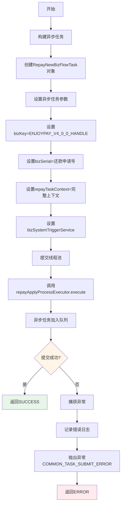
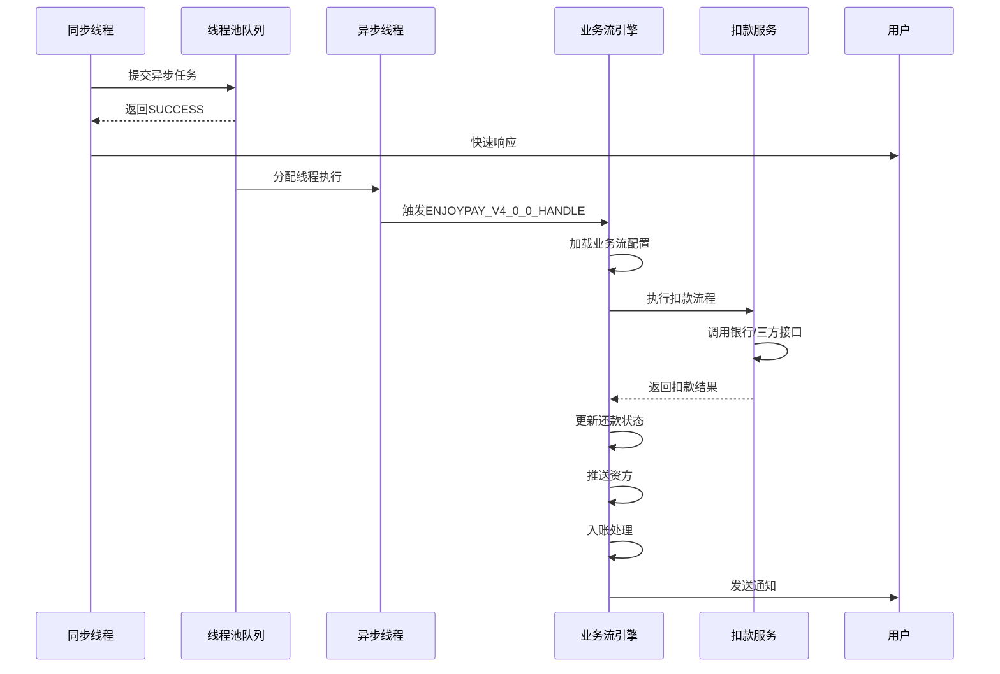
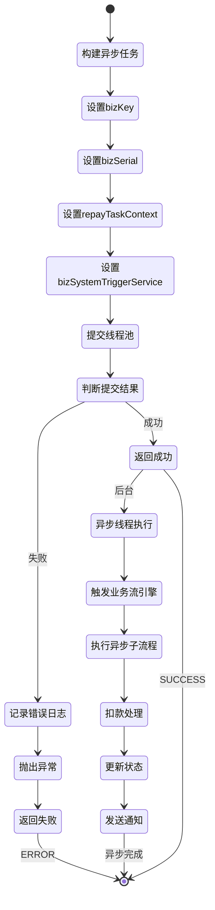

# PE161010 - 启动异步流程

## 节点信息

| 属性 | 值 |
|------|-----|
| **处理器代码** | PE161010 |
| **节点名称** | 启动异步流程 |
| **节点类型** | PROCESS |
| **所属流程** | [[账期制V400还款同步流程]] |
| **执行阶段** | 同步受理阶段(最后一个节点) |
| **实现类** | RepayApplyBizFlowPE161010ServiceImpl |
| **优先级** | P0(核心节点) |

## 功能说明

启动异步流程节点负责将还款申请提交到异步处理线程池,启动账期制V400还款异步子流程,实现同步受理和异步扣款的解耦,提高系统吞吐量和响应速度。

### 核心职责
1. **构建异步任务**: 创建RepayNewBizFlowTask异步任务对象
2. **设置业务流Key**: 指定异步子流程为ENJOYPAY_V4_0_0_HANDLE
3. **设置业务流水号**: 传递bizSerial用于关联同步和异步流程
4. **提交线程池**: 将异步任务提交到repayApplyProcessExecutor线程池
5. **异步执行**: 异步任务在独立线程中执行扣款流程

### 适用场景

- **所有还款场景**: 同步流程最后一个节点,启动异步扣款
- **快速响应**: 同步流程快速返回,异步执行耗时扣款
- **提高吞吐量**: 异步处理提高系统并发能力

## 输入参数

| 参数名 | 参数代码 | 类型 | 来源 | 说明 |
|--------|----------|------|------|------|
| 业务流水号 | bizSerial | String | RepayApplyContext | 还款申请业务流水号 |
| 还款上下文 | repayTaskContext | RepayApplyContext | RepayApplyContext | 完整的还款申请上下文 |

## 输出参数

无直接输出参数,异步任务已提交到线程池。

## 处理流程



## 核心业务逻辑

### 1. 构建异步任务

**构建逻辑**:
```
repayTask = RepayNewBizFlowTask.builder()
    .bizKey(BizFlowConstants.BIZFLOW_BIZ_KEY_ENJOYPAY_V4_0_0_HANDLE)
    .bizSerial(repayContext.getBizSerial())
    .repayTaskContext(repayContext)
    .bizSystemTriggerService(bizSystemTriggerService)
    .build()
```

**RepayNewBizFlowTask 包含**:

| 字段 | 类型 | 说明 | 用途 |
|------|------|------|------|
| bizKey | String | 业务流Key | 指定异步子流程 |
| bizSerial | String | 业务流水号 | 关联同步和异步流程 |
| repayTaskContext | RepayApplyContext | 还款上下文 | 传递完整业务数据 |
| bizSystemTriggerService | BizSystemTriggerService | 业务系统触发服务 | 触发异步流程执行 |

**业务含义**:
- bizKey: 标识要执行的异步子流程
- bizSerial: 用于日志追踪和数据关联
- repayTaskContext: 包含还款单、扣款单等所有数据
- bizSystemTriggerService: 业务流引擎服务

### 2. 异步子流程说明

**异步子流程Key**: `BIZFLOW_BIZ_KEY_ENJOYPAY_V4_0_0_HANDLE`

**对应流程**: [[账期制V400还款异步子流程]]

**异步子流程主要功能**:
- 执行扣款(银行卡代扣/三方支付/优惠券等)
- 更新还款状态
- 推送资方
- 入账处理
- 发送通知

**为什么需要异步?**
- 扣款耗时较长(银行接口、三方支付接口)
- 提高系统吞吐量
- 快速响应用户
- 解耦同步受理和异步扣款

### 3. 提交线程池

**提交逻辑**:
```
repayApplyProcessExecutor.execute(repayTask)
```

**线程池配置**:
- **线程池名称**: repayApplyProcessExecutor
- **核心线程数**: 配置文件指定
- **最大线程数**: 配置文件指定
- **队列容量**: 配置文件指定
- **拒绝策略**: 配置文件指定

**线程池作用**:
- 控制并发数量
- 避免资源耗尽
- 提供任务队列
- 线程复用

**提交成功**:
- 任务加入线程池队列
- 独立线程执行任务
- 同步流程立即返回
- 异步流程在后台执行

**提交失败**:
- 线程池队列已满
- 抛出RejectedExecutionException
- 记录错误日志
- 抛出COMMON_TASK_SUBMIT_ERROR异常

### 4. 异步任务执行流程



### 5. RepayNewBizFlowTask 执行逻辑

**RepayNewBizFlowTask.run() 方法**:

```
@Override
public void run() {
    try {
        // 触发异步业务流
        bizSystemTriggerService.trigger(
            bizKey,              // 业务流Key
            bizSerial,           // 业务流水号
            repayTaskContext     // 还款上下文
        )
    } catch (Exception e) {
        // 记录异常日志
        RE_LOG.error(e, "异步业务流执行异常", bizSerial)
        // 更新还款申请状态为失败
        updateRepayApplyStatus(bizSerial, FAILED, e.getMessage())
    }
}
```

**业务流引擎触发**:
```
bizSystemTriggerService.trigger(bizKey, bizSerial, context):
    // 1. 根据bizKey加载业务流配置
    bizFlowConfig = loadBizFlowConfig(bizKey)

    // 2. 创建业务流执行器
    bizFlowExecutor = createBizFlowExecutor(bizFlowConfig)

    // 3. 执行业务流
    bizFlowExecutor.execute(bizSerial, context)

    // 4. 返回执行结果
    RETURN bizFlowExecutor.getResult()
```

## 同步 vs 异步流程对比

| 对比项 | 同步流程 | 异步流程 |
|--------|---------|---------|
| **流程名称** | 账期制V400还款同步流程 | 账期制V400还款异步子流程 |
| **主要功能** | 受理还款申请,拆单,保存单据 | 执行扣款,更新状态,入账 |
| **执行方式** | 同步阻塞 | 异步非阻塞 |
| **响应速度** | 快(几十毫秒) | 慢(几秒到几分钟) |
| **用户体验** | 立即返回受理结果 | 异步处理,完成后通知 |
| **吞吐量** | 高 | 中等 |
| **失败处理** | 立即返回错误 | 重试机制 |

**为什么需要同步+异步?**
- 同步流程: 快速受理,校验,拆单,保存
- 异步流程: 耗时扣款,状态更新,入账
- 解耦提高性能
- 提高系统吞吐量
- 优化用户体验

## 线程池配置说明

### 线程池参数

| 参数 | 说明 | 配置建议 |
|------|------|----------|
| corePoolSize | 核心线程数 | CPU密集型: CPU核数<br>IO密集型: 2*CPU核数 |
| maxPoolSize | 最大线程数 | 根据系统负载调整 |
| queueCapacity | 队列容量 | 根据业务峰值调整 |
| keepAliveSeconds | 空闲线程存活时间 | 60秒 |
| threadNamePrefix | 线程名前缀 | repay-apply-process- |

**配置示例**:
```
repay.apply.process.executor.corePoolSize=20
repay.apply.process.executor.maxPoolSize=50
repay.apply.process.executor.queueCapacity=1000
repay.apply.process.executor.keepAliveSeconds=60
repay.apply.process.executor.threadNamePrefix=repay-apply-process-
```

### 拒绝策略

| 策略 | 说明 | 适用场景 |
|------|------|----------|
| AbortPolicy | 抛出RejectedExecutionException | 需要感知任务提交失败 |
| CallerRunsPolicy | 由调用线程执行任务 | 不希望任务丢失 |
| DiscardPolicy | 直接丢弃任务 | 允许任务丢失 |
| DiscardOldestPolicy | 丢弃队列中最老的任务 | 允许任务丢失 |

**本系统使用**: AbortPolicy(抛出异常)

### 线程池监控

**监控指标**:
- activeCount: 活跃线程数
- poolSize: 当前线程池大小
- corePoolSize: 核心线程数
- maxPoolSize: 最大线程数
- queueSize: 队列大小
- completedTaskCount: 已完成任务数
- taskCount: 总任务数

**告警阈值**:
- queueSize > 800: 队列接近满
- activeCount == maxPoolSize: 线程池满
- rejectedExecutionCount > 0: 任务被拒绝

## 状态流转



## 上游节点

- **PE160090** - 保存扣款单

## 下游节点

无(同步流程最后一个节点)

**异步流程入口**:
- [[账期制V400还款异步子流程]] - 由本节点启动

## 异常处理

| 异常场景 | 错误类型 | 错误码 | 处理方式 | 影响 |
|----------|----------|--------|----------|------|
| 线程池队列满 | RejectedExecutionException | COMMON_TASK_SUBMIT_ERROR | 记录日志,抛出异常 | 流程终止 |
| 线程池关闭 | RejectedExecutionException | COMMON_TASK_SUBMIT_ERROR | 记录日志,抛出异常 | 流程终止 |
| 其他异常 | Exception | COMMON_TASK_SUBMIT_ERROR | 记录日志,抛出异常 | 流程终止 |

## 监控指标

### 业务指标
- **异步任务提交成功率**: 成功数 / 总提交次数
- **异步任务队列积压**: 当前队列大小
- **异步任务执行成功率**: 成功数 / 总执行次数
- **平均异步执行耗时**: P50/P95/P99

### 技术指标
- **线程池活跃线程数**: 实时监控
- **线程池队列大小**: 实时监控
- **线程池拒绝次数**: 告警指标
- **线程池完成任务数**: 统计指标

## 性能优化

### 1. 线程池调优
- **策略**: 根据系统负载调整线程池参数
- **效果**: 提高并发处理能力

### 2. 队列容量优化
- **策略**: 根据业务峰值调整队列容量
- **效果**: 避免任务被拒绝

### 3. 异步执行
- **策略**: 同步流程快速返回,异步执行耗时操作
- **效果**: 提高系统吞吐量,优化用户体验

## 实现位置

```bash
repayengine-service/src/main/java/cn/caijiajia/repayengine/service/
├── repay/process/dcp/
│   └── RepayApplyBizFlowPE161010ServiceImpl.java  # 节点处理器 (66行)
└── repay/task/
    └── RepayNewBizFlowTask.java                   # 异步任务类
```

## 设计考虑

### 1. 为什么需要启动异步流程?

**原因**:
- 扣款操作耗时较长(银行接口、三方支付)
- 同步流程需要快速响应
- 提高系统吞吐量
- 解耦同步受理和异步扣款

### 2. 为什么使用线程池而不是直接new Thread?

**原因**:
- 线程池控制并发数量
- 避免资源耗尽
- 线程复用提高性能
- 提供任务队列缓冲

### 3. 为什么异步任务需要传递完整上下文?

**原因**:
- 异步流程需要访问还款单、扣款单等数据
- 避免异步流程再次查询数据库
- 保证数据一致性
- 提高异步流程执行效率

### 4. 为什么异步流程失败不影响同步流程?

**原因**:
- 同步流程已保存所有单据
- 异步流程失败可以重试
- 用户可以查询还款状态
- 系统有补偿机制

## 相关文档

- [[账期制V400还款同步流程]] - 主流程设计
- [[账期制V400还款异步子流程]] - 异步子流程设计
- [[PE160090]] - 保存扣款单
- [[线程池配置说明]] - 线程池参数配置
- [[业务流引擎]] - 业务流引擎使用

## 标签

#节点 #启动异步流程 #线程池 #PE161010