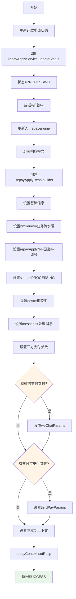
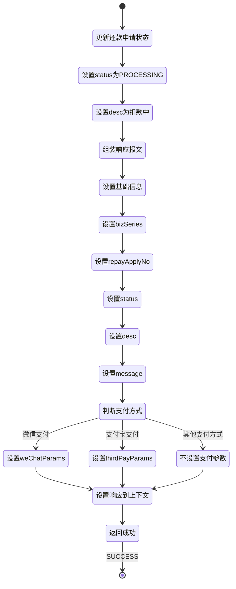

# PE161060 - 组织还款受理结果报文

## 节点信息

| 属性 | 值 |
|------|-----|
| **处理器代码** | PE161060 |
| **节点名称** | 组织还款受理结果报文 |
| **节点类型** | PROCESS |
| **所属流程** | [[账期制V400还款同步流程]] |
| **执行阶段** | 同步受理阶段(倒数第二个节点) |
| **实现类** | RepayApplyBizFlowPE161060ServiceImpl |
| **优先级** | P0(核心节点) |

## 功能说明

组织还款受理结果报文节点负责更新还款申请状态为"扣款中",并组装还款申请受理结果响应报文,将还款申请号、处理状态、三方支付参数等信息返回给客户端。

### 核心职责
1. **更新还款申请状态**: 将还款申请状态更新为PROCESSING(扣款中)
2. **组装响应报文**: 创建RepayApplyResp响应对象
3. **设置基础信息**: 业务流水号、还款申请号、状态等
4. **设置三方支付参数**: 微信/支付宝支付参数(如有)
5. **设置消息信息**: 处理消息或错误消息

### 适用场景

- **所有还款场景**: 同步流程倒数第二个节点,组装响应报文
- **三方支付**: 返回支付参数供客户端调起SDK
- **其他支付**: 返回受理结果,客户端轮询或等待通知

## 输入参数

| 参数名 | 参数代码 | 类型 | 来源 | 说明 |
|--------|----------|------|------|------|
| 业务流水号 | bizSerial | String | RepayApplyContext | 还款申请业务流水号 |
| 还款申请号 | repayApplyNo | String | RepayApplyBo | 还款申请唯一标识 |
| 处理消息 | message | String | RepayApplyContext | 处理消息或错误消息 |
| 微信支付参数 | weChatParams | Map | RepayApplyBo | PE160060获取的微信支付参数 |
| 支付宝支付参数 | thirdPayParams | Map | RepayApplyBo | PE160060获取的支付宝支付参数 |

## 输出参数

| 参数名 | 参数代码 | 类型 | 说明 |
|--------|----------|------|---------|
| 响应报文 | resp | RepayApplyResp | 设置到RepayApplyContext |

### RepayApplyResp 结构

| 字段名 | 字段代码 | 类型 | 说明 |
|--------|----------|------|------|
| 业务流水号 | bizSeries | String | 业务流水号 |
| 还款申请号 | repayApplyNo | String | 还款申请唯一标识 |
| 状态 | status | RepayStatus | 还款申请状态(PROCESSING) |
| 描述 | desc | String | 状态描述 |
| 消息 | message | String | 处理消息或错误消息 |
| 微信支付参数 | weChatParams | Map<String,String> | 微信支付参数(可选) |
| 三方支付参数 | thirdPayParams | Map<String,String> | 支付宝支付参数(可选) |

## 处理流程



## 核心业务逻辑

### 1. 更新还款申请状态

**更新逻辑**:
```
repayApplyService.updateStatus(
    repayApplyNo,                    // 还款申请号
    RepayStatus.PROCESSING,          // 状态: 扣款中
    RepayStatus.PROCESSING.caption,  // 描述: 扣款中
    CommonConst.REPAY_ENGINE         // 更新人: repayengine
)
```

**RepayStatus 枚举**:

| 枚举值 | 说明 | caption | 使用场景 |
|--------|------|---------|----------|
| INIT | 初始状态 | 初始 | 还款申请刚创建 |
| ACCEPTED | 已受理 | 已受理 | 还款申请已受理 |
| PROCESSING | 扣款中 | 扣款中 | **本节点设置** |
| SUCCESS | 还款成功 | 还款成功 | 还款完成 |
| FAILED | 还款失败 | 还款失败 | 还款失败 |
| CANCELLED | 已取消 | 已取消 | 还款取消 |

**状态流转**:
```
INIT → ACCEPTED → PROCESSING → SUCCESS/FAILED
```

**业务含义**:
- PROCESSING: 扣款中,已提交异步扣款流程
- 用户可以看到"扣款中"状态
- 客户端可以轮询查询还款状态
- 后台异步流程正在执行扣款

**为什么更新为PROCESSING?**
- 同步流程已完成受理
- 异步流程已启动
- 扣款操作正在进行
- 用户可以查询处理进度

### 2. 组装响应报文

**组装逻辑**:
```
repayApplyResp = RepayApplyResp.builder()
    .bizSeries(repayContext.getBizSerial())              // 业务流水号
    .repayApplyNo(repayContext.getBo().getRepayApplyNo()) // 还款申请号
    .status(RepayStatus.PROCESSING)                       // 状态
    .desc(RepayStatus.PROCESSING.getCaption())            // 描述
    .message(repayContext.getMessage())                   // 消息
    .weChatParams(repayContext.getBo().getWeChatParams()) // 微信支付参数
    .thirdPayParams(repayContext.getBo().getThirdPayParams()) // 支付宝支付参数
    .build()
```

**响应报文字段说明**:

| 字段 | 来源 | 用途 | 示例值 |
|------|------|------|--------|
| bizSeries | repayContext.bizSerial | 关联请求和响应 | BIZ20240402001 |
| repayApplyNo | repayApplyBo.repayApplyNo | 查询还款状态 | RA20240402001 |
| status | RepayStatus.PROCESSING | 状态标识 | PROCESSING |
| desc | PROCESSING.caption | 状态描述 | 扣款中 |
| message | repayContext.message | 处理消息 | 处理成功 |
| weChatParams | repayApplyBo.weChatParams | 微信支付参数 | {appId, prepayId...} |
| thirdPayParams | repayApplyBo.thirdPayParams | 支付宝支付参数 | {payStr...} |

### 3. 三方支付参数说明

#### 3.1 微信支付参数

**使用场景**: 微信支付(WECHAT_PAY)

**参数内容**:
```
{
    "appId": "wx1234567890",           // 微信应用ID
    "prepayId": "wx2024...",            // 预支付ID
    "timeStamp": "1712345678",          // 时间戳
    "nonceStr": "abc123",               // 随机字符串
    "sign": "ABC123...",                // 签名
    "extend": "{\"bizSerial\":\"...\"}" // 扩展信息
}
```

**客户端使用**:
- 获取支付参数
- 调起微信支付SDK
- 用户完成支付
- 微信回调通知

#### 3.2 支付宝支付参数

**使用场景**: 支付宝SDK支付(ALIPAY_SDK)

**参数内容**:
```
{
    "payStr": "alipay_sdk=...",         // 支付串
    "extend": "{...}"                   // 扩展信息
}
```

**客户端使用**:
- 获取支付参数
- 调起支付宝SDK
- 用户完成支付
- 支付宝回调通知

#### 3.3 其他支付方式

**银行卡代扣/溢缴款/优惠券**:
- weChatParams: null
- thirdPayParams: null
- 客户端不需要调起支付SDK
- 后台自动扣款
- 客户端轮询查询状态或等待通知

### 4. 设置响应到上下文

**设置逻辑**:
```
repayContext.setResp(repayApplyResp)
```

**业务含义**:
- 将响应报文设置到上下文
- 业务流引擎会自动返回响应
- 客户端接收到响应报文
- 流程结束

## 响应报文示例

### 场景1: 微信支付

**响应报文**:
```json
{
    "bizSeries": "BIZ20240402001",
    "repayApplyNo": "RA20240402001",
    "status": "PROCESSING",
    "desc": "扣款中",
    "message": "处理成功",
    "weChatParams": {
        "appId": "wx1234567890",
        "prepayId": "wx20240402123456789",
        "timeStamp": "1712345678",
        "nonceStr": "abc123def456",
        "sign": "ABC123DEF456...",
        "extend": "{\"bizSerial\":\"DEDUCT20240402001\"}"
    },
    "thirdPayParams": null
}
```

**客户端处理**:
1. 获取weChatParams
2. 调起微信支付SDK
3. 用户完成支付
4. 微信回调通知
5. 后台更新状态
6. 客户端收到支付结果

### 场景2: 支付宝支付

**响应报文**:
```json
{
    "bizSeries": "BIZ20240402001",
    "repayApplyNo": "RA20240402001",
    "status": "PROCESSING",
    "desc": "扣款中",
    "message": "处理成功",
    "weChatParams": null,
    "thirdPayParams": {
        "payStr": "alipay_sdk=alipay-sdk-java&...",
        "extend": "{...}"
    }
}
```

**客户端处理**:
1. 获取thirdPayParams
2. 调起支付宝SDK
3. 用户完成支付
4. 支付宝回调通知
5. 后台更新状态
6. 客户端收到支付结果

### 场景3: 银行卡代扣

**响应报文**:
```json
{
    "bizSeries": "BIZ20240402001",
    "repayApplyNo": "RA20240402001",
    "status": "PROCESSING",
    "desc": "扣款中",
    "message": "处理成功",
    "weChatParams": null,
    "thirdPayParams": null
}
```

**客户端处理**:
1. 显示"扣款中"状态
2. 轮询查询还款状态
3. 或等待短信/推送通知
4. 后台自动扣款
5. 扣款完成后更新状态
6. 客户端收到还款结果

## 状态流转



## 上游节点

- **PE161010** - 启动异步流程

## 下游节点

无(响应报文已返回给客户端)

## 异常处理

本节点一般不会出现异常,主要是组装响应报文。

| 异常场景 | 错误类型 | 错误码 | 处理方式 | 影响 |
|----------|----------|--------|----------|------|
| 状态更新失败 | SQLException | - | 记录日志,抛出异常 | 流程终止 |
| 其他异常 | Exception | - | 记录日志,抛出异常 | 流程终止 |

## 监控指标

### 业务指标
- **响应报文组装成功率**: 成功数 / 总次数
- **三方支付比例**: 有支付参数的次数 / 总次数
- **平均响应报文大小**: 字节数统计

### 技术指标
- **平均组装耗时**: P50/P95/P99
- **状态更新成功率**: 成功数 / 总更新次数

## 性能优化

### 1. 快速组装
- **策略**: 直接从上下文获取数据组装
- **效果**: 减少数据库查询

### 2. 简化响应
- **策略**: 只返回必要的信息
- **效果**: 减少网络传输

## 实现位置

```bash
repayengine-service/src/main/java/cn/caijiajia/repayengine/service/
├── repay/process/dcp/
│   └── RepayApplyBizFlowPE161060ServiceImpl.java  # 节点处理器 (61行)
├── repayapply/
│   └── IRepayApplyService.java                     # 还款申请服务
└── common/resp/
    └── RepayApplyResp.java                         # 响应报文
```

## 设计考虑

### 1. 为什么要更新状态为PROCESSING?

**原因**:
- 同步流程已完成受理
- 异步流程已启动
- 扣款操作正在进行
- 用户可以查询处理进度
- 状态机必须明确

### 2. 为什么要返回三方支付参数?

**原因**:
- 微信/支付宝支付需要调起SDK
- SDK需要预支付参数
- 参数由支付系统生成
- 包含签名等安全信息
- 客户端无法自己生成

### 3. 为什么银行卡代扣不需要支付参数?

**原因**:
- 银行卡代扣是后台自动扣款
- 不需要用户主动操作
- 不需要调起支付SDK
- 客户端只需等待结果
- 后台会自动更新状态

### 4. 为什么message字段很重要?

**原因**:
- 记录处理过程中的关键信息
- 异常场景记录错误原因
- 便于问题排查
- 用户可以看到处理消息
- 日志追踪

## 相关文档

- [[账期制V400还款同步流程]] - 主流程设计
- [[PE161010]] - 启动异步流程
- [[还款申请状态流转]] - 还款申请状态机
- [[微信支付集成]] - 微信支付对接文档
- [[支付宝支付集成]] - 支付宝支付对接文档

## 标签

#节点 #响应报文 #状态更新 #PE161060