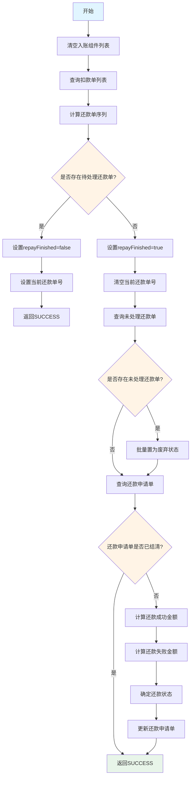
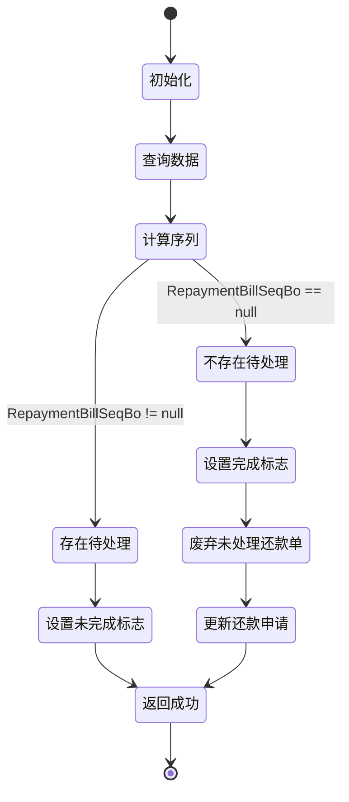

# PE170005 - 筛选还款单

## 节点信息

| 属性 | 值 |
|------|-----|
| **处理器代码** | PE170005 |
| **节点名称** | 筛选还款单 |
| **节点类型** | PROCESS |
| **所属流程** | [[账期制V400还款异步流程]] |
| **执行阶段** | 主流程筛选阶段 |
| **实现类** | RepayApplyBizFlowPE170005ServiceImpl |
| **优先级** | P0（核心节点） |

## 功能说明

筛选待处理的还款单,判断还款子流程是否完成,为后续流程分支决策提供依据。

### 核心职责
1. **清空入账组件列表**: 重置入账相关数据
2. **查询扣款单**: 根据还款申请号获取所有扣款单
3. **计算还款单序列**: 根据还款单和扣款单计算待处理的还款单
4. **设置完成标志**: 判断是否还有待处理的还款单
5. **废弃未处理还款单**: 如果已完成,将未处理的还款单置为废弃
6. **更新还款申请状态**: 更新还款申请单的最终状态和金额

### 适用场景

- **首次进入异步流程**: 需要执行子流程处理扣款和入账
- **子流程完成后**: 所有还款单已处理完成,进入后置流程
- **部分还款**: 部分还款单已处理,还有待处理的还款单

## 输入参数

| 参数名 | 参数代码 | 类型 | 来源 | 说明 |
|--------|----------|------|------|------|
| 还款申请对象 | repayApplyBo | RepayApplyBo | 流程变量 | 包含所有还款信息 |
| 还款申请号 | repayApplyNo | String | RepayApplyBo | 还款申请唯一标识 |
| 还款单列表 | repaymentBillHandleForDcpList | List | RepayApplyBo | 账期制还款单处理列表 |

## 输出参数

| 参数名 | 参数代码 | 类型 | 说明 |
|--------|----------|------|------|
| 还款子流程完成标志 | repayFinished | Boolean | 存入流程变量,标识是否完成 |
| 当前还款单号 | currentRepaymentBillNo | String | 当前处理的还款单号 |

## 处理流程



## 核心业务逻辑

### 1. 清空入账组件列表

**操作**:
```
repayApplyBo.setInComeComponentList(null)
```

**目的**:
- 重置入账相关数据
- 避免历史数据干扰

### 2. 查询扣款单

**查询方法**:
```
deductBillService.getByRepayApplyNo(repayApplyNo)
```

**返回结果**: `List<DeductBill>` - 该还款申请号下的所有扣款单

**扣款单信息**:
- 扣款单号
- 扣款金额
- 扣款状态
- 实际扣款金额
- 还款单号

### 3. 计算还款单序列

**计算方法**:
```
RepaymentBillSelector.calcRepaymentBillSeqBo(
    repaymentBillHandleForDcpList,
    deductBillList
)
```

**计算逻辑**:
1. 遍历还款单列表
2. 根据扣款单状态判断还款单是否已处理
3. 筛选出待处理的还款单
4. 返回第一个待处理的还款单序列

**返回结果**: `RepaymentBillSeqBo` 或 `null`
- 非 null: 存在待处理的还款单
- null: 所有还款单已处理完成

### 4. 设置完成标志

#### 4.1 存在待处理还款单

**操作**:
```
processContext.getFacts().put(REPAY_FINISHED, false)
repayApplyBo.setCurrentRepaymentBillNo(repaymentBillSeqBo.getRepaymentBillNo())
```

**业务含义**:
- `repayFinished = false`: 还款未完成
- 设置当前还款单号,子流程会使用该值

**后续流程**: 进入子流程执行扣款和入账

#### 4.2 所有还款单已处理完成

**操作**:
```
processContext.getFacts().put(REPAY_FINISHED, true)
repayApplyBo.setCurrentRepaymentBillNo(null)
```

**业务含义**:
- `repayFinished = true`: 还款已完成
- 清空当前还款单号

**后续流程**: 跳过子流程,直接进入后置处理

### 5. 废弃未处理还款单

**查询条件**:
- 还款申请号: `repayApplyNo`
- 查询未删除的还款单

**筛选逻辑**:
```
repaymentBillList.stream()
    .filter(item -> item.getRepayStatus().isInit())
    .collect(Collectors.toList())
```

**废弃操作**:
```
repaymentBillService.updateStatus(
    repaymentBillNo,
    RepayStatus.INIT_ABORT,
    "废弃原因",
    "repayengine"
)
```

**废弃原因**:
- 还款流程已结束
- 这些还款单未被处理(可能是提前结清导致的剩余还款单)

### 6. 更新还款申请状态

**查询还款申请单**:
```
repayApplyService.getByRepayApplyNo(repayApplyNo, false)
```

**判断条件**: `!repayApply.getRepayStatus().isFinished()`
- 已结清 → 跳过更新
- 未结清 → 继续更新

**计算还款金额**:
```
Integer repaySuccessAmt = deductBillList.stream()
    .mapToInt(DeductBill::getRealDeductAmount)
    .sum()

Integer repayFailureAmt = Math.max(
    repayApply.getRepayAmount() - repaySuccessAmt,
    0
)
```

**确定还款状态**:
| 条件 | 还款状态 | 说明 |
|------|----------|------|
| repaySuccessAmt == 0 | FAILURE | 全部失败 |
| repayFailureAmt == 0 | SUCCESS | 全部成功 |
| 其他 | PART_SUCCESS | 部分成功 |

**更新操作**:
```
repayApplyService.updateRepayApplyAmountAndStatus(
    repayApplyNo,
    repayApply.getRepayAmount(),
    repaySuccessAmt,
    repayStatus
)
```

## 状态流转



## 关键决策点

### 决策1: 是否存在待处理还款单

**判断依据**: `RepaymentBillSeqBo != null`

**分支逻辑**:
- **存在**: 设置 `repayFinished = false` → 进入子流程
- **不存在**: 设置 `repayFinished = true` → 跳过子流程

### 决策2: 还款申请单是否已结清

**判断依据**: `repayApply.getRepayStatus().isFinished()`

**分支逻辑**:
- **已结清**: 跳过更新,避免重复更新
- **未结清**: 更新还款申请单状态和金额

## 上游节点

- **触发节点**: 系统触发 (SYSTEM_TRIGGER)

## 下游节点

- **条件网关**: 判断 `repayFinished` 状态
  - `false` → [[账期制V400还款异步子流程]]
  - `true` → [[PE170050-更新全局入账明细]]

## 异常处理

| 异常场景 | 错误类型 | 处理方式 | 影响 |
|----------|----------|----------|------|
| 扣款单查询失败 | RuntimeException | 抛出异常 | 流程中断 |
| 还款单序列计算失败 | NullPointerException | 抛出异常 | 流程中断 |
| 废弃还款单失败 | RuntimeException | 记录错误,继续执行 | 不影响流程 |
| 更新还款申请失败 | RuntimeException | 抛出异常 | 流程中断 |

## 依赖服务

| 服务名 | 方法 | 用途 |
|--------|------|------|
| IDeductBillService | getByRepayApplyNo | 查询扣款单列表 |
| IRepaymentBillService | getByRepayApplyNo | 查询还款单列表 |
| IRepaymentBillService | updateStatus | 更新还款单状态 |
| IRepayApplyService | getByRepayApplyNo | 查询还款申请单 |
| IRepayApplyService | updateRepayApplyAmountAndStatus | 更新还款申请单 |

## 工具类

| 工具类 | 方法 | 用途 |
|--------|------|------|
| RepaymentBillSelector | calcRepaymentBillSeqBo | 计算待处理的还款单序列 |

## 数据模型

### DeductBill (扣款单)

| 字段 | 类型 | 说明 |
|------|------|------|
| deductBillNo | String | 扣款单号 |
| repayApplyNo | String | 还款申请号 |
| repaymentBillNo | String | 还款单号 |
| deductAmount | Integer | 扣款金额(分) |
| realDeductAmount | Integer | 实际扣款金额(分) |
| deductStatus | DeductStatus | 扣款状态 |

### RepaymentBill (还款单)

| 字段 | 类型 | 说明 |
|------|------|------|
| repaymentBillNo | String | 还款单号 |
| repayApplyNo | String | 还款申请号 |
| repayStatus | RepayStatus | 还款状态 |
| repayAmount | Integer | 还款金额(分) |

### RepayApply (还款申请单)

| 字段 | 类型 | 说明 |
|------|------|------|
| repayApplyNo | String | 还款申请号 |
| repayAmount | Integer | 还款金额(分) |
| repayStatus | RepayStatus | 还款状态 |

## 监控指标

- **还款单筛选成功率**: 成功筛选数 / 总请求数
- **待处理还款单比例**: 存在待处理还款单数 / 总请求数
- **还款单废弃率**: 废弃还款单数 / 总还款单数
- **还款申请状态更新成功率**: 成功更新数 / 需更新数

## 性能优化

### 1. 批量查询
- 一次性查询所有扣款单和还款单
- 减少数据库查询次数

### 2. 流式处理
- 使用 Stream API 筛选和处理数据
- 提高代码可读性和性能

### 3. 条件更新
- 仅在未结清时更新还款申请单
- 避免重复更新

## 实现位置

```bash
repayengine-service/src/main/java/cn/caijiajia/repayengine/service/
├── repay/process/dcp/
│   └── RepayApplyBizFlowPE170005ServiceImpl.java  # 节点处理器 (107行)
├── bill/
│   ├── IDeductBillService.java                     # 扣款单服务接口
│   └── IRepaymentBillService.java                  # 还款单服务接口
└── repayapply/
    └── IRepayApplyService.java                     # 还款申请服务接口
```

## 设计考虑

### 1. 为什么要清空入账组件列表?

**原因**:
- 入账组件列表在子流程中会重新计算
- 避免历史数据影响当前流程

### 2. 为什么要废弃未处理的还款单?

**原因**:
- 还款流程已结束,这些还款单不再需要处理
- 提前结清可能导致部分还款单未被处理
- 废弃状态可以标识这些还款单的最终状态

### 3. 为什么要判断还款申请单是否已结清?

**原因**:
- 避免重复更新
- 如果已结清,说明状态已经正确,无需再次更新

### 4. 为什么使用 RepaymentBillSelector 计算序列?

**原因**:
- 复用计算逻辑
- 统一筛选规则
- 便于维护和测试

## 相关文档

- [[账期制V400还款异步流程]] - 主流程设计
- [[PE170050-更新全局入账明细]] - 下游节点
- [[账期制V400还款异步子流程]] - 子流程设计
- [[还款单拆分规则]] - 还款单生成逻辑

## 标签

#节点 #筛选还款单 #流程控制 #PE170005
