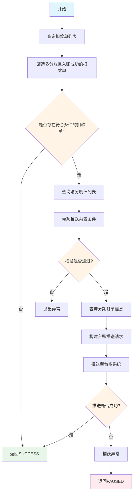
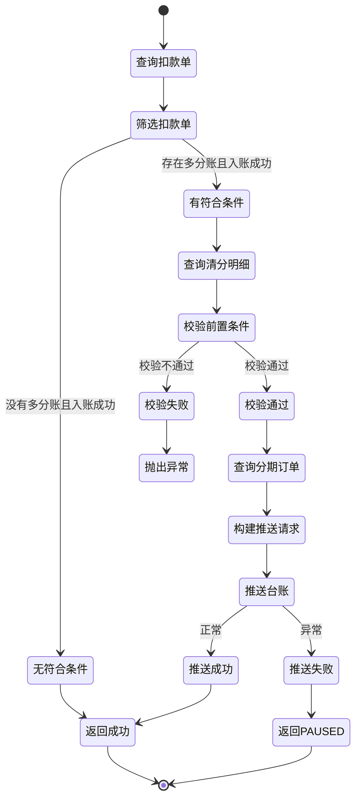

# PE170045 - 入账结果推送台账

## 节点信息

| 属性 | 值 |
|------|-----|
| **处理器代码** | PE170045 |
| **节点名称** | 入账结果推送台账 |
| **节点类型** | PROCESS |
| **所属流程** | [[账期制V400还款异步流程]] |
| **执行阶段** | 后置处理阶段 |
| **实现类** | RepayApplyBizFlowPE170045ServiceImpl |
| **优先级** | P1（重要节点） |

## 功能说明

将多分账且入账成功的扣款单结果推送至台账系统(StandingBook),用于财务对账和资金清分。

### 核心职责
1. **筛选多分账扣款单**: 过滤出多分账且入账成功的扣款单
2. **查询清分明细**: 获取清分试算结果
3. **校验推送条件**: 确保数据完整性
4. **查询分期订单**: 获取完整的订单信息
5. **构建推送请求**: 组装台账系统需要的请求参数
6. **推送至台账**: 调用台账系统接口

### 适用场景

- **多分账还款**: 涉及多个资金方的还款
- **资金清分**: 需要将还款金额分配给多个资方
- **财务对账**: 台账系统记录还款明细用于对账

## 输入参数

| 参数名 | 参数代码 | 类型 | 来源 | 说明 |
|--------|----------|------|------|------|
| 还款申请对象 | repayApplyBo | RepayApplyBo | 流程变量 | 包含所有还款信息 |
| 还款申请号 | repayApplyNo | String | RepayApplyBo | 还款申请唯一标识 |

## 输出参数

| 参数名 | 参数代码 | 类型 | 说明 |
|--------|----------|------|------|
| 无 | - | - | 推送操作,无特定输出 |

## 处理流程



## 核心业务逻辑

### 1. 查询扣款单列表

**查询方法**:
```java
List<DeductBill> deductBillList = deductBillService.getByRepayApplyNo(repayApplyNo);
```

### 2. 筛选多分账且入账成功的扣款单

**筛选条件**:
```java
deductBillList.stream()
    .filter(deductBill -> deductBill.getDeductStatus() == DeductStatus.RECORD_SUCCESS)
    .filter(deductBill -> BooleanUtils.isTrue(deductBill.fetchExtInfo().getMultiShare()))
    .collect(Collectors.toList());
```

**双重过滤**:
1. **扣款状态**: `DeductStatus.RECORD_SUCCESS` (入账成功)
2. **多分账标志**: `multiShare == true` (多分账)

**业务含义**:
- 单分账的扣款单不需要推送台账
- 入账失败的扣款单不推送
- 只推送多分账且入账成功的扣款单

### 3. 查询清分明细

**查询方法**:
```java
List<ClearingBill> clearingBillList = clearingService.selectByRepaymentBillList(
    deductBillList.stream()
        .map(DeductBill::getRepaymentBillNo)
        .distinct()
        .collect(Collectors.toList())
);
```

**查询内容**:
- 清分试算结果
- 资方分配金额
- 各项费用分配明细

### 4. 校验推送前置条件

**校验方法**: `checkPrePushToSb(repayApplyBo, clearingBillList)`

**校验内容**:
1. 清分明细是否存在
2. 还款申请信息是否完整
3. 金额是否匹配
4. 必要字段是否填充

**校验失败**: 抛出异常,流程暂停

### 5. 查询分期订单信息

**查询方法**:
```java
List<StageOrderWrapper> stageOrderWrapperList = loanCoreQueryService.listStageOrderWrapper(
    uid,
    stageOrderNoList,
    null,
    ContractQueryRangeEnum.BNP.getRange(),
    null,
    null,
    null
);
```

**查询内容**:
- 分期订单详情
- 还款计划信息
- 合同信息

### 6. 构建台账推送请求

**请求对象**: `BankSplitProfitsReq`

**构建逻辑**:
```java
BankSplitProfitsReq bankSplitProfitsReq = new BankSplitProfitsReq();
bankSplitProfitsReq.setOrderInfoList(orderInfoReqList);
bankSplitProfitsReq.setSplitAmountList(splitAmountReqList);
bankSplitProfitsReq.setStageList(stageReqList);
```

**请求内容**:
1. **OrderInfoReq**: 订单信息
   - 订单号
   - 订单金额
   - 订单状态

2. **SplitAmountReq**: 分账金额信息
   - 资方编号
   - 分账金额
   - 分账比例

3. **StageReq**: 分期信息
   - 期数
   - 每期金额
   - 还款状态

### 7. 推送至台账系统

**推送方法**:
```java
standingBookClient.bankSplitProfits(bankSplitProfitsReq);
```

**推送结果**:
- 成功: 返回 SUCCESS,流程继续
- 失败: 抛出异常,流程暂停

## 状态流转



## 上游节点

- [[PE170060-恢复额度]] - 额度已恢复

## 下游节点

- [[PE170069-结清返现记录]] - 结清返现

## 异常处理

| 异常场景 | 错误类型 | 处理方式 | 影响 |
|----------|----------|----------|------|
| 清分明细不存在 | RuntimeException | 抛出异常 | 流程暂停 |
| 校验失败 | RuntimeException | 抛出异常 | 流程暂停 |
| 台账推送失败 | Exception | 返回PAUSED | 流程暂停,触发重试 |
| 没有符合条件扣款单 | - | 直接返回SUCCESS | 正常流程,不影响 |

## 依赖服务

| 服务名 | 方法 | 用途 |
|--------|------|------|
| IDeductBillService | getByRepayApplyNo | 查询扣款单列表 |
| IClearingService | selectByRepaymentBillList | 查询清分明细 |
| LoanCoreQueryService | listStageOrderWrapper | 查询分期订单 |
| StandingBookClient | bankSplitProfits | 推送台账 |

## 监控指标

- **台账推送成功率**: 成功推送数 / 总请求数
- **多分账扣款单比例**: 多分账扣款单数 / 总扣款单数
- **台账推送耗时**: P50/P95/P99
- **清分明细查询耗时**: P50/P95/P99

## 性能优化

### 1. 条件筛选
- 只处理多分账且入账成功的扣款单
- 减少不必要的推送

### 2. 批量查询
- 批量查询清分明细
- 批量查询分期订单
- 减少服务调用次数

### 3. 数据校验
- 推送前校验数据完整性
- 避免推送失败后的重试

## 实现位置

```bash
repayengine-service/src/main/java/cn/caijiajia/repayengine/service/
├── repay/process/dcp/
│   └── RepayApplyBizFlowPE170045ServiceImpl.java  # 节点处理器 (100+行)
├── bill/
│   └── IDeductBillService.java                     # 扣款单服务接口
├── clearing/
│   └── IClearingService.java                       # 清分服务接口
└── loan/
    └── LoanCoreQueryService.java                   # 核心查询服务
```

## 设计考虑

### 1. 为什么要筛选多分账扣款单?

**原因**:
- 单分账的扣款单不涉及资金清分
- 台账系统只处理多分账场景
- 减少不必要的推送

### 2. 为什么要校验前置条件?

**原因**:
- 确保数据完整性
- 避免推送失败后的重试
- 提前发现问题

### 3. 为什么需要查询分期订单?

**原因**:
- 台账系统需要完整的订单信息
- 用于财务对账和资金清分
- 提供订单维度的还款记录

### 4. 为什么推送失败返回 PAUSED?

**原因**:
- 台账推送是重要操作
- 失败需要重试或人工介入
- 保证数据最终一致性

## 相关文档

- [[账期制V400还款异步流程]] - 主流程设计
- [[PE170060-恢复额度]] - 上游节点
- [[PE170069-结清返现记录]] - 下游节点
- [[台账系统接口文档]] - 台账系统API

## 标签

#节点 #台账推送 #多分账 #PE170045