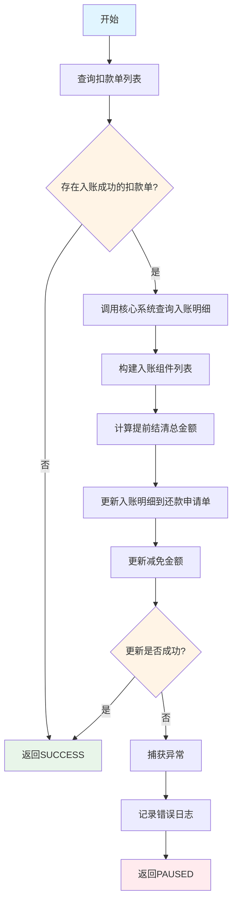
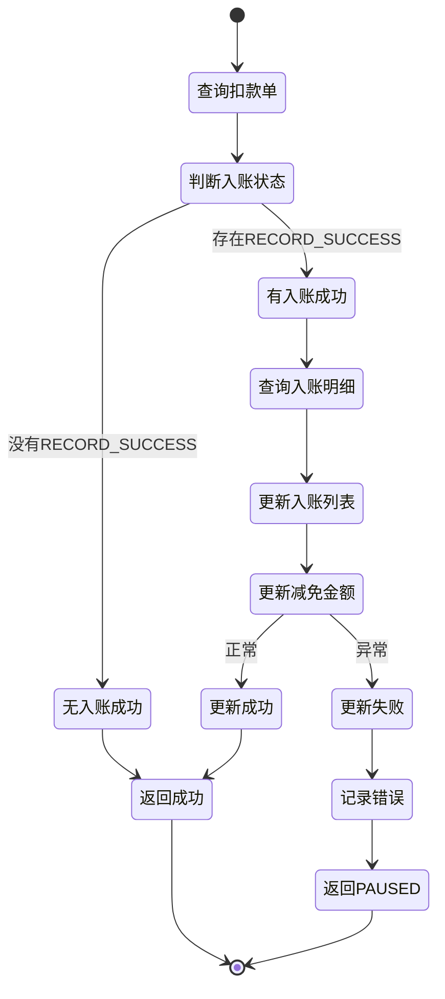

# PE170050 - 更新全局入账明细

## 节点信息

| 属性 | 值 |
|------|-----|
| **处理器代码** | PE170050 |
| **节点名称** | 更新全局入账明细 |
| **节点类型** | PROCESS |
| **所属流程** | [[账期制V400还款异步流程]] |
| **执行阶段** | 后置处理阶段 |
| **实现类** | RepayApplyBizFlowPE170050ServiceImpl |
| **优先级** | P0（核心节点） |

## 功能说明

汇总所有扣款单的入账明细,更新到还款申请单的全局入账明细字段,为后续对账和查询提供完整数据。

### 核心职责
1. **查询扣款单列表**: 获取所有扣款单
2. **筛选入账成功**: 过滤出入账成功的扣款单
3. **查询入账明细**: 调用核心系统查询详细的入账明细
4. **汇总计算**: 计算提前结清总金额
5. **更新入账明细**: 更新到还款申请单
6. **更新减免金额**: 记录减免金额

### 适用场景

- **子流程完成后**: 所有扣款和入账已完成
- **跳过子流程后**: 同步流程已完成入账,需要更新明细
- **部分还款**: 部分扣款成功,需要更新已入账的明细

## 输入参数

| 参数名 | 参数代码 | 类型 | 来源 | 说明 |
|--------|----------|------|------|------|
| 还款申请对象 | repayApplyBo | RepayApplyBo | 流程变量 | 包含所有还款信息 |
| 还款申请号 | repayApplyNo | String | RepayApplyBo | 还款申请唯一标识 |

## 输出参数

| 参数名 | 参数代码 | 类型 | 说明 |
|--------|----------|------|------|
| 入账明细列表 | inComeComponentList | List | 更新到 RepayApplyBo |
| 提前结清总金额 | earlySettleAmtTotal | AtomicInteger | 更新到还款申请单扩展信息 |
| 减免金额 | deductedAmount | Integer | 更新到还款申请单扩展信息 |

## 处理流程



## 核心业务逻辑

### 1. 查询扣款单列表

**查询方法**:
```java
List<DeductBill> deductBillList = deductBillService.getByRepayApplyNo(repayApplyNo);
```

**返回结果**: 该还款申请号下的所有扣款单

### 2. 筛选入账成功的扣款单

**筛选条件**:
```java
deductBillList.stream()
    .noneMatch(item -> DeductStatus.RECORD_SUCCESS == item.getDeductStatus())
```

**判断逻辑**:
- 如果没有任何入账成功的扣款单 → 直接返回成功
- 如果存在入账成功的扣款单 → 继续处理

**状态说明**:
- `DeductStatus.RECORD_SUCCESS`: 扣款入账成功
- 只有入账成功的扣款单才有入账明细

### 3. 查询入账明细

**查询方法**:
```java
AtomicInteger earlySettleAmtTotal = new AtomicInteger(0);
List<StagePlanRepayComponent> stagePlanRepayComponentList =
    loanCoreQueryService.queryIncomeDetailsByRepayApplyNo(
        repayApplyNo,
        earlySettleAmtTotal
    );
```

**查询内容**:
- 每期还款的入账明细(本金、利息、罚息、费用等)
- 提前结清总金额(通过 AtomicInteger 返回)

**返回结果**: `List<StagePlanRepayComponent>`
- 每个元素代表一期的入账明细
- 包含该期的各项费用入账金额

### 4. 更新入账明细

**更新操作**:
```java
repayContext.getBo().setInComeComponentList(stagePlanRepayComponentList);
```

**字段说明**:
- `inComeComponentList`: 入账组件列表
- 存储在 RepayApplyBo 对象中
- 后续节点可以访问这些明细数据

### 5. 更新提前结清金额

**更新方法**:
```java
repayApplyService.addExtInfoForAmount(
    repayContext.getBo().getRepayApplyNo(),
    Constant.REPAY_DEDUCTED_AMOUNT,
    earlySettleAmtTotal.get()
);
```

**参数说明**:
- `repayApplyNo`: 还款申请号
- `REPAY_DEDUCTED_AMOUNT`: 扩展字段键(减免金额)
- `earlySettleAmtTotal.get()`: 提前结清总金额

**扩展信息存储**:
- 存储在还款申请单的扩展字段中
- 用于后续对账和统计

## 状态流转



## 关键数据结构

### StagePlanRepayComponent (入账组件)

| 字段 | 类型 | 说明 |
|------|------|------|
| stageOrderNo | String | 分期订单号 |
| stagePlanNo | String | 分期计划号 |
| period | Integer | 期数 |
| principalAmt | Integer | 入账本金(分) |
| interestAmt | Integer | 入账利息(分) |
| penaltyAmt | Integer | 入账罚息(分) |
| feeAmt | Integer | 入账费用(分) |
| repayTime | Date | 入账时间 |

### DeductBill (扣款单)

| 字段 | 类型 | 说明 |
|------|------|------|
| deductBillNo | String | 扣款单号 |
| repayApplyNo | String | 还款申请号 |
| deductStatus | DeductStatus | 扣款状态 |
| realDeductAmount | Integer | 实际扣款金额(分) |

## 上游节点

- [[PE170005-筛选还款单]] - 提供还款申请号
- [[账期制V400还款异步子流程]] - 子流程完成入账

## 下游节点

- [[PE170060-恢复额度]] - 使用入账明细恢复额度

## 异常处理

| 异常场景 | 错误类型 | 处理方式 | 影响 |
|----------|----------|----------|------|
| 查询入账明细失败 | Exception | 记录错误日志,返回PAUSED | 流程暂停,触发重试 |
| 更新扩展信息失败 | Exception | 记录错误日志,返回PAUSED | 流程暂停,触发重试 |
| 没有入账成功的扣款单 | - | 直接返回SUCCESS | 正常流程,不影响 |

## 依赖服务

| 服务名 | 方法 | 用途 |
|--------|------|------|
| IDeductBillService | getByRepayApplyNo | 查询扣款单列表 |
| LoanCoreQueryService | queryIncomeDetailsByRepayApplyNo | 查询入账明细 |
| IRepayApplyService | addExtInfoForAmount | 更新还款申请单扩展信息 |

## 监控指标

- **入账明细查询成功率**: 成功查询数 / 总请求数
- **入账成功扣款单比例**: 有入账成功扣款单数 / 总请求数
- **平均入账明细数量**: 总入账明细数 / 总请求数
- **提前结清金额统计**: 总提前结清金额 / 总还款次数

## 性能优化

### 1. 条件判断
- 如果没有入账成功的扣款单,直接返回
- 避免不必要的查询

### 2. 批量查询
- 一次性查询所有扣款单
- 减少数据库查询次数

### 3. 原子操作
- 使用 AtomicInteger 统计提前结清金额
- 避免并发问题

## 实现位置

```bash
repayengine-service/src/main/java/cn/caijiajia/repayengine/service/
├── repay/process/dcp/
│   └── RepayApplyBizFlowPE170050ServiceImpl.java  # 节点处理器 (82行)
├── bill/
│   └── IDeductBillService.java                     # 扣款单服务接口
├── loan/
│   └── LoanCoreQueryService.java                   # 核心查询服务
└── repayapply/
    └── IRepayApplyService.java                     # 还款申请服务接口
```

## 设计考虑

### 1. 为什么要筛选入账成功的扣款单?

**原因**:
- 只有入账成功的扣款单才有入账明细
- 避免查询和处理无用的数据

### 2. 为什么要更新到 RepayApplyBo?

**原因**:
- 后续节点需要使用入账明细
- 统一存储在流程上下文中,便于访问

### 3. 为什么使用 AtomicInteger 统计提前结清金额?

**原因**:
- 核心系统通过回调方式累加金额
- 原子操作保证线程安全

### 4. 为什么要更新减免金额?

**原因**:
- 记录提前结清的总金额
- 用于对账和统计
- 便于后续查询和分析

## 相关文档

- [[账期制V400还款异步流程]] - 主流程设计
- [[PE170005-筛选还款单]] - 上游节点
- [[PE170060-恢复额度]] - 下游节点
- [[扣款入账流程]] - 入账逻辑说明

## 标签

#节点 #入账明细 #数据汇总 #PE170050