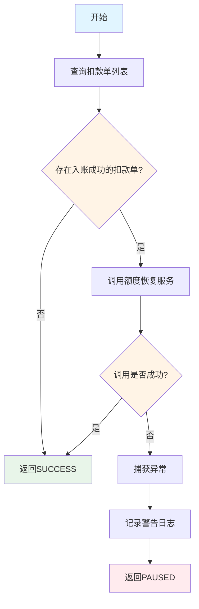
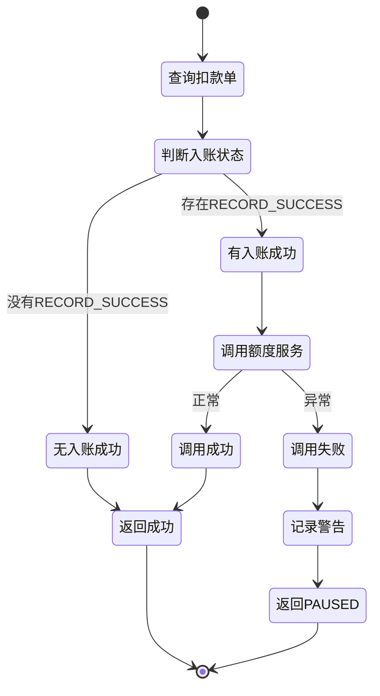

# PE170060 - 恢复额度

## 节点信息

| 属性 | 值 |
|------|-----|
| **处理器代码** | PE170060 |
| **节点名称** | 恢复额度 |
| **节点类型** | PROCESS |
| **所属流程** | [[账期制V400还款异步流程]] |
| **执行阶段** | 后置处理阶段 |
| **实现类** | RepayApplyBizFlowPE170060ServiceImpl |
| **优先级** | P0（核心节点） |

## 功能说明

根据入账成功的扣款单,调用额度服务恢复用户的可用额度,使用户可以继续使用授信额度。

### 核心职责
1. **查询扣款单列表**: 获取所有扣款单
2. **筛选入账成功**: 过滤出入账成功的扣款单
3. **调用额度服务**: 执行额度恢复逻辑
4. **异常处理**: 捕获异常并返回PAUSED状态

### 适用场景

- **正常还款**: 还款成功后恢复相应额度
- **提前结清**: 结清后恢复全部额度
- **部分还款**: 部分还款后恢复对应额度

## 输入参数

| 参数名 | 参数代码 | 类型 | 来源 | 说明 |
|--------|----------|------|------|------|
| 还款申请对象 | repayApplyBo | RepayApplyBo | 流程变量 | 包含所有还款信息 |
| 还款申请号 | repayApplyNo | String | RepayApplyBo | 还款申请唯一标识 |
| 用户ID | uid | String | 流程上下文 | 用户唯一标识 |
| 入账组件列表 | inComeComponentList | List | RepayApplyBo | 入账明细列表 |

## 输出参数

| 参数名 | 参数代码 | 类型 | 说明 |
|--------|----------|------|------|
| 无 | - | - | 恢复额度操作,无特定输出 |

## 处理流程



## 核心业务逻辑

### 1. 查询扣款单列表

**查询方法**:
```java
List<DeductBill> deductBillList = deductBillService.getByRepayApplyNo(repayApplyNo);
```

**返回结果**: 该还款申请号下的所有扣款单

### 2. 筛选入账成功的扣款单

**筛选条件**:
```java
deductBillList.stream()
    .noneMatch(item -> DeductStatus.RECORD_SUCCESS == item.getDeductStatus())
```

**判断逻辑**:
- 如果没有任何入账成功的扣款单 → 直接返回成功
- 如果存在入账成功的扣款单 → 继续处理

**业务含义**:
- 没有入账成功 = 没有实际还款 → 无需恢复额度
- 有入账成功 = 有实际还款 → 需要恢复额度

### 3. 调用额度恢复服务

**调用方法**:
```java
nHeavyAssetAdjustmentService.handleEnjoyAdjust(
    repayContext.getBo().getRepayApplyNo(),
    repayContext.getUid(),
    repayContext.getBo().getInComeComponentList()
);
```

**参数说明**:
- `repayApplyNo`: 还款申请号(用于关联操作)
- `uid`: 用户ID(标识用户)
- `inComeComponentList`: 入账组件列表(包含每期入账明细)

**额度恢复逻辑**:
1. 解析入账组件列表
2. 计算每期应恢复的额度
3. 调用账户系统恢复额度
4. 记录额度变更日志

**额度计算**:
- 正常还款: 恢复当期本金对应的额度
- 提前结清: 恢复所有未还本金对应的额度
- 部分还款: 恢复实际入账本金对应的额度

### 4. 异常处理

**捕获异常**:
```java
try {
    nHeavyAssetAdjustmentService.handleEnjoyAdjust(...);
} catch (Exception e) {
    RE_LOG.warn(e, LogPayLoad.of("PE170060还享花额度恢复发生异常", repayApplyNo));
    return createPausedProcessResult(e.getMessage());
}
```

**处理策略**:
- 捕获所有异常,不区分异常类型
- 记录警告日志
- 返回 PAUSED 状态
- 触发流程重试

**重试机制**:
- 重试次数: 5次
- 重试间隔: 30秒
- 重试类型: normal

## 状态流转



## 上游节点

- [[PE170050-更新全局入账明细]] - 提供入账组件列表

## 下游节点

- [[PE170045-入账结果推送台账]] - 推送台账

## 异常处理

| 异常场景 | 错误类型 | 处理方式 | 影响 |
|----------|----------|----------|------|
| 额度服务调用失败 | Exception | 记录警告日志,返回PAUSED | 流程暂停,触发重试 |
| 额度计算异常 | Exception | 记录警告日志,返回PAUSED | 流程暂停,触发重试 |
| 没有入账成功的扣款单 | - | 直接返回SUCCESS | 正常流程,不影响 |

## 依赖服务

| 服务名 | 方法 | 用途 |
|--------|------|------|
| IDeductBillService | getByRepayApplyNo | 查询扣款单列表 |
| NHeavyAssetAdjustmentService | handleEnjoyAdjust | 恢复额度 |

## 监控指标

- **额度恢复成功率**: 成功恢复数 / 总请求数
- **额度恢复失败率**: 失败数 / 总请求数
- **平均额度恢复金额**: 总恢复金额 / 总恢复次数
- **额度恢复耗时**: P50/P95/P99

## 性能优化

### 1. 条件判断
- 如果没有入账成功的扣款单,直接返回
- 避免不必要的额度服务调用

### 2. 批量处理
- 一次性恢复所有期数的额度
- 减少服务调用次数

### 3. 异常隔离
- 额度恢复失败不影响其他流程
- 通过重试机制保证最终成功

## 实现位置

```bash
repayengine-service/src/main/java/cn/caijiajia/repayengine/service/
├── repay/process/dcp/
│   └── RepayApplyBizFlowPE170060ServiceImpl.java  # 节点处理器 (64行)
├── bill/
│   └── IDeductBillService.java                     # 扣款单服务接口
└── adjustment/
    └── NHeavyAssetAdjustmentService.java           # 额度恢复服务
```

## 设计考虑

### 1. 为什么要筛选入账成功的扣款单?

**原因**:
- 只有入账成功才应该恢复额度
- 避免额度错误恢复

### 2. 为什么捕获所有异常?

**原因**:
- 额度恢复是关键操作
- 任何异常都应该暂停流程并重试
- 不区分异常类型,统一处理

### 3. 为什么返回 PAUSED 状态?

**原因**:
- 额度恢复失败需要人工介入或重试
- PAUSED 状态会触发重试机制
- 保证额度最终恢复成功

### 4. 为什么需要入账组件列表?

**原因**:
- 额度恢复需要知道每期入账的本金
- 根据入账本金计算应恢复的额度
- 支持部分还款和提前结清场景

## 相关文档

- [[账期制V400还款异步流程]] - 主流程设计
- [[PE170050-更新全局入账明细]] - 上游节点
- [[PE170045-入账结果推送台账]] - 下游节点
- [[额度恢复逻辑]] - 额度服务详细设计

## 标签

#节点 #额度恢复 #账户操作 #PE170060