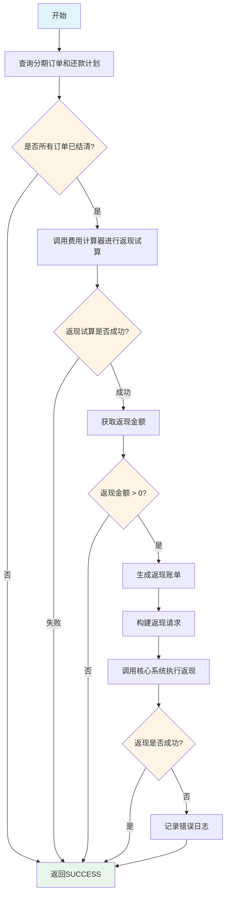
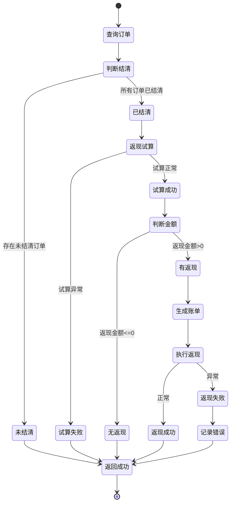

# PE170069 - 结清返现记录

## 节点信息

| 属性 | 值 |
|------|-----|
| **处理器代码** | PE170069 |
| **节点名称** | 结清返现记录 |
| **节点类型** | PROCESS |
| **所属流程** | [[账期制V400还款异步流程]] |
| **执行阶段** | 后置处理阶段 |
| **实现类** | RepayApplyBizFlowPE170069ServiceImpl |
| **优先级** | P2（业务节点） |

## 功能说明

判断用户是否结清所有欠款,如果结清则调用费用计算器进行返现试算,生成返现账单并执行返现操作。

### 核心职责
1. **查询分期订单**: 获取所有分期订单信息
2. **判断结清状态**: 检查是否所有订单都已结清
3. **返现试算**: 调用费用计算器计算返现金额
4. **生成返现账单**: 创建返现账单记录
5. **执行返现**: 调用核心系统执行返现

### 适用场景

- **提前结清**: 用户提前还清所有欠款
- **正常结清**: 最后一期还款后结清
- **返现活动**: 参与了结清返现活动

## 输入参数

| 参数名 | 参数代码 | 类型 | 来源 | 说明 |
|--------|----------|------|------|------|
| 还款申请对象 | repayApplyBo | RepayApplyBo | 流程变量 | 包含所有还款信息 |
| 用户ID | uid | String | 流程上下文 | 用户唯一标识 |

## 输出参数

| 参数名 | 参数代码 | 类型 | 说明 |
|--------|----------|------|------|
| 无 | - | - | 返现操作,无特定输出 |

## 处理流程



## 核心业务逻辑

### 1. 查询分期订单和还款计划

**查询内容**:
- 所有分期订单信息
- 每个订单的还款计划
- 订单状态和还款状态

### 2. 判断结清状态

**判断逻辑**:
```java
boolean isSettled = stageOrderWrapperList.stream()
    .allMatch(order -> order.getStageOrderStatus() == StageOrderStatus.SETTLED);
```

**判断条件**:
- 所有分期订单状态为 `SETTLED` (已结清)
- 任何一个订单未结清 → 不执行返现

### 3. 返现试算

**试算方法**: 调用费用计算器服务

**试算内容**:
- 计算返现金额
- 计算返现比例
- 计算返现条件

**试算参数**:
- 用户ID
- 订单列表
- 还款记录

**试算结果**: `RefundTrialRespV2`
- 返现金额
- 返现账单列表

### 4. 生成返现账单

**生成逻辑**:
```java
RefundBill refundBill = new RefundBill();
refundBill.setRefundBillNo(generateRefundBillNo());
refundBill.setUid(uid);
refundBill.setRefundAmount(refundAmount);
refundBill.setRefundStatus(RefundStatus.INIT);
refundBill.setCreateTime(LocalDateTime.now());
```

**账单字段**:
- 返现账单号
- 用户ID
- 返现金额
- 返现状态
- 创建时间

**保存操作**: `refundBillService.save(refundBill)`

### 5. 执行返现

**返现请求**: `RefundIncomeReq`

**构建逻辑**:
```java
RefundIncomeReq refundIncomeReq = new RefundIncomeReq();
refundIncomeReq.setUid(uid);
refundIncomeReq.setRefundBillNo(refundBill.getRefundBillNo());
refundIncomeReq.setRefundAmount(refundAmount);
refundIncomeReq.setAccountType(AccountTypeEnum.BALANCE);
```

**执行方法**:
```java
loanCoreRepayService.refundIncome(refundIncomeReq);
```

**返现方式**:
- 返现到用户余额账户
- 用户可用于下次还款或提现

## 状态流转



## 上游节点

- [[PE170045-入账结果推送台账]] - 台账已推送

## 下游节点

- [[PE170070-订单解锁]] - 订单解锁

## 异常处理

| 异常场景 | 错误类型 | 处理方式 | 影响 |
|----------|----------|----------|------|
| 返现试算失败 | Exception | 记录错误,返回SUCCESS | 不影响流程 |
| 返现执行失败 | Exception | 记录错误,返回SUCCESS | 不影响流程 |
| 未结清 | - | 直接返回SUCCESS | 正常流程 |
| 无返现金额 | - | 直接返回SUCCESS | 正常流程 |

**特殊说明**:
- 返现失败不影响还款流程
- 返现是营销活动,失败不阻塞主流程

## 依赖服务

| 服务名 | 方法 | 用途 |
|--------|------|------|
| LoanCoreQueryService | listStageOrderWrapper | 查询分期订单 |
| FeecalculatorClient | refundTrialV2 | 返现试算 |
| IRefundBillService | save | 保存返现账单 |
| LoanCoreRepayService | refundIncome | 执行返现 |

## 监控指标

- **结清率**: 结清用户数 / 总用户数
- **返现成功率**: 成功返现数 / 结清用户数
- **平均返现金额**: 总返现金额 / 返现次数
- **返现试算耗时**: P50/P95/P99

## 性能优化

### 1. 条件判断
- 未结清直接返回
- 无返现金额直接返回
- 避免不必要的操作

### 2. 异常隔离
- 返现失败不影响主流程
- 记录错误但不抛出异常

### 3. 异步处理
- 返现可以异步执行
- 不阻塞还款流程

## 实现位置

```bash
repayengine-service/src/main/java/cn/caijiajia/repayengine/service/
├── repay/process/dcp/
│   └── RepayApplyBizFlowPE170069ServiceImpl.java  # 节点处理器 (100+行)
├── bill/
│   └── IRefundBillService.java                     # 返现账单服务
├── loan/
│   ├── LoanCoreQueryService.java                   # 核心查询服务
│   └── LoanCoreRepayService.java                   # 核心还款服务
└── producer/
    └── RepayEngineProducer.java                    # 消息生产者
```

## 设计考虑

### 1. 为什么返现失败不影响主流程?

**原因**:
- 返现是营销活动
- 失败不应该影响还款成功
- 用户还款成功是最重要的

### 2. 为什么要判断所有订单已结清?

**原因**:
- 返现条件是结清所有欠款
- 部分还款不满足返现条件

### 3. 为什么要生成返现账单?

**原因**:
- 记录返现明细
- 用于对账和查询
- 便于后续处理

### 4. 为什么返现到余额账户?

**原因**:
- 余额账户通用性强
- 用户可以自由使用
- 便于提现或下次还款

## 相关文档

- [[账期制V400还款异步流程]] - 主流程设计
- [[PE170045-入账结果推送台账]] - 上游节点
- [[PE170070-订单解锁]] - 下游节点
- [[返现规则配置]] - 返现活动规则

## 标签

#节点 #返现 #营销活动 #PE170069