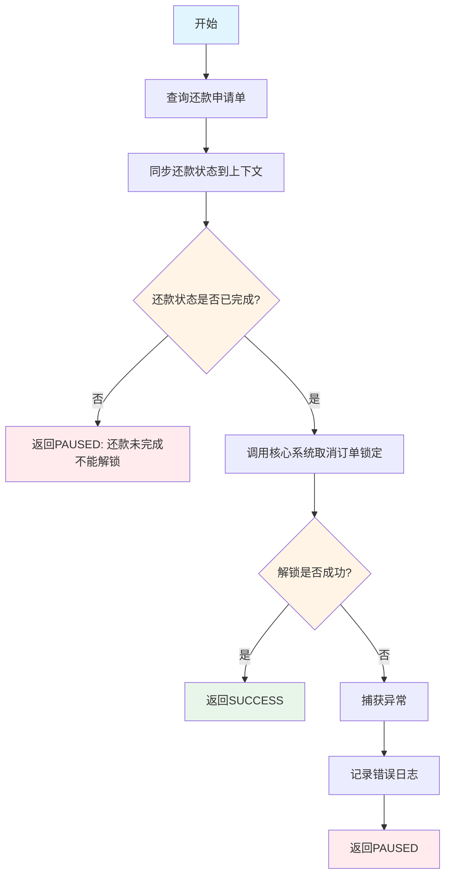
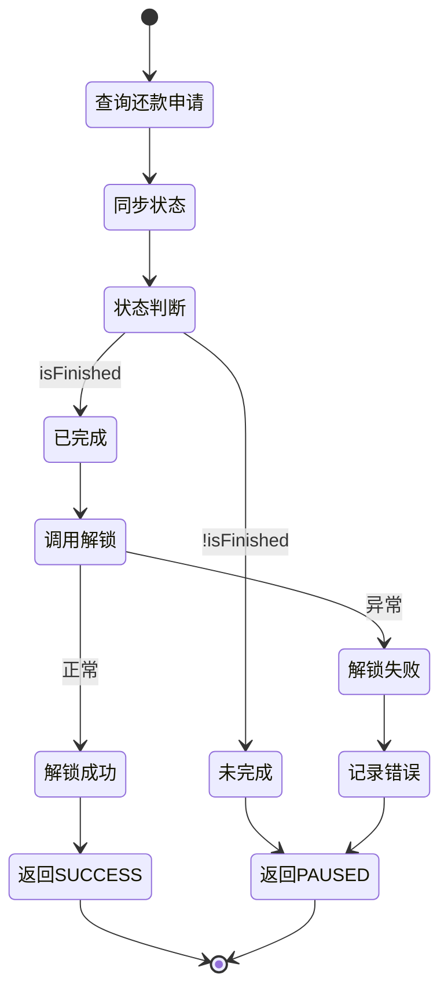

# PE170070 - 订单解锁

## 节点信息

| 属性 | 值 |
|------|-----|
| **处理器代码** | PE170070 |
| **节点名称** | 订单解锁 |
| **节点类型** | PROCESS |
| **所属流程** | [[账期制V400还款异步流程]] |
| **执行阶段** | 后置处理阶段 |
| **实现类** | RepayApplyBizFlowPE170070ServiceImpl |
| **优先级** | P0（核心节点） |

## 功能说明

释放订单锁定状态,允许用户进行下一次还款操作。只有还款状态为已完成时才执行解锁。

### 核心职责
1. **查询还款申请**: 获取最新的还款申请单状态
2. **同步还款状态**: 将状态同步到流程上下文
3. **校验还款状态**: 判断是否已完成
4. **取消订单锁定**: 调用核心系统解锁订单
5. **异常处理**: 捕获异常并返回相应状态

### 适用场景

- **还款成功**: 正常还款成功后解锁
- **部分成功**: 部分还款成功后解锁
- **还款失败**: 还款失败后解锁(允许重新还款)

## 输入参数

| 参数名 | 参数代码 | 类型 | 来源 | 说明 |
|--------|----------|------|------|------|
| 还款申请号 | repayApplyNo | String | RepayApplyBo | 还款申请唯一标识 |

## 输出参数

| 参数名 | 参数代码 | 类型 | 说明 |
|--------|----------|------|------|
| 还款状态 | repayStatus | RepayStatus | 更新到 RepayApplyBo |
| 还款金额 | repayAmount | Integer | 更新到 RepayApplyBo |
| 成功金额 | repaySuccessAmount | Integer | 更新到 RepayApplyBo |
| 失败金额 | repayFailureAmount | Integer | 更新到 RepayApplyBo |

## 处理流程



## 核心业务逻辑

### 1. 查询还款申请单

**查询方法**:
```java
RepayApply repayApply = repayApplyService.getByRepayApplyNo(repayApplyNo, false);
```

**查询参数**:
- `repayApplyNo`: 还款申请号
- `false`: 不查询删除记录

**返回结果**: `RepayApply` - 还款申请单对象

### 2. 同步还款状态

**同步字段**:
```java
repayContext.getBo().setRepayStatus(repayApply.getRepayStatus());
repayContext.getBo().setRepayAmount(repayApply.getRepayAmount());
repayContext.getBo().setRepaySuccessAmount(repayApply.getRepaySuccessAmount());
repayContext.getBo().setRepayFailureAmount(repayApply.getRepayFailureAmount());
```

**同步内容**:
- **repayStatus**: 还款状态
- **repayAmount**: 还款总金额
- **repaySuccessAmount**: 成功金额
- **repayFailureAmount**: 失败金额

**目的**:
- 更新流程上下文中的还款信息
- 供后续节点使用

### 3. 校验还款状态

**校验逻辑**:
```java
if (!repayContext.getBo().getRepayStatus().isFinished()) {
    return createPausedProcessResult("还款未完成不能解锁");
}
```

**判断条件**: `repayStatus.isFinished()`

**还款状态枚举**:
- `SUCCESS`: 全部成功 → isFinished = true
- `FAILURE`: 全部失败 → isFinished = true
- `PART_SUCCESS`: 部分成功 → isFinished = true
- `INIT`: 初始化 → isFinished = false
- `PROCESSING`: 处理中 → isFinished = false

**业务含义**:
- 只有完成状态才解锁
- 未完成状态返回 PAUSED

### 4. 取消订单锁定

**解锁方法**:
```java
String repayLockSerial = repayApply.getRepayApplyNo();
loanCoreRepayService.cancelRepayPlans(repayLockSerial);
```

**参数说明**:
- `repayLockSerial`: 还款锁定序列号 = 还款申请号

**解锁操作**:
1. 取消订单的还款锁定标记
2. 释放订单资源
3. 允许用户进行下一次还款

**锁定机制**:
- 还款开始时锁定订单
- 防止并发还款
- 还款结束后解锁

## 状态流转



## 上游节点

- [[PE170069-结清返现记录]] - 返现已处理

## 下游节点

- [[PE170090-优惠券消费]] - 消费优惠券

## 异常处理

| 异常场景 | 错误类型 | 处理方式 | 影响 |
|----------|----------|----------|------|
| 还款未完成 | - | 返回PAUSED | 流程暂停,等待完成 |
| 解锁服务调用失败 | Exception | 记录错误,返回PAUSED | 流程暂停,触发重试 |
| 还款申请查询失败 | Exception | 抛出异常 | 流程中断 |

## 依赖服务

| 服务名 | 方法 | 用途 |
|--------|------|------|
| IRepayApplyService | getByRepayApplyNo | 查询还款申请单 |
| LoanCoreRepayService | cancelRepayPlans | 取消订单锁定 |

## 监控指标

- **解锁成功率**: 成功解锁数 / 总解锁请求数
- **未完成解锁率**: 未完成状态数 / 总请求数
- **平均解锁耗时**: P50/P95/P99
- **解锁失败重试率**: 重试次数 / 总解锁次数

## 性能优化

### 1. 状态判断
- 只有完成状态才解锁
- 避免不必要的解锁操作

### 2. 异常处理
- 区分不同异常场景
- 返回不同的状态码

### 3. 重试机制
- 解锁失败自动重试
- 保证最终解锁成功

## 实现位置

```bash
repayengine-service/src/main/java/cn/caijiajia/repayengine/service/
├── repay/process/dcp/
│   └── RepayApplyBizFlowPE170070ServiceImpl.java  # 节点处理器 (80+行)
├── repayapply/
│   └── IRepayApplyService.java                     # 还款申请服务接口
└── loan/
    └── LoanCoreRepayService.java                   # 核心还款服务
```

## 设计考虑

### 1. 为什么要校验还款状态?

**原因**:
- 只有完成的还款才能解锁
- 避免解锁未完成的还款
- 保证数据一致性

### 2. 为什么要同步还款状态?

**原因**:
- 后续节点需要使用最新状态
- 流程上下文保持数据一致性

### 3. 为什么解锁失败返回 PAUSED?

**原因**:
- 解锁是关键操作
- 失败需要重试
- 保证最终解锁成功

### 4. 为什么使用还款申请号作为锁定序列号?

**原因**:
- 还款申请号唯一
- 便于追踪和查询
- 与锁定时的序列号对应

## 相关文档

- [[账期制V400还款异步流程]] - 主流程设计
- [[PE170069-结清返现记录]] - 上游节点
- [[PE170090-优惠券消费]] - 下游节点
- [[订单锁定机制]] - 锁定逻辑说明

## 标签

#节点 #订单解锁 #流程控制 #PE170070