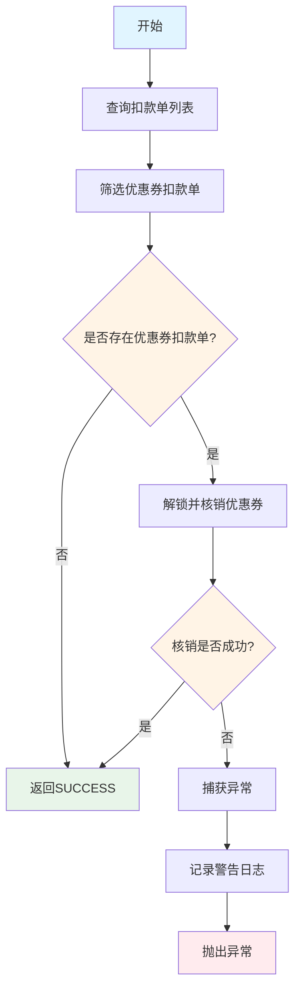
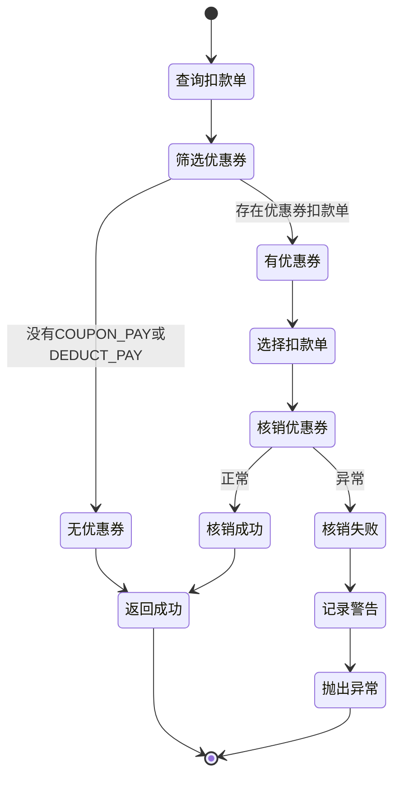

# PE170090 - 优惠券消费

## 节点信息

| 属性 | 值 |
|------|-----|
| **处理器代码** | PE170090 |
| **节点名称** | 优惠券消费 |
| **节点类型** | PROCESS |
| **所属流程** | [[账期制V400还款异步流程]] |
| **执行阶段** | 后置处理阶段 |
| **实现类** | RepayApplyBizFlowPE170090ServiceImpl |
| **优先级** | P2（业务节点） |

## 功能说明

标记还款过程中使用的优惠券为已消费状态,防止优惠券重复使用。

### 核心职责
1. **查询扣款单列表**: 获取所有扣款单
2. **筛选优惠券扣款单**: 过滤出使用优惠券的扣款单
3. **解锁并核销优惠券**: 调用优惠券服务标记已使用
4. **异常处理**: 捕获异常并记录日志

### 适用场景

- **使用优惠券还款**: 还款时使用了优惠券抵扣
- **券码支付**: 使用券码进行部分或全部支付
- **抵扣券**: 使用利息抵扣券、费用抵扣券等

## 输入参数

| 参数名 | 参数代码 | 类型 | 来源 | 说明 |
|--------|----------|------|------|------|
| 还款申请号 | repayApplyNo | String | RepayApplyBo | 还款申请唯一标识 |

## 输出参数

| 参数名 | 参数代码 | 类型 | 说明 |
|--------|----------|------|------|
| 无 | - | - | 优惠券标记操作,无特定输出 |

## 处理流程



## 核心业务逻辑

### 1. 查询扣款单列表

**查询方法**:
```java
List<DeductBill> deductBillList = deductBillService.getByRepayApplyNo(repayApplyNo);
```

**返回结果**: 该还款申请号下的所有扣款单

### 2. 筛选优惠券扣款单

**筛选条件**:
```java
deductBillList.stream()
    .filter(deductBill -> PayType.COUPON_PAY.equals(deductBill.getPayType())
        || PayType.DEDUCT_PAY.equals(deductBill.getPayType()))
    .collect(Collectors.toList());
```

**支付类型**:
- `PayType.COUPON_PAY`: 优惠券支付
- `PayType.DEDUCT_PAY`: 抵扣支付

**业务含义**:
- 只处理使用优惠券的扣款单
- 其他支付方式的扣款单不处理

**判断逻辑**:
- 如果没有优惠券扣款单 → 直接返回成功
- 如果有优惠券扣款单 → 继续处理

### 3. 解锁并核销优惠券

**处理方法**: `unLockAndWriteOffCoupon(deductBillList)`

**选择策略**:
```java
DeductBill deductBill = deductBillList.stream()
    .filter(deductBillItem -> deductBillItem.getDeductStatus() == DeductStatus.RECORD_SUCCESS)
    .findAny()
    .orElse(deductBillList.get(0));
```

**选择逻辑**:
1. 优先选择入账成功的扣款单
2. 如果没有入账成功的,选择第一个扣款单

**核销操作**: `doUnLockAndWriteOffCoupon(deductBill)`

**核销内容**:
- 解锁优惠券(取消锁定状态)
- 标记优惠券为已使用
- 记录使用时间
- 关联还款申请号

**异常捕获**:
```java
try {
    doUnLockAndWriteOffCoupon(deductBill);
} catch (Exception e) {
    RE_LOG.warn(e, LogPayLoad.of("解锁券或消费券发生异常，请确认业务是否异常", deductBill.getDeductBillNo()));
    throw e;
}
```

**异常处理**:
- 记录警告日志
- 抛出异常(流程会暂停)

## 优惠券类型

| 优惠券类型 | 说明 | 使用场景 |
|-----------|------|----------|
| 利息抵扣券 | 抵扣利息 | 减免利息 |
| 费用抵扣券 | 抵扣费用 | 减免手续费 |
| 本金抵扣券 | 抵扣本金 | 减免本金 |
| 全额抵扣券 | 全额抵扣 | 全额减免 |

## 状态流转



## 上游节点

- [[PE170070-订单解锁]] - 订单已解锁

## 下游节点

- [[PE180050-发送结果消息]] - 发送消息

## 异常处理

| 异常场景 | 错误类型 | 处理方式 | 影响 |
|----------|----------|----------|------|
| 没有优惠券扣款单 | - | 直接返回SUCCESS | 正常流程,不影响 |
| 优惠券核销失败 | Exception | 记录警告,抛出异常 | 流程暂停 |
| 优惠券服务调用失败 | Exception | 记录警告,抛出异常 | 流程暂停 |

## 依赖服务

| 服务名 | 方法 | 用途 |
|--------|------|------|
| IDeductBillService | getByRepayApplyNo | 查询扣款单列表 |
| CouponClient | unlockAndWriteOff | 解锁并核销优惠券 |
| CouponClientV2 | unlockAndWriteOffV2 | 解锁并核销优惠券V2 |

## 监控指标

- **优惠券使用率**: 使用优惠券还款数 / 总还款数
- **优惠券核销成功率**: 成功核销数 / 总核销请求数
- **优惠券类型分布**: 各类优惠券使用比例
- **平均优惠券金额**: 总优惠券金额 / 使用次数

## 性能优化

### 1. 条件筛选
- 只处理使用优惠券的扣款单
- 减少不必要的核销操作

### 2. 选择策略
- 优先选择入账成功的扣款单
- 避免处理失败的扣款单

### 3. 异常隔离
- 优惠券核销失败抛出异常
- 流程暂停,触发重试

## 实现位置

```bash
repayengine-service/src/main/java/cn/caijiajia/repayengine/service/
├── repay/process/dcp/
│   └── RepayApplyBizFlowPE170090ServiceImpl.java  # 节点处理器 (80+行)
├── bill/
│   └── IDeductBillService.java                     # 扣款单服务接口
└── client/feign/
    ├── CouponClient.java                           # 优惠券客户端V1
    └── CouponClientV2.java                         # 优惠券客户端V2
```

## 设计考虑

### 1. 为什么要筛选优惠券扣款单?

**原因**:
- 只有使用优惠券的扣款单需要核销
- 避免不必要的核销操作

### 2. 为什么优先选择入账成功的扣款单?

**原因**:
- 入账成功表示还款成功
- 失败的扣款单不应核销优惠券
- 优惠券可以退回给用户

### 3. 为什么核销失败抛出异常?

**原因**:
- 优惠券核销是重要操作
- 失败需要重试或人工处理
- 防止优惠券重复使用

### 4. 为什么有V1和V2两个优惠券客户端?

**原因**:
- V1: 旧版优惠券系统
- V2: 新版优惠券系统
- 兼容不同类型的优惠券

## 相关文档

- [[账期制V400还款异步流程]] - 主流程设计
- [[PE170070-订单解锁]] - 上游节点
- [[PE180050-发送结果消息]] - 下游节点
- [[优惠券使用规则]] - 优惠券系统说明

## 标签

#节点 #优惠券 #营销活动 #PE170090