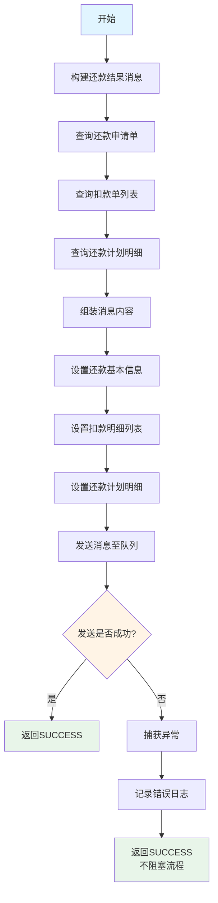
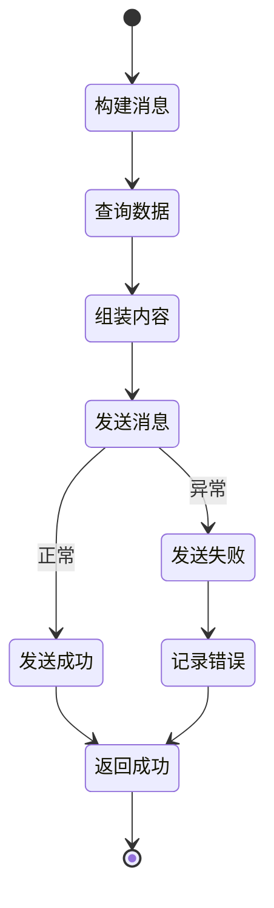

# PE180050 - 发送结果消息

## 节点信息

| 属性 | 值 |
|------|-----|
| **处理器代码** | PE180050 |
| **节点名称** | 发送结果消息 |
| **节点类型** | PROCESS |
| **所属流程** | [[账期制V400还款异步流程]] |
| **执行阶段** | 后置处理阶段 |
| **实现类** | RepayApplyBizFlowPE180050ServiceImpl |
| **优先级** | P1（重要节点） |

## 功能说明

将还款结果消息发送至消息队列,通知下游系统还款完成,用于异步解耦和事件驱动处理。

### 核心职责
1. **构建还款结果消息**: 组装完整的还款结果信息
2. **查询扣款明细**: 获取扣款单详情
3. **查询还款明细**: 获取还款计划明细
4. **发送消息**: 推送至消息队列
5. **异常处理**: 捕获异常并记录日志

### 适用场景

- **还款成功**: 通知下游系统还款成功
- **部分成功**: 通知部分还款成功
- **还款失败**: 通知还款失败
- **异步通知**: 触发下游系统异步处理

## 输入参数

| 参数名 | 参数代码 | 类型 | 来源 | 说明 |
|--------|----------|------|------|------|
| 还款申请对象 | repayApplyBo | RepayApplyBo | 流程变量 | 包含所有还款信息 |
| 还款申请号 | repayApplyNo | String | RepayApplyBo | 还款申请唯一标识 |
| 用户ID | uid | String | 流程上下文 | 用户唯一标识 |

## 输出参数

| 参数名 | 参数代码 | 类型 | 说明 |
|--------|----------|------|------|
| 无 | - | - | 发送消息操作,无特定输出 |

## 处理流程



## 核心业务逻辑

### 1. 构建还款结果消息

**消息对象**: `RepayApplyResultMsg`

**构建方法**:
```java
RepayApplyResultMsg repayApplyResultMsg = new RepayApplyResultMsg();
repayApplyResultMsg.setRepayApplyNo(repayApplyNo);
repayApplyResultMsg.setUid(uid);
repayApplyResultMsg.setRepayStatus(repayStatus);
// ... 其他字段
```

### 2. 查询还款申请单

**查询方法**:
```java
RepayApply repayApply = repayApplyService.getByRepayApplyNo(repayApplyNo, false);
```

**查询内容**:
- 还款状态
- 还款金额
- 成功金额
- 失败金额
- 创建时间

### 3. 查询扣款单列表

**查询方法**:
```java
List<DeductBill> deductBillList = deductBillService.getByRepayApplyNo(repayApplyNo);
```

**查询内容**:
- 扣款单号
- 扣款金额
- 扣款状态
- 支付方式
- 支付渠道

### 4. 组装消息内容

#### 4.1 还款基本信息

| 字段 | 类型 | 说明 |
|------|------|------|
| repayApplyNo | String | 还款申请号 |
| uid | String | 用户ID |
| repayStatus | RepayStatus | 还款状态 |
| repayAmount | Integer | 还款总金额(分) |
| repaySuccessAmount | Integer | 成功金额(分) |
| repayFailureAmount | Integer | 失败金额(分) |
| repayTime | Date | 还款时间 |

#### 4.2 扣款明细列表

**构建方法**:
```java
List<PayResultItem> payResultItemList = deductBillList.stream()
    .map(deductBill -> {
        PayResultItem item = new PayResultItem();
        item.setDeductBillNo(deductBill.getDeductBillNo());
        item.setDeductAmount(deductBill.getRealDeductAmount());
        item.setPayType(deductBill.getPayType());
        item.setDeductStatus(deductBill.getDeductStatus());
        return item;
    })
    .collect(Collectors.toList());
```

**扣款明细内容**:
- 扣款单号
- 扣款金额
- 支付方式
- 扣款状态
- 扣款时间

#### 4.3 还款计划明细

**查询方法**:
```java
List<RepayApplyStagePlanItem> stagePlanItemList =
    repayApplyService.getStagePlanItemsByRepayApplyNo(repayApplyNo);
```

**转换方法**:
```java
List<PlanRepayDetail> planRepayDetailList = stagePlanItemList.stream()
    .map(stagePlanItem -> {
        PlanRepayDetail detail = new PlanRepayDetail();
        detail.setStageOrderNo(stagePlanItem.getStageOrderNo());
        detail.setPeriod(stagePlanItem.getPeriod());
        detail.setPrincipalAmt(stagePlanItem.getPrincipalAmt());
        detail.setInterestAmt(stagePlanItem.getInterestAmt());
        return detail;
    })
    .collect(Collectors.toList());
```

**还款计划明细**:
- 分期订单号
- 期数
- 本金金额
- 利息金额
- 罚息金额
- 费用金额

### 5. 发送消息

**发送方法**:
```java
repayEngineProducer.sendRepayApplyResultMsg(repayApplyResultMsg);
```

**消息队列**: RocketMQ / Kafka

**消息Topic**: `REPAY_APPLY_RESULT_TOPIC`

**消息Key**: `repayApplyNo` (保证顺序和去重)

## 消息结构

### RepayApplyResultMsg (还款结果消息)

```json
{
  "repayApplyNo": "APPLY20240325001",
  "uid": "USER123456",
  "repayStatus": "SUCCESS",
  "repayAmount": 100000,
  "repaySuccessAmount": 100000,
  "repayFailureAmount": 0,
  "repayTime": "2024-03-25 18:30:00",
  "payResultItemList": [
    {
      "deductBillNo": "DEDUCT001",
      "deductAmount": 100000,
      "payType": "ALIPAY",
      "deductStatus": "RECORD_SUCCESS",
      "deductTime": "2024-03-25 18:28:00"
    }
  ],
  "planRepayDetailList": [
    {
      "stageOrderNo": "ORDER001",
      "period": 1,
      "principalAmt": 80000,
      "interestAmt": 20000,
      "penaltyAmt": 0,
      "feeAmt": 0
    }
  ]
}
```

## 下游消费系统

| 系统 | 用途 | 处理逻辑 |
|------|------|----------|
| **短信服务** | 发送还款结果短信 | 通知用户还款结果 |
| **推送服务** | 发送APP推送 | 实时通知用户 |
| **数据统计** | 数据统计分析 | 统计还款成功率等指标 |
| **风控系统** | 风险监控 | 监控异常还款行为 |
| **财务系统** | 财务对账 | 记录还款流水 |

## 状态流转



## 上游节点

- [[PE170090-优惠券消费]] - 优惠券已消费

## 下游节点

- [[P999999-收尾节点]] - 流程收尾

## 异常处理

| 异常场景 | 错误类型 | 处理方式 | 影响 |
|----------|----------|----------|------|
| 查询还款申请失败 | Exception | 记录错误,返回SUCCESS | 不影响流程 |
| 查询扣款单失败 | Exception | 记录错误,返回SUCCESS | 不影响流程 |
| 消息发送失败 | Exception | 记录错误,返回SUCCESS | 不影响流程 |

**特殊说明**:
- 消息发送失败不阻塞主流程
- 还款成功是最重要的
- 消息可以后续补发

## 依赖服务

| 服务名 | 方法 | 用途 |
|--------|------|------|
| IRepayApplyService | getByRepayApplyNo | 查询还款申请单 |
| IRepayApplyService | getStagePlanItemsByRepayApplyNo | 查询还款计划 |
| IDeductBillService | getByRepayApplyNo | 查询扣款单列表 |
| RepayEngineProducer | sendRepayApplyResultMsg | 发送消息 |

## 监控指标

- **消息发送成功率**: 成功发送数 / 总请求数
- **消息发送耗时**: P50/P95/P99
- **消息体大小**: 平均消息大小
- **下游消费延迟**: 消息堆积量

## 性能优化

### 1. 异步发送
- 消息发送不阻塞主流程
- 快速返回

### 2. 批量查询
- 批量查询扣款单和还款计划
- 减少数据库查询次数

### 3. 异常隔离
- 消息发送失败不影响还款流程
- 记录错误但不抛出异常

## 实现位置

```bash
repayengine-service/src/main/java/cn/caijiajia/repayengine/service/
├── repay/process/dcp/
│   └── RepayApplyBizFlowPE180050ServiceImpl.java  # 节点处理器 (80+行)
├── repayapply/
│   └── IRepayApplyService.java                     # 还款申请服务接口
├── bill/
│   └── IDeductBillService.java                     # 扣款单服务接口
└── producer/
    └── RepayEngineProducer.java                    # 消息生产者
```

## 设计考虑

### 1. 为什么消息发送失败不阻塞流程?

**原因**:
- 消息通知是辅助功能
- 还款成功是最重要的
- 消息可以后续补发

### 2. 为什么要包含扣款明细?

**原因**:
- 下游系统需要知道每笔扣款的详情
- 用于对账和统计
- 提供完整的还款信息

### 3. 为什么要包含还款计划明细?

**原因**:
- 下游系统需要知道每期的还款情况
- 用于更新订单状态
- 便于用户查询

### 4. 为什么使用消息队列?

**原因**:
- 异步解耦
- 提高性能
- 保证可靠性
- 支持重试

## 相关文档

- [[账期制V400还款异步流程]] - 主流程设计
- [[PE170090-优惠券消费]] - 上游节点
- [[P999999-收尾节点]] - 下游节点
- [[消息队列设计]] - 消息队列架构

## 标签

#节点 #消息队列 #异步通知 #PE180050