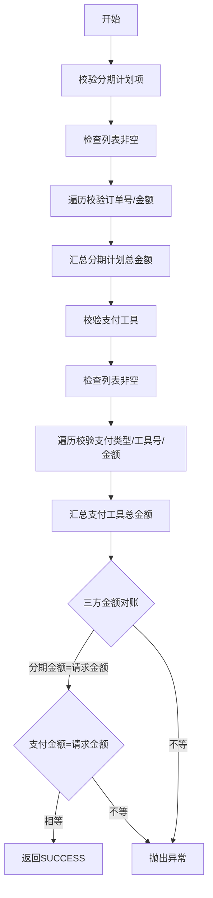

# PH110001 - 准入校验

## 节点信息

| 属性 | 值 |
|------|-----|
| **处理器代码** | PH110001 |
| **节点名称** | 准入校验 |
| **节点类型** | PROCESS |
| **所属流程** | [[重资产分期制还款同步流程V401]] |
| **执行阶段** | 准入校验阶段 |
| **实现类** | RepayApplyBizFlowPH110001ServiceImpl |

## 功能说明

还款申请准入校验，验证分期计划项和支付工具的金额一致性，确保三方金额对账正确。

### 核心职责
1. **分期计划校验**: 校验分期还款申请列表非空、订单号存在、金额非负
2. **支付工具校验**: 校验支付工具列表非空、支付类型和工具号存在、金额为正
3. **三方金额对账**: 分期计划总金额 = 支付工具总金额 = 请求还款金额

## 处理流程



## 核心业务逻辑

### 1. 分期计划校验 (checkAndCalcStagePlanItemAmount)
- 校验 stageRepayApplyList 非空
- 遍历每个分期项，校验 stageOrderNo 存在、金额 >= 0
- 累加得到分期计划总金额

### 2. 支付工具校验 (checkAndCalcPayToolItemAmount)
- 校验 payToolItemList 非空
- 遍历每个支付工具，校验 payType/payInstrumentNo 存在、金额 > 0
- 累加得到支付工具总金额

### 3. 三方金额对账
- 分期计划总金额 = 请求 repayAmount
- 支付工具总金额 = 请求 repayAmount

## 异常处理

| 异常场景 | 处理方式 |
|----------|----------|
| 列表为空/字段缺失/金额异常 | 抛出 ClientException |
| 金额不一致 | 抛出 ClientException |
| 其他异常 | 设置context消息，重新抛出 |

## 实现位置

```bash
repayengine-service/src/main/java/cn/caijiajia/repayengine/service/repay/process/heavyasset/
└── RepayApplyBizFlowPH110001ServiceImpl.java
```

## 相关文档
- [[重资产分期制还款同步流程V401]] - 所属业务流
- [[PH110010]] - 下游节点：请求幂等

## 标签
#节点 #准入校验 #金额对账 #PH110001