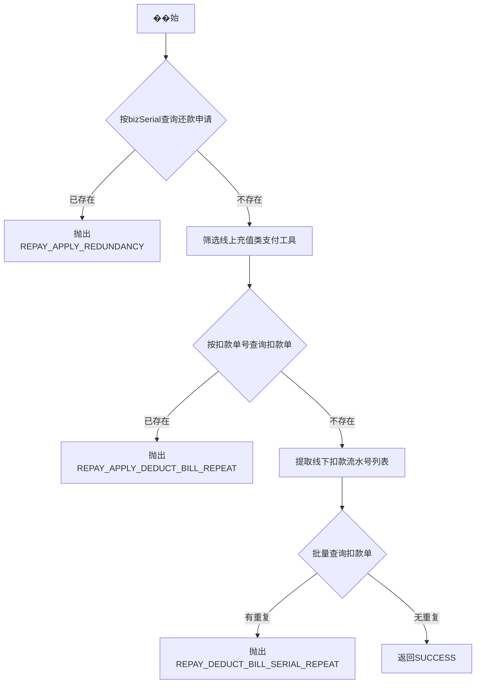

# PH110010 - 请求幂等

## 节点信息

| 属性 | 值 |
|------|-----|
| **处理器代码** | PH110010 |
| **节点名称** | 请求幂等 |
| **节点类型** | PROCESS |
| **所属流程** | [[重资产分期制还款同步流程V401]] |
| **执行阶段** | 准入校验阶段 |
| **实现类** | RepayApplyBizFlowPH110010ServiceImpl |

## 功能说明

还款请求幂等性校验，防止重复提交。检查线上还款申请重复、线上扣款单号重复、线下扣款流水号重复三个维度。

### 核心职责
1. **还款申请幂等**: 按bizSerial检查是否已存在还款申请
2. **线上扣款单号去重**: 检查充值类支付工具的扣款单号是否已存在
3. **线下扣款流水号去重**: 检查线下还款的扣款流水号是否已存在

## 处理流程



## 核心业务逻辑

### 1. 还款申请幂等检查
- 调用 `repayApplyService.getByBizSerial()` 按业务流水号查询
- 存在则设置已有申请的状态和日期到context

### 2. 线上扣款单号去重
- 筛选 PayType 为成功充值类型的支付工具
- 按扣款单号查询 `deductBillService.getByDeductBillNo()`

### 3. 线下扣款流水号去重
- 从线下还款列表提取所有扣款流水号，扁平化并去重
- 批量查询 `deductBillService.getByDeductBillNoList()`

## 异常处理

| 异常场景 | 错误码 | 处理方式 |
|----------|--------|----------|
| 还款申请已存在 | REPAY_APPLY_REDUNDANCY | 返回Error结果 |
| 线上扣款单号重复 | REPAY_APPLY_DEDUCT_BILL_REPEAT | 返回Error结果 |
| 线下扣款流水号重复 | REPAY_DEDUCT_BILL_SERIAL_REPEAT | 返回Error结果 |

## 实现位置

```bash
repayengine-service/src/main/java/cn/caijiajia/repayengine/service/repay/process/heavyasset/
└── RepayApplyBizFlowPH110010ServiceImpl.java
```

## 相关文档
- [[重资产分期制还款同步流程V401]] - 所属业务流
- [[PH110001]] - 上游节点：准入校验
- [[PH130080]] - 下游节点：支付工具初始化

## 标签
#节点 #幂等校验 #防重 #PH110010