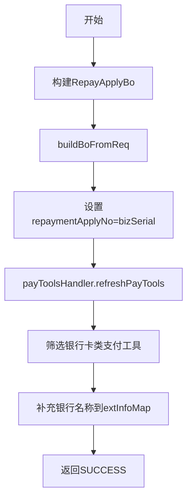

# PH130080 - 支付工具初始化

## 节点信息

| 属性 | 值 |
|------|-----|
| **处理器代码** | PH130080 |
| **节点名称** | 支付工具初始化 |
| **节点类型** | PROCESS |
| **所属流程** | [[重资产分期制还款同步流程V401]] |
| **执行阶段** | 初始化阶段 |
| **实现类** | RepayApplyBizFlowPH130080ServiceImpl |

## 功能说明

初始化还款业务对象(BO)和支付工具信息，从请求中构建BO对象，刷新支付工具数据并补充银行信息。

### 核心职责
1. **BO对象初始化**: 从请求构建RepayApplyBo，设置还款申请号
2. **支付工具刷新**: 调用payToolsHandler刷新验证支付工具
3. **银行信息补充**: 为银行卡类支付工具补充银行名称

## 处理流程



## 核心业务逻辑

### 1. BO对象初始化
- 设置当前时间戳，调用 `buildBoFromReq()` 从请求构建BO
- 设置 repaymentApplyNo = bizSerial

### 2. 支付工具刷新
- 调用 `payToolsHandler.refreshPayTools()` 刷新并验证

### 3. 银行信息补充
- 筛选银行卡类型（CARD/DEBIT_CARD等）
- 在 extInfoMap 中存储银行名称（key: PAY_ITEM_EXINFO_BANK_NAME）

## 异常处理

| 异常场景 | 处理方式 |
|----------|----------|
| CjjClientException | 记录日志，返回Error |
| CjjServerException | 记录日志，返回Error |

## 实现位置

```bash
repayengine-service/src/main/java/cn/caijiajia/repayengine/service/repay/process/heavyasset/
└── RepayApplyBizFlowPH130080ServiceImpl.java
```

## 相关文档
- [[重资产分期制还款同步流程V401]] - 所属业务流
- [[PH110010]] - 上游节点：请求幂等
- [[PH130090]] - 下游节点：保存请求信息

## 标签
#节点 #初始化 #支付工具 #PH130080