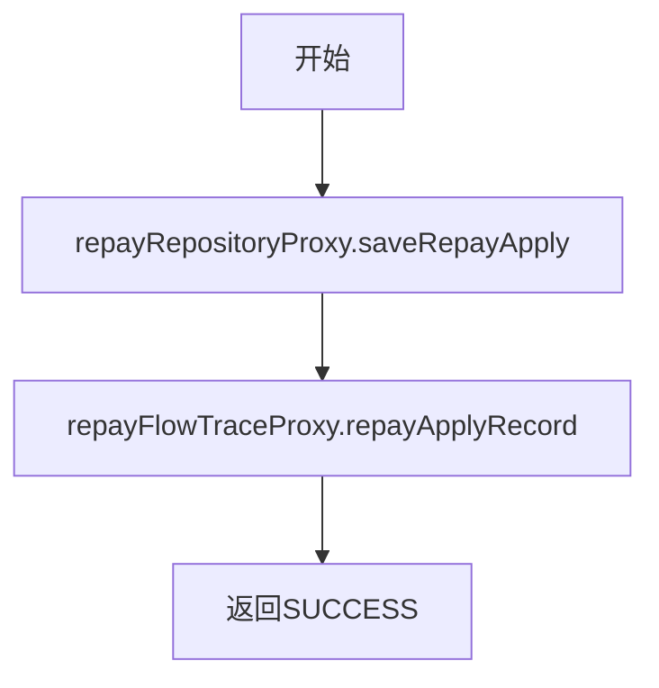

# PH130090 - 保存请求信息

## 节点信息

| 属性 | 值 |
|------|-----|
| **处理器代码** | PH130090 |
| **节点名称** | 保存请求信息 |
| **节点类型** | PROCESS |
| **所属流程** | [[重资产分期制还款同步流程V401]] |
| **执行阶段** | 初始化阶段 |
| **实现类** | RepayApplyBizFlowPH130090ServiceImpl |

## 功能说明

持久化还款申请请求数据到数据库，并记录流程追踪埋点。

### 核心职责
1. **保存还款申请**: 调用repository层保存还款申请数据
2. **流程追踪**: 记录还款申请的流程追踪信息

## 处理流程



## 核心业务逻辑

### 1. 保存还款申请
- 调用 `repayRepositoryProxy.saveRepayApply(repayContext, Boolean.TRUE)`
- 参数 TRUE 表示新建模式

### 2. 流程追踪
- 构建 FlowTraceBo（uid + bizSerial）
- 调用 `repayFlowTraceProxy.repayApplyRecord()` 记录埋点

## 异常处理

| 异常场景 | 处理方式 |
|----------|----------|
| 保存失败 | 记录日志，设置context消息，重新抛出 |

## 实现位置

```bash
repayengine-service/src/main/java/cn/caijiajia/repayengine/service/repay/process/heavyasset/
└── RepayApplyBizFlowPH130090ServiceImpl.java
```

## 相关文档
- [[重资产分期制还款同步流程V401]] - 所属业务流
- [[PH130080]] - 上游节点：支付工具初始化
- [[PH130688]] - 下游节点：订单信息初始化

## 标签
#节点 #持久化 #流程追踪 #PH130090