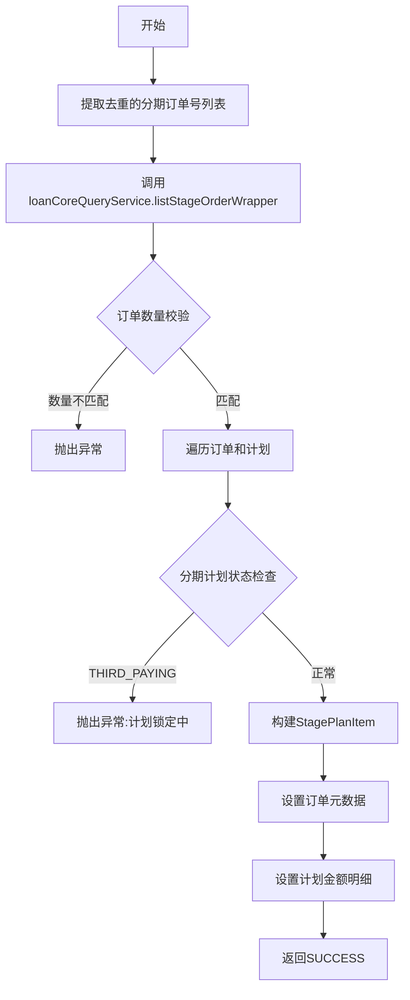

# PH130688 - 订单信息初始化

## 节点信息

| 属性 | 值 |
|------|-----|
| **处理器代码** | PH130688 |
| **节点名称** | 订单信息初始化 |
| **节点类型** | PROCESS |
| **所属流程** | [[重资产分期制还款同步流程V401]] |
| **执行阶段** | 初始化阶段 |
| **实现类** | RepayApplyBizFlowPH130688ServiceImpl |

## 功能说明

从贷款核心系统获取分期订单详情，校验订单状态，并将订单元数据充实到还款上下文中。

### 核心职责
1. **订单查询**: 从贷款核心查询分期订单包装对象(StageOrderWrapper)
2. **订单校验**: 验证请求的订单全部存在、状态合法
3. **数据充实**: 将订单/计划数据映射为StagePlanItem对象

## 处理流程



## 核心业务逻辑

### 1. 订单查询
- 从请求中提取去重的 stageOrderNo 列表
- 调用 `loanCoreQueryService.listStageOrderWrapper()` 查询

### 2. 订单校验 (checkStageOrderWrapper)
- 集合差集校验：确保请求的所有订单都在返回结果中

### 3. 数据充实 (dealProcess)
- 校验分期计划不是 THIRD_PAYING 状态
- 构建 StagePlanItem 包含：
  - 订单维度：businessType, billStatus, product, channel, bank, asset
  - 计划维度：repaymentDate, stageNo, lendStatus, exceedStatus
  - 金额维度：principal, fee, interest, lateFee, warrantyFee, earlySettleFee, amcFee

## 异常处理

| 异常场景 | 处理方式 |
|----------|----------|
| 订单查询结果缺失 | 抛出异常 |
| THIRD_PAYING状态 | 抛出异常（计划锁定中） |
| CjjClientException/CjjServerException | 返回Error结果 |

## 实现位置

```bash
repayengine-service/src/main/java/cn/caijiajia/repayengine/service/repay/process/heavyasset/
└── RepayApplyBizFlowPH130688ServiceImpl.java
```

## 相关文档
- [[重资产分期制还款同步流程V401]] - 所属业务流
- [[PH130090]] - 上游节点：保存请求信息
- [[PH130817]] - 下游节点：拆还款单

## 标签
#节点 #订单初始化 #贷款核心 #PH130688