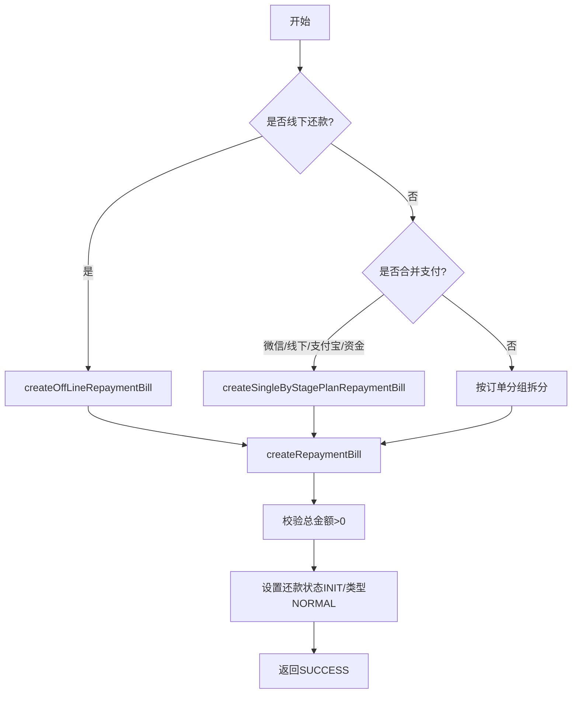

# PH130817 - 拆还款单

## 节点信息

| 属性 | 值 |
|------|-----|
| **处理器代码** | PH130817 |
| **节点名称** | 拆还款单 |
| **节点类型** | PROCESS |
| **所属流程** | [[重资产分期制还款同步流程V401]] |
| **执行阶段** | 还款单处理阶段 |
| **实现类** | RepayApplyBizFlowPH130817ServiceImpl |

## 功能说明

将分期计划项转换为还款单，按业务规则进行分组和拆分。根据支付方式选择不同的拆分策略。

### 核心职责
1. **还款单拆分**: 根据支付方式选择拆分策略
2. **金额校验**: 验证拆分后金额一致性
3. **还款单构建**: 创建ByStagePlanRepaymentBill对象

## 处理流程



## 核心业务逻辑

### 1. 拆分策略选择
- **线下还款**: offLineRepayList不为空 → `createOffLineRepaymentBill()`
- **合并支付**: WECHAT_PAY/AO_OFFLINE_PAY/FUND_OFFLINE_PAY/ALIPAY_SDK → 合并为单个还款单
- **默认路径**: 按订单号分组，每组独立拆分

### 2. 合并支付逻辑
- 多个订单时统一bank/assetId/loanSubject（全部相同取值，否则默认SELF）

### 3. 还款单构建 (createRepaymentBill)
- 校验总金额 > 0
- 线下场景校验扣款明细金额之和 = 还款金额
- 将 StagePlanItemList 转为 StageOrderItem 存入还款单

## 异常处理

| 异常场景 | 处理方式 |
|----------|----------|
| 总金额为0或负数 | 抛出 ErrorCode 异常 |
| 线下扣款明细金额不匹配 | 抛出 ErrorCode 异常 |
| 其他异常 | 记录日志，设置context消息，重新抛出 |

## 实现位置

```bash
repayengine-service/src/main/java/cn/caijiajia/repayengine/service/repay/process/heavyasset/
└── RepayApplyBizFlowPH130817ServiceImpl.java
```

## 相关文档
- [[重资产分期制还款同步流程V401]] - 所属业务流
- [[PH130688]] - 上游节点：订单信息初始化
- [[PH140010]] - 下游节点：preRepay校验

## 标签
#节点 #拆还款单 #还款单 #PH130817