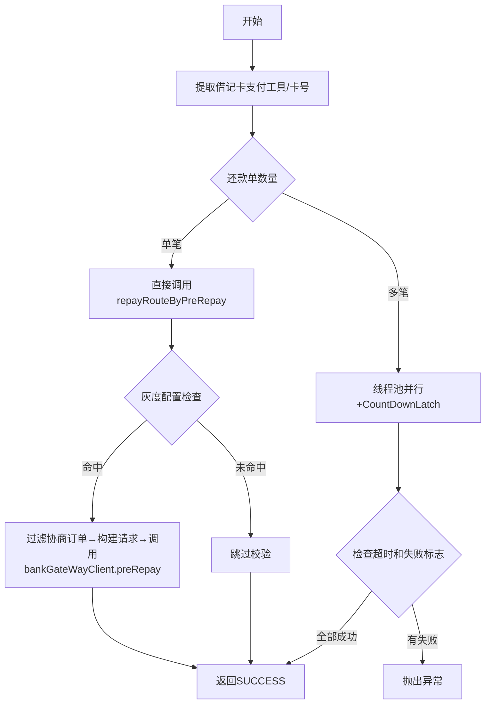

# PH140010 - preRepay校验

## 节点信息

| 属性 | 值 |
|------|-----|
| **处理器代码** | PH140010 |
| **节点名称** | preRepay校验 |
| **节点类型** | PROCESS |
| **所属流程** | [[重资产分期制还款同步流程V401]] |
| **执行阶段** | 还款单处理阶段 |
| **实现类** | RepayApplyBizFlowPH140010ServiceImpl |

## 功能说明

还款前置校验，向银行网关发送preRepay请求验证还款可行性。支持单笔直接校验和多笔并行校验。

### 核心职责
1. **提取银行卡信息**: 从支付工具中获取借记卡号
2. **preRepay校验**: 调用银行网关preRepay接口
3. **并行处理**: 多还款单使用线程池并发校验

## 处理���程



## 核心业务逻辑

### 1. preRepay路由校验 (repayRouteByPreRepay)
- 检查灰度配置决定是否执行
- 过滤协商还款订单
- 通过 `repaymentBillSplitter.buildPreRepayReq()` 构建请求
- 调用 `bankGateWayClient.preRepay()` 执行校验

### 2. 多笔并行处理
- 线程池: `heavyAssetSyncExecutor`
- CountDownLatch 等待，超时可配置

## 异常处理

| 异常场景 | 处理方式 |
|----------|----------|
| 并行任务超时 | 抛出 ClientException |
| 银行网关返回失败 | 设置失败标志，汇总错误 |

## 实现位置

```bash
repayengine-service/src/main/java/cn/caijiajia/repayengine/service/repay/process/heavyasset/
└── RepayApplyBizFlowPH140010ServiceImpl.java
```

## 相关文档
- [[重资产分期制还款同步流程V401]] - 所属业务流
- [[PH130817]] - 上游节点：拆还款单
- [[PH140020]] - 下游节点：锁单

## 标签
#节点 #preRepay #银行网关 #并行处理 #PH140010