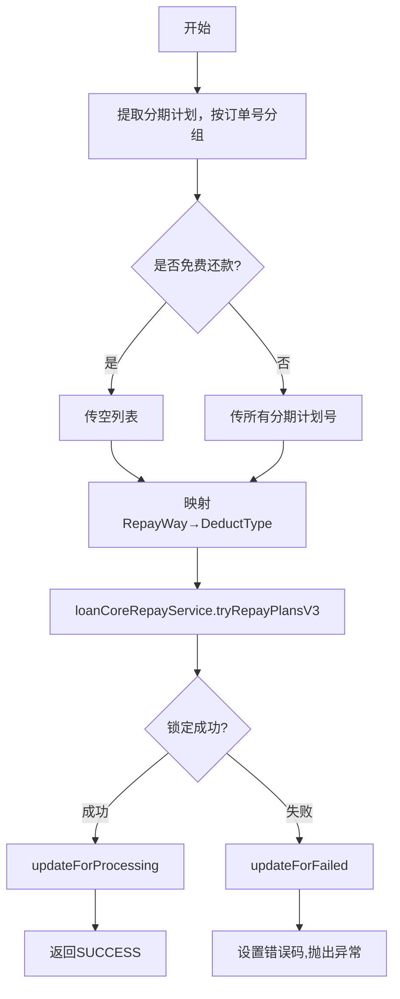

# PH140020 - 锁单

## 节点信息

| 属性 | 值 |
|------|-----|
| **处理器代码** | PH140020 |
| **节点名称** | 锁单 |
| **节点类型** | PROCESS |
| **所属流程** | [[重资产分期制还款同步流程V401]] |
| **执行阶段** | 还款单处理阶段 |
| **实现类** | RepayApplyBizFlowPH140020ServiceImpl |

## 功能说明

在贷款核心系统锁定分期计划，防止并发操作。锁定成功后更新还款申请状态为处理中。

### 核心职责
1. **分期计划锁定**: 调用贷款核心tryRepayPlansV3锁定
2. **状态更新**: 成功→processing，失败→failed

## 处理流程



## 核心业务逻辑

### 1. 分期计划锁定 (lockStagePlans)
- 按订单号分组，检查 FREE_REPAY 标志
- 映射 RepayWay → DeductType（AUTO_DEDUCT/MANUAL_DEDUCT/AO_OFFLINE）
- 调用 `loanCoreRepayService.tryRepayPlansV3()` 执行锁定

### 2. 状态更新
- 成功: `repayDataService.updateForProcessing()`
- 失败: `repayDataService.updateForFailed()`

## 异常处理

| 异常场景 | 处理方式 |
|----------|----------|
| ResourceLockFailedException | 更新为failed，设置错误码 |
| CjjServerException | 更新为failed |
| Exception | 更新为failed |

## 实现位置

```bash
repayengine-service/src/main/java/cn/caijiajia/repayengine/service/repay/process/heavyasset/
└── RepayApplyBizFlowPH140020ServiceImpl.java
```

## 相关文档
- [[重资产分期制还款同步流程V401]] - 所属业务流
- [[PH140010]] - 上游节点：preRepay校验
- [[PH140030V1]] - 下游节点：还款试算

## 标���
#节点 #锁单 #贷款核心 #PH140020