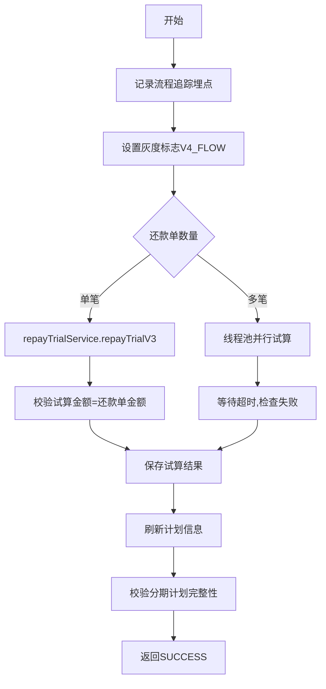

# PH140030V1 - 还款试算

## 节点信息

| 属性 | 值 |
|------|-----|
| **处理器代码** | PH140030V1 |
| **节点名称** | 还款试算 |
| **节点类型** | PROCESS |
| **所属流程** | [[重资产分期制还款同步流程V401]] |
| **执行阶段** | 还款单处理阶段 |
| **实现类** | RepayApplyBizFlowPH140030V1ServiceImpl |

## 功能说明

执行还款试算，计算精确的还款金额、手续费、计划详情。支持单笔直接试算和多笔并行试算。

### 核心职责
1. **流程追踪**: 记录还款试算埋点
2. **还款试算**: 调用试算服务计算各项金额
3. **结果校验**: 校验试算金额与还款单金额一致
4. **计划信息刷新**: 用试算结果更新分期计划信息

## 处理流程



## 核心业务逻辑

### 1. 还款试算执行
- 单笔: `repayTrialService.repayTrialV3()`
- 多笔: 线程池并行 + CountDownLatch

### 2. 结果校验 (checkRepayTrialResp)
- 校验金额一致、所有计划有repayScene

### 3. 计划信息刷新 (refreshPlanInfo)
- 更新repayScene、rechargeType、各项费用金额

## 异常处理

| 异常场景 | 处理方式 |
|----------|----------|
| 试算金额不匹配 | 抛出异常 |
| 并行任务超时 | 抛出 ClientException |
| repayScene缺失 | 抛出异常 |

## 实现位置

```bash
repayengine-service/src/main/java/cn/caijiajia/repayengine/service/repay/process/heavyasset/
└── RepayApplyBizFlowPH140030V1ServiceImpl.java
```

## 相关文档
- [[重资产分期制还款同步流程V401]] - 所属业务流
- [[PH140020]] - 上游节点：锁单
- [[PH140624]] - 下游节点：获取资金方数据

## 标签
#节点 #还款试算 #并行处理 #PH140030V1