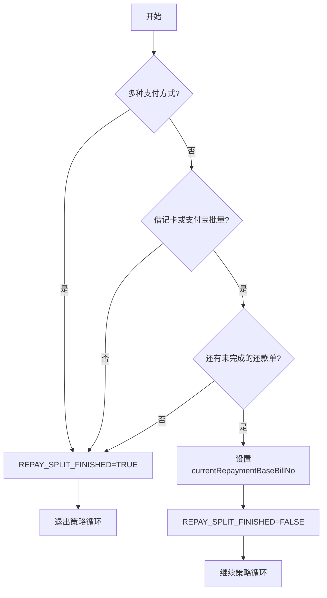

# PH140040 - 筛选还款单调用策略

## 节点信息

| 属性 | 值 |
|------|-----|
| **处理器代码** | PH140040 |
| **节点名称** | 筛选还款单调用策略 |
| **节��类型** | PROCESS |
| **所属流程** | [[重资产分期制还款同步流程V401]] |
| **执行阶段** | 还款模式策略循环 |
| **实现类** | RepayApplyBizFlowPH140040ServiceImpl |

## 功能说明

还款模式策略循环控制器。判断是否需要执行还款模式策略，设置流程变量控制循环。

### 核心职责
1. **策略适用性判断**: 三级过滤决定是否执行策略
2. **循环控制**: 设置 REPAY_SPLIT_FINISHED 变量
3. **当前处理单选择**: 找到下一个未完成策略的还款单

## 处理流程



## 核心业务逻辑

### 三级过滤 (refreshFactRepaySplitFinished)
- **过滤1**: 多种支付方式 → 跳过策略
- **过滤2**: 单一支付方式但非 DEBIT_CARD/ALIPAY_API → 跳过
- **过滤3**: 所有还款单的 repayStrategyFinished=TRUE → 退出循环

### 循环控制
- 找第一个 repayStrategyFinished=FALSE 的还款单
- 设置 currentRepaymentBaseBillNo
- 设置 REPAY_SPLIT_FINISHED=FALSE 继续循环

## 异常处理

| 异常场景 | 处理方式 |
|----------|----------|
| 无异常处理 | 始终返回SUCCESS |

## 实现位置

```bash
repayengine-service/src/main/java/cn/caijiajia/repayengine/service/repay/process/heavyasset/
└── RepayApplyBizFlowPH140040ServiceImpl.java
```

## 相关文档
- [[重资产分期制还款同步流程V401]] - 所属业务流
- [[PH140624]] - 上游节点
- [[PH140626]] - 下游节点（循环内）
- [[PH150010]] - 下游节点（循环结束）

## 标签
#节点 #循环控制 #还款模式策略 #PH140040