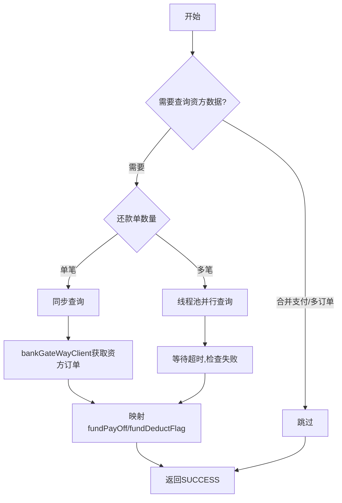

# PH140624 - 获取资金方数据

## 节点信息

| 属性 | 值 |
|------|-----|
| **处理器代码** | PH140624 |
| **节点名称** | 获取资金方数据 |
| **节点类型** | PROCESS |
| **所属流程** | [[重资产分期制还款同步流程V401]] |
| **执行阶段** | 还款单处理阶段 |
| **实现类** | RepayApplyBizFlowPH140624ServiceImpl |

## 功能说明

从银行网关获取资金方订单信息，将银行分期计划数据同步到还款上下文，补充fundPayOff/fundDeductFlag状态。

### 核心职责
1. **判断是否需查询**: 合并支付模式/多订单时跳过
2. **资方订单查询**: 调用银行网关获取BankStageOrderBo
3. **状态同步**: 映射资方计划状态到内部字段

## 处理流程



## 核心业务逻辑

### 1. 跳过查询判断 (needQueryFundOrderInfo)
- AO_OFFLINE_PAY/WECHAT_PAY/FUND_OFFLINE_PAY/ALIPAY_SDK → 跳过
- 单还款单含多订单 → 跳过

### 2. 状态映射 (refreshBaseRepayBillStageOrderInfo)
- fundPayOff: 资方是否已结清
- fundDeductFlag: 资方扣款标志
- 旧版资金包直接标记已结清

## 异常处理

| 异常场景 | 错误码 | 处理方式 |
|----------|--------|----------|
| 查询超时 | REPAY_LIGHT_ASSET_ORDER_ERROR | 抛出异常 |
| 分期计划未��到 | REPAY_STAGE_PLAN_NOT_FOUND | 抛出异常 |

## 实现位置

```bash
repayengine-service/src/main/java/cn/caijiajia/repayengine/service/repay/process/heavyasset/
└── RepayApplyBizFlowPH140624ServiceImpl.java
```

## 相关文档
- [[重资产分期制还款同步流程V401]] - 所属业务流
- [[PH140030V1]] - 上游节点：还款试算
- [[PH140040]] - 下游节点：筛选还款单调用策略

## 标签
#节点 #资金方 #银行网关 #PH140624