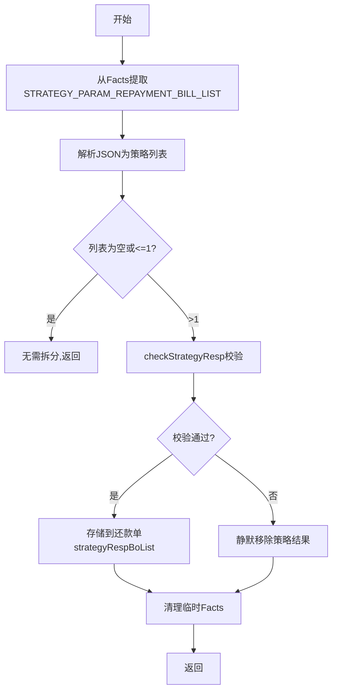

# PH140628 - 还款模式策略出参

## 节点信息

| 属性 | 值 |
|------|-----|
| **处理器代码** | PH140628 |
| **节点名称** | 还款模式策略出参 |
| **节点类型** | PROCESS |
| **所属流程** | [[重资产分期制还款同步流程V401]] |
| **执行阶段** | 还款模式策略循环 |
| **实现类** | RepayApplyBizFlowPH140628ServiceImpl |

## 功能说明

解析还款模式策略决策引擎返回的结果，校验策略响应，判断是否需要拆分还款单。

### 核心职责
1. **策略结果解析**: 从Facts提取策略输出，解析JSON为RepayStrategyOutputBo列表
2. **结果校验**: 验证repaySeqNo和planNoList
3. **拆分判断**: >1需拆分，<=1无需拆分

## 处理流程



## 核心业务逻辑

### 1. 结果校验 (checkStrategyResp)
- repaySeqNo >= 0
- planNoList 不为空
- 失败则静默移除（容错设计）

### 2. 清理临时Facts
- 移除策略参数、资方信息、扣款渠道信息

## 异常处理

| 异常场景 | 处理方式 |
|----------|----------|
| 策略列表为空/size<=1 | 正常返回 |
| 校验失败 | 静默移除，继续执行 |

## 实现位置

```bash
repayengine-service/src/main/java/cn/caijiajia/repayengine/service/repay/process/heavyasset/
└── RepayApplyBizFlowPH140628ServiceImpl.java
```

## 相关文档
- [[重资产分期制还款同步流程V401]] - 所属业务流
- [[JC-202405140001]] - 上游节点：决策
- [[PH140630]] - 下游节点：按策略拆还款单

## 标签
#节点 #策略出参 #还款模式 #PH140628