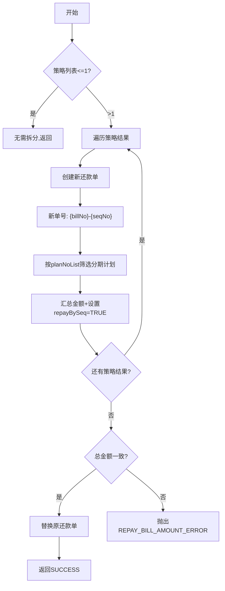

# PH140630 - 按照策略结果拆还款单

## 节点信息

| 属性 | 值 |
|------|-----|
| **处理器代码** | PH140630 |
| **节点名称** | 按照策略结果拆还款单 |
| **节点类型** | PROCESS |
| **所属流程** | [[重资产分期制还款同步流程V401]] |
| **执行阶段** | 还款模式策略循环 |
| **实现类** | RepayApplyBizFlowPH140630ServiceImpl |

## 功能说明

根据还款模式策略输出结果，将一个还款单拆分为多个子还款单。每个策略结果对应一个新还款单。

### 核心职责
1. **还款单拆分**: 按策略结果拆分
2. **金额校验**: 确保拆��前后总金额一致
3. **上下文更新**: 用拆分后的还款单替换原始还款单

## 处理流程



## 核心业务逻辑

### 1. 新还款单创建 (createNewRepaymentBill)
- 新单号格式: `{原单号}-{seqNo}`
- 按 planNoList 筛选分期计划
- 深拷贝原还款单避免引用问题
- 设置 repayStrategyFinished=TRUE, repayBySeq=TRUE

### 2. 金额校验 (checkAmount)
- 拆分后所有还款单金额之和 = 原还款金额

### 3. 上下文更新
- 移除原始还款单，添加所有拆分后的新还款单

## 异常处理

| 异常场景 | 错误码 |
|----------|--------|
| 拆分前后金额不一致 | REPAY_BILL_AMOUNT_ERROR |

## 实现位置

```bash
repayengine-service/src/main/java/cn/caijiajia/repayengine/service/repay/process/heavyasset/
└── RepayApplyBizFlowPH140630ServiceImpl.java
```

## 相关文档
- [[重资产分期制还款同步��程V401]] - 所属业务流
- [[PH140628]] - 上游节点：策略出参
- [[PH140040]] - 下游（循环回）：筛选还款单调用策略

## 标签
#节点 #拆还款单 #策略拆分 #PH140630