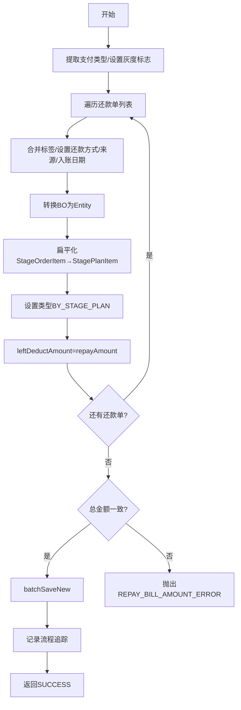

# PH150010 - 保存还款单

## 节点信息

| 属性 | 值 |
|------|-----|
| **处理器代码** | PH150010 |
| **节点名称** | 保存还款单 |
| **节点类型** | PROCESS |
| **所属流程** | [[重资产分期制还款同步流程V401]] |
| **执行阶段** | 保存还款单阶段 |
| **实现类** | RepayApplyBizFlowPH150010ServiceImpl |

## 功能说明

将还款单从业务对象(BO)转换为持久化实体(Entity)并批量保存到数据库。补充标签、还款方式、来源等信息。

### 核心职责
1. **数据补充**: 标签、还款方式、请求来源、对接入账日期
2. **对象转换**: BaseRepaymentBill(BO) → RepaymentBill(Entity)
3. **金额校验**: 校验所有还款单总金额一致
4. **批量保存**: 持久化还款单

## 处理流程



## 核心业务逻辑

### 1. 前置处理 (initFacts)
- 微信/支付宝SDK: 设置currentRepaymentBillNo为第一个还款单号

### 2. 数据补充 (dealProcess)
- 合并请求标签和还款单扩展信息中的标签
- 设置repayWay、requestSource、dockingIncomeDate

### 3. 对象转换 (convertToStagePlanRepaymentBill)
- 扁平化StageOrderItem → StagePlanItem
- 初始化 leftDeductAmount = repayAmount

## 异常处理

| 异常场景 | 处理方式 |
|----------|----------|
| 总金额不一致 | 抛出 REPAY_BILL_AMOUNT_ERROR |
| 日期解析失败 | 记录警告，不阻断 |
| 其他异常 | 设置context消息，重新抛出 |

## 实现位置

```bash
repayengine-service/src/main/java/cn/caijiajia/repayengine/service/repay/process/heavyasset/
└── RepayApplyBizFlowPH150010ServiceImpl.java
```

## 相关文档
- [[重资产分期制还款同步流程V401]] - 所属业务流
- [[PH160026V1]] - 下游（支付宝/微信）：扣款决策入参
- [[PH161010V1]] - 下游（默认）：启动异步流程

## 标签
#节点 #保存还款单 #持久化 #PH150010