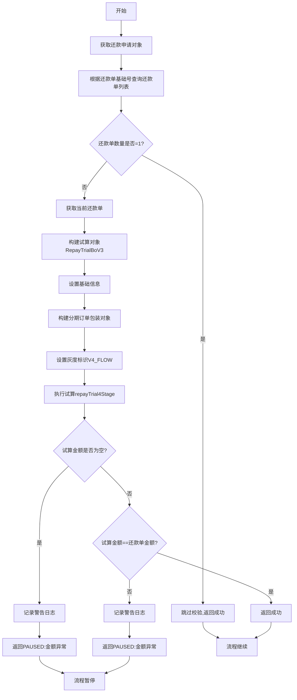
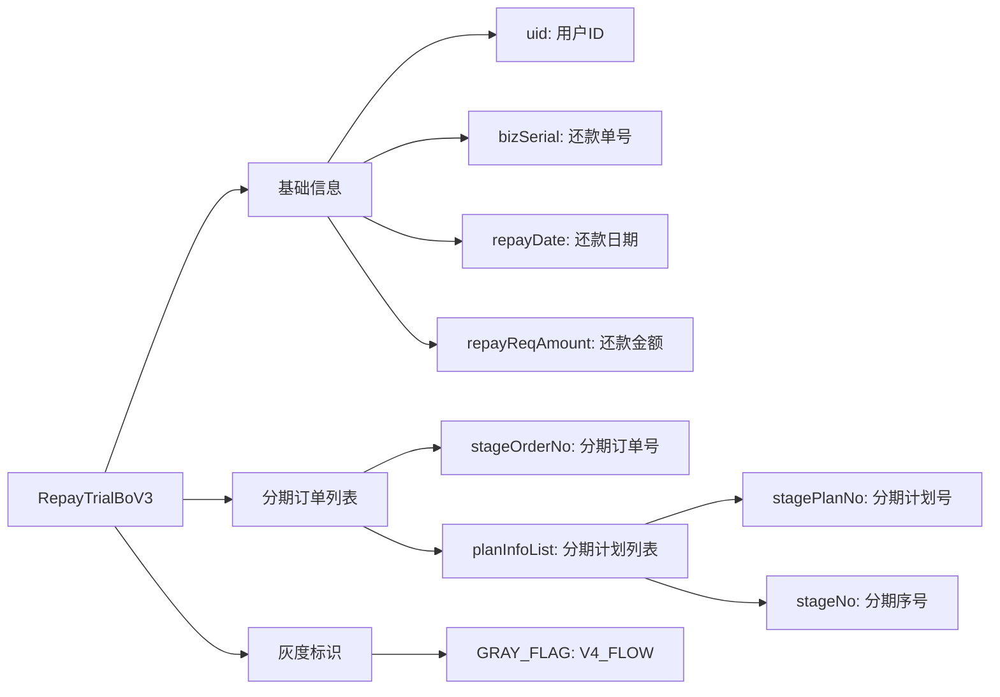
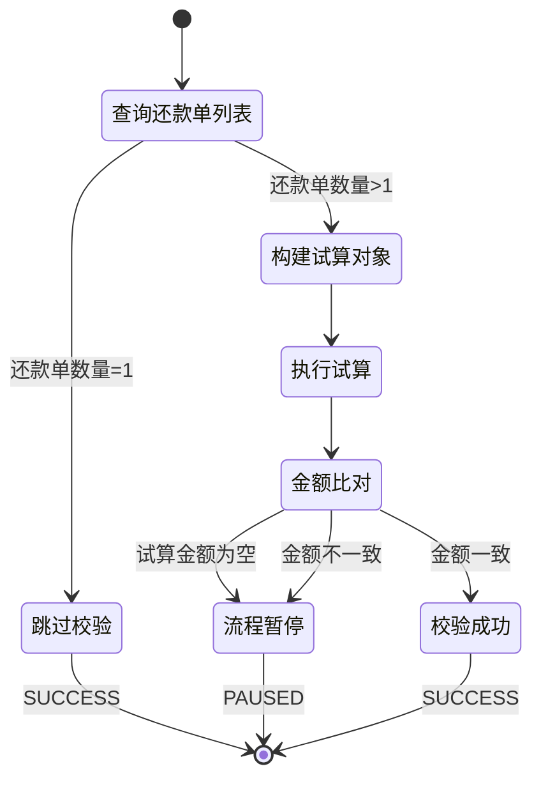

# PH160020 - 还款金额再次校验

## 节点信息

| 属性 | 值 |
|------|------|
| **处理器代码** | PH160020 |
| **节点名称** | 还款金额再次校验 |
| **节点类型** | PROCESS |
| **所属流程** | [[重资产分期制还款异步子流程V401]] |
| **执行阶段** | 扣款前校验阶段 |
| **实现类** | RepayApplyBizFlowPH160020ServiceImpl |
| **优先级** | P1（重要节点） |

## 功能说明

在扣款前对还款金额进行二次校验,确保按还款模式拆分后的还款单金额与实际试算金额一致,防止金额错误导致扣款异常。

### 核心职责
1. **还款单数量判断**: 判断是否为拆分后的还款单
2. **试算对象构建**: 构建试算请求对象
3. **执行试算**: 调用试算服务重新计算应还金额
4. **金额比对**: 校验试算金额与还款单金额是否一致
5. **异常处理**: 金额不一致时暂停流程

### 适用场景

- **还款模式拆分**: 按还款模式策略拆分还款单后的场景
- **多还款单**: 同一还款单元下有多个还款单
- **金额校验**: 防止拆分逻辑导致的金额错误

## 输入参数

| 参数名 | 参数代码 | 类型 | 来源 | 说明 |
|--------|----------|------|------|------|
| 还款申请对象 | repayApplyBo | RepayApplyBo | 流程变量 | 包含所有还款相关信息 |
| 当前还款单基础号 | currentRepaymentBaseBillNo | String | 流程变量 | 还款单元标识 |
| 当前还款单号 | currentRepaymentBillNo | String | 流程变量 | 当前处理的还款单 |

## 输出参数

| 参数名 | 参数代码 | 类型 | 说明 |
|--------|----------|------|------|
| 无 | - | - | 仅校验,不输出数据 |

## 处理流程



## 核心���务逻辑

### 1. 还款单数量判断

**判断逻辑**:
根据 `currentRepaymentBaseBillNo` 从 `repaymentBillList` 中过滤出同一还款单元的所有还款单

**数量判断**:
- 数量 = 1: 说明未拆分,跳过校验
- 数量 > 1: 说明已按还款模式拆分,需要校验

**业务含义**:
- 只有一个还款单时,金额已在上游节点校验过
- 拆分后的还款单需要二次校验,防止拆分逻辑错误

### 2. 试算对象构建

**RepayTrialBoV3 构建步骤**:



**关键字段**:
- `bizSerial`: 使用还款单号作为业务流水号
- `repayReqAmount`: 设置为还款单金额
- `extraMap.GRAY_FLAG = V4_FLOW`: 标识使用V4流程

### 3. 执行试算

**调用接口**: `IRepayTrialPerformer.repayTrial4Stage()`

**试算逻辑**:
1. 根据分期计划查询应还金额
2. 计算各组件应还金额
3. 汇总得到总应还金额
4. 写入 `repayTrialBo.repayRespAmount`

**试算结果**: 返回计算出的应还金额

### 4. 金额比对

**比对条件**:
```
repayRespAmount != null && repayRespAmount == repaymentBill.repayAmount
```

**比对失败场景**:
- `repayRespAmount == null`: 试算失败,返回PAUSED
- `repayRespAmount != repayAmount`: 金额不一致,返回PAUSED

**失败处理**:
- 记录警告日志(包含试算金额和还款单金额)
- 返回 `PAUSED` 状态,提示"扣款前校验试算金额异常,等待重试"

## 还款模式拆分场景

### 什么是还款模式拆分?

**定义**: 根据不同的还款模式策略,将一个还款单元拆分成多个还款单

**拆分原因**:
- 不同分期使用不同还款模式
- 需要分别处理不同模式的扣款
- 保证扣款逻辑的独立性

**示例**:
```
还款单元 (currentRepaymentBaseBillNo): RB2024032100001

拆分后:
- 还款单1 (RB2024032100001-01): 主动还款模式
- 还款单2 (RB2024032100001-02): 代扣还款模式
```

### 为什么需要二次校验?

**风险点**:
- 拆分逻辑可能有bug
- 金额分配可能不准确
- 总金额可能不等于原金额

**校验目的**:
- 确保拆分后每个还款单金额正确
- 防止扣款金额错误
- 避免资金损失

## 状态流转



## 上游节点

- [[PH170010V1]] - 还款单生成

## 下游节点

- [[PH170015]] - 扣款执行

## 异常处理

| 异常场景 | 处理方式 | 影响 |
|----------|----------|------|
| 还款单数量=1 | 跳过校验,返回成功 | 无 |
| 试算金额为空 | 返回PAUSED | 流程暂停,等待重试 |
| 金额不一致 | 返回PAUSED | 流程暂停,等待重试 |
| 试算服务异常 | 抛出异常 | 流程中断 |

**PAUSED 状态说明**:
- 流程暂停,不会继续执行
- 支持自动重试
- 重试时会重新执行试算

## 监控指标

- **校验执行率**: 执行校验次数 / 总还款单数
- **金额一致性**: 金额一致次数 / 校验次数
- **异常率**: 金额不一致次数 / 校验次数
- **暂停率**: PAUSED次数 / 校验次数
- **校验耗时**: P50/P95/P99

## 重要配置

### 灰度标识

**配置项**: `extraMap.GRAY_FLAG = V4_FLOW`

**用途**: 标识使用V4版本的试算流程

**影响**: 决定试算逻辑的版本

## 数据依赖

### RepaymentBill (还款单)

**关键字段**:
- `repaymentBillNo`: 还款单号
- `repaymentBaseBillNo`: 还款单元号
- `repayAmount`: 还款金额
- `stageOrderItemList`: 分期订单列表

### StageOrderItem (分期订单项)

**关键字段**:
- `stageOrderNo`: 分期订单号
- `stagePlanItemList`: 分期计划列表

### StagePlanItem (分期计划项)

**关键字段**:
- `stagePlanNo`: 分期计划号
- `stageNo`: 分期序号

## 实现位置

```bash
repayengine-service/src/main/java/cn/caijiajia/repayengine/service/
├── repay/process/heavyasset/
│   └── RepayApplyBizFlowPH160020ServiceImpl.java  # 节点处理器
├── trial/
│   └── IRepayTrialPerformer.java                  # 试算执行器
└── repaymentbill/util/
    └── RepaymentBillUtils.java                    # 还款单工具类
```

## 设计考虑

### 1. 为什么只校验拆分后的还款单?

**原因**:
- 未拆分的还款单在上游已经校验过
- 避免重复校验,提高性能
- 聚焦于拆分逻辑的金额正确性

### 2. 为什么使用PAUSED而不是抛异常?

**原因**:
- 金额不一致可能是临时性问题
- 支持自动重试恢复
- 避免流程完全失败

### 3. 为什么需要重新试算?

**原因**:
- 拆分逻辑可能修改了分期列表
- 确保使用最新的分期数据
- 验证拆分后的金额分配

## 相关文档

- [[还款模式策略]] - 还款模式拆分规则
- [[试算服务设计]] - 试算逻辑详细说明
- [[还款单拆分逻辑]] - 拆分算法实现
- [[金额校验机制]] - 金额校验体系

## 标签

#节点 #金额校验 #试算 #还款拆分 #PH160020
