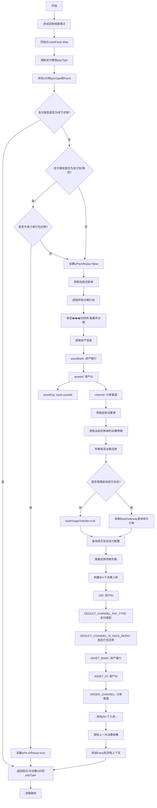
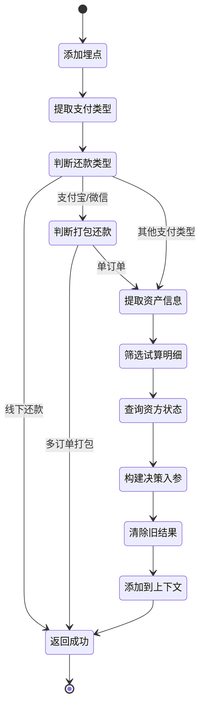

# PH160026V1 - 扣款渠道决策入参准备

## 节点信息

| 属性 | 值 |
|------|------|
| **处理器代码** | PH160026V1 |
| **节点名称** | 扣款渠道决策入参准备 |
| **节点类型** | PROCESS |
| **所属流程** | [[重资产分期制还款异步子流程V401]] |
| **执行阶段** | 决策准备阶段 |
| **实现类** | RepayApplyBizFlowPH160026V1ServiceImpl |
| **优先级** | P0（核心节点） |

## 功能说明

为扣款渠道决策引擎准备完整的决策入参（Facts），通过收集和整理资产信息、订单状态、资方状态等多维度数据,为决策引擎提供决策依据。

### 核心职责
1. **埋点记录**: 添加还款视图埋点
2. **支付类型提取**: 从支付工具列表提取支付类型
3. **打包还款判断**: 判断是否为多订单打包还款
4. **资产信息收集**: 提取资产银行、资产ID等信息
5. **分期计划筛选**: 筛选当前还款单对应的分期计划
6. **资方状态查询**: 查询资方订单和分期状态
7. **决策入参构建**: 构建30+个决策入参项
8. **上下文更新**: 将决策入参添加到流程上下文

### 适用场景

- **所有还款场景**: 除线下还款外都需要执行决策
- **决策引擎驱动**: 为Drools决策引擎提供Facts
- **渠道路由选择**: 根据决策入参选择最优扣款渠道

## 输入参数

| 参数名 | 参数代码 | 类型 | 来源 | 说明 |
|--------|----------|------|------|------|
| 用户ID | uid | String | 流程变量 | 用户唯一标识 |
| 还款申请对象 | repayApplyBo | RepayApplyBo | 流程变量 | 包含所有还款信息 |
| 当前还款单号 | currentRepaymentBillNo | String | 流程变量 | 当前处理的还款单 |
| 生命周期Token | bizSerial | String | 流程变量 | 还款流程追踪标识 |

## 输出参数

| 参数名 | 参数代码 | 类型 | 说明 |
|--------|----------|------|------|
| 决策入参集合 | routeFacts | Map | 添加到流程上下文的Facts |

## 处理流程



## 核心业务逻辑

### 1. 支付类型提取

**提取逻辑**:
从 `payToolItemList` 中获取支付类型

**校验**:
- 支付工具列表大小必须为1
- 否则抛出 `REPAY_PAY_TOOL_ERROR` 异常

**支持的支付类型**:
- `DEBIT_CARD`: 借记卡
- `ALIPAY_SDK`: 支付宝SDK
- `ALIPAY_API`: 支付宝API
- `WECHAT_PAY`: 微信支付
- `AO_OFFLINE_PAY`: 线下还款

### 2. 打包还款判断

**判断条件**:
1. 支付类型为 `ALIPAY_SDK` 或 `WECHAT_PAY`
2. 第一个还款单的 `stageOrderItemList` 大小 > 1

**业务含义**:
- 多订单打包还款: 一笔支付交易还多个订单
- 单订单还款: 一笔支付交易还一个订单

**策略影响**: 打包还款和单订单还款走不同的决策规则

### 3. 线下还款特殊处理

**条件**: `payType == AO_OFFLINE_PAY`

**处理方式**:
- 仅设置 `UID` 和 `DEDUCT_CHANNEL_PAY_TYPE`
- 直接返回成功,不设置其他入参

**原因**: 线下还款不需要复杂的渠道决策

### 4. 资产信息提取

**数据来源**: 从还款日最早的分期计划中提取

**提取字段**:
- `assetBank`: 资产银行 (BankEnum)
- `assetId`: 资产ID
- `channel`: 订单渠道
- `businessType`: 业务类型
- `stageOrderNo`: 分期订单号
- `amcCode`: AMC代码
- `bothWarrantyFeeOrder`: 是否为双担保费订单

**组合字段**: `assetKey = assetBank + "-" + assetId`

### 5. 试算明细筛选

**筛选步骤**:
1. 获取还款试算单 (`repayTrialBill`)
2. 提取试算结果中的分期还款组件
3. 根据 `stagePlanNoList` 过滤出当前还款单的试算明细

**关键判断**:
- `planAllPayOff`: 所有分期是否全额还清
- `repayScene`: 还款场景列表

### 6. 资方状态查询

**查询条件**:
- 配置检查: `checkBankAsset(bankName, assetId)` 返回false
- 未配置的资产包需要查询资方状态
- 已配置的历史老资金包按资方已结清处理

**查询接口**: `BankGateWayClient.getStageOrder()`

**请求参数** (GetStageOrderReq):
- `orderNo`: 分期订单号
- `bank`: 资产银行
- `uid`: 用户ID

**返回对象**: `BankStageOrderBo` 包含订单和分期状态

**异常处理**: 查询结果为null时抛出 `STAGE_ORDER_CAN_NOT_FOUND_FOR_QUERY`

### 7. 决策入参构建

**30+个决策入参项**:

| 入参代码 | 类型 | 说明 | 计算逻辑 |
|---------|------|------|---------|
| UID | String | 用户ID | 直接获取 |
| DEDUCT_CHANNEL_PAY_TYPE | String | 支付类型 | 从支付工具提取 |
| DEDUCT_CHANNEL_IS_PACK_REPAY | Boolean | 是否打包还款 | 判断订单数量 |
| ASSET_BANK | String | 资产银行 | 从分期计划提取 |
| ASSET_ID | String | 资产ID | 从分期计划提取 |
| ORDER_CHANNEL | String | 订单渠道 | 从分期计划提取 |
| DEDUCT_CHANNEL_IS_DOWN_BY_PLAN_COMPONENTS | Boolean | 是否有降额成分 | 计算试算组件 |
| DEDUCT_CHANNEL_IS_DOWN_BY_PLAN_ALL_COMPONENTS | Boolean | 是否全部降额 | 计算试算组件 |
| DEDUCT_CHANNEL_IS_ASSET_PAY_OFF | Boolean | 资方是否结清 | 查询资方状态 |
| DEDUCT_CHANNEL_IS_OVERDUE_LIMIT_DAYS | Boolean | 是否超逾期天数限制 | fundConfig计算 |
| DEDUCT_CHANNEL_IS_OVERDUE_LIMIT_TIME | Boolean | 是否超逾期时间限制 | fundConfig计算 |
| DEDUCT_CHANNEL_CUT_DEDUCT | Boolean | 是否截止扣款 | fundConfig检查 |
| DEDUCT_CHANNEL_IS_ALL_AMOUNT_REPAY | Boolean | 是否全额还款 | 试算明细判断 |
| DEDUCT_CHANNEL_IS_IN_DARK_TIME | Boolean | 是否在黑暗时段 | fundConfig比较 |
| DEDUCT_CHANNEL_BUSINESS_TYPE | String | 业务类型 | 从分期计划提取 |
| DEDUCT_CHANNEL_ORDER_NO | String | 订单号 | 从分期计划提取 |
| DEDUCT_CHANNEL_REPAY_WAY | String | 还款方式 | 主动/被动还款 |
| DEDUCT_CHANNEL_COMPENSATOR | String | 代偿方 | fundConfig获取 |
| DEDUCT_CHANNEL_DEDUCT_WAY | String | 扣款方式 | fundConfig获取 |
| DEDUCT_CHANNEL_PROJECT_IS_END | Boolean | 项目是否结束 | fundConfig检查 |
| DEDUCT_CHANNEL_IS_BOTH_WARRANTYFEE_ORDER | Boolean | 是否双担保费订单 | 从分期计划判断 |
| DEDUCT_CHANNEL_DEDUCT_FLAG | String | 扣款标识 | 从资方状态获取 |
| DEDUCT_CHANNEL_DEDUCT_COMPONENT | String | 扣款成分 | fundConfig获取 |
| DEDUCT_CHANNEL_FUND_ATTRIBUTE | String | 资金属性 | fundConfig获取 |
| DEDUCT_CHANNEL_PROTOCOL_PAYMENT_CONFIG | Boolean | 协议支付配置 | fundConfig获取 |
| DEDUCT_CHANNEL_CARD_FUND_SIGNED | Boolean | 卡是否资方签约 | BankGateway判断 |
| DEDUCT_CHANNEL_REPAY_SCENE_LIST | List | 还款场景列表 | 试算明细提取 |
| DEDUCT_CHANNEL_FUND_TAG | String | 资金标签 | 计算HOLD状态 |
| DEDUCT_CHANNEL_AMC_CODE | String | AMC代码 | 从分期计划提取 |

### 8. 资方HOLD标识计算

**计算方法**: `refreshFundTag()`

**判断逻辑**:
```
IF bankStageOrderBo == null THEN
    return "NORMAL"
ELSE IF 任一分期的holdFlag == true THEN
    return "HOLD"
ELSE
    return "NORMAL"
END IF
```

**业务含义**:
- `HOLD`: 资方账中,暂不扣款
- `NORMAL`: 正常状态,可扣款

### 9. 扣款标识获取

**获取方法**: `getDeductFlag()`

**逻辑**:
1. 从资方订单的分期列表中筛选当前还款单对应的分期
2. 提取第一个分期的 `deductFlag`
3. 如果没有则返回null

**用途**: 某些资方对扣款有特殊标识要求

### 10. 资方结清判断

**判断方法**: `getBankStatusByPlan()`

**判断条件** (满足任一即为true):
1. `bankStageOrderBo == null` (历史老资金包)
2. 任一分期的 `fundStatus == PAY_OFF`
3. 任一分期的 `isPreMargin == true` (预提保证金)

**业务含义**: 资方侧认为该分期已结清,影响扣款渠道选择

### 11. 卡资方签约判断

**判断接口**: `BankGateWayClient.isFundSigned()`

**参数**:
- `bankName`: 资产银行
- `uid`: 用户ID
- `protocolPaymentConfig`: 协议支付配置
- `payToolItemList`: 支付工具列表

**返回**: Boolean,表示银行卡是否与资方签约

### 12. 上一次决策结果清除

**清除字段** (6个):
- `DEDUCT_CHANNEL_DECISION_RESULT`: 决策结果
- `DEDUCT_CHANNEL_PAYMENT_DEDUCT_SUPPORTED`: Payment是否支持扣款
- `DEDUCT_CHANNEL_THREE_PARTY_SPLIT_ACCOUNT`: 三方分账
- `DEDUCT_CHANNEL_SPLIT_PROFITS_TYPE`: 分账类型
- `DEDUCT_CHANNEL_PRINCIPAL_REPAY_CHANNEL`: 本金还款渠道
- `DEDUCT_CHANNEL_PRINCIPAL_BIZ_CODE`: 本金业务代码
- `DEDUCT_CHANNEL_FEE_REPAY_CHANNEL`: 费用还款渠道
- `DEDUCT_CHANNEL_FEE_BIZ_CODE`: 费用业务代码

**原因**: 避免上一次还款单的决策结果影响当前决策

## 决策入参计算细节

### IS_DOWN_BY_PLAN_COMPONENTS (是否有降额成分)

**计算逻辑**: `DecisionRouteFactCreator.calcDownAmountForStagePlan()`

**判断**: 分期计划中是否存在降额相关的还款组件

### IS_DOWN_BY_PLAN_ALL_COMPONENTS (是否全部降额)

**计算逻辑**: `DecisionRouteFactCreator.calcDownAllAmount()`

**判断**: 分期计划的所有还款组件是否全部为降额类型

### IS_OVERDUE_LIMIT_DAYS (是否超逾期天数限制)

**计算逻辑**: `fundConfig.getIsOverdueLimit(repaymentDate, assetKey)`

**判断**: 逾期天数是否超过配置的限制

### IS_OVERDUE_LIMIT_TIME (是否超逾期时间限制)

**计算逻辑**: `fundConfig.getIsOverdueLimitTime(assetKey)`

**判断**: 逾期时间是否超过配置的时间点限制

### CUT_DEDUCT (是否截止扣款)

**计算逻辑**: `fundConfig.checkCutDeductTime(repaymentDate, assetBank, assetId)`

**判断**: 是否到达截止扣款时间

### IS_IN_DARK_TIME (是否在黑暗时段)

**计算逻辑**: `fundConfig.compareNowAndExeDate(assetKey)`

**判断**: 当前时间是否在配置的黑暗时段(不扣款时段)

### PROJECT_IS_END (项目是否结束)

**计算逻辑**: `fundConfig.checkProjectEnd(assetKey)`

**判断**: 该资产的项目是否已结束

## 状态流转



## 上游节点

- [[PH160020]] - 还款金额再次校验

## 下游节点

- [[JC-202405140002]] - 还款渠道选择路由新策略 (决策节点)

## 异常处理

| 异常场景 | 错误码 | 处理方式 | 影响 |
|----------|--------|----------|------|
| 支付工具数量!=1 | REPAY_PAY_TOOL_ERROR | 抛出异常 | 流程中断 |
| 分期计划为空 | REPAY_STAGE_PLAN_NOT_FOUND | 抛出异常 | 流程中断 |
| 资方订单查询失败 | STAGE_ORDER_CAN_NOT_FOUND_FOR_QUERY | 抛出异常 | 流程中断 |
| 资方分期列表为空 | REPAY_STAGE_PLAN_NOT_FOUND | 抛出异常 | 流程中断 |
| 入参准备异常 | - | 捕获记录警告,重新抛出 | 流程中断 |

## 监控与埋点

### 埋点记录

**埋点调用**: `repayFlowTraceProxy.repayApplyStrategy()`

**埋点数据**:
- `uid`: 用户ID
- `repayLifeToken`: 还款生命周期标识

**用途**: 记录还款视图中的决策准备事件

### 监控指标

- **入参准备成功率**: 成功次数 / 总次数
- **打包还款比例**: 打包还款次数 / 总还款次数
- **线下还款比例**: 线下还款次数 / 总还款次数
- **资方查询耗时**: P50/P95/P99
- **入参准备总耗时**: P50/P95/P99
- **各支付类型分布**: DEBIT_CARD/ALIPAY_SDK/WECHAT_PAY等占比

## 配置依赖

### FundConfig (资金配置)

**提供的配置项**:
- `getProtocolPaymentConfig()`: 资方协议支付配置
- `getIsOverdueLimit()`: 逾期天数限制
- `getIsOverdueLimitTime()`: 逾期时间限制
- `checkCutDeductTime()`: 截止扣款时间
- `compareNowAndExeDate()`: 黑暗时段判断
- `getCompensator()`: 代偿方
- `getDeductWay()`: 扣款方式
- `checkProjectEnd()`: 项目是否结束
- `getFundDeductComponent()`: 扣款成分
- `getFundAttribute()`: 资金属性

### ConfigFunctions

**checkBankAsset()**:
检查资产包是否在配置列表中,配置的历史老资金包不查询资方状态

## 数据结构

### RouteFactConstants (决策入参常量)

**30+个常量定义**:
```
UID
DEDUCT_CHANNEL_PAY_TYPE
DEDUCT_CHANNEL_IS_PACK_REPAY
ASSET_BANK
ASSET_ID
ORDER_CHANNEL
DEDUCT_CHANNEL_IS_DOWN_BY_PLAN_COMPONENTS
DEDUCT_CHANNEL_IS_DOWN_BY_PLAN_ALL_COMPONENTS
DEDUCT_CHANNEL_IS_ASSET_PAY_OFF
DEDUCT_CHANNEL_IS_OVERDUE_LIMIT_DAYS
DEDUCT_CHANNEL_IS_OVERDUE_LIMIT_TIME
DEDUCT_CHANNEL_CUT_DEDUCT
DEDUCT_CHANNEL_IS_ALL_AMOUNT_REPAY
DEDUCT_CHANNEL_IS_IN_DARK_TIME
DEDUCT_CHANNEL_BUSINESS_TYPE
DEDUCT_CHANNEL_ORDER_NO
DEDUCT_CHANNEL_REPAY_WAY
DEDUCT_CHANNEL_COMPENSATOR
DEDUCT_CHANNEL_DEDUCT_WAY
DEDUCT_CHANNEL_PROJECT_IS_END
DEDUCT_CHANNEL_IS_BOTH_WARRANTYFEE_ORDER
DEDUCT_CHANNEL_DEDUCT_FLAG
DEDUCT_CHANNEL_DEDUCT_COMPONENT
DEDUCT_CHANNEL_FUND_ATTRIBUTE
DEDUCT_CHANNEL_PROTOCOL_PAYMENT_CONFIG
DEDUCT_CHANNEL_CARD_FUND_SIGNED
DEDUCT_CHANNEL_REPAY_SCENE_LIST
DEDUCT_CHANNEL_FUND_TAG
DEDUCT_CHANNEL_AMC_CODE
```

### BankStageOrderBo (资方订单对象)

**核心字段**:
- `orderNo`: 订单号
- `stagePlans`: 分期列表 (List<BankStagePlanBo>)

### BankStagePlanBo (资方分期对象)

**核心字段**:
- `stageNo`: 分期序号
- `fundStatus`: 资方状态
- `holdFlag`: HOLD标识
- `isPreMargin`: 预提保证金标识
- `deductFlag`: 扣款标识

## 实现位置

```bash
repayengine-service/src/main/java/cn/caijiajia/repayengine/service/
├── repay/process/heavyasset/
│   └── RepayApplyBizFlowPH160026V1ServiceImpl.java  # 节点处理器 (292行)
├── configuration/
│   └── FundConfig.java                               # 资金配置
└── route/decisionroute/
    └── DecisionRouteFactCreator.java                 # 决策入参创建器
```

## 设计考虑

### 1. 为什么要准备30+个决策入参?

**原因**:
- 扣款渠道决策规则复杂,需要多维度信息
- 不同资产、不同场景的决策规则不同
- 决策引擎(Drools)需要完整的Facts才能正确匹配规则

### 2. 为什么线下还款不设置其他入参?

**原因**:
- 线下还款是手动操作,不需要自动化决策
- 仅需记录基本信息即可
- 避免不必要的数据查询

### 3. 为什么要清除上一次的决策结果?

**原因**:
- 同一还款申请可能有多个还款单
- 每个还款单需要独立决策
- 防止决策结果互相干扰

### 4. 为什么配置的历史老资金包不查询资方状态?

**原因**:
- 历史老资金包可能已迁移或下线
- 资方接口可能不可用
- 按资方已结清处理,走客账还款流程

## 相关文档

- [[决策引擎规则]] - Drools决策规则配置
- [[扣款渠道路由]] - 渠道选择逻辑
- [[资金配置中心]] - FundConfig配置说明
- [[资方接口对接]] - BankGateway接口规范
- [[决策入参手册]] - 各入参详细说明

## 标签

#节点 #决策入参 #渠道路由 #Facts构建 #PH160026V1
