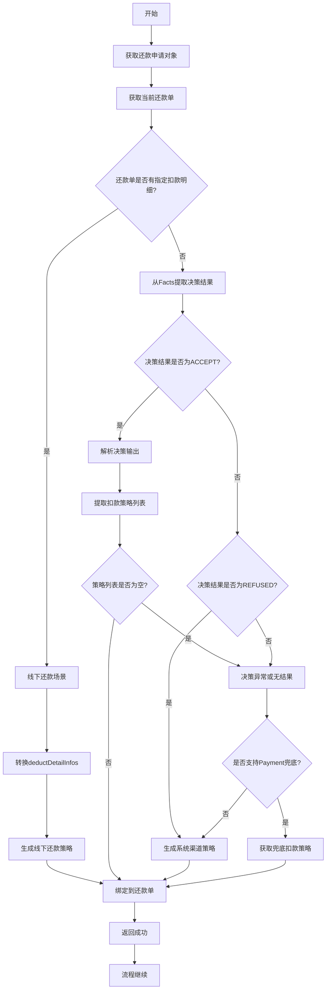
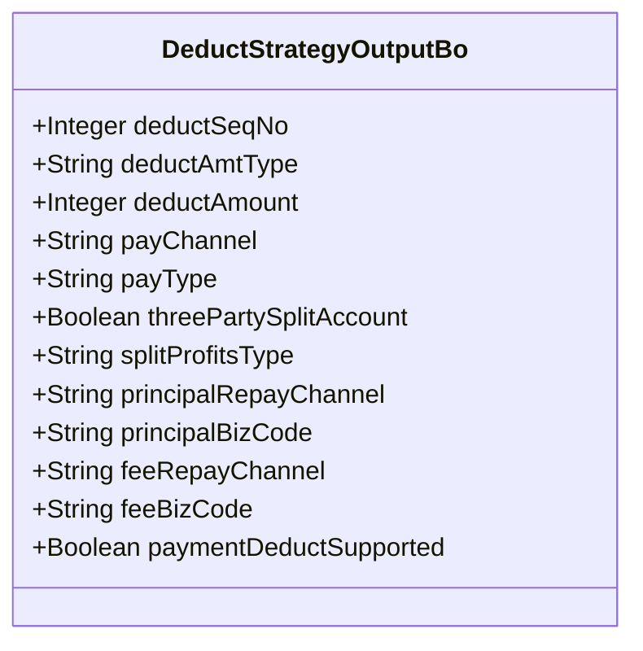
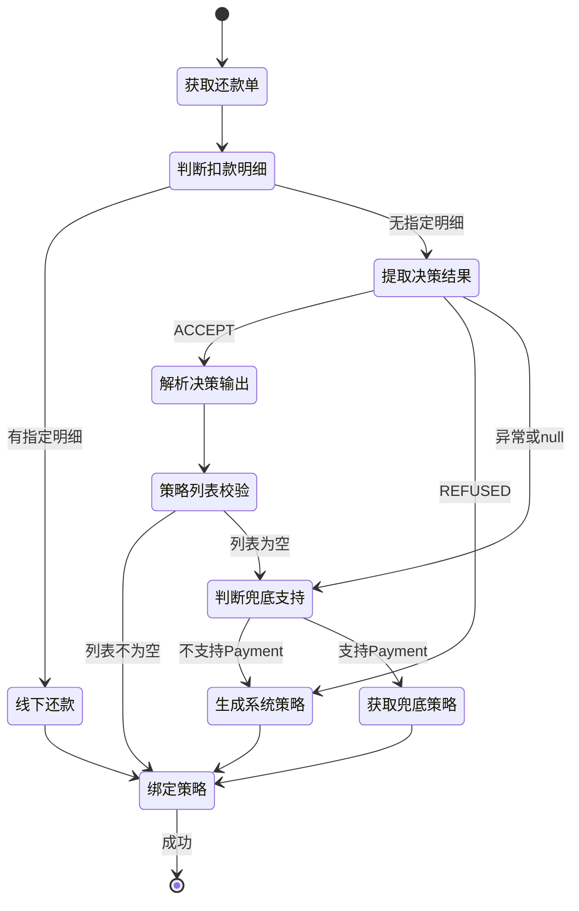

# PH160028V1 - 扣款渠道决策出参解析

## 节点信息

| 属性 | 值 |
|------|------|
| **处理器代码** | PH160028V1 |
| **节点名称** | 扣款渠道决策出参解析 |
| **节点类型** | PROCESS |
| **所属流程** | [[重资产分期制还款异步子流程V401]] |
| **执行阶段** | 决策解析阶段 |
| **实现类** | RepayApplyBizFlowPH160028V1ServiceImpl |
| **优先级** | P0（核心节点） |

## 功能说明

解析扣款渠道决策引擎的输出结果,将决策结果转换为扣款策略对象,为后续扣款单生成提供依据。支持线下还款指定扣款明细、决策成功、决策拒绝、决策异常等多种场景。

### 核心职责
1. **线下还款处理**: 处理指定扣款明细的线下还款场景
2. **决策结果解析**: 解析Drools决策引擎的Facts输出
3. **策略转换**: 将Facts转换为DeductStrategyOutputBo对象
4. **拒绝策略处理**: 决策拒绝时生成系统默认策略
5. **异常策略处理**: 决策异常时根据配置生成兜底策略
6. **策略绑定**: 将策略列表绑定到还款单对象

### 适用场景

- **正常决策**: 决策引擎返回ACCEPT,使用决策结果
- **决策拒绝**: 决策引擎返回REFUSED,使用系统渠道
- **决策异常**: 决策引擎未返回或异常,使用兜底策略
- **线下还款**: 运营指定扣款明细,直接转换

## 输入参数

| 参数名 | 参数代码 | 类型 | 来源 | 说明 |
|--------|----------|------|------|------|
| 还款申请对象 | repayApplyBo | RepayApplyBo | 流程变量 | 包含所有还款信息 |
| 当前还款单号 | currentRepaymentBillNo | String | 流程变量 | 当前处理的还款单 |
| 决策结果Facts | facts | Map | 流程上下文 | 决策引擎输出的Facts |

## 输出参数

| 参数名 | 参数代码 | 类型 | 说明 |
|--------|----------|------|------|
| 扣款策略列表 | deductChannelStrategyBoList | List | 绑定到还款单对象 |

## 处理流程



## 核心业务逻辑

### 1. 线下还款指定扣款明细

**判断条件**: `repaymentBill.getDeductDetailInfos() != null && !isEmpty()`

**转换接口**: `DeductChannelStrategyRespParser.satetyFetchOfflinePayStrategy()`

**输入**: `List<DeductDetailInfo>` 扣款明细列表

**输出**: `List<DeductStrategyOutputBo>` 扣款策略列表

**业务含义**:
运营在后台为某些特殊还款场景(如手动还款、批量还款)指定了扣款明细,直接按指定明细生成策略,不走决策引擎。

**DeductDetailInfo 包含**:
- `payChannel`: 支付渠道
- `payType`: 支付类型
- `deductAmount`: 扣款金额
- 其他扣款配置

### 2. 决策结果解析

**决策结果标识**: `RouteFactConstants.DEDUCT_CHANNEL_DECISION_RESULT`

**三种可能值**:
- `ACCEPT`: 决策通过
- `REFUSED`: 决策拒绝
- `null` 或其他: 决策异常

### 3. ACCEPT - 正常决策输出

**解析接口**: `DeductChannelStrategyRespParser.resolveDeductChannelStrategyResp()`

**输入**: `Map<String, Object> facts` 决策引擎Facts

**输出**: `List<DeductStrategyOutputBo>` 决策输出的策略列表

**解析逻辑**:
1. 从Facts中提取决策输出的字段
2. 构建DeductStrategyOutputBo对象
3. 如果列表为空,走异常处理逻辑

**可能提取的决策输出字段**:
- `DEDUCT_CHANNEL_PAYMENT_DEDUCT_SUPPORTED`: Payment是否支持
- `DEDUCT_CHANNEL_THREE_PARTY_SPLIT_ACCOUNT`: 三方分账
- `DEDUCT_CHANNEL_SPLIT_PROFITS_TYPE`: 分账类型
- `DEDUCT_CHANNEL_PRINCIPAL_REPAY_CHANNEL`: 本金还款渠道
- `DEDUCT_CHANNEL_PRINCIPAL_BIZ_CODE`: 本金业务代码
- `DEDUCT_CHANNEL_FEE_REPAY_CHANNEL`: 费用还款渠道
- `DEDUCT_CHANNEL_FEE_BIZ_CODE`: 费用业务代码

### 4. REFUSED - 决策拒绝

**生成接口**: `DeductChannelStrategyRespParser.buildDeductStrategyForSystemChannel()`

**返回**: 系统默认渠道策略

**业务含义**:
决策引擎明确拒绝了扣款,可能原因:
- 用户无可用支付渠道
- 用户被风控拒绝
- 资产不支持自动扣款

**系统渠道**: 通常指线下还款渠道或特殊处理渠道

### 5. 异常处理 - Payment兜底

**判断条件**: 决策结果不是ACCEPT也不是REFUSED

**支持判断**: `fundConfig.checkSupportPayment(assetBank, assetId)`

**两种处理方式**:

#### 5.1 不支持Payment兜底

**处理**: 生成系统渠道策略 (同REFUSED)

**配置**: 某些资产配置为不支持Payment兜底

#### 5.2 支持Payment兜底

**生成接口**: `DeductChannelStrategyRespParser.satetyFetchStrategyResp()`

**输入**: `Map<String, Object> facts` 部分Facts

**返回**: 兜底扣款策略

**业务含义**:
决策引擎异常时,使用Payment渠道作为兜底方案,确保还款流程不中断。

### 6. 策略绑定

**绑定操作**: `repaymentBill.setDeductChannelStrategyBoList(deductChannelStrategyBoList)`

**绑定位置**: 还款单对象的策略列表字段

**下游使用**: 后续节点从还款单对象中获取策略列表

## DeductStrategyOutputBo 数据结构



**核心字段**:
- `deductSeqNo`: 扣款序号,决定扣款顺序
- `deductAmtType`: 扣款金额类型 (如CUSTOMER_TOTAL, FUND_TOTAL)
- `deductAmount`: 扣款金额 (可能为null,需后续计算)
- `payChannel`: 支付渠道 (PAYMENT/PARTNER/DOCKING)
- `payType`: 支付类型 (DEBIT_CARD/ALIPAY_SDK等)
- `threePartySplitAccount`: 是否三方分账
- `splitProfitsType`: 分账类型
- `principalRepayChannel`: 本金还款渠道
- `principalBizCode`: 本金业务代码
- `feeRepayChannel`: 费用还款渠道
- `feeBizCode`: 费用业务代码
- `paymentDeductSupported`: Payment是否支持扣款

## 状态流转



## 上游节点

- [[JC-202405140002]] - 还款渠道选择路由新策略 (决策节点)

## 下游节点

- [[PH160030V1]] - 按决策结果聚合拆扣款单

## 异常处理

| 异常场景 | 处理方式 | 影响 |
|----------|----------|------|
| 指定扣款明细转换失败 | 抛出异常 | 流程中断 |
| 决策结果解析失败 | 使用兜底策略 | 继续执行 |
| 不支持Payment兜底 | 生成系统策略 | 可能线下处理 |
| 兜底策略获取失败 | 抛出异常 | 流程中断 |

## 决策输出示例

### ACCEPT 场景

**Facts输出**:
```
DEDUCT_CHANNEL_DECISION_RESULT = "ACCEPT"
DEDUCT_CHANNEL_PAYMENT_DEDUCT_SUPPORTED = true
DEDUCT_CHANNEL_THREE_PARTY_SPLIT_ACCOUNT = true
DEDUCT_CHANNEL_SPLIT_PROFITS_TYPE = "X_Y_SPLIT"
DEDUCT_CHANNEL_PRINCIPAL_REPAY_CHANNEL = "PAYMENT"
DEDUCT_CHANNEL_PRINCIPAL_BIZ_CODE = "REPAY_PRINCIPAL"
DEDUCT_CHANNEL_FEE_REPAY_CHANNEL = "PAYMENT"
DEDUCT_CHANNEL_FEE_BIZ_CODE = "REPAY_FEE"
```

**解析结果**:
- 策略输出1: Payment渠道,扣本金
- 策略输出2: Payment渠道,扣费用

### REFUSED 场景

**Facts输出**:
```
DEDUCT_CHANNEL_DECISION_RESULT = "REFUSED"
```

**生成结果**:
- 系统渠道策略 (线下处理或特殊渠道)

### 异常兜底场景

**Facts输出**:
```
DEDUCT_CHANNEL_DECISION_RESULT = null
```

**配置检查**: `checkSupportPayment(assetBank, assetId)` 返回true

**生成结果**:
- Payment兜底策略

## 配置依赖

### FundConfig.checkSupportPayment()

**功能**: 判断资产是否支持Payment兜底

**参数**:
- `assetBank`: 资产银行
- `assetId`: 资产ID

**返回**: Boolean
- `true`: 支持Payment兜底
- `false`: 不支持,使用系统渠道

**配置来源**: 资金配置中心

## 实现位置

```bash
repayengine-service/src/main/java/cn/caijiajia/repayengine/service/
├── repay/process/heavyasset/
│   └── RepayApplyBizFlowPH160028V1ServiceImpl.java  # 节点处理器 (101行)
├── configuration/
│   └── FundConfig.java                               # 资金配置
└── route/decisionroute/repaychannel/
    └── DeductChannelStrategyRespParser.java          # 决策输出解析器
```

## 监控指标

- **决策通过率**: ACCEPT次数 / 总次数
- **决策拒绝率**: REFUSED次数 / 总次数
- **兜底使用率**: 兜底策略次数 / 总次数
- **线下还款比例**: 指定明细次数 / 总次数
- **解析成功率**: 成功解析次数 / 总次数

## 设计考虑

### 1. 为什么支持指定扣款明细?

**原因**:
- 运营需要手动干预某些特殊还款
- 批量还款需要指定扣款方案
- 异常修复需要精确控制扣款

### 2. 为什么有Payment兜底策略?

**原因**:
- 决策引擎可能故障或超时
- 保证还款流程高可用
- Payment渠道稳定性高,适合兜底

### 3. 为什么REFUSED要生成系统策略?

**原因**:
- 明确拒绝不代表不还款
- 可能转人工处理或线下还款
- 记录拒绝原因,便于分析

### 4. 为什么某些资产不支持Payment兜底?

**原因**:
- 某些资金方要求必须走指定渠道
- 老资金包可能不支持Payment
- 合规要求限制扣款渠道

## 相关文档

- [[Drools决策引擎]] - 决策引擎规则配置
- [[决策输出解析器]] - DeductChannelStrategyRespParser详细说明
- [[扣款策略对象]] - DeductStrategyOutputBo字段说明
- [[兜底策略设计]] - Payment兜底逻辑
- [[线下还款流程]] - 指定扣款明细场景

## 标签

#节点 #决策输出 #策略解析 #兜底策略 #PH160028V1
