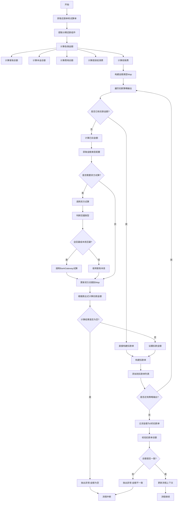
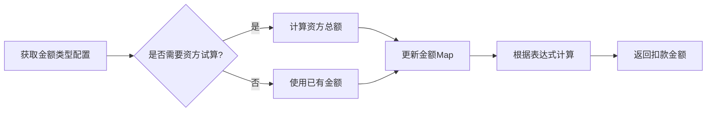
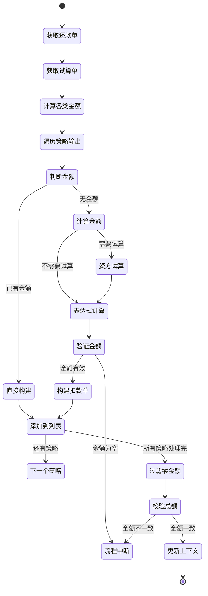

# PH160030V1 - 按决策结果聚合拆扣款单

## 节点信息

| 属性 | 值 |
|------|------|
| **处理器代码** | PH160030V1 |
| **节点名称** | 按决策结果聚合拆扣款单 |
| **节点类型** | PROCESS |
| **所属流程** | [[重资产分期制还款异步子流程V401]] |
| **执行阶段** | 扣款前准备阶段 |
| **实现类** | RepayApplyBizFlowPH160030V1ServiceImpl |
| **优先级** | P0（核心节点） |

## 功能说明

根据扣款渠道决策结果,按不同的扣款金额类型拆分生成多个扣款单,实现精细化扣款控制。

### 核心职责
1. **金额类型计算**: 计算各类金额(客账总额、本金、费用等)
2. **扣款单拆分**: 按策略输出的金额类型生成扣款单
3. **资方试算**: 全回灌场景调用资方试算获取扣款金额
4. **金额表达式计算**: 根据配置的表达式计算扣款金额
5. **金额校验**: 校验拆分后扣款单总额与还款单金额一致

### 适用场景

- **多渠道扣款**: 不同渠道分别扣款(如客账渠道、资金渠道)
- **分账扣款**: 本金和费用分开扣款
- **��回灌场景**: 资方扣款需要调用资方试算

## 输入参数

| 参数名 | 参数代码 | 类型 | 来源 | 说明 |
|--------|----------|------|------|------|
| 还款申请对象 | repayApplyBo | RepayApplyBo | 流程变量 | 包含所有还款信息 |
| 当前还款单号 | currentRepaymentBillNo | String | 流程变量 | 当前还款单 |
| 扣款策略输出 | deductChannelStrategyBoList | List | 还款单 | 渠道决策结果 |

## 输出参数

| 参数名 | 参数代码 | 类型 | 说明 |
|--------|----------|------|------|
| 当前扣款单列表 | currentDeductBillList | List | 拆分后的扣款单 |

## 处理流程



## 核心业务逻辑

### 1. 金额类型计算

**计算的金额类型**:

| 金额类型 | 枚举值 | 计算逻辑 | 说明 |
|----------|--------|----------|------|
| 客账总额 | CUSTOMER_TOTAL | 还款单金额 | 用户应还总额 |
| 本金总额 | PRINCIPAL_TOTAL | 汇总PRINCIPAL组件 | 所有分期本金之和 |
| 费用总额 | FEE_TOTAL | 汇总FEE组件 | 所有分期费用之和 |
| 提前结清费 | EARLY_SETTLE_FEE | 汇总EARLY_SETTLE_FEE组件 | 提前结清手续费 |
| 担保费 | WARRANTY_FEE | 汇总WARRANTY_FEE组件 | 担保费用 |
| 内部担保费 | WARRANTY_FEE_IN | 汇总WARRANTY_FEE_IN子组件 | 内部担保费 |
| 已扣金额 | PRE_DEDUCT_AMT | 已生成扣款单之和 | 累计已拆分金额 |
| 资方总额 | FUND_TOTAL | 资方试算或本息 | 资方应收金额 |

**计算过程**:
1. 从试算单获取分期还款组件列表
2. 按组件类型汇总金额
3. 存入金额类型Map供后续使用

### 2. 扣款策略输出处理

**DeductStrategyOutputBo 包含**:
- `deductSeqNo`: 扣款序号
- `deductAmtType`: 扣款金额类型
- `deductAmount`: 扣款金额(可能为空,需计算)
- `payChannel`: 支付渠道
- 其他扣款配置

**处理流程**:
1. 按 `deductSeqNo` 排序
2. 遍历每个策略输出
3. 计算扣款金额(如未指定)
4. 构建扣款单

### 3. 扣款金额计算

**计算时机**: 当 `deductAmount` 为空或≤0时

**计算步骤**:



**表达式示例**:
- `CUSTOMER_TOTAL`: 直接使用客账总额
- `PRINCIPAL_TOTAL + FEE_TOTAL`: 本金+费用
- `CUSTOMER_TOTAL - PRE_DEDUCT_AMT`: 总额-已扣金额
- `FUND_TOTAL`: 资方应收金额

### 4. 资方试算逻辑

**触发条件**:
- 金额类型配置中 `needFundTrial = true`
- 扣款金额类型需要资方试算

**回灌类型判断**:

**全回灌** (ALL_RECHARGE):
- 调用 BankGateway 资方试算
- 使用资方返回的应还金额

**本息回灌** (PRINCIPAL_INTEREST_RECHARGE):
- 调用 BankGateway 资方试算
- 使用资方返回的应还金额

**非回灌** (其他):
- 使用客账本息: `本金总额 + 费用总额`

**特殊资产配置**:
某些资产配置为资金扣资金应收按客账本息计算

**BankGateway试算请求**:
- `bank`: 资产银行
- `orderNo`: 分期订单号
- `uid`: 用户ID
- `stageNoList`: 分期序号列表
- `repayLiftToken`: 还款流程标识

**试算结果处理**:
```
fundTotal = min(资方试算金额, 客账总额)
```
取较小值,避免超过客账总额

### 5. 扣款单构建

**构建器**: `DeductBillBuilder.buildDeductBill()`

**输入参数**:
- `deductStrategyOutputBo`: 策略输出
- `repaymentBill`: 还款单
- `payToolItem`: 支付工具
- `stagePlanRepayList`: 分期还款列表

**生成内容**:
- `deductBillNo`: UUID生成
- `deductAmount`: 计算得到的金额
- `payChannel`: 支付渠道
- `payType`: 支付类型
- `deductSeqNo`: 扣款序号
- 其他字段从策略输出和还款单复制

### 6. 零金额扣款单过滤

**过滤逻辑**:
```
deductBillList = deductBillList.stream()
  .filter(deductAmount > 0)
  .collect(Collectors.toList())
```

**原因**:
按渠道拆分时,某些渠道可能无对应成分,金额为0,需要过滤

### 7. 金额校验

**校验逻辑**:
```
扣款单总额 = sum(deductBill.deductAmount)
还款单金额 = repaymentBill.repayAmount

if (扣款单总额 != 还款单金额) {
  抛出异常: REPAY_BILL_AMOUNT_ERROR
}
```

**重要性**: 确保金额不丢失、不重复

## 拆分示例

### 场景1: 客账+资金双渠道

**还款单金额**: 10000元
- 本金: 9000元
- 费用: 1000元

**策略输出**:
1. 客账渠道: `CUSTOMER_TOTAL` (10000元)
2. 资金渠道: `FUND_TOTAL` (9000元)

**但实际扣款**:
- 扣款单1(客账): 10000元
- 扣款单2(资金): 0元 (因为客账已扣全部)

**过滤后**:
- 扣款单1(客账): 10000元

### 场景2: 本金费用分开扣

**还款单金额**: 10000元

**策略输出**:
1. 本金渠道: `PRINCIPAL_TOTAL` (9000元)
2. 费用渠道: `FEE_TOTAL` (1000元)

**扣款单**:
- 扣款单1: 9000元
- 扣款单2: 1000元

### 场景3: 全回灌资方扣

**还款单金额**: 10000元

**策略输出**:
1. 资金渠道: `FUND_TOTAL`

**资方试算**: 返回9500元

**扣款单**:
- 扣款单1: 9500元

## 状态流转



## 上游节点

- [[PH170010V1]] - 还款单生成(包含策略输出)

## 下游节点

- [[PH160050V1]] - 限额拆单

## 异常处理

| 异常场景 | 错误码 | 处理方式 | 影响 |
|----------|--------|----------|------|
| 支付工具不唯一 | REPAY_PAY_TOOL_ERROR | 抛出异常 | 流程中断 |
| 计算金额为空 | REPAY_SPLIT_AMOUNT_NOT_EQUAL | 抛出异常 | 流程中断 |
| 扣款单总额不等于还款单 | REPAY_BILL_AMOUNT_ERROR | 抛出异常 | 流程中断 |
| 资方试算失败 | REPAY_COMPONENT_ERROR | 抛出异常 | 流程中断 |

## 配置说明

### DeductAmtTypeConfig (扣款金额类型配置)

**配置项**:
- `needFundTrial`: 是否需要资方试算
- `expressionString`: 金额计算表达式

**示例配置**:
```json
{
  "CUSTOMER_TOTAL": {
    "needFundTrial": false,
    "expressionString": "CUSTOMER_TOTAL"
  },
  "FUND_TOTAL": {
    "needFundTrial": true,
    "expressionString": "FUND_TOTAL"
  }
}
```

## 实现位置

```bash
repayengine-service/src/main/java/cn/caijiajia/repayengine/service/
├── repay/process/heavyasset/
│   └── RepayApplyBizFlowPH160030V1ServiceImpl.java  # 节点处理器
├── deduct/util/
│   └── DeductBillBuilder.java                       # 扣款单构建器
└── route/decisionroute/repaychannel/
    └── DeductChannelStrategyRespParser.java         # 金额计算器
```

## 设计考虑

### 1. 为什么需要按策略拆分?

**原因**:
- 不同渠道有不同的扣款规则
- 支持精细化控制
- 满足监管和对账要求

### 2. 为什么需要资方试算?

**原因**:
- 全回灌场景资方计算逻辑不同
- 确保资方端金额一致
- 避免对账差异

### 3. 为什么要过滤零金额扣款单?

**原因**:
- 减少无意义扣款调用
- 提高执行效率
- 避免扣款失败

## 相关文档

- [[扣款渠道决策]] - 策略输出生成
- [[资方试算逻辑]] - BankGateway试算
- [[金额类型配置]] - DeductAmtTypeConfig说明
- [[扣款单构建器]] - DeductBillBuilder实现

## 标签

#节点 #扣款拆分 #策略决策 #资方试算 #PH160030V1
