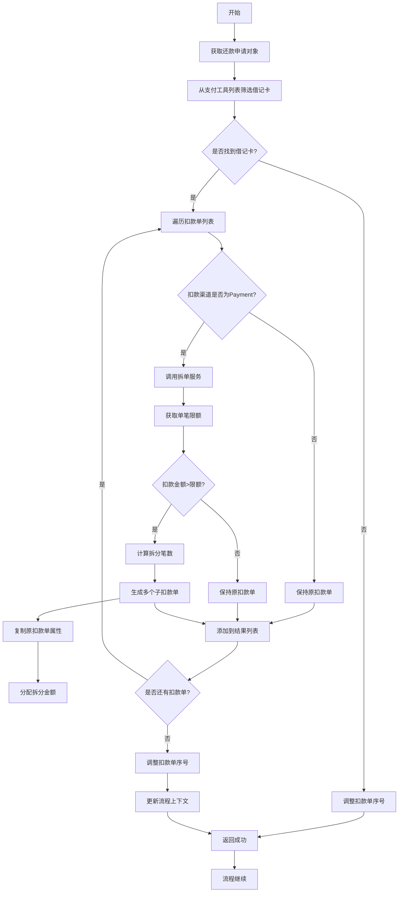
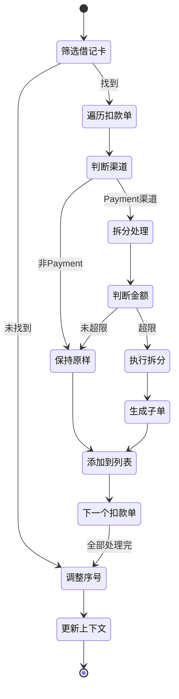

# PH160050V1 - 限额拆扣款单

## 节点信息

| 属性 | 值 |
|------|------|
| **处理器代码** | PH160050V1 |
| **节点名称** | 限额拆扣款单 |
| **节点类型** | PROCESS |
| **所属流程** | [[重资产分期制还款异步子流程V401]] |
| **执行阶段** | 扣款前准备阶段 |
| **实现类** | RepayApplyBizFlowPH160050V1ServiceImpl |
| **优先级** | P1（重要节点） |

## 功能说明

根据支付渠道的单笔限额要求,将超限的扣款单拆分成多个小额扣款单,确保每笔扣款都在限额范围内。

### 核心职责
1. **支付工具筛选**: 提取借记卡支付工具
2. **扣款单拆分**: 按Payment渠道限额拆分扣款单
3. **序号调整**: 重新分配扣款序号
4. **列表更新**: 更新流程上下文中的扣款单列表

### 适用场景

- **Payment渠道扣款**: 通过Payment渠道的借记卡扣款
- **超限额扣款**: 扣款金额超过单笔限额
- **多笔拆分**: 一笔扣款拆成多笔小额扣款

## 输入参数

| 参数名 | 参数代码 | 类型 | 来源 | 说明 |
|--------|----------|------|------|------|
| 还款申请对象 | repayApplyBo | RepayApplyBo | 流程变量 | 包含扣款单和支付工具 |
| 当前扣款单列表 | currentDeductBillList | List | 流程变量 | 待拆分的扣款单 |
| 支付工具列表 | payToolItemList | List | 流程变量 | 包含限额信息 |

## 输出参数

| 参数名 | 参数代码 | 类型 | 说明 |
|--------|----------|------|------|
| 拆分后扣款单列表 | currentDeductBillList | List | 更新到流程上下文 |

## 处理流程



## 核心业务逻辑

### 1. 借记卡支付工具筛选

**筛选条件**: `payType == DEBIT_CARD`

**筛选逻辑**:
```
payToolItemList.stream()
  .filter(payType == DEBIT_CARD)
  .findFirst()
```

**未找到处理**:
- 调整扣款单序号
- 直接返回成功
- 不进行拆分

**业务含义**: 只有借记卡扣款才需要考虑限额拆分

### 2. 扣款单拆分判断

**拆分条件**:
1. 扣款渠道为 `Payment`
2. 找到借记卡支付工具(包含限额信息)

**不拆分场景**:
- 非Payment渠道(如Partner、Docking等)
- 没有借记卡支付工具
- 扣款金额未超限额

### 3. 拆单服务调用

**接口**: `DeductBillSplitter.splitAmountForPaymentLimit()`

**输入参数**:
- `deductBill`: 原扣款单
- `payToolItem`: 支付工具(包含限额)

**拆分逻辑**:
1. 从 `payToolItem` 获取单笔限额
2. 判断扣款金额是否超限
3. 计算需要拆分的笔数: `笔数 = ceil(扣款金额 / 限额)`
4. 生成多个子扣款单
5. 分配金额: 前N-1笔为限额,最后一笔为余额

**返回结果**: `List<DeductBill>` 拆分后的扣款单列表

### 4. 扣款单序号调整

**调整时机**: 拆分完成后

**调整逻辑**:
1. 按原序号排序
2. 重新分配序号: 1, 2, 3, ...
3. 保证扣款顺序

**目的**: 保持扣款单的执行顺序

## 拆分示例

### 场景1: 单笔超限

**原扣款单**:
- 扣款金额: 15000元
- 单笔限额: 10000元

**拆分后**:
- 扣款单1: 10000元 (序号1)
- 扣款单2: 5000元 (序号2)

### 场景2: 多笔超限

**原扣款单列表**:
- 扣款单A: 25000元
- 扣款单B: 8000元

**拆分后** (限额10000):
- 扣款单A-1: 10000元 (序号1)
- 扣款单A-2: 10000元 (序号2)
- 扣款单A-3: 5000元 (序号3)
- 扣款单B: 8000元 (序号4)

### 场景3: 非Payment渠道

**原扣款单**:
- 扣款金额: 15000元
- 扣款渠道: Partner

**拆分后**:
- 保持原样,不拆分

## 状态流转



## 上游节点

- [[PH170015]] - 扣款单生成

## 下游节点

- [[PH170015]] - 扣款执行

## 数据结构

### PayToolItem (支付工具)

**关键字段**:
- `payType`: 支付类型 (DEBIT_CARD)
- `singleLimit`: 单笔限额
- `dailyLimit`: 单日限额
- `cardNo`: 卡号

### DeductBill (扣款单)

**拆分相关字段**:
- `deductBillNo`: 扣款单号
- `deductAmount`: 扣款金额
- `deductSeqNo`: 扣款序号
- `payChannel`: 支付渠道
- `parentDeductBillNo`: 父扣款单号(拆分后)

## 异常处理

| 异常场景 | 处理方式 | 影响 |
|----------|----------|------|
| 无借记卡支付工具 | 调整序号,返回成功 | 无,不拆分 |
| 拆分服务异常 | 记录警告,抛出异常 | 流程中断 |
| 限额配置缺失 | 按默认逻辑处理 | 可能不拆分 |

## 监控指标

- **拆分执行率**: 执行拆分次数 / 总扣款次数
- **拆分笔数分布**: 拆成2笔/3笔/N笔的比例
- **超限比例**: 超限扣款单 / 总扣款单
- **拆分后成功率**: 拆分后扣款成功率

## 限额配置

### 单笔限额

**来源**: Payment渠道配置

**常见限额**:
- 快捷支付: 5000-50000元
- 网银支付: 50000-500000元
- 不同银行限额不同

### 限额获取

**获取路径**:
1. 从 `PayToolItem` 获取
2. PayToolItem 从支付路由获取
3. 支付路由从Payment配置获取

## 实现位置

```bash
repayengine-service/src/main/java/cn/caijiajia/repayengine/service/
├── repay/process/heavyasset/
│   └── RepayApplyBizFlowPH160050V1ServiceImpl.java  # 节点处理器
└── deduct/util/
    └── DeductBillSplitter.java                      # 拆单工具类
```

## 设计考虑

### 1. 为什么只拆Payment渠道?

**原因**:
- Payment渠道有严格的单笔限额
- Partner、Docking渠道由对方控制
- 避免不必要的拆分

### 2. 为什么需要调整序号?

**原因**:
- 保证扣款顺序
- 拆分后序号可能不连续
- 便于追踪和排查

### 3. 拆分后如何保证原子性?

**说明**:
- 拆分只是逻辑拆分
- 每笔扣款独立执行
- 失败时可以部分成功

## 相关文档

- [[Payment限额配置]] - 限额规则说明
- [[扣款单拆分算法]] - DeductBillSplitter实现
- [[支付路由选择]] - PayToolItem生成逻辑
- [[扣款序号管理]] - 序号分配规则

## 标签

#节点 #限额拆分 #扣款单 #Payment #PH160050V1
