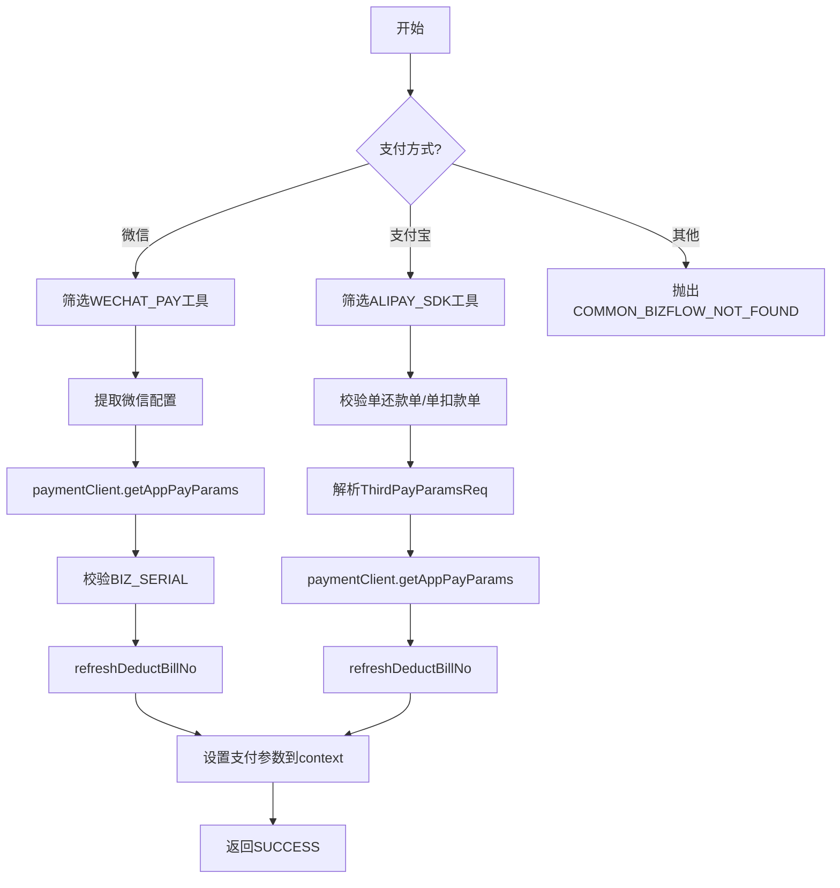

# PH160060V1 - 获取三方支付参数

## 节点信息

| 属性 | 值 |
|------|-----|
| **处理器代码** | PH160060V1 |
| **节点名称** | 获取三方支付参数 |
| **节点类型** | PROCESS |
| **所属流程** | [[重资产分期制还款同步流程V401]] |
| **执行阶段** | 扣款单处理阶段 |
| **实现类** | RepayApplyBizFlowPH160060V1ServiceImpl |

## 功能说明

获取支付宝/微信等三方支付平台的支付参数，支持APP支付唤起所需的参数获取。

### 核心职责
1. **微信支付参数获取**: 提取配置，调用支付网关
2. **支付宝支付参数获取**: 提取配置，调用支付网关
3. **扣款单号刷新**: 用支付服务返回的流水号更新

## 处理流程



## 核心业务逻辑

### 1. 微信支付处理
- 从扩展信息提取微信配置
- 设置 bizCode 为当前扣款单号
- 校验返回的 EXTEND 中包含 BIZ_SERIAL

### 2. 支付宝支付处理
- 校验单还款单、单非废弃扣款单
- 从配置解析 ThirdPayParamsReq

### 3. 扣款单号刷新 (refreshDeductBillNo)
- 用支付服务返回的 serial 更新 payInstrumentNo

## 异常处理

| 异常场景 | 错误码 |
|----------|--------|
| 配置缺失 | WECHAT_PAY_TOOL_NOT_FOUND |
| 参数返回为空 | WECHAT_PAY_PARAMS_ERROR |
| 多还款单/多扣款单 | REPAY_DEDUCT_BILL_SPLIT_ERROR |
| 非微信非支付宝 | COMMON_BIZFLOW_NOT_FOUND |

## 实现位置

```bash
repayengine-service/src/main/java/cn/caijiajia/repayengine/service/repay/process/heavyasset/
└── RepayApplyBizFlowPH160060V1ServiceImpl.java
```

## 相关文档
- [[重资产分期制还款同步流程V401]] - 所属业务流
- [[PH160030V1]] - 上游节点：BY决策结果聚合拆扣款单
- [[PH160090]] - 下游节点：保存扣款单

## 标签
#节点 #三方支付 #微信 #支付宝 #PH160060V1