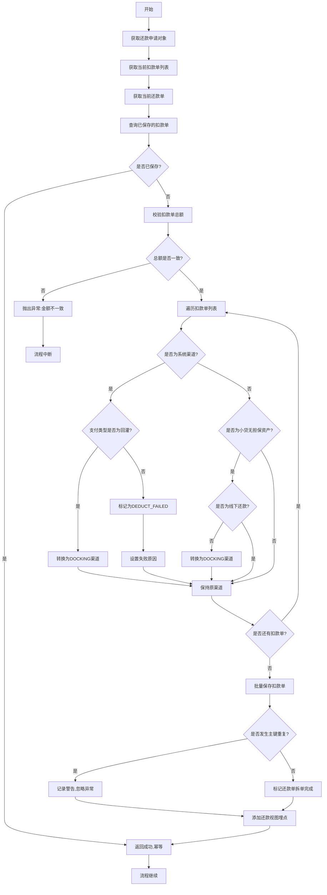
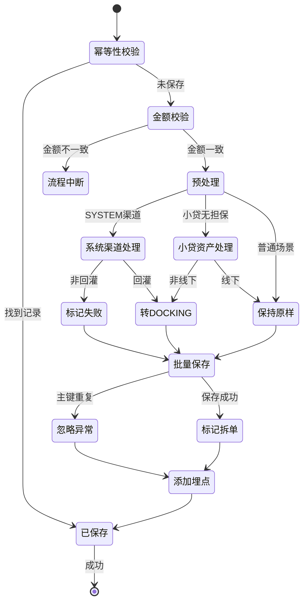

# PH160090 - 保存扣款单

## 节点信息

| 属性 | 值 |
|------|------|
| **处理器代码** | PH160090 |
| **节点名称** | 保存扣款单 |
| **节点类型** | PROCESS |
| **所属流程** | [[重资产分期制还款异步子流程V401]] |
| **执行阶段** | 扣款准备阶段 |
| **实现类** | RepayApplyBizFlowPH160090ServiceImpl |
| **优先级** | P0（核心节点） |

## 功能说明

将拆分和聚合后的扣款单持久化到数据库,并根据业务规则对扣款单进行预处理(如系统渠道失败标记、小贷无担保资产渠道转换等),为后续扣款执行提供数据基础。

### 核心职责
1. **幂等性校验**: 检查扣款单是否已保存,防止重复插入
2. **金额校验**: 校验扣款单总额与还款单金额一致
3. **系统渠道处理**: 处理决策异常的系统渠道扣款单
4. **小贷无担保转换**: 特定资产转为资方扣款
5. **批量保存**: 批量插入扣款单到数据库
6. **埋点记录**: 添加还款视图埋点
7. **拆单标记**: 标记还款单已完成拆单

### 适用场景

- **所有扣款场景**: 扣款单必须先持久化才能执行
- **异常重试**: 支持幂等性,重试不会重复插入
- **特殊资产处理**: 小贷无担保资产的渠道转换

## 输入参数

| 参数名 | 参数代码 | 类型 | 来源 | 说明 |
|--------|----------|------|------|------|
| 还款申请对象 | repayApplyBo | RepayApplyBo | 流程变量 | 包含所有还款信息 |
| 当前扣款单列表 | currentDeductBillList | List | 流程变量 | 待保存的扣款单 |
| 当前还款单号 | currentRepaymentBillNo | String | 流程变量 | 当前处理的还款单 |
| 用户ID | uid | String | 流程变量 | 用户唯一标识 |
| 生命周期Token | bizSerial | String | 流程变量 | 还款流程追踪标识 |

## 输出参数

| 参数名 | 参数代码 | 类型 | 说明 |
|--------|----------|------|------|
| 无 | - | - | 扣款单保存到数据库 |

## 处理流程



## 核心业务逻辑

### 1. 幂等性校验

**查询接口**: `deductBillService.getByRepaymentBillNo(repaymentBillNo)`

**查询条件**: 根据还款单号查询已保存的扣款单

**处理逻辑**:
- 如果查询结果不为空,说明已保存,直接返回成功
- 如果查询结果为空,继续执行保存逻辑

**触发场景**:
- 节点异常重试
- 流程重放
- 极小概率的并发场景

### 2. 金额校验

**校验方法**: `checkDeductBillAmount()`

**校验逻辑**:
```
扣款单总额 = sum(deductBill.deductAmount)
还款单金额 = repaymentBill.repayAmount

IF 扣款单总额 != 还款单金额 THEN
    抛出异常: REPAY_BILL_AMOUNT_ERROR
END IF
```

**异常信息**: 包含扣款单总额和还款单金额,便于排查

**重要性**: 确保金额不丢失、不重复

### 3. 系统渠道处理

**判断条件**: `payChannel == SYSTEM`

**业务含义**:
决策引擎异常时且没有使用兜底策略,payChannel被设置为SYSTEM,表示无可用扣款渠道。

#### 3.1 非回灌场景

**判断**: `!PayType.isSuccessRecharge(payType)`

**处理**:
- 设置扣款状态: `DEDUCT_FAILED`
- 设置扣款描述: "扣款失败"
- 设置扩展信息message: "易盾配置异常"
- 设置标准码: "DEFAULT_STANDARD_CODE"

**业务含义**: 非回灌场景无法扣款,直接标记失败,后续不再执行扣款

#### 3.2 回灌场景

**判断**: `PayType.isSuccessRecharge(payType)`

**处理**:
- 转换payChannel: `SYSTEM` → `DOCKING`

**业务含义**: 回灌场景即使决策异常也要尝试资方扣款,因为资方可能已扣款成功

**回灌支付类型**:
- `ALIPAY_SUCCESS_RECHARGE`: 支付宝成功回灌
- `WECHAT_SUCCESS_RECHARGE`: 微信成功回灌
- 其他成功回灌类型

### 4. 小贷无担保资产转换

**配置检查**: `grayApiConfigs.getXdUnsecuredAssetList().contains(assetId)`

**判断条件**:
1. assetId在小贷无担保资产列表中
2. 支付类型不是线下还款

**处理**: 转换payChannel: 任意渠道 → `DOCKING`

**业务含义**:
小贷无担保资产需要走资方扣款渠道,不走Payment等其他渠道

**线下还款例外**: 线下还款不转换,保持原渠道

### 5. 批量保存

**保存接口**: `deductBillService.batchSaveDeductBill()`

**参数**:
- `deductBillList`: 扣款单列表
- `source`: 来源标识 ("REPAY_ENGINE")

**保存操作**:
- 批量插入到 `t_deduct_bill` 表
- 生成Event事件(可能)
- 更新相关缓存

**异常处理**: 捕获 `DuplicateKeyException` 主键重复异常

### 6. 主键重复处理

**捕获异常**: `DuplicateKeyException`

**处理方式**: 记录警告日志,忽略异常

**原因**:
- 极小概率的并发场景
- 异常重试可能导致重复插入
- 幂等性校验可能有时序问题

**日志内容**: 包含扣款单列表详细信息

### 7. 拆单完成标记

**标记操作**: `repaymentBill.setSplitDeduct(Boolean.TRUE)`

**标记含义**: 该还款单已完成拆单和保存

**下游使用**: 后续节点判断是否已拆单

### 8. 埋点记录

**埋点调用**: `repayFlowTraceProxy.applyDeductBill()`

**埋点数据**:
- `uid`: 用户ID
- `repayLifeToken`: 还款生命周期标识

**用途**: 记录还款视图中的扣款单创建事件

## 扣款单状态说明

**初始状态**: 大部分扣款单状态为 `INIT` (待扣款)

**特殊状态**: 系统渠道非回灌场景直接设为 `DEDUCT_FAILED`

**状态流转**:
```
INIT → PROCESSING → SUCCESS/FAILED
```

**直接失败**: `DEDUCT_FAILED` 不再流转,跳过扣款执行

## 渠道转换规则

**转换场景汇总**:

| 原渠道 | 条件 | 转换后渠道 | 原因 |
|--------|------|-----------|------|
| SYSTEM | 回灌场景 | DOCKING | 资方可能已扣款 |
| 任意 | 小贷无担保+非线下 | DOCKING | 必须走资方扣款 |

**不转换场景**:
- 系统渠道+非回灌: 直接失败,不转换
- 小贷无担保+线下还款: 保持线下渠道

## 状态流转



## 上游节点

- [[PH160050V1]] - 限额拆扣款单

## 下游节点

- [[PH170015]] - 扣款执行

## 异常处理

| 异常场景 | 错误码 | 处理方式 | 影响 |
|----------|--------|----------|------|
| 金额不一致 | REPAY_BILL_AMOUNT_ERROR | 抛出异常 | 流程中断 |
| 主键重复 | - | 记录警告,忽略 | 无影响 |
| 数据库异常 | - | 重新抛出 | 流程中断 |
| 节点处理异常 | - | 记录警告,重新抛出 | 流程中断 |

## 数据库表

### t_deduct_bill (扣款单表)

**核心字段**:
- `deduct_bill_no`: 扣款单号 (主键)
- `repayment_bill_no`: 还款单号
- `uid`: 用户ID
- `deduct_amount`: 扣款金额
- `deduct_status`: 扣款状态
- `deduct_desc`: 扣款描述
- `pay_channel`: 支付渠道
- `pay_type`: 支付类型
- `deduct_seq_no`: 扣款序号
- `ext_info`: 扩展信息 (JSON)

**索引**:
- `idx_repayment_bill_no`: 还款单号索引
- `idx_uid`: 用户ID索引

## 配置说明

### 小贷无担保资产列表

**配置项**: `grayApiConfigs.getXdUnsecuredAssetList()`

**配置内容**: 小贷无担保的assetId列表

**用途**: 判断是否需要转换为资方扣款

**配置示例**: `["XD_ASSET_001", "XD_ASSET_002"]`

## 实现位置

```bash
repayengine-service/src/main/java/cn/caijiajia/repayengine/service/
├── repay/process/heavyasset/
│   └── RepayApplyBizFlowPH160090ServiceImpl.java  # 节点处理器 (127行)
├── bill/
│   └── IDeductBillService.java                    # 扣款单服务
└── flowtrace/
    └── RepayFlowTraceProxy.java                   # 埋点代理
```

## 监控指标

- **保存成功率**: 成功保存次数 / 总次数
- **幂等命中率**: 幂等返回次数 / 总次数
- **主键重复率**: 重复异常次数 / 总次数
- **系统渠道比例**: SYSTEM渠道次数 / 总次数
- **小贷转换比例**: 转DOCKING次数 / 总次数
- **直接失败比例**: DEDUCT_FAILED次数 / 总次数
- **保存耗时**: P50/P95/P99

## 设计考虑

### 1. 为什么需要幂等性校验?

**原因**:
- 节点可能异常重试
- 流程可能重放
- 防止重复插入导致数据混乱

### 2. 为什么回灌场景要转DOCKING?

**原因**:
- 回灌表示资方可能已扣款成功
- 需要查询资方扣款结果
- 不能直接标记失败

### 3. 为什么小贷无担保必须走资方?

**原因**:
- 小贷无担保的资金方要求
- 合规要求,必须由资方控制扣款
- Payment等渠道不支持该类资产

### 4. 为什么要忽略主键重复异常?

**原因**:
- 极小概率的并发场景
- 幂等性校验已处理大部分情况
- 重复插入不影响业务正确性

## 相关文档

- [[扣款单数据模型]] - DeductBill字段详细说明
- [[扣款状态机]] - 扣款状态流转规则
- [[系统渠道处理]] - SYSTEM渠道的业务含义
- [[小贷无担保资产]] - 特殊资产处理规则
- [[回灌机制]] - 成功回灌业务逻辑

## 标签

#节点 #扣款单保存 #数据持久化 #渠道转换 #PH160090
