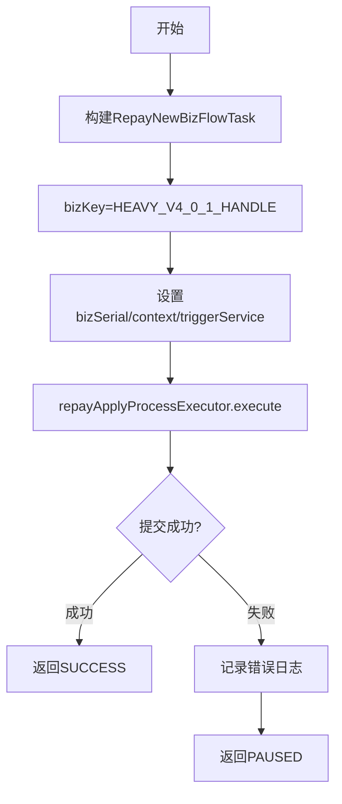

# PH161010V1 - 启动异步流程

## 节点信息

| 属性 | 值 |
|------|-----|
| **处理器代码** | PH161010V1 |
| **节点名称** | 启动异步流程 |
| **节点类型** | PROCESS |
| **所属流程** | [[重资产分期制还款同步流程V401]] |
| **执行阶段** | 异步启动阶段 |
| **实现类** | RepayApplyBizFlowPH161010V1ServiceImpl |

## 功能说明

将还款处理任务提交到线程池，异步启动重资产还款处理主流程。同步流程到此节点后不再等待后续处理结果。

### 核心职责
1. **异步任务构建**: 构建RepayNewBizFlowTask
2. **任务提交**: 提交到还款申请处理线程池
3. **失败处理**: 提交失败返回PAUSED（支持重试）

## 处理流程



## 核心业务逻辑

### 1. 异步任务构建
- bizKey: `BIZFLOW_BIZ_KEY_HEAVY_V4_0_1_HANDLE`
- bizSerial: 从repayContext获取
- 非阻塞，主流程不等待执行结果

### 2. 失败处理
- 返回 PAUSED（非FAILED），允许重试

## 异常处理

| 异常场景 | 处理方式 |
|----------|----------|
| CjjServerException | 返回PAUSED |
| 线程池满 | 返回PAUSED |

## 实现位置

```bash
repayengine-service/src/main/java/cn/caijiajia/repayengine/service/repay/process/heavyasset/
└── RepayApplyBizFlowPH161010V1ServiceImpl.java
```

## 相关文档
- [[重资产分期制还款同步流程V401]] - 所属业务流
- [[重资产分期制还款异步主流程V401]] - 启动的异步主流程
- [[PH161060]] - 下游节点：组织还款受理结果报文

## 标签
#节点 #异步启动 #任务提交 #PH161010V1