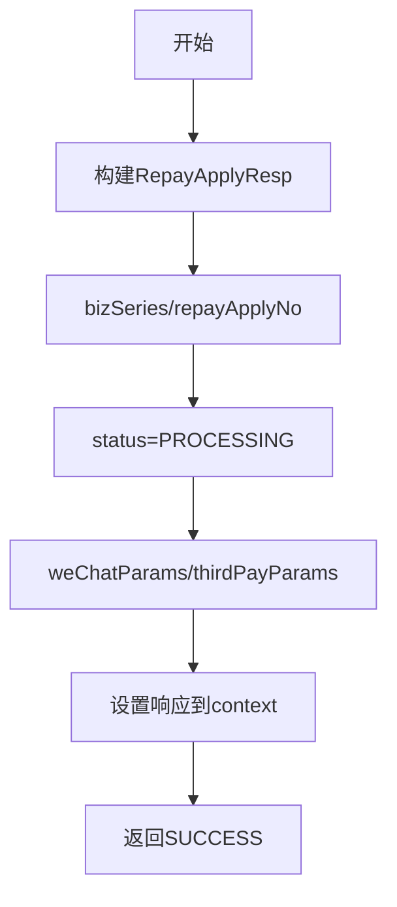

# PH161060 - 组织还款受理结果报文

## 节点信息

| 属性 | 值 |
|------|-----|
| **处理器代码** | PH161060 |
| **节点名称** | 组织还款受理结果报文 |
| **节点类型** | PROCESS |
| **所属流程** | [[重资产分期制还款同步流程V401]] |
| **执行阶段** | 响应组织阶段 |
| **实现类** | RepayApplyBizFlowPH161060ServiceImpl |

## 功能说明

同步流程最后一个处理节点，组织还款受理结果响应报文返回调用方。

### 核心职责
1. **响应构建**: 构建RepayApplyResp响应对象
2. **状态设置**: PROCESSING（异步处理中）
3. **支付参数传递**: 微信/支付宝支付参数

## 处理流程



## 响应报文字段

| 字段 | 来源 | 说明 |
|------|------|------|
| bizSeries | context | 业务流水号 |
| repayApplyNo | bo | 还款申请号 |
| status | PROCESSING | 异步处理中 |
| desc | 状态枚举描述 | 状态说明 |
| message | context消息 | 自定义消息 |
| weChatParams | PH160060V1设置 | 微信支付参数 |
| thirdPayParams | PH160060V1设置 | 三方支付参数 |

## 异常处理

| 异常场景 | 处理方式 |
|----------|----------|
| 无异常处理 | 纯数据组装，始终返回SUCCESS |

## 实现位置

```bash
repayengine-service/src/main/java/cn/caijiajia/repayengine/service/repay/process/heavyasset/
└── RepayApplyBizFlowPH161060ServiceImpl.java
```

## 相关文档
- [[重资产分期制还款同步流程V401]] - 所属业务流
- [[PH161010V1]] - 上游节点：启动异步流程

## 标签
#节点 #响应报文 #同步返回 #PH161060