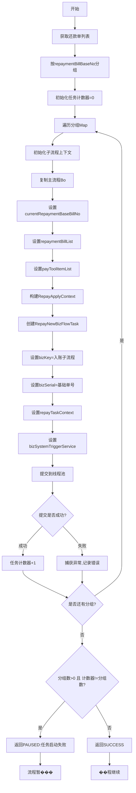
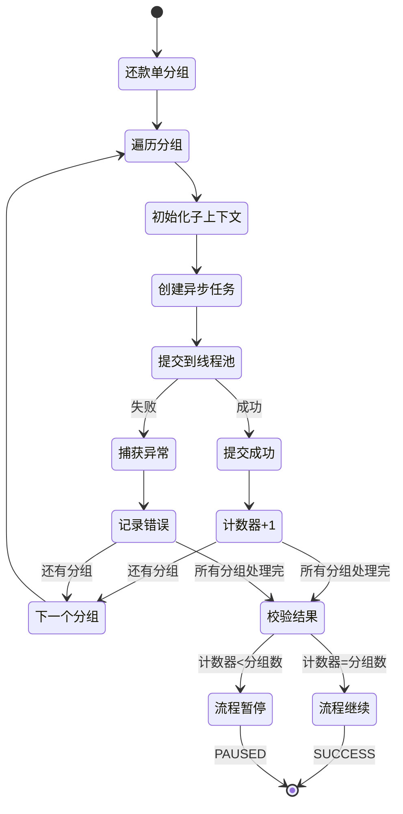

# PH170005V1 - 开启异步子流程

## 节点信息

| 属性 | 值 |
|------|-----|
| **处理器代码** | PH170005V1 |
| **节点名称** | 开启异步子流程 |
| **节点类型** | PROCESS |
| **所属流程** | [[重资产分期制还款异步主流程V401]] |
| **执行阶段** | 主流程分发阶段 |
| **实现类** | RepayApplyBizFlowPH170005V1ServiceImpl |
| **优先级** | P0（核心节点） |

## 功能说明

按还款单基础号（repaymentBillBaseNo）分组还款单,为每个分组异步启动独立的入账子流程,实现并行处理扣款和入账,提高还款处理效率。

### 核心职责
1. **还款单分组**: 按repaymentBillBaseNo分组还款单
2. **子流程上下文初始化**: 为每个分组构建独立的RepayApplyContext
3. **异步任务创建**: 构建RepayNewBizFlowTask对象
4. **任务提交**: 提交到线程池异步执行
5. **任务计数**: 统计成功提交的任务数量
6. **结果校验**: 验证所有分组是否都成功启动子流程

### 适用场景

- **单笔还款**: 1个分组,1个子流程
- **多笔还款**: N个分组,N个子流程并行
- **提前结清**: 多期还款单,按分组并行处理

## 输入参数

| 参数名 | 参数代码 | 类型 | 来源 | 说明 |
|--------|----------|------|------|------|
| 还款申请对象 | repayApplyBo | RepayApplyBo | 流程变量 | 包含所有还款信息 |
| 还款单列表 | repaymentBillList | List | RepayApplyBo | 所有还款单 |

## 输出参数

| 参数名 | 参数代码 | 类型 | 说明 |
|--------|----------|------|------|
| 无 | - | - | 启动异步任务,不等待返回 |

## 处理流程



## 核心业务逻辑

### 1. 还款单分组

**分组依据**: `repaymentBillBaseNo` (还款单基础号)

**分组操作**:
```
repaymentBillList.stream()
  .collect(Collectors.groupingBy(BaseRepaymentBill::getRepaymentBillBaseNo))
```

**返回结果**: `Map<String, List<BaseRepaymentBill>>`
- Key: repaymentBillBaseNo
- Value: 该分组下的所有还款单列表

**业务含义**:
- 同一个repaymentBillBaseNo的还款单属于同一个还款单元
- 一个还款单元对应一个子流程
- 不同还款单元的子流程可以并行执行

**分组示例**:
```
还款申请号: APPLY20240319001

分组1 (BASE_001):
  - 还款单1: BILL_001_01 (还款模式A)
  - 还款单2: BILL_001_02 (还款模式B)

分组2 (BASE_002):
  - 还款单3: BILL_002_01 (还款模式A)

分组3 (BASE_003):
  - 还款单4: BILL_003_01 (还款模式A)

结果: 启动3个并行子流程
```

### 2. 子流程上下文初始化

**初始化方法**: `initSubRepayApplyContext()`

**构建步骤**:

#### 2.1 创建子流程Bo
```
RepayApplyBo repayApplyBo = RepayApplyBo.builder().build()
```

#### 2.2 复制主流程Bo属性
```
BeanUtils.copyProperties(repayContext.getBo(), repayApplyBo)
```

**复制的属性**:
- repayApplyNo: 还款申请号
- uid: 用户ID
- repayWay: 还款方式
- repayDate: 还款日期
- 其他业务字段

#### 2.3 设置子流程特有字段
- `currentRepaymentBaseBillNo`: 当前处理的还款单基础号 (分组Key)
- `repaymentBillList`: 所有还款单列表 (不是分组子集)
- `payToolItemList`: 支付工具列表

**注意**: `repaymentBillList` 设置的是全量列表,不是当前分组的子列表,子流程会根据`currentRepaymentBaseBillNo`自行筛选。

#### 2.4 构建子流程Context
```
RepayApplyContext.builder()
  .req(repayContext.getReq())
  .bo(repayApplyBo)
  .uid(repayContext.getUid())
  .bizSerial(repayContext.getBizSerial())
  .build()
```

**关键字段**:
- `req`: 请求对象 (原始请求)
- `bo`: 业务对象 (子流程Bo)
- `uid`: 用户ID
- `bizSerial`: 主流程业务流水号

### 3. 异步任务创建

**任务类**: `RepayNewBizFlowTask`

**构建参数**:
- `bizKey`: `BIZFLOW_BIZ_KEY_HEAVY_V4_0_1_INCOME` (入账子流程的业务流Key)
- `bizSerial`: `repaymentBillBaseNo` (子流程业务流水号,用于分组标识)
- `repayTaskContext`: 子流程上下文对象
- `bizSystemTriggerService`: 业务流触发服务

**任务执行**: 任务提交到线程池后,会调用`bizSystemTriggerService`启动子流程

### 4. 任务提交

**线程池**: `repayBatchIncomeProcessExecutor`

**提交操作**: `repayBatchIncomeProcessExecutor.submit(repayBatchIncomeBizTask)`

**提交方式**: 异步非阻塞,主流程不等待子流程执行

**异常捕获**: 捕获`CjjServerException`,记录错误但不中断循环

### 5. 任务计数

**计数器**: `AtomicInteger taskCounter = new AtomicInteger(0)`

**计数操作**: 每成功提交一个任务,计数器 +1

**用途**: 校验所有分组是否都成功启动子流程

### 6. 结果校验

**校验逻辑**:
```
IF repaymentBillMap不为空 AND taskCounter != repaymentBillMap.size() THEN
    返回 PAUSED: "批量入账任务启动失败"
ELSE
    返回 SUCCESS
END IF
```

**校验含义**:
- 分组数 = 应启动的子流程数
- 计数器 = 实际成功启动的子流程数
- 两者不一致说明部分任务提交失败

**失败处理**: 返回PAUSED,触发主流程重试

## 子流程说明

### 子流程Key

**bizKey**: `BIZFLOW_BIZ_KEY_HEAVY_V4_0_1_INCOME`

**对应流程**: [[重资产分期制还款异步子流程V401]]

**子流程职责**:
- 扣款执行
- 客账入账
- 资方入账
- 清分试算
- 额度恢复
- 结清返现
- 等等

### 子流程业务流水号

**bizSerial**: `repaymentBillBaseNo`

**用途**:
- 唯一标识子流程实例
- 关联还款单分组
- 流程追踪和监控

### 子流程并行

**并行度**: 等于分组数

**示例**:
- 3个分组 → 3个子流程并行
- 总耗时 ≈ max(子流程1耗时, 子流程2耗时, 子流程3耗时)

**优势**:
- 提高还款处理效率
- 缩短用户等待时间
- 充分利用服务器资源

## 状态流转



## 上游节点

- 主流程入口 (TRIGGER_METHOD)

## 下游节点

- [[PH170080]] - 等待子流程结束

## 异常处理

| 异常场景 | 错误类型 | 处理方式 | 影响 |
|----------|----------|----------|------|
| 线程池队列已满 | CjjServerException | 记录错误,继续提交其他任务 | 计数器不增加 |
| 上下文初始化失败 | RuntimeException | 记录错误,继续提交其他任务 | 计数器不增加 |
| 部分任务提交失败 | - | 返回PAUSED | 触发重试 |
| 所有任务提交成功 | - | 返回SUCCESS | 流程继续 |

## 线程池配置

### Bean名称

`repayBatchIncomeProcessExecutor`

### 作用

专门用于批量入账异步处理

### 配置建议

- **核心线程数**: 根据服务器核心数配置 (如8核)
- **最大线程数**: 核心线程数的2倍 (如16)
- **队列容量**: 根据业务量配置 (如1000)
- **拒绝策略**: CallerRunsPolicy (调用者执行)

### 隔离性

与其他业务线程池隔离,避免相互影响

## 监控指标

- **子流程启动成功率**: 成功数 / 分组数
- **平均分组数**: 总分组数 / 总还款次数
- **线程池队列使用率**: 队列长度 / 队列容量
- **任务提交耗时**: P50/P95/P99
- **分组数分布**: 1组/2组/3组/...的比例

## 性能优化

### 并行处理

**优势**: 多个还款单组同时处理,缩短总耗时

**效果**:
- ���组: 耗时T
- 3组并行: 耗时 ≈ T (而不是3T)

### 异步执行

**优势**: 主流程不阻塞,立即返回

**效果**: 主流程耗时仅为任务提交时间,不包含子流程执行时间

### 资源隔离

**优势**: 独立线程池,避免影响其他业务

**效果**: 还款业务高峰不影响其他业务

## 实现位置

```bash
repayengine-service/src/main/java/cn/caijiajia/repayengine/service/
├── repay/process/heavyasset/
│   └── RepayApplyBizFlowPH170005V1ServiceImpl.java  # 节点处理器 (107行)
└── repay/task/
    └── RepayNewBizFlowTask.java                      # 异步任务类
```

## 设计考虑

### 1. 为什么要按repaymentBillBaseNo分组?

**原因**:
- 同一个repaymentBillBaseNo的还款单属于同一个还款单元
- 还款单元内的还款单可能因还款模式拆分
- 一个还款单元对应一个完整的扣款和入账流程

### 2. 为什么子流程接收全量还款单列表?

**原因**:
- 简化接口设计,子流程自行筛选
- 避免分组逻辑重复
- 子流程可以看到所有还款单,便于跨分组逻辑

### 3. 为什么要校验计数器?

**原因**:
- 部分任务提交失败会导致子流程缺失
- 缺失的子流程不会执行,导致还款不完整
- 重试可以弥补提交失败的任务

### 4. 为什么使用独立线程池?

**原因**:
- 还款业务量大,高峰期并发高
- 独立线程池便于监控和调优
- 避免影响其他业务

## 相关文档

- [[重资产分期制还款异步主流程V401]] - 主流程设计
- [[重资产分期制还款异步子流程V401]] - 子流程详细设计
- [[还款单拆分规则]] - 为什么会有多个还款单
- [[PH170080]] - 等待子流程结束节点
- [[RepayNewBizFlowTask]] - 异步任务实现

## 标签

#节点 #异步子流程 #并行处理 #任务分发 #PH170005V1
