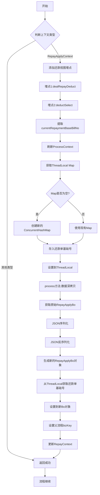
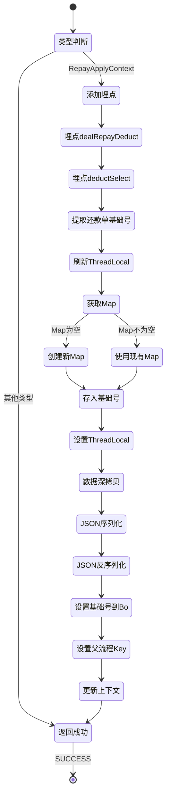

# PH170007 - 子流程开始节点处理数据序列号

## 节点信息

| 属性 | 值 |
|------|------|
| **处理器代码** | PH170007 |
| **节点名称** | 子流程开始节点处理数据序列号 |
| **节点类型** | PROCESS |
| **所属流程** | [[重资产分期制还款异步子流程V401]] |
| **执行阶段** | 子流程入口阶段 |
| **实现类** | RepayApplyBizFlowPH170007ServiceImpl |
| **优先级** | P0（核心节点） |

## 功能说明

异步子流程的入口节点,负责从主流程接收还款上下文,进行数据深拷贝序列化,设置子流程的业务流水号,并添加还款视图埋点,为后续扣款处理做准备。

### 核心职责
1. **还款视图埋点**: 添加扣款处理和扣款选择埋点
2. **数据深拷贝**: 通过JSON序列化/反序列化避免线程变量共享
3. **业务流水号设置**: 设置当前子流程的业务流水号为还款单基础号
4. **线程局部变量刷新**: 将还款单基础号存入ThreadLocal
5. **父流程关联**: 设置父流程bizKey用于流程追踪

### 适用场景

- **所有异步子流程**: 每个异步子流程都需要执行此节点
- **多线程隔离**: 确保不同子流程的数据互不影响
- **流程追踪**: 建立主子流程关联关系

## 输入参数

| 参数名 | 参数代码 | 类型 | 来源 | 说明 |
|--------|----------|------|------|------|
| 还款申请对象 | repayApplyBo | RepayApplyBo | 主流程传递 | 包含所有还款信息 |
| 当前还款单基础号 | currentRepaymentBaseBillNo | String | RepayApplyBo | 子流程处理的分组标识 |
| 用户ID | uid | String | RepayContext | 用户唯一标识 |
| 业务流水号 | bizSerial | String | RepayContext | 主流程生命周期Token |

## 输出参��

| 参数名 | 参数代码 | 类型 | 说明 |
|--------|----------|------|------|
| 深拷贝后的Bo | repayApplyBo | RepayApplyBo | 绑定到子流程上下文 |
| 父流程Key | parentBizKey | String | 设置为主流程bizKey |

## 处理流程



## 核心业务逻辑

### 1. 还款视图埋点

**埋点位置**: `initFacts()` 方法

**埋点调用**:
1. `repayFlowTraceProxy.dealRepayDeduct()` - 扣款处理埋点
2. `repayFlowTraceProxy.deductSelect()` - 扣款选择埋点

**埋点数据**:
- `uid`: 用户ID
- `repayLifeToken`: 还款生命周期标识(主流程bizSerial)

**用途**: 记录还款视图中的扣款处理和扣款选择事件,用于数据分析和监控

### 2. 线程局部变量刷新

**刷新方法**: `refreshProcessContext(String currentRepaymentBillNo)`

**操作步骤**:
1. 从ThreadLocal获取 `bizFlowTaskUserDefinedParams` Map
2. 如果Map为空,创建新的 `ConcurrentHashMap`
3. 存入键值对: `BIZ_FACTS_KEY_CURRENT_REPAYMENT_BASE_BILL_NO` → `currentRepaymentBillNo`
4. 将Map设置回ThreadLocal

**业务含义**:
- 每个子流程线程独立维护自己的还款单基础号
- 通过ThreadLocal实现线程隔离
- 后续节点可以从ThreadLocal中获取当前处理的还款单基础号

### 3. 数据深拷贝

**拷贝方法**: JSON序列化 + 反序列化

**实现方式**:
- 序列化: `JSON.toJSONString(repayContext.getBo(), SerializerFeature.DisableCircularReferenceDetect)`
- 反序列化: `JSONObject.parseObject(jsonString, RepayApplyBo.class)`

**关键特性**:
- `SerializerFeature.DisableCircularReferenceDetect`: 禁用循环引用检测,避免$ref引用

**业务含义**:
- 主流程和多个子流程在不同线程中执行
- 如果共享同一个Bo对象,会导致线程安全问题
- 深拷贝后每个子流程拥有独立的Bo副本
- 子流程对Bo的修改不会影响主流程和其他子流程

**重要风险警告**:
代码注释中提到:"此处的风险在于如果后续流程处理不当,导致扣款后扣款单状态没有变成非PRE_DEDUCT状态,将会造成子流程无限循环死锁,最终打爆数据库"

### 4. 业务流水号设置

**设置操作**:
从ThreadLocal获取还款单基础号,设置到新Bo对象的 `currentRepaymentBaseBillNo` 字段

**流水号来源**:
主流程在创建子流程时,将还款单基础号作为子流程的bizSerial传递

**用途**:
- 子流程的唯一标识
- 关联还款单分组
- 流程追踪和监控

### 5. 父流程关联

**设置操作**: `repayContext.setParentBizKey(BizFlowConstants.BIZFLOW_BIZ_KEY_HEAVY_V4_0_1_HANDLE)`

**父流程Key**: `BIZFLOW_BIZ_KEY_HEAVY_V4_0_1_HANDLE` (异步主流程)

**用途**:
- 建立主子流程关联
- 流程追踪
- 异常排查时可以找到父流程

## 状态流转



## 上游节点

- 主流程启动 (异步任务提交)

## 下游节点

- [[PH170010V1]] - 拆扣款单前置,筛选还款单,设置支付方式

## 异常处理

| 异常场景 | 错误类型 | 处理方式 | 影响 |
|----------|----------|----------|------|
| JSON序列化失败 | RuntimeException | 抛出异常 | 子流程中断 |
| JSON反序列化失败 | RuntimeException | 抛出异常 | 子流程中断 |
| ThreadLocal设置失败 | RuntimeException | 抛出异常 | 子流程中断 |

## 数据结构

### RepayApplyContext (还款申请上下文)

**核心字段**:
- `req`: 请求对象
- `bo`: RepayApplyBo业务对象
- `uid`: 用户ID
- `bizSerial`: 业务流水号(主流程为还款申请号,子流程为还款单基础号)
- `parentBizKey`: 父流程bizKey

### RepayApplyBo (还款申请业务对象)

**核心字段**:
- `repayApplyNo`: 还款申请号
- `currentRepaymentBaseBillNo`: 当前处理的还款单基础号
- `repaymentBillList`: 还款单列表
- `payToolItemList`: 支付工具列表
- 其他业务字段

### FlowTraceBo (流程追踪埋点对象)

**核心字段**:
- `uid`: 用户ID
- `repayLifeToken`: 还款生命周期Token

## 实现位置

```bash
repayengine-service/src/main/java/cn/caijiajia/repayengine/service/
├── repay/process/heavyasset/
│   └── RepayApplyBizFlowPH170007ServiceImpl.java  # 节点处理器 (84行)
└── flowtrace/
    └── RepayFlowTraceProxy.java                   # 埋点代理
```

## 监控指标

- **子流程启动成功率**: 成功次数 / 总次数
- **数据深拷贝耗时**: P50/P95/P99
- **埋点记录成功率**: 埋点成功次数 / 总次数
- **ThreadLocal设置耗时**: P50/P95/P99

## 设计考虑

### 1. 为什么需要数据深拷贝?

**原因**:
- 主流程和多个子流程在不同线程中并行执行
- 如果共享同一个Bo对象,会导致线程安全问题
- 一个子流程修改Bo可能影响其他子流程
- 深拷贝后每个子流程拥有独立的Bo副本

### 2. 为什么使用JSON序列化深拷贝?

**原因**:
- RepayApplyBo是复杂对象,包含多层嵌套
- JSON序列化简单可靠,无需手动复制每个字段
- Fastjson性能较好,序列化反序列化速度快
- 禁用循环引用检测避免$ref引用问题

### 3. 为什么需要ThreadLocal存储还款单基础号?

**原因**:
- 业务流框架提供的Facts机制在某些场景下不方便
- ThreadLocal提供线程隔离,每个子流程线程独立
- 后续节点可以方便地获取当前处理的还款单基础号
- 避免在每个节点间显式传递参数

### 4. 为什么要设置父流程bizKey?

**原因**:
- 建立主子流程关联关系
- 便于流程追踪和监控
- 异常排查时可以找到父流程上下文
- 支持流程嵌套层级查询

## 相关文档

- [[重资产分期制还款异步主流程V401]] - 主流程设计
- [[重资产分期制还款异步子流程V401]] - 子流程详细设计
- [[PH170005V1]] - 开启异步子流程节点
- [[还款视图埋点]] - 埋点设计
- [[业务流框架]] - 流程上下文和Facts机制

## 标签

#节点 #子流程入口 #数据序列化 #深拷贝 #PH170007
