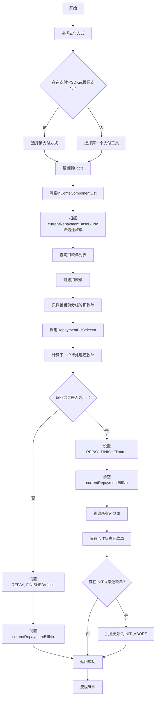
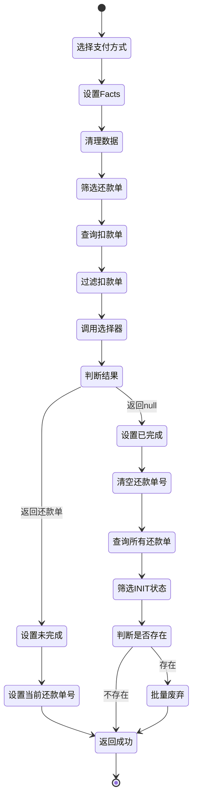

# PH170010V1 - 拆扣款单前置，筛选还款单，设置支付方式

## 节点信息

| 属性 | 值 |
|------|------|
| **处理器代码** | PH170010V1 |
| **节点名称** | 拆扣款单前置，筛选还款单，设置支付方式 |
| **节点类型** | PROCESS |
| **所属流程** | [[重资产分期制还款异步子流程V401]] |
| **执行阶段** | 子流程还款单筛选阶段 |
| **实现类** | RepayApplyBizFlowPH170010V1ServiceImpl |
| **优先级** | P0（核心节点） |

## 功能说明

异步子流程中的还款单筛选节点,负责从当前还款单基础号分组中筛选出下一个待处理的还款单,设置支付方式到Facts,并处理流程完成状态。

### 核心职责
1. **设置支付方式**: 从支付工具列表中选择支付方式,优先选择支付宝SDK或微信支付
2. **清理冗余数据**: 清空InComeComponentList避免数据冗余
3. **筛选当前分组还款单**: 根据currentRepaymentBaseBillNo筛选还款单
4. **查询扣款单**: 获取当前还款申请的所有扣款单
5. **计算下一个待处理还款单**: 调用RepaymentBillSelector选择器
6. **设置流程完成标志**: 判断是否所有还款单都已处理完成
7. **废弃未处理还款单**: 将INIT状态的还款单标记为INIT_ABORT

### 适用场景

- **所有异步子流程**: 每个子流���都需要筛选还款单
- **顺序还款**: 按照还款单序号顺序处理
- **失败熔断**: 前序还款单失败时停止后续处理

## 输入参数

| 参数名 | 参数代码 | 类型 | 来源 | 说明 |
|--------|----------|------|------|------|
| 还款申请Bo | repayApplyBo | RepayApplyBo | RepayContext | 包含所有还款信息 |
| 当前还款单基础号 | currentRepaymentBaseBillNo | String | RepayApplyBo | 当前处理的分组标识 |
| 支付工具列表 | payToolItemList | List | RepayApplyBo | 用户选择的支付工具 |
| 还款单列表 | repaymentBillList | List | RepayApplyBo | 所有还款单 |
| 还款申请号 | repayApplyNo | String | RepayApplyBo | 还款申请唯一标识 |

## 输出参数

| 参数名 | 参数代码 | 类型 | 说明 |
|--------|----------|------|------|
| 支付方式 | STRATEGY_PARAM_PAY_TYPE | String | 存入Facts,供决策使用 |
| 还款完成标志 | REPAY_FINISHED | Boolean | true表示所有还款单已处理完成 |
| 当前还款单号 | currentRepaymentBillNo | String | 下一个待处理的还款单号 |

## 处理流程



## 核心业务逻辑

### 1. 支付方式选择

**选择规则**:
1. 优先选择支付宝SDK (ALIPAY_SDK) 或微信支付 (WECHAT_PAY)
2. 如果不存在,则选择支付工具列表的第一个

**实现逻辑**:
使用Stream API过滤支付工具列表,查找支付宝SDK或微信支付,如果找不到则使用第一个支付工具

**设置到Facts**:
将选中的支付方式名称存入Facts的 `STRATEGY_PARAM_PAY_TYPE` 键

**用途**: 后续决策节点根据支付方式选择不同的扣款策略

### 2. 清理冗余数据

**清理操作**: `repayApplyBo.setInComeComponentList(null)`

**原因**: InComeComponentList在子流程中不需要,清空可以减少内存占用和序列化开销

### 3. 筛选当前分组还款单

**筛选方法**: `RepaymentBillUtils.getRepaymentBillListByBaseNo()`

**筛选条件**: `repaymentBillBaseNo == currentRepaymentBaseBillNo`

**返回结果**: 当前分组的所有还款单列表

**业务含义**: 一个子流程只处理一个分组的还款单,不同分组并行处理

### 4. 查询和过滤扣款单

**查询接口**: `deductBillService.getByRepayApplyNo(repayApplyNo)`

**查询范围**: 当前还款申请的所有扣款单

**过滤逻辑**:
1. 提取当前分组还款单的还款单号列表
2. 过滤出属于当前分组的扣款单

**用途**: 为还款单选择器提供扣款单状态信息

### 5. 还款单选择器

**选择器**: `RepaymentBillSelector.calRepaymentBillSeqBo()`

**输入参数**:
- `baseRepaymentBillList`: 当前分组的还款单列表
- `deductBillList`: 当前分组的扣款单列表

**返回结果**: `RepaymentBillSeqBo` 或 `null`

**选择逻辑**:

#### 5.1 兜底扣款单处理
- 如果存在Payment兜底扣款单,需要踢出原扣款单
- 判断条件: `paymentDeductFlag == true`
- 提取原扣款单号: `originDeductBillNo`
- 从列表中移除原扣款单

#### 5.2 构建还款单序列对象
为每个还款单构建 `RepaymentBillSeqBo`:
- `repaymentBillBaseNo`: 还款单基础号
- `repaymentBillNo`: 还款单号
- `seq`: 还款单序号
- `deductBillSeqBoList`: 该还款单的扣款单状态列表

#### 5.3 按基础号分组
将还款单序列对象按 `repaymentBillBaseNo` 分组

#### 5.4 查找可处理还款单
遍历每个分组,查找第一个可处理的还款单:

**排序规则**: 按 `seq` 升序,再按 `repaymentBillNo` 升序

**选择规则**:
1. 如果还款单没有扣款单 → 选中该还款单
2. 如果还款单的扣款单中存在失败状态 → 返回null,停止处理
3. 否则继续查找下一个还款单

**失败状态**: `DEDUCT_FAILED` 或 `RECORD_FAILED`

**特殊处理 - 支付宝/微信支付**:
- 这两种支付方式同步已完成拆单
- 为统一流程,只保留对账完成的扣款单
- 过滤条件: `deductStatus.isReconFinished()`

### 6. 流程完成判断

**判断条件**: `repaymentBillSeqBo == null`

**完成时操作**:
1. 设置 `REPAY_FINISHED = true`
2. 清空 `currentRepaymentBillNo`
3. 查询所有还款单
4. 筛选INIT状态的还款单
5. 批量更新为INIT_ABORT状态

**未完成时操作**:
1. 设置 `REPAY_FINISHED = false`
2. 设置 `currentRepaymentBillNo` 为选中的还款单号

### 7. 废弃未处理还款单

**废弃条件**: 流程完成时,存在INIT状态的还款单

**废弃操作**: `repaymentBillService.updateStatus()`

**更新状态**: `INIT` → `INIT_ABORT`

**更新描述**: "INIT_ABORT"

**业务含义**: 
- 某些还款单可能因为前序失败而未被处理
- 将其标记为废弃,避免数据不一致
- 不影响已处理的还款单

## 状态流转



## 上游节点

- [[PH170007]] - 子流程开始节点处理数据序列号

## 下游节点

- [[PH160020]] - 还款金额再次校验 (条件: REPAY_FINISHED == false)
- 子流程结束 (条件: REPAY_FINISHED == true)

## 异常处理

| 异常场景 | 错误类型 | 处理方式 | 影响 |
|----------|----------|----------|------|
| 支付工具列表为空 | RuntimeException | 抛出异常 | 流程中断 |
| 还款单列表为空 | - | 正常处理,返回null | 流程完成 |
| 扣款单查询失败 | RuntimeException | 抛出异常 | 流程中断 |
| 状态更新失败 | RuntimeException | 抛出异常 | 流程中断 |

## 数据结构

### RepaymentBillSeqBo (还款单序列对象)

**核心字段**:
- `repaymentBillBaseNo`: 还款单基础号
- `repaymentBillNo`: 还款单号
- `seq`: 还款单序号
- `deductBillSeqBoList`: 扣款单状态列表

### DeductBillSeqBo (扣款单序列对象)

**核心字段**:
- `deductBillNo`: 扣款单号
- `deductStatus`: 扣款状态

## 实现位置

```bash
repayengine-service/src/main/java/cn/caijiajia/repayengine/service/
├── repay/process/heavyasset/
│   └── RepayApplyBizFlowPH170010V1ServiceImpl.java  # 节点处理器 (113行)
├── repaymentbill/util/
│   ├── RepaymentBillSelector.java                   # 还款单选择器 (177行)
│   └── RepaymentBillUtils.java                      # 还款单工具类
├── bill/
│   └── IDeductBillService.java                      # 扣款单服务
└── repaymentbill/
    └── IRepaymentBillService.java                   # 还款单服务
```

## 监控指标

- **还款单筛选成功率**: 成功次数 / 总次数
- **流程完成比例**: REPAY_FINISHED=true次数 / 总次数
- **废弃还款单数量**: INIT_ABORT状态还款单数
- **选择器耗时**: P50/P95/P99
- **支付方式分布**: ALIPAY_SDK/WECHAT_PAY/其他占比

## 设计考虑

### 1. 为什么优先选择支付宝SDK或微信支付?

**原因**:
- 这两种支付方式用户体验好,成功率高
- 支持实时扣款和对账
- 是主流的移动支付方式

### 2. 为什么要清空InComeComponentList?

**原因**:
- 该数据在子流程中不需要
- 减少内存占用
- 减少序列化开销
- 避免数据冗余传递

### 3. 为什么要按序号顺序处理还款单?

**原因**:
- 保证还款顺序的确定性
- 便于追踪和排查问题
- 符合业务逻辑(先还早期,后还晚期)

### 4. 为什么前序失败要停止后续处理?

**原因**:
- 避免部分成功部分失败的复杂状态
- 失败熔断,减少无效操作
- 便于重试和恢复

### 5. 为什么要废弃INIT状态的还款单?

**原因**:
- 流程完成时不应该有未处理的还款单
- 标记为废弃避免数据不一致
- 便于后续分析和统计

### 6. 为什么要踢出原扣款单?

**原因**:
- Payment兜底扣款单是对原扣款单的替换
- 原扣款单已失败,不应再参与判断
- 避免重复扣款

## 相关文档

- [[重资产分期制还款异步子流程V401]] - 所属流程
- [[还款单选择器]] - RepaymentBillSelector详细设计
- [[还款单序号规则]] - 序号生成和排序规则
- [[Payment兜底机制]] - 兜底扣款单处理
- [[还款单状态机]] - 还款单状态流转

## 标签

#节点 #还款单筛选 #支付方式 #流程控制 #PH170010V1
